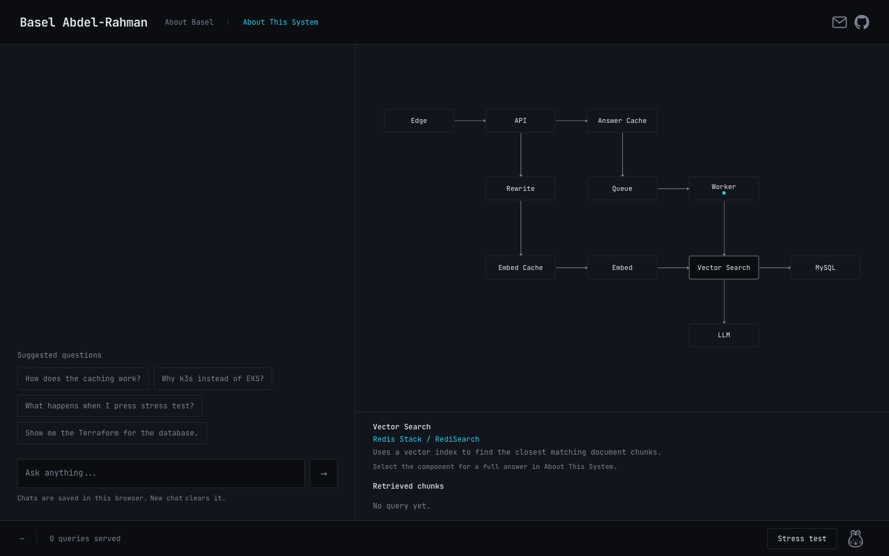
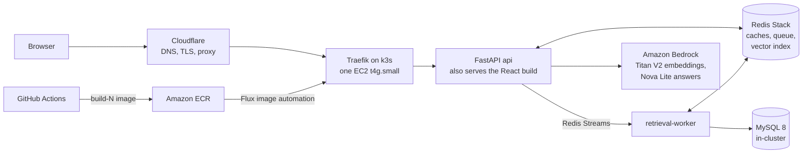
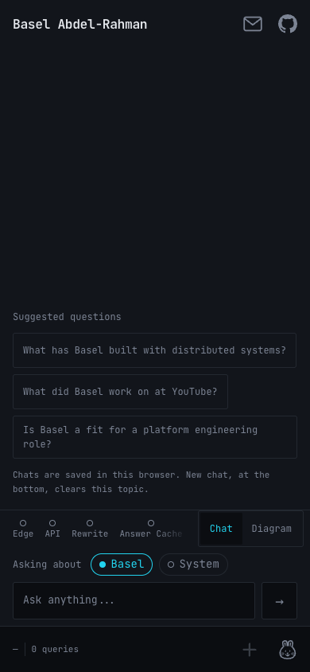
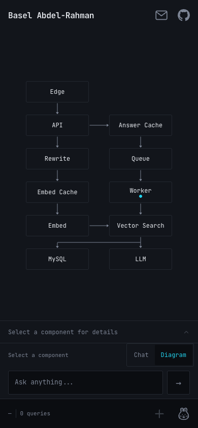

# Glassbox

> A portfolio you can talk to, with the wiring left in view.

**Live: [basel.engineering](https://basel.engineering)** · [Design notes](docs/DESIGN.md) · [Architecture deep dive](docs/architecture/deep-dive.md)

Glassbox is my portfolio and a working retrieval-augmented generation (RAG) system. Ask it about my experience, or ask how it works: a question is embedded, matched against curated documents in a Redis vector index, answered by an Amazon Bedrock model with inspectable sources, and streamed back while a live diagram highlights each component the request touches. It runs on a single small AWS node (k3s), and merging to `main` deploys it through GitHub Actions and Flux.



*Desktop, "About This System" topic, hovering the Vector Search node. Captured from the live site.*

## Start with a question

| If you're curious about… | Try asking… |
| --- | --- |
| My work | “What did Basel build at Google and Microsoft?” |
| The engineering | “How does this site find the right information?” |
| The decisions | “Why run this on k3s?” |

There's no special prompt to learn. Pick one of the suggested questions on the site or write your own. You can see what was retrieved, where the answer came from, and what the system did along the way.

## Why I built it

I wanted a landing page for my work that felt more like a conversation than a list of links. I also wanted a real project to help me learn retrieval-augmented generation (RAG), embeddings, language models, and the infrastructure needed to run them. Building the whole path from a question to an answer taught me more than another small tutorial would have.

I chose to show the machinery because I think the interesting part of a project is often *how* it works: the decisions, the trade-offs, and the pieces that have to cooperate when someone actually uses it. Glassbox gives me a place to keep learning those things in public.

## How it works



1. **Find context.** The question is embedded (Titan Text Embeddings V2, 512 dimensions) and a worker runs a KNN search on a Redis Stack vector index. MySQL is the source of truth for documents and chunks; Redis holds the retrieval-time copies.
2. **Build an answer.** Nova Lite on Bedrock writes the answer from the retrieved passages, streamed over Server-Sent Events. Embeddings, retrievals and answers are cached, and a daily budget caps LLM spend.
3. **Show the journey.** The same event stream drives the diagram, so you can watch which stages ran and which sources were used.

Some honest details:

- It is one `t4g.small` EC2 node running k3s, not a cluster. MySQL runs in the cluster, not on RDS, to keep the bill small.
- KEDA is installed to autoscale the worker on queue lag, but it has been suspended since a memory incident on 2026-09-30, so the worker runs a single replica and the "Stress test" button plays a simulation when there is not enough free memory for a real one.
- The "About Basel" answers come from a private repository that is added to each release; this repo only holds the system itself.
- I have not measured load-test numbers yet, so there are none here.

The backend is Python (FastAPI); the frontend is React 19, TypeScript, Tailwind and React Flow. Infrastructure is Terraform, deployed by GitHub Actions workflows with approval gates.

### On a phone

<p>
  
  
</p>

## Run it locally

Needs Docker, Python 3.12 and Node. The default `fake` provider makes no network calls, so no AWS account is needed (answers are canned; it exercises the whole pipeline).

```bash
docker compose up -d mysql redis
python -m venv .venv && source .venv/bin/activate
pip install -r services/requirements-dev.txt
export MYSQL_HOST=127.0.0.1 MYSQL_USER=glassbox MYSQL_PASSWORD=glassbox MYSQL_DATABASE=glassbox \
       REDIS_URL=redis://127.0.0.1:6379/0 GLASSBOX_PROVIDER=fake
alembic upgrade head
python -m services.glassbox.ingest.run          # index docs/, infra/, k8s/, services/
uvicorn services.glassbox.api.main:app --port 8000 &
python -m services.glassbox.worker.main &       # retrieval worker
cd frontend && npm ci && npm run dev            # http://localhost:5173, proxies /api to :8000
```

Tests: `pytest services/tests -q` (needs the MySQL and Redis containers above) and, in `frontend/`, `npm run lint && npm test && npm run build`. `npm run phone` serves a page of phone-sized frames for checking the mobile layout.

## Repo map

| Path | What is in it |
| --- | --- |
| [`frontend/`](frontend/) | React app: chat, live architecture diagram, mobile layout |
| [`services/glassbox/`](services/glassbox/) | FastAPI API, retrieval worker, ingestion, cache, providers; tests in `services/tests/` |
| [`eval/`](eval/) | Retrieval and answer-quality evaluation harness |
| [`infra/`](infra/) | Terraform: network, compute (k3s node), registry, secrets, ops runbooks, Cloudflare edge |
| [`k8s/`](k8s/) | Kubernetes manifests (Kustomize), reconciled by Flux |
| [`.github/workflows/`](.github/workflows/) | CI, release (build to ECR), Terraform, push-button ops runbooks |
| [`docs/`](docs/) | Design documents (also the corpus the chatbot reads about itself) |
| [`project/`](project/) | Working notes: architecture snapshot, backlog, per-change status reports |

## Design docs

- [DESIGN.md](docs/DESIGN.md): the core architecture and the reasoning behind it
- [Architecture deep dive](docs/architecture/deep-dive.md): how requests, caches and ingestion behave in detail
- [DESIGN-002](docs/DESIGN-002-followups.md) resilience and chat features, [DESIGN-003](docs/DESIGN-003-ingestion.md) content ingestion, [DESIGN-004](docs/DESIGN-004-action-plan.md) build plan and milestones, [DESIGN-005](docs/DESIGN-005-rag-quality.md) RAG quality
- [project/SNAPSHOT.md](project/SNAPSHOT.md): what exists and what runs live right now

## Credits

The tiger and rabbit status icons are from Microsoft's [Fluent Emoji](https://github.com/microsoft/fluentui-emoji) (high-contrast set), MIT licensed.
