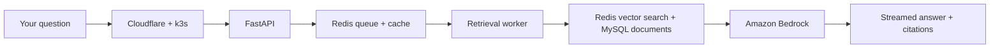

# Glassbox: a portfolio you can ask questions

**[Visit basel.engineering](https://basel.engineering)** · [Meet the builder](#meet-basel) · [Peek under the hood](#how-the-trick-works)

Most portfolios ask you to scroll. This one invites you to ask.

Glassbox is my interactive portfolio and a small, working AI system in its own right. Ask about my work at Google and Microsoft, a project I built, or the engineering behind this very page. It looks through a curated set of documents, answers in a stream, and shows where its answer came from. While it works, the architecture diagram lights up so you can watch the request travel. The magic trick comes with a diagram of the trapdoor.

## Take it for a spin

Open **[basel.engineering](https://basel.engineering)** and choose a lane:

| Curious about… | Try asking… |
| --- | --- |
| **About Basel** | “What did Basel work on at YouTube?” or “Is Basel a fit for a platform engineering role?” |
| **About This System** | “How does the caching work?” or “Why k3s instead of EKS?” |

Suggested questions are built into the page, so you can start with one click. Answers stream into the chat; retrieved sources and citations let you follow the breadcrumbs. The diagram and request stats show what happened along the way.

**Hiring?** The first lane gives you the human story; the second shows how I make engineering decisions. **Building something together?** The source is here to inspect, and you can [get in touch through the site](https://basel.engineering). **Just curious?** Poke around. Glass boxes are made for looking inside.

## Meet Basel

I'm Basel Abdel-Rahman, a backend and platform engineer. I've worked on distributed systems, release engineering, developer tooling, and cloud infrastructure at Microsoft and Google. I like making complex systems easier to operate and easier to understand. This site is a tiny example of both.

The “About Basel” answers come from [public, hand-curated documents](corpus/about-me/), rather than a model guessing from a résumé-shaped prompt.

## How the trick works



The system uses **retrieval-augmented generation**: it finds relevant passages in the selected corpus, then asks a model to answer from those passages. Redis handles the job queue, vector index, and caches; MySQL keeps the source documents and query records. A FastAPI endpoint sends progress, retrieved sources, and answer text to a React frontend over Server-Sent Events. Amazon Bedrock supplies the production embedding and language models.

The site runs on a single AWS EC2 instance with k3s, fronted by Cloudflare. Terraform defines the infrastructure; GitHub Actions builds an image into Amazon ECR; Flux watches for new images and deploys them. The one-node setup is a deliberate fit for a personal project, with trade-offs documented in the [design notes](docs/DESIGN.md).

There are guardrails, too: per-client rate limits, a daily answer budget, and a retrieval-only response when that budget is exhausted. The repo includes [retrieval evaluations](eval/README.md) and tests for the service. The more theatrical stress-test and autoscaling demo is still being prepared; it is not part of the live experience yet.

## Explore the workshop

| Where | What you'll find |
| --- | --- |
| [`frontend/`](frontend/) | React interface, chat, and live architecture view |
| [`services/glassbox/`](services/glassbox/) | API, ingestion, retrieval worker, provider adapters, and caches |
| [`corpus/about-me/`](corpus/about-me/) | The public material behind “About Basel” |
| [`k8s/`](k8s/) and [`infra/`](infra/) | Kubernetes manifests and Terraform |
| [`docs/DESIGN.md`](docs/DESIGN.md) | Architecture, choices, and trade-offs |
| [`eval/`](eval/) | Questions and retrieval baselines |

### Run it locally

You'll need Python 3.12, Node.js 22, Docker, and npm. Local development uses fake model providers, so AWS credentials aren't needed.

```bash
docker compose up -d mysql redis
python3.12 -m venv .venv
source .venv/bin/activate
pip install -r services/requirements-dev.txt
export MYSQL_HOST=127.0.0.1 MYSQL_PORT=3306 MYSQL_USER=glassbox MYSQL_PASSWORD=glassbox MYSQL_DATABASE=glassbox
export REDIS_URL=redis://127.0.0.1:6379/0 GLASSBOX_PROVIDER=fake
alembic upgrade head
python -m services.glassbox.ingest.run
python -m services.glassbox.worker.main &
uvicorn services.glassbox.api.main:app --reload
```

In another terminal:

```bash
cd frontend
npm ci
npm run dev
```

Open the URL Vite prints (usually `http://localhost:5173`). To use Bedrock instead of the local fake providers, see [`.env.example`](.env.example) and the [provider design](docs/DESIGN.md).

---

Built by [Basel Abdel-Rahman](https://basel.engineering). Questions welcome; the site is listening.
