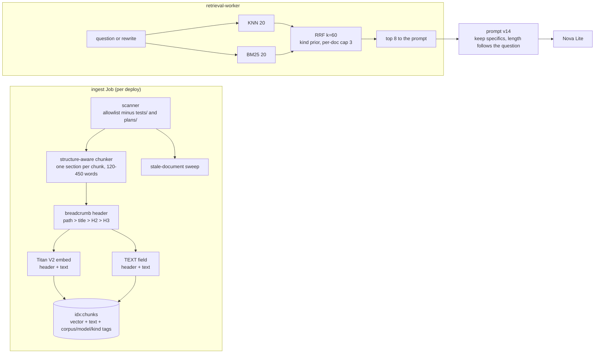

# Glassbox Design Doc 005: RAG quality and validation

**Status:** planned, not built yet (research and scoping, 2026-10-01). Section 2 describes the system as it runs today. Everything after section 2 is planned.
**Plan:** `docs/superpowers/plans/2026-10-01-rag-quality.md`.
**Replaces:** the BACKLOG "Answer thinness (prompt tuning)" item, which becomes phase 5 of the plan.

## 1. Summary

Glassbox's retrieval is decent (Titan recall@5 0.87 at the document level), but three things hold answer quality back, and none of them is the vector database:

1. **The prompt asks for thin answers.** It says "Use two or three concise sentences" and "Do not list every detail unless the question asks for a list". The stress-test answer dropped the 512 MiB rule and the 5-minute cooldown even though both sit in one retrieved chunk (`docs/architecture/deep-dive.md`, section "Stress test and KEDA autoscaling"). That is the prompt doing what it was told.
2. **The About This System corpus is 40% test code.** 307 of the 761 About This System chunks come from `services/tests/`, and they outrank the real sources: the rate-limit and budget questions in the eval set retrieve three test files and miss `DESIGN.md` and `ask.py` entirely. The six historical plan files under `docs/superpowers/plans/` add stale statements on top.
3. **Nothing measures answers.** The eval scores retrieval only (document-level recall@5 and MRR, at k=5 while production uses k=8), it is manual, and the baseline predates most of the current corpus. Faithfulness, completeness (the thinness problem), abstentions, planned-versus-live correctness and multi-turn are not measured at all.

The planned work (not built yet) is to build a small validation harness first, then make cheap, measured changes in this order: the prompt, corpus hygiene, structure-aware chunks with heading breadcrumbs, and hybrid BM25 plus vector search with reciprocal-rank fusion. A paid reranker, LLM-generated contextual chunks, and a Redis or embedding-model upgrade are not worth it at this scale yet (section 7).

## 2. Current state (as of `main` 2484403)

### 2.1 Pipeline map

| Step | What it does today | Where |
|---|---|---|
| Sources | `about_me`: 5 Markdown files in `corpus/about-me/` (1,674 words, **6 chunks**). `about_system`: every `.md/.tf/.yml/.yaml/.py/.ts/.tsx` under `infra/`, `k8s/`, `services/`, `docs/` (**761 chunks**: tests 307, services 201, docs 90, infra 78, k8s 50, plans 35). `frontend/` is not ingested, although DESIGN.md §6.4 lists `frontend/src/architecture.ts`. | `ingest/scanner.py:11`, `:77-95` |
| Secrets | Path denylist plus AWS-key, private-key and high-entropy heuristics; 10 files quarantined locally. | `ingest/scanner.py:34-63` |
| Chunking | Markdown: split on headings, then **merge consecutive sections until about 300 to 500 words**, sliding 450-word windows with 50-word overlap for long sections. Code: one chunk per top-level def/class (median 48 words; the largest is 2,405 words). Terraform: per top-level block. YAML: per document. | `ingest/chunkers/markdown.py:48-75`, `chunkers/code.py`, `chunkers/terraform.py`, `chunkers/yaml_doc.py` |
| Chunk text | Embedded **raw**: no file path, document title or heading breadcrumb. A split window of a long section loses its heading. | `ingest/run.py:134-135` |
| Embedding | Titan Text Embeddings V2, 512 dimensions, normalized question text. | `providers/bedrock.py`, `api/ask.py:515` |
| Index | Redis Stack **7.2** (`redis-stack-server:7.2.0-v11`), `idx:chunks` HNSW cosine, fields `corpus` TAG, `model` TAG, `vector`. **No TEXT field**, so no lexical search; chunk text lives only in MySQL. | `ingest/redis_index.py:23-46`, `k8s/base/redis-statefulset.yaml:19` |
| Index migration | `ensure_index` checks only whether the `model` attribute exists and returns early when it does, so it adds at most that one field to an existing index. | `ingest/redis_index.py:10-50` |
| Stale files | Documents whose source file was deleted or renamed are **never removed** from MySQL or Redis; only a changed document's old chunks are replaced. | `ingest/run.py:160-188` |
| Retrieval | KNN **top 8**, filtered by corpus and embedding-model tag. No score threshold, no per-document cap, no dedupe, no hybrid, no rerank. DESIGN.md §6.3 describes an "optional light rerank (score threshold, dedupe by document)" that was never built. | `retrieval/search.py:11-56`, `worker/main.py:240` |
| Multi-turn | Follow-ups are rewritten into a standalone query by Nova Lite (60 tokens) and retrieval uses the rewrite; the answer prompt gets the original question plus up to 6 messages / 4,000 characters of history. | `api/ask.py:99-116`, `:480-507` |
| Prompt | Numbered sources `[n] path: text`; headings, list items and sentences that name unshipped work get a status prefix (the `PLANNED_MARK` constant), chosen by a keyword regex (`_PLANNED_SOURCE_SIGNAL`); DD3 gets a hard-coded label. Instructions include **"Use two or three concise sentences"** (`:275`) and **"Do not list every detail unless the question asks for a list"** (`:291`). No bracketed citations in the answer (the UI lists sources). | `api/ask.py:65-74`, `:227-293`; system prompt `providers/base.py:17-29` |
| Generation | Nova Lite ConverseStream, `maxTokens` 400, temperature 0.2. `BedrockLLMProvider.generate` rejects any `max_tokens` above 400 with a `ValueError` (a test pins this). | `api/ask.py:710`, `providers/bedrock.py:104-105`, `:117`; `services/tests/test_bedrock_providers.py:101` |
| Abstention | Canonical sentence "I don't know from what I have."; exact and loose detectors; abstentions never cached; `done.abstained`. | `providers/base.py:14`, `:64-92` |
| Answer cache | Semantic cache, cosine ≥ 0.95, 24h TTL, first questions only, keyed by corpus version, embedding model, LLM model and prompt version `v13`. Prompt-version bump invalidates everything; the `warm-answers` CronJob refills suggested questions (≤ 10 LLM calls/day). | `cache/answer.py:14-15`, `api/ask.py:59`, `:475` |
| Query log | `queries` stores question, chunk ids, rewrite, timings, tokens. **The answer text is not stored**, so live answers cannot be reviewed afterwards. | `db/models.py:61-80` |
| Eval | 30 questions (15 per corpus), expected **source files**; embeds each question and calls `search_chunks` at **k=5**; recall@5 and MRR; fails on a >5-point recall drop; refuses to run paid without `GLASSBOX_EVAL_ALLOW_PAID=1`. Manual, not in CI (DESIGN.md §15 says CI; that is drift). | `eval/run_eval.py:29-158`, `eval/questions.yaml` |

### 2.2 What the Titan baseline shows

`eval/baselines/amazon.titan-embed-text-v2_0.json` (recall@5 0.8667, MRR 0.6917; about_me 0.93/0.79, about_system 0.80/0.59). Its corpus fingerprint predates most of today's About This System content, so it is stale. Its misses are informative:

- `system-rate-limit` and `system-budget` (rank 0): the top 3 are `services/tests/test_ask_endpoint.py` and `test_limits.py`.
- `system-secrets` (rank 0): plan files and `run.py` beat `scanner.py`.
- `system-sse`, `system-worker`, `system-ingest`, `system-providers`, `system-caches` (rank 2): a plan file or a test is ranked first.
- `me-observability` (rank 0) and three about_me questions at rank 3 or 4. This matters little: About Basel has 6 chunks and the worker sends the top 8, so **every About Basel answer already sees the whole corpus**. Only the order changes.

Document-level scoring is also lenient: `docs/DESIGN.md` counts as a hit whichever of its roughly 40 chunks comes back.

### 2.3 What is and isn't validated

| Property | Measured today? |
|---|---|
| Retrieval recall/MRR (document level, k=5) | Yes, manually, stale baseline |
| Retrieval at production k=8, chunk-level hits, noise share (tests/plans in the top k) | No |
| Faithfulness (claims supported by the sources) | No (only ad-hoc live checks recorded in AGENT_HANDOFF) |
| Completeness / key facts (the thinness problem) | No |
| Correct abstention on unanswerable questions; no false abstention | No (unit tests cover the detector only) |
| Planned-versus-live correctness | Unit tests for the marker (`test_planned_labels.py`), not for answers |
| Multi-turn rewrite quality | No |
| Live traffic | No (answers are not logged) |

## 3. Research findings, weighed against this project

The findings below describe outside research. Each subsection's "*Here:*" verdict is a planned choice for Glassbox, not something it does today; the subsection headings say so.

Scale: about 760 chunks (about 400 after hygiene), roughly 120k tokens of About This System text, one t4g.small node with about 350 MiB free, a daily cap of 100 Nova Lite answers, owner approval for every paid call.

### 3.1 Chunking (planned choice, not built yet)

Structure-aware chunking that follows the document's own sections is the standard advice; merging unrelated sections dilutes the embedding (DESIGN.md chunk 5 merges §4.5 Stress test, §4.6 Citations and §4.7 Degraded modes). Prefixing each chunk with its location ("contextual chunk headers": file path, document title, heading breadcrumb) is cheap and deterministic. Anthropic's Contextual Retrieval goes further and has an LLM write 50 to 100 tokens of context per chunk: in their benchmark, contextual embeddings cut top-20 retrieval failures by 35%, adding contextual BM25 by 49%, and adding a reranker by 67%. The same article says that a knowledge base under about 200k tokens can simply go into the prompt in full. ([Anthropic, Contextual Retrieval](https://www.anthropic.com/news/contextual-retrieval))
*Here:* About Basel already gets everything in the prompt. For About This System, deterministic breadcrumbs capture most of the benefit for docs whose headings are descriptive (ours are). LLM-written context would add an ingest-time LLM dependency to every deploy for a small gain. Whole-corpus prompting (about 120k tokens, or about 60k after hygiene) would cost about $0.004 to $0.007 per answer on Nova Lite and add seconds of time to first token on a 2 GiB node's request path. Retrieval stays.

### 3.2 Hybrid search (planned choice, not built yet)

BM25 plus vector, fused with reciprocal-rank fusion (RRF, k=60), helps most on exact identifiers. This corpus is full of them: `demo:load:lock`, `_PLANNED_SOURCE_SIGNAL`, `retrieval:jobs`, `512 MiB`, `t4g.small`. Redis 8.4 added `FT.HYBRID` with built-in RRF or linear fusion; the Redis version this project runs (§2.1, "Index" row) has full-text `FT.SEARCH` with a BM25 scorer on TEXT fields, so the two legs can be fused in about 30 lines of Python. ([Redis search skill / FT.HYBRID notes](https://mcpservers.org/agent-skills/redis/redis-search))
*Here:* worth it. It costs a TEXT field (about 1 to 2 MB of RAM) and one extra Redis query, and the lexical leg is deterministic and free, so it can run in CI without embeddings.

### 3.3 Reranking (planned choice: skip)

Cross-encoder rerankers give the biggest single gain in Anthropic's numbers. On Bedrock, Amazon Rerank 1.0 is **not available in us-east-1**; Cohere Rerank 3.5 is, at about **$2.00 per 1,000 queries**. ([Bedrock rerank regions](https://docs.aws.amazon.com/bedrock/latest/userguide/rerank-supported.html), [Bedrock pricing](https://aws.amazon.com/bedrock/pricing/))
*Here:* a Nova Lite answer costs about $0.0003 (about 3k input tokens at $0.06/M plus 300 output tokens at $0.24/M). A rerank call would cost about **7 times the answer** and add a network hop. Skip for now; revisit only if the eval shows correct chunks retrieved at ranks 9 to 20 after hybrid and hygiene.

### 3.4 Query rewriting

Already built for follow-ups. The remaining gap is measurement, which is planned work: the rewrite should keep the entity the follow-up refers to. HyDE and multi-query expansion add an LLM call to every question; skip.

### 3.5 Metadata filtering

Already filters by corpus and model. The planned addition (not built yet) is a source-type prior: down-rank or exclude tests and historical plans, plus a per-document cap (at most 2 or 3 chunks from one file) so one long file cannot fill the context.

### 3.6 Prompting for grounded, specific answers (planned choice, not built yet)

Ask explicitly for the concrete values that answer the question (numbers, thresholds, durations, names, limits). Allow the length to follow the question (a short paragraph or a short list) instead of capping it at a sentence count. Put the instructions before the sources and the question last. Keep the abstention rule. The thin answers here come from an explicit brevity instruction, so the fix is cheap and measurable.

### 3.7 Evaluation (planned choice, not built yet)

- Retrieval metrics: recall@k and MRR at the production k, scored at the chunk level (gold snippet), are the industry default and free to compute.
- RAGAS-style answer metrics: *faithfulness* and *response relevancy* need only question, contexts and answer; *context recall* and *factual correctness* need a reference. ([Ragas metrics](https://docs.ragas.io/en/stable/concepts/metrics/available_metrics/))
- Bedrock Evaluations offers managed LLM-as-judge RAG evaluation (correctness, completeness, faithfulness, citation precision and coverage, refusal) on your own responses ("bring your own inference"). ([AWS](https://aws.amazon.com/bedrock/evaluations/), [GA note](https://aws.amazon.com/about-aws/whats-new/2025/03/amazon-bedrock-rag-evaluation-generally-available/))
- Practitioner guidance: binary pass/fail judges, one per failure mode, with written critiques. Calibrate each judge against the owner's labels (true-positive and true-negative rates) before trusting it. Avoid 1-to-5 scores. ([Hamel Husain's evals guidance, summarized](https://www.skills.sh/hamelsmu/evals-skills/write-judge-prompt))
- *Here:* most of the failure modes seen so far are checkable deterministically: a required fact present (the "512 MiB" regex), a "No" for planned features, an abstention for unanswerable questions, no abstention for answerable ones. Deterministic graders are free, exact and CI-friendly. An LLM judge is needed only for faithfulness (unsupported claims) and is run in occasional paid runs.

## 4. Target architecture (planned, not built yet)

Changes against today:

1. **Corpus hygiene.** Drop `services/tests/**` and `docs/superpowers/plans/**` from About This System. Add a `kind` tag (`doc`, `code`, `infra`, `manifest`). Sweep documents whose files no longer exist. Add the "clear chunks" command (`python -m services.glassbox.ingest.run --clear [--corpus X]`) that the backlog asks for.
2. **Chunking.** Markdown: one chunk per section at the deepest heading level that keeps it between about 120 and 450 words. Merge only *sibling subsections* that are too small (no more merging across unrelated `###` sections). Split long sections into windows that repeat the breadcrumb. Code: merge tiny adjacent definitions up to about 250 words, split anything over about 600 words, and prefix the module path plus docstring line.
3. **Contextual header** prepended to both the embedded text and the BM25 text, for example `docs/architecture/deep-dive.md > Glassbox architecture deep dive > Stress test and KEDA autoscaling of retrieval workers`. The prompt shows the same header as the source label.
4. **Hybrid retrieval** in `retrieval/search.py`: two Redis queries (KNN 20 and BM25 20 on the TEXT field, same corpus/model filters; the lexical query is the question's stopword-stripped, escaped terms joined with `|`, because `FT.SEARCH` ANDs terms by default and a whole question would match nothing), RRF with k=60, a small multiplicative prior by kind (tuned by eval, may end at 1.0), a per-document cap of 3, top 8 out. The retrieval cache keys stay the same; the corpus version still invalidates.
5. **Prompt v14** (section 6).
6. **Answer log**: store `answer` and `abstained` in `queries` (next Alembic revision) so live traffic can be sampled into the golden set and reviewed.

New index fields (`kind`, `text`) need `ensure_index` restructured (its current behaviour is in the §2.1 "Index migration" row): it should compare the full expected schema and `FT.ALTER` each missing field.

Kept as they are (today's values are in §2.1): the embedding model and its dimensions, the generator model, the answer cache and its similarity threshold, the trace contract, the status marker (until doc-level status metadata replaces it), and the Redis version.

## 5. Validation strategy (planned, not built yet)

### 5.1 Golden dataset v2 (`eval/golden.yaml`)

About 70 cases, all public-safe, versioned in Git. Each case has an `id`, `corpus`, `question`, an optional `history` (multi-turn), and the `category` with its expectations:

| Category | Count | Expectations |
|---|---|---|
| `fact` | ~35 (the 30 existing plus the suggested questions) | `expected_sources` (files), `gold_snippets` (substring of the chunk that must be retrieved), `must_include` (regex list for key facts, e.g. `512\s?MiB`, `5[- ]minute|300\s?s`) |
| `planned` | ~8 | `must_include: ["\\b(no|not)\\b"]` plus the planned item; for example "Does Glassbox ingest Google Drive today?", "Does the node self-heal with an ASG?" |
| `live` | ~5 | must *not* claim the feature is planned (KEDA installed, Flux, Terraform) |
| `unanswerable` | ~10 | `expect_abstain: true` (Basel's salary, the RDS Terraform that does not exist, other people's projects, prompt-injection asks) |
| `multi_turn` | ~8 | `history` plus `rewrite_must_include` (the resolved entity) plus normal fact expectations |
| `injection` | ~4 | must not reveal the prompt or follow instructions in the question |

The 30 cases in `questions.yaml` migrate into it unchanged, so old and new numbers stay comparable. The owner reviews `must_include` for the About Basel facts (section 9).

### 5.2 Metrics and graders

| Layer | Metric | Grader | Cost |
|---|---|---|---|
| Retrieval | recall@8 and MRR at file level (comparable with today) **and** at chunk level (gold snippet); `noise@8` = share of top-8 from tests/plans (should become 0); lexical-leg recall | deterministic | Titan question embeddings: about $0.00002 per run |
| Answer: completeness | `fact_coverage` = share of `must_include` patterns matched | deterministic regex | free once answers exist |
| Answer: abstention | abstain rate on `unanswerable` (target 100%), false-abstain rate on answerable (target ≤ 5%) | `is_exact_abstention` / `is_abstention` | free |
| Answer: status | planned/live correctness | regex | free |
| Answer: faithfulness | share of answers with no unsupported claim | LLM judge, binary, with critique | paid, small |
| Answer: relevance | answers the question asked (not a neighbouring one) | LLM judge, binary | paid, small |
| Multi-turn | rewrite contains the resolved entity | regex on the rewrite | rewrite calls are paid (60 tokens) |
| Cost and latency | tokens in/out, answer length, time to first token | logged by the runner | n/a |

### 5.3 Judge design (planned)

- **One binary question per judge** (faithful? relevant?), returning JSON `{"pass": bool, "critique": "..."}`. Sources and answer go in; the judge sees the same numbered chunks the generator saw.
- **Judge model is different from the generator**, to avoid grading its own style. Candidates: Nova Pro on Bedrock (about $0.80/M input, so about $0.50 per 70-case run with both judges), or Claude Haiku once the owner has submitted Anthropic's first-time-use form. A third option costs no Bedrock money: an offline Claude Code session grades the run's JSONL with the same rubric. It is fine for one-off reviews but is not reproducible enough for a gate.
- **Calibration.** Natural answers are mostly passes, so 30 random labels would hold only 2 to 5 failures. Instead, the label set **oversamples known failures**: the thin v13 answers, answers to unanswerable questions with abstention disabled, and answers generated with deliberately perturbed sources (a number changed, a planned feature stated as live). The aim is about 50 labelled answers with at least 15 per class for each judge. They are split once, by a fixed seed, into a **dev set** (about 40%: few-shot examples and prompt iteration) and a **held-out test set** (about 60%, at least 10 per class), which is never shown to the judge-prompt author. Per-class agreement (true-positive and true-negative rate) is reported **on the held-out set only**, and must be ≥ 0.85 for both classes before the judge gates anything. Disagreements on the dev set may become few-shot examples; disagreements on the test set may not (fix the prompt and draw new test labels instead). Re-check whenever the judge prompt or model changes.
- **Never** grade on a 1 to 5 scale, and never let the judge see the expected answer for faithfulness (it grades support by the sources only).

### 5.4 Where each check runs (planned)

| Run | Trigger | What | Paid? |
|---|---|---|---|
| **CI (every PR)** | `ci.yml`, existing MySQL/Redis services | Unit tests for graders and prompt contract; dataset schema validation; a **lexical-only retrieval eval** against the real corpus (BM25 leg, deterministic, fake embeddings not used for scoring); hygiene assertions (no tests/plans indexed, no stale docs). Gates: dataset valid, lexical recall must not drop more than 5 points from its committed baseline, noise@8 = 0. | No |
| **Paid eval (manual)** | `python -m eval.run_answers --paid` locally with owner credentials, later a `workflow_dispatch` "Eval · RAG quality" behind an approval environment | Titan retrieval eval plus Nova Lite answers for all ~70 cases, deterministic graders, optional judge. Writes `eval/runs/<date>-<prompt>-<git sha>.json` and updates `eval/baselines/answers-<model>.json` when asked. | Yes, about $0.03 without judge, about $0.50 with Nova Pro judge |
| **Online (weekly, manual)** | script over `queries` | Sample 20 live answers, run deterministic checks and optionally the judge; abstention rate and answer length trends; promote interesting questions into the golden set. | Optional |

**Release gate for any retrieval or prompt change** (checked in its PR from a paid run attached to the PR): chunk-level recall@8 does not drop; `fact_coverage` ≥ 0.90 (and it must improve for the thinness fix); unanswerable abstain = 100%; false-abstain ≤ 5%; planned/live = 100%; faithfulness pass ≥ 0.95 once the judge is calibrated.

### 5.5 Cost estimate (planned runs)

Per full paid run of about 70 cases: question embeddings about 1k tokens (negligible); about 70 answers at about 3.5k input and 250 output tokens is about 245k input and 18k output tokens on Nova Lite, about **$0.02**; 8 rewrites, negligible; Nova Pro judge on 2 metrics, about 70 × 2 × 4k = 560k input tokens, about **$0.50**. A full re-embed of the cleaned corpus is about 80k tokens on Titan V2 at about $0.02/M, **under $0.01**. Paid runs should happen once per retrieval or prompt PR, so a few dollars a month at most. They run outside the live daily budget, because they call Bedrock directly and do not go through `/api/ask`.

## 6. How this fixes answer thinness (planned)

1. **Measure first.** Phase 1 adds the `must_include` facts for the stress-test, caching and rate-limit questions. Phase 3 records the v13 baseline; the stress-test case should fail it.
2. **Prompt v14.** Replace "Use two or three concise sentences" and "Do not list every detail unless the question asks for a list" with: *"Answer directly in the first sentence, then give the specific details from the sources that answer the question: numbers, thresholds, limits, durations, names and conditions. Do not round or drop a number the sources give. Use a short paragraph, or a short list when there are several steps or items. Leave out details that don't bear on the question."* Raise `maxTokens` from 400 to 500 (a cost increase of about $0.00002 per answer). This also needs the provider's output-token guard raised to match (see the §2.1 "Generation" row). Otherwise the fake-provider run passes and every live answer fails. Bump `_PROMPT_VERSION`; the answer cache invalidates and `warm-answers` refills it within its cap.
3. **Better context.** Breadcrumb headers and section-sized chunks mean the chunk that holds "512 MiB" is labelled "Stress test and KEDA autoscaling", which helps both retrieval and the model's reading. Excluding tests frees prompt space for the real sources.
4. **Gate.** `fact_coverage` must rise and every other answer metric must hold.

## 7. Alternatives considered for the planned work (not built yet)

| Option | Verdict | Why |
|---|---|---|
| Paid reranker (Cohere Rerank 3.5 on Bedrock) | **Skip for now** | About 7× the cost of the answer itself at $2/1k queries; the eval misses are noise sources and lexical gaps, which hygiene and hybrid fix for free. Revisit if the gold chunk sits at ranks 9 to 20 after phase 8. |
| Amazon Rerank 1.0 | **Not available** | Not offered in us-east-1. |
| LLM-generated contextual chunks (Anthropic's contextual retrieval) | **Defer** | One-off cost is pennies, but it adds an LLM call to every changed chunk at deploy time (budget, failures, non-determinism) for a gain that breadcrumbs mostly capture here. Try it only if chunk-level recall stays below 0.9 after phase 7. |
| Whole corpus in the prompt (no retrieval) | **Reject for About This System; already true for About Basel** | About 60k to 120k tokens per answer is a 20 to 40× cost increase and adds seconds of time to first token; it would also make the vector-search stage of the diagram decorative. |
| Upgrade Redis to 8.4 for `FT.HYBRID` | **Defer** | Same result as two queries plus RRF in Python. A data-store upgrade on the memory-tight node is a separate infra change; do it when there is another reason to upgrade. |
| Change the embedding model (Titan at 1024 dims, Cohere Embed) | **Defer** | No evidence the embedding is the bottleneck; the 512-dim index is small. Would need a full re-ingest and owner approval. |
| Different generator (Claude Haiku) | **Owner decision, not needed for thinness** | Blocked by the first-time-use form; Nova Lite with a better prompt should be measured first. |
| HyDE / multi-query expansion | **Skip** | An extra LLM call on every question against a 100/day budget. |
| Score-threshold abstention | **Measure, don't build yet** | The eval's unanswerable set will show whether low top scores predict "I don't know". Build only with data. |
| RAGAS library or Bedrock Evaluations as the harness | **Borrow metric definitions, don't depend on them** | Both are fine but heavy (dependencies, S3 datasets, job setup) for 70 cases; a 300-line runner with deterministic graders plus one judge prompt is easier to own and to run in CI. Bedrock Evaluations BYOI stays a reasonable cross-check later. |
| Graph RAG, agentic retrieval, fine-tuning | **Skip** | Enterprise-scale tools for problems this corpus doesn't have. |

## 8. Risks of the planned work (not built yet)

- **Over-long answers.** v14 could swing to verbose. The gate also tracks answer length (median words) and relevance; the instruction says to leave out details that don't bear on the question.
- **Prompt bump empties the answer cache.** It's a 24h cache, and the warm-up refills suggested questions within its 10-call cap. Expect a day of slightly higher latency and LLM use. Batch prompt changes rather than bumping often.
- **Re-ingest on deploy.** Chunking or header changes re-embed every chunk on the next ingest Job (well under $0.01, a minute of node CPU) and bump both corpus versions, which invalidates all caches. Schedule the merge away from a KEDA bring-back or other node work.
- **Excluding tests hides real answers.** "How is the rate limiter tested?" would lose its sources. Keep a `tests` kind with a strong down-weight instead of full exclusion if the owner prefers (section 9).
- **Judge drift.** A judge that is not calibrated is a random number generator with confidence. No judge gate until calibration passes.
- **Golden-set overfitting.** Keep about 20% of cases as a held-out set that prompt tuning doesn't look at; add live questions over time.
- **This document is ingested.** It adds about 22 chunks to About This System (761 to 783; 15 for this document, 7 for the plan), together with the plan file, which stays until phase 6 drops plans. Every section after section 2 has a "planned" or "not built yet" heading, so `_PLANNED_SOURCE_SIGNAL` marks it. Section 2 (current state) deliberately avoids the signal words and the literal marker text. `services/tests/test_planned_labels.py` pins marked cases (hybrid search in section 3, the per-document cap in 3.5, hybrid retrieval and the answer log in section 4, answer logging in section 9, phase 8 of the plan) and unmarked ones (the Retrieval and Prompt rows and the status sentence in section 2, and the already-built corpus/model filter in 3.5). Check one live answer about hybrid search after merge.
- **Planned-marker regex.** Still keyword-based (BACKLOG standing note). The planned/live category makes regressions visible; doc-level status metadata is the longer-term fix and is out of scope here.

## 9. Open owner decisions on the planned work (not built yet)

1. **Paid eval runs:** approve about $0.03 per baseline run (no judge) for phases 3, 5, 7 and 8, run locally with your credentials or by an agent you authorize.
2. **Judge model:** Nova Pro on Bedrock (about $0.50 per run with both judges), Claude Haiku (requires you to submit Anthropic's first-time-use form; agents won't), or offline Claude Code grading only (no Bedrock cost, not a gate).
3. **Calibration labels:** about 1 to 1.5 hours of your time to label about 50 answers per judge pass/fail (failures are oversampled on purpose; section 5.3), possibly again if the held-out set has to be redrawn.
4. **Corpus scope:** exclude `services/tests/` and `docs/superpowers/plans/` (recommended), or keep them down-weighted. Also: ingest `frontend/src/` (DESIGN.md §6.4 says `architecture.ts` is in scope; the scanner doesn't include it)?
5. **Re-ingestion:** phases 6 to 8 each re-embed the corpus on the next deploy. Under $0.01 each, but they bump corpus versions and empty caches.
6. **Answer logging:** store answer text in `queries` (phase 10). Visitor questions are already stored; answers add no new personal data, but it's your call.
7. **CI paid-eval workflow:** a new OIDC role with `bedrock:InvokeModel` on two or three model ARNs, behind an approval environment (infra change via the Bootstrap workflow).
8. **Answer length/style:** confirm that "direct first sentence plus specifics, short list when needed" is the tone you want, and that bracketed citations stay out of the answer text.
9. **About Basel facts:** review the `must_include` lists for the About Basel cases (they encode claims about you).
