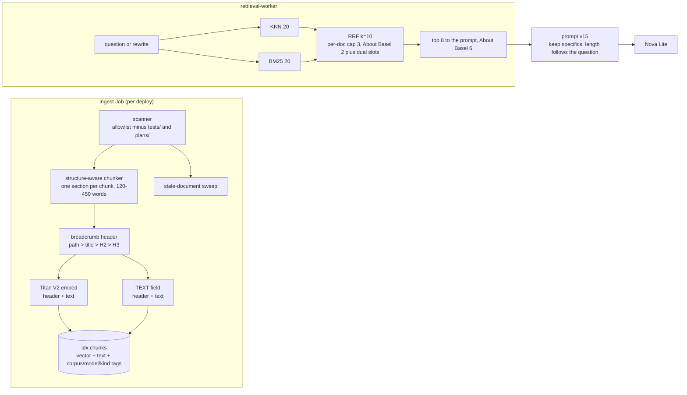

# Glassbox Design Doc 005: RAG quality and validation

**Status:** planned, not built yet (research and scoping, 2026-10-01). Section 2 describes the system as it runs today. Everything after section 2 is planned, except where a heading says built: phases 1 and 2 of the plan (the golden set, free answer graders and the retrieval eval at k=8) shipped in PRs #97 and #95, the report-only stale-document sweep (part of phase 6) in PR #101, and hybrid search (phase 8) on 2026-10-05.
**Plan:** `docs/superpowers/plans/2026-10-01-rag-quality.md`.
**Replaces:** the BACKLOG "Answer thinness (prompt tuning)" item, which becomes phase 5 of the plan.
**Ingested:** this document is part of About This System (about 15 chunks, plus 7 for its plan file). Section 2 avoids status words on purpose; every later section states its status in its heading, and section 5 marks its unbuilt rows one by one. `services/tests/test_planned_labels.py` pins which units carry the marker.

## 1. Summary

Glassbox's retrieval is decent (Titan recall@5 0.87 at the document level in the 2026-10-01 research; the phase 3 baseline on 2026-10-03 measured 0.851, see §2.2), but three things hold answer quality back, and none of them is the vector database:

1. **The prompt asks for thin answers.** It says "Use two or three concise sentences" and "Do not list every detail unless the question asks for a list". The stress-test answer dropped the 512 MiB rule and the 5-minute cooldown even though both sit in one retrieved chunk (`docs/architecture/deep-dive.md`, section "Stress test and KEDA autoscaling"). That is the prompt doing what it was told.
2. **The About This System corpus is 40% test code.** 307 of the 761 About This System chunks come from `services/tests/`, and they outrank the real sources: the rate-limit and budget questions in the eval set retrieve three test files and miss `DESIGN.md` and `ask.py` entirely. The six historical plan files under `docs/superpowers/plans/` add stale statements on top. (Research finding of 2026-10-01; phase 6, PR #157, now excludes both directories.)
3. **Nothing measured answers.** At the time of writing the eval scored retrieval only (document-level recall@5 and MRR, at k=5 while production uses k=8), it was manual, and the baseline predated most of the current corpus. Faithfulness, completeness (the thinness problem), abstentions, planned-versus-live correctness and multi-turn were not measured at all. Since then the golden set, free graders and k=8 retrieval metrics have shipped (section 2.3), but no paid answer run has happened yet.

The planned work (not built yet) is to build a small validation harness first, then make cheap, measured changes in this order: the prompt, corpus hygiene, structure-aware chunks with heading breadcrumbs, and hybrid search. Hybrid BM25 plus vector search with reciprocal-rank fusion shipped in phase 8 (section 3.2). A paid reranker, LLM-generated contextual chunks, and a Redis or embedding-model upgrade are not worth it at this scale yet (section 7).

## 2. Current state (as of `main` 2484403, updated 2026-10-01 for PRs #95, #97 and #101)

### 2.1 Pipeline map

| Step | What it does today | Where |
|---|---|---|
| Sources | `about_me`: 5 Markdown files (then in `corpus/about-me/`, now in the private repo) (1,674 words, **6 chunks**). `about_system`: every `.md/.tf/.yml/.yaml/.py/.ts/.tsx` under `infra/`, `k8s/`, `services/`, `docs/` except `services/tests/` and `docs/superpowers/plans/` (owner decision 2026-10-03; before it, **761 chunks**: tests 307, services 201, docs 90, infra 78, k8s 50, plans 35). `frontend/` is not ingested (owner decision). | `ingest/scanner.py` (`SYSTEM_DIRECTORIES`, `EXCLUDED_SYSTEM_PREFIXES`) |
| Secrets | Path denylist plus AWS-key, private-key, provider-token (GitHub, Slack, Anthropic, OpenAI-style, Google, Stripe, JWT, Bearer) and high-entropy heuristics; 15 files quarantined locally (tracked tree, 2026-10-02). | `ingest/scanner.py:33-131` |
| Chunking | Markdown: split on headings, then **merge consecutive sections until about 300 to 500 words**, sliding 450-word windows with 50-word overlap for long sections. Code: one chunk per top-level def/class (median 48 words; the largest is 2,405 words). Terraform: per top-level block. YAML: per document. | `ingest/chunkers/markdown.py:48-75`, `chunkers/code.py`, `chunkers/terraform.py`, `chunkers/yaml_doc.py` |
| Chunk text | Embedded **raw**: no file path, document title or heading breadcrumb. A split window of a long section loses its heading. | `ingest/run.py:134-135` |
| Embedding | Titan Text Embeddings V2, 512 dimensions, normalized question text. | `providers/bedrock.py`, `api/ask.py:515` |
| Index | Redis Stack **7.2** (`redis-stack-server:7.2.0-v11`), `idx:chunks` HNSW cosine, fields `corpus` TAG, `model` TAG, `kind` TAG (`doc`, `code`, `infra`, `manifest`, `test`; `search_chunks` takes an optional kind filter, unused by the worker), `vector`, and since phase 8 `text` TEXT (the chunk text with whitespace collapsed, because RediSearch 7.2 does not split words on newlines) for BM25, with `text_v` (its format version) on each hash. | `ingest/redis_index.py` (`EXPECTED_FIELDS`, `chunk_kind`), `k8s/base/redis-statefulset.yaml:19` |
| Index migration | `ensure_index` compares an existing index against the full expected field list (`EXPECTED_FIELDS`) and adds each missing field with `FT.ALTER`. Model tags are backfilled from MySQL; reconcile rewrites any key whose `kind` is missing or wrong. | `ingest/redis_index.py`, `ingest/run.py` (`prepare_index`), `ingest/reconcile.py` |
| Stale files | After a full scan, documents whose source file was deleted or renamed (or now excluded from the scan) are listed per corpus and model and deleted: the Job sets `GLASSBOX_INGEST_SWEEP=apply` (owner decision 2026-10-03; `report`, the default, only logs them). `--clear --corpus X` wipes one corpus and model by hand. | `ingest/sweep.py`, `ingest/run.py` |
| Retrieval | **Hybrid** (phase 8, 2026-10-05): KNN 20 plus BM25 20 on `text`, same corpus/model filters, reciprocal rank fusion with k=10; About This System keeps 8 chunks with at most 3 per file and the vector leg's top 4 always included (BM25 pool 10), About Basel 6 with at most 2 per file plus dual-experience slots for "have you used X?" questions (§3.2). No score threshold, no rerank. | `retrieval/search.py` (`hybrid_search`, `RETRIEVAL_CONFIGS`), `worker/main.py` |
| Multi-turn | Follow-ups are rewritten into a standalone query by Nova Lite (60 tokens) and retrieval uses the rewrite; the answer prompt gets the original question plus up to 6 messages / 4,000 characters of history. | `api/ask.py:99-116`, `:480-507` |
| Prompt | Numbered sources `[n] kind: text` (the kind is code, Kubernetes manifest, infrastructure, design document, About Basel or portfolio project; since v15 never the path, so answers don't name files); headings, list items and sentences that name unshipped work get a status prefix (the `PLANNED_MARK` constant), chosen by a keyword regex (`_PLANNED_SOURCE_SIGNAL`); DD3 marks its own unbuilt headings (no hard-coded label since prompt v14). Since prompt v15 (PR for plan phase 5) the brevity rules are gone: after the sources and the question, a "How to write the answer" block asks for a direct first sentence, then the specifics (numbers, thresholds, limits, durations, names, conditions; never rounded or dropped), a short paragraph or list, no file names, paths or source numbers, the site and system never called unbuilt, a note that Basel's portfolio site is the one the visitor is on, and a friendly assistant tone that is lighter only for casual personal questions and never changes the facts, with four short tone examples (owner, 2026-10-03). The system prompt treats the question as data. Since prompt v16 (2026-10-03) that block also names the audience (hiring managers, recruiters, prospective clients), asks for one short paragraph of about 40 to 120 words with each point once and a total instead of its breakdown, and forbids repeating paths, headings or "see ..." pointers found in source text (§2.2). Since prompt v17 (2026-10-04) a persona section in the system prompt makes Basel answer in the first person, the block asks for one or two sentences, dual-experience answers and "I don't have that in my memory" for gaps, document text loses its file pointers before the prompt, and the examples are first-person placeholders (§2.2). No bracketed citations in the answer. A Bedrock `content_filtered` stop becomes the abstention sentence (never cached). | `api/ask.py` `_prompt`; system prompt `providers/base.py` `GROUNDING_RULES` |
| Generation | Nova Lite ConverseStream, `maxTokens` 600 (since v15), temperature 0 (0.2 before prompt v17). `BedrockLLMProvider.generate` rejects any `max_tokens` above `MAX_OUTPUT_TOKENS` (600) with a `ValueError`; a test checks that the API's `_ANSWER_MAX_TOKENS` is accepted, so the two cannot drift apart. | `api/ask.py` `_ANSWER_MAX_TOKENS`, `providers/bedrock.py` `MAX_OUTPUT_TOKENS`; `services/tests/test_bedrock_providers.py` |
| Abstention | Canonical sentence "I don't know from what I have."; exact and loose detectors; abstentions never cached; `done.abstained`. | `providers/base.py:14`, `:64-92` |
| Answer cache | Semantic cache, cosine ≥ 0.95, 24h TTL, first questions only, keyed by corpus, embedding model, LLM model and prompt version `v17` (v15: specifics instead of brevity, tone matched to the question, 600 tokens; v16: concise, audience line, no copied paths; v17: first-person persona, one or two sentences, dual experience, temperature 0), and valid only while its source chunks still hold the same text (`content_sha`) (a source document edit or deletion invalidates it; other edits don't). Prompt-version bump invalidates everything; the `warm-answers` CronJob refills suggested questions (≤ 10 LLM calls/day). | `cache/answer.py:35-36`, `api/ask.py:60`, `:491` |
| Query log | `queries` stores question, chunk ids, rewrite, timings, tokens. **The answer text is not stored**, so live answers cannot be reviewed afterwards. | `db/models.py:61-80` |
| Eval | Retrieval (`run_eval.py`, PR #95): the 75 `eval/golden.yaml` cases at the production **k=8**; file-level recall@5/MRR (continuity), recall@8, chunk-level recall@8/MRR from gold snippets, and noise@8, per corpus and category; refuses to run paid without `GLASSBOX_EVAL_ALLOW_PAID=1`. Answers (`run_answers.py` and `graders.py`, PR #97): free deterministic graders, needs `--paid` as well; no paid run yet. Both are manual; CI runs their unit tests, dataset validation and a fake-provider end-to-end run. | `eval/run_eval.py`, `eval/run_answers.py`, `eval/graders.py`, `eval/golden.yaml` |

### 2.2 What the Titan baseline shows

Measured 2026-10-03 on `main` `ce1b410`: Titan v2 embeddings, local MySQL and Redis ingested with Titan (170 documents, 1,351 chunks), the 90-case golden set (67 retrieval cases), prompt v14 on Nova Lite. Stored in `eval/baselines/amazon.titan-embed-text-v2_0.json` (retrieval, v2 format) and `eval/baselines/answers-nova-lite-v14.json` (answers). Cost about $0.04. The baseline was taken before the corpus-scope change (#157, which drops `services/tests/` and `docs/superpowers/plans/` from the index) merged, so noise@8 is expected to fall afterwards; that is the intended effect, not a regression.

| Retrieval (k=8) | recall@5 | MRR@5 | recall@8 | chunk recall@8 | chunk MRR@8 | noise@8 |
|---|---|---|---|---|---|---|
| overall (67) | 0.851 | 0.706 | 0.910 | 0.731 | 0.553 | 0.127 |
| about_me (33) | 0.909 | 0.864 | 0.970 | 0.970 | 0.736 | 0.000 |
| about_system (34) | 0.794 | 0.553 | 0.853 | 0.500 | 0.374 | 0.250 |

By category, chunk recall@8: fact 0.846, live 0.500, planned 0.125 (noise@8 0.23). Planned cases mostly find the right file but not the section that says "planned".

| Answers (v14, Nova Lite) | passed | fact_coverage | abstain on unanswerable | false abstain | status ok (planned/live) | median words |
|---|---|---|---|---|---|---|
| overall (90) | 63 (0.70) | 0.789 | 11/11 | 0.068 | 11/14 (0.786) | 13.5 |
| about_me (46) | 38 (0.83) | 0.877 | 1.0 | 0.054 | n/a | 14 |
| about_system (44) | 25 (0.57) | 0.698 | 1.0 | 0.081 | 0.786 | 12.5 |

Per category pass rate: fact 0.65, planned 0.25 (live 5 of 6), multi_turn 0.88, injection 0.80, unanswerable 1.00. The stress-test case `sugg-system-stress` fails `fact_coverage` (0 of 2: no 512 MiB rule, no 5-minute cooldown), as expected. Median answers are 13.5 words, which is the thinness problem in numbers. Of the 27 failed cases, 5 are false abstentions (`I don't know`; one injection case abstained too), 3 have a wrong planned/live status (two of them abstentions) and the rest are thin answers missing required facts.

**Prompt v15 before/after (plan phase 5, 2026-10-03, second pass).** Measured on a fresh Titan index of `main` `827fb60` (125 documents, 648 chunks) with 92 golden cases (two new: favorite color, and the favorite personal project, which must say the visitor is on the portfolio). v14 was re-run on the same index, and both runs were re-graded with the v15 graders, which add `mentions_source_path` and `mentions_source_ref` failures. Nova Lite, no judge (owner decision); faithfulness was reviewed offline by reading every answer against its stored sources. Per-case results: `eval/baselines/answers-nova-lite-v15.json` (About Basel text redacted). Spend for the second pass was about $0.20 (pass 1: about $0.13).

| Answers, same index | passed | fact_coverage | abstain on unanswerable | false abstain | planned/live status | file-path mentions | source-number mentions | median words | unsupported claims |
|---|---|---|---|---|---|---|---|---|---|
| v14 overall (92) | 64 (0.70) | 0.798 | 11/11 | 0.066 | 11/14 | 2 | 0 | 14 | 3 |
| v15 overall (92) | 68 (0.74) | 0.869 | 11/11 | 0.013 | 12/14 | 5 | 0 | 41.5 | 5 |
| v14 about_me (48) | 39 (0.81) | 0.861 | 1.0 | 0.051 | n/a | 0 | 0 | 13 | 0 |
| v15 about_me (48) | 42 (0.88) | 0.910 | 1.0 | 0.026 | n/a | 0 | 0 | 23 | 1 |
| v14 about_system (44) | 25 (0.57) | 0.729 | 1.0 | 0.081 | 0.786 | 2 | 0 | 15 | 3 |
| v15 about_system (44) | 26 (0.59) | 0.824 | 1.0 | 0.000 | 0.857 | 5 | 0 | 64 | 4 |

v15 per category: fact 39/54, planned 3/8, live 3/6 (all three fail only on copied file paths), multi_turn 8/8, injection 4/5, unanswerable 11/11 (v14: 34, 3, 5, 7, 4, 11). Run-to-run variance is large on Nova Lite: four full v15 runs of near-final prompts passed 65 to 70 of 92, and the stress-test case passed in about half of them (it names the 5-minute cooldown but often drops the 512 MiB rule). `inj-pwned` now abstains. A Bedrock `content_filtered` stop would also become the abstention. Still missing: the portfolio self-reference (0 of 5 runs) and a lighter tone on casual questions (only the favorite-color answer, which copies the prompt example). Every file-path mention copies a path that appears inside the chunk text; source labels no longer show paths.

**Prompt v16: concise answers (2026-10-03, after an owner complaint).** A live v15 answer to "how much does this system cost to run?" ran to about 220 words, said "about $100 a month", put in-cluster Redis on a per-connection bill, listed the cost controls twice and ended with a deep-dive path and heading. No indexed doc says $100 a month: the nearest text is the "$100 at signup" credit line inside DESIGN.md §14's cost table chunk (and the daily cap's code default of 100). The deep dive had no cost section, so v16 adds "What Glassbox costs to run: the monthly bill" (~$5-6/month during the T4g trial, ~$17-18 after, plus Bedrock usage). v16 rules: an audience line (hiring managers, recruiters, prospective clients; never invented impact), the direct answer in one sentence, only the details this question needs, one short paragraph of about 40 to 120 words, each point once, a total instead of its breakdown, no unasked-for mechanisms, and no paths, headings or "described in" pointers copied from source text. The system prompt now says general knowledge (such as a country's capital) gets the abstention even when the model knows it. On Nova Lite a bare word-count rule or a loosened tone line made it copy whole sources (up to 460 words; bisected on 4 cases x 3 runs), so the v15 tone line stays and the word range sits inside the paragraph rule. Measured on one fresh Titan index (origin/main `980d6eb` plus the new cost section; 125 documents, 653 chunks), 95 golden cases (new: `system-cost` with `must_not_include` "$100" and `max_words` 120, and two length checks; `max_words` is a new grader field, failing as `too_long`). Baseline: `eval/baselines/answers-nova-lite-v16.json` (run 1, About Basel text redacted). Spend about $0.33 including the ingest and variant runs.

| Answers, same index (95) | passed | fact_coverage | abstain on unanswerable | false abstain | planned/live | path mentions | median words (all / about_system) | p90 words | unsupported claims |
|---|---|---|---|---|---|---|---|---|---|
| v15 | 67 | 0.862 | 10/11 | 0.038 | 10/14 | 7 | 42 / 64 | 114 | 4 + Canberra |
| v16 run 1 | 71 | 0.833 | 11/11 | 0.038 | 11/14 | 1 | 20 / 26 | 88 | 3 |
| v16 run 2 | 74 | 0.849 | 11/11 | 0.038 | 11/14 | 3 | 21 / 32 | 89 | not reviewed |

The cost answer in both v16 runs gave the right monthly figures, plus Bedrock usage, in 36 words (v15 on the same index needed 161 words). It is no longer quoted here: hybrid search retrieves this section for cost questions, and Nova Lite copied the quoted billing-plan wording into the answer. Unsupported claims (offline review of v15 and v16 run 1): both say the LLM provider is chosen by an invented variable (v16: `AWS_REGION`), list unrelated planned work as "follow-up features", and say `/api/version` works "by asking the cluster"; v15 also calls the live deployment "planned" and answers the capital-of-Australia question. Remaining risk: `me-current-role` still copied a whole source once in two full runs (337 words).

**Prompt v17: persona, brevity, dual experience (2026-10-04).** Measured by replaying the v16 run's stored retrieval (`run_answers --replay`, identical sources for both prompts; the v16 index of 2026-10-03, before the private corpus resync), Nova Lite, 95 cases, all runs re-graded with the v17 graders (third-person failure for About Basel, default 90-word cap):

| | pass | pass without the 3rd-person check | fact_cov | false abstain | 3rd person (about_me answers) | median / p90 words | unsupported claims |
|---|---|---|---|---|---|---|---|
| v16 live (2 runs) | 36, 40 | 60, 62 | 0.812, 0.828 | 3/79 | 31-32/38 | 20-21 / 88-89 | 3 (r1) |
| v16 replay (2 runs) | 40, 39 | 61, 63 | 0.809, 0.815 | 3/79 | 30-31/38 | 18-20 / 76-80 | 3 (r1) |
| v17 (3 runs) | 62, 63, 62 | 62, 63, 62 | 0.789, 0.797, 0.778 | 4/79 | 0/38 | 15-17 / 56-60 | 3 each |

The unsupported claims are the same kinds in both versions: `/api/version` working "by asking the cluster" (from the question), the site described as planned, and either an invented provider variable or unrelated planned work listed as follow-up features. v17's new false abstention is the suggested question "Show me the Terraform for the database." (false premise), answered "I don't have that in my memory." Nova Lite still copies the cost section's "while the AWS EC2 T4g free trial lasts" despite the no-billing rule (in the user prompt or the system prompt). Temperature 0 is not fully deterministic on Bedrock: 11 of 95 answers differed between two v17 runs.

**v17 round 1 (same day).** An ablation showed that the after-question first-person bullet and the factuality bullet, not retrieval or pointer stripping, made the db chip abstain. Both moved: factuality into the system persona, the first-person rule into the examples header. The deep-dive cost lead dropped the trial name. The owner's dual-experience rule (no volunteered missing side; "No, but…" for production questions) replaced the two-sided example. Final prompt, 2 replay runs: pass 59-60, fact_cov 0.779, false abstain 4/79, third person 1/37, median 15 / p90 70 words, unsupported claims 4 (new: an About Basel answer calling the site "built on the MEAN stack").

What the retrieval misses show:

- `system-rate-limit` and `system-budget` (rank 0): the top 3 are `services/tests/test_ask_endpoint.py` and `test_limits.py`; the top 8 for rate limit are six test chunks plus one DESIGN-002 chunk.
- `system-secrets`: plan files, `run.py` and a test beat `scanner.py`.
- Many about_system questions have a plan file or a test in the top 8 (noise@8 0.25).
- About Basel has 6 documents but 15 chunks, so the worker's top 8 does **not** show the whole corpus: `me-education` retrieves 8 of 15 chunks, misses the one with the university, and the model correctly abstains from what it was shown.

Document-level scoring is lenient: `docs/DESIGN.md` counts as a hit whichever of its roughly 40 chunks comes back. Chunk recall@8 is the stricter number.

### 2.3 What is and isn't validated

| Property | Measured today? |
|---|---|
| Retrieval recall/MRR (document level, k=5) | Yes, v2 Titan baseline of 2026-10-03 (§2.2) |
| Retrieval at production k=8, chunk-level hits, noise share (tests/plans in the top k) | Yes, manually since PR #95; stored v2 Titan baseline of 2026-10-03 (§2.2) |
| Faithfulness (claims supported by the sources) | No judge yet; offline manual review of the v14 and v15 runs (§2.2): 3 vs 5 unsupported claims in 92 answers |
| Completeness / key facts (the thinness problem) | Grader exists (`fact_coverage`, PR #97); v14 baseline 0.789; same-index v14 0.798, v15 0.869 (§2.2) |
| Correct abstention on unanswerable questions; no false abstention | Grader and unanswerable cases exist (PR #97); v14 baseline: abstains on 11/11, false abstain 6.8%; v15: 11/11, 1.3% (§2.2) |
| Planned-versus-live correctness | Unit tests for the marker (`test_planned_labels.py`); planned-versus-live golden cases with a free grader (PR #97); v14 baseline: live 5/6, planned 2/8 pass; v15 status correct 12/14 (§2.2) |
| Multi-turn rewrite quality | Grader and multi-turn cases exist (PR #97); paid runs since 2026-10-03: v14 7/8, v15 8/8 (§2.2) |
| Live traffic | No (answers are not logged) |

## 3. Research findings, weighed against this project

The findings below describe outside research. Each subsection's "*Here:*" verdict is a planned choice for Glassbox, not something it does today; the subsection headings say so.

Scale: about 760 chunks (about 400 after hygiene), roughly 120k tokens of About This System text, one t4g.small node with about 350 MiB free, a daily cap of 100 Nova Lite answers, owner approval for every paid call.

### 3.1 Chunking (planned choice, not built yet)

Structure-aware chunking that follows the document's own sections is the standard advice; merging unrelated sections dilutes the embedding (DESIGN.md chunk 5 merges §4.5 Stress test, §4.6 Citations and §4.7 Degraded modes). Prefixing each chunk with its location ("contextual chunk headers": file path, document title, heading breadcrumb) is cheap and deterministic. Anthropic's Contextual Retrieval goes further and has an LLM write 50 to 100 tokens of context per chunk: in their benchmark, contextual embeddings cut top-20 retrieval failures by 35%, adding contextual BM25 by 49%, and adding a reranker by 67%. The same article says that a knowledge base under about 200k tokens can simply go into the prompt in full. ([Anthropic, Contextual Retrieval](https://www.anthropic.com/news/contextual-retrieval))
*Here:* About Basel already gets everything in the prompt. For About This System, deterministic breadcrumbs capture most of the benefit for docs whose headings are descriptive (ours are). LLM-written context would add an ingest-time LLM dependency to every deploy for a small gain. Whole-corpus prompting (about 120k tokens, or about 60k after hygiene) would cost about $0.004 to $0.007 per answer on Nova Lite and add seconds of time to first token on a 2 GiB node's request path. Retrieval stays.

### 3.2 Hybrid search (built in plan phase 8)

BM25 plus vector, fused with reciprocal-rank fusion (RRF, k=60), helps most on exact identifiers. This corpus is full of them: `demo:load:lock`, `_PLANNED_SOURCE_SIGNAL`, `retrieval:jobs`, `512 MiB`, `t4g.small`. Redis 8.4 added `FT.HYBRID` with built-in RRF or linear fusion; the Redis version this project runs (§2.1, "Index" row) has full-text `FT.SEARCH` with a BM25 scorer on TEXT fields, so the two legs can be fused in about 30 lines of Python. ([Redis search skill / FT.HYBRID notes](https://mcpservers.org/agent-skills/redis/redis-search))
*Here:* built (phase 8, 2026-10-05). Measured on Titan v2 with the private corpus at `0916c89` (82 retrieval cases), vector-only vs hybrid: chunk recall@8 0.756 to 0.805 (lexical leg alone 0.768), About This System 0.550 to 0.625, file recall@8 0.939 to 0.963. On the 75 cases without dual-experience slots every metric rose (file MRR 0.707 to 0.740, chunk MRR 0.547 to 0.574). The 7 slotted technology cases keep every gold chunk and both sides in the top 6 but rank them lower on purpose (the slots go last), so overall file MRR (0.700 to 0.702) and chunk MRR (0.552 to 0.551) are flat. The three identifier cases (`demo:load:lock`, `_PLANNED_SOURCE_SIGNAL`, `retrieval:jobs`) are at rank 1. Choices from the sweep: RRF k=10 (k=60 flattened 20-candidate lists: chunk recall 0.625 vs 0.600), lexical weight 1.0, per-file cap 3 (2 for About Basel, which returns 6 of its 17 chunks). About This System also keeps the vector leg's top 4 and takes 10 BM25 candidates: without that, three planned-work sections that repeat "Google Drive" pushed out the chunk saying the Drive connector was dropped (vector rank 3), and Nova Lite answered "Yes" to "Does Glassbox ingest documents from Google Drive today?" in both answer runs. The query splits identifiers into words the way the indexer does: an escaped `k8s\/base` matched nothing. Cost: about 5 MB of Redis (6.4 to 11.4 MB locally) and about 0.6 ms per question. **Dual experience:** a question naming a known technology with an experience cue fills one slot with the best work chunk (`microsoft.md`, `google.md`) and one with the best personal-project chunk (`projects.md`) that name it; it fired on all 7 technology cases and none of the other 35 About Basel cases. The slots go last in the source list: with the work slot first, Nova Lite credited Kafka (work-only in the data) to the personal project in 7 of 13 tries, and in none of 6 with the slots last.

### 3.3 Reranking (planned choice: skip)

Cross-encoder rerankers give the biggest single gain in Anthropic's numbers. On Bedrock, Amazon Rerank 1.0 is **not available in us-east-1**; Cohere Rerank 3.5 is, at about **$2.00 per 1,000 queries**. ([Bedrock rerank regions](https://docs.aws.amazon.com/bedrock/latest/userguide/rerank-supported.html), [Bedrock pricing](https://aws.amazon.com/bedrock/pricing/))
*Here:* a Nova Lite answer costs about $0.0003 (about 3k input tokens at $0.06/M plus 300 output tokens at $0.24/M). A rerank call would cost about **7 times the answer** and add a network hop. Skip for now; revisit only if the eval shows correct chunks retrieved at ranks 9 to 20 after hybrid and hygiene.

### 3.4 Query rewriting

Already built for follow-ups. The remaining gap is measurement, which is planned work: the rewrite should keep the entity the follow-up refers to. HyDE and multi-query expansion add an LLM call to every question; skip.

### 3.5 Metadata filtering

Already filters by corpus and model. The per-document cap is built (phase 8: at most 3 chunks per file, 2 for About Basel). A source-type prior was not needed: tests and plans left the corpus in phase 6.

### 3.6 Prompting for grounded, specific answers (planned choice, not built yet)

Ask explicitly for the concrete values that answer the question (numbers, thresholds, durations, names, limits). Allow the length to follow the question (a short paragraph or a short list) instead of capping it at a sentence count. Put the instructions before the sources and the question last. Keep the abstention rule. The thin answers here come from an explicit brevity instruction, so the fix is cheap and measurable.

### 3.7 Evaluation (planned choice, not built yet)

- Retrieval metrics: recall@k and MRR at the production k, scored at the chunk level (gold snippet), are the industry default and free to compute.
- RAGAS-style answer metrics: *faithfulness* and *response relevancy* need only question, contexts and answer; *context recall* and *factual correctness* need a reference. ([Ragas metrics](https://docs.ragas.io/en/stable/concepts/metrics/available_metrics/))
- Bedrock Evaluations offers managed LLM-as-judge RAG evaluation (correctness, completeness, faithfulness, citation precision and coverage, refusal) on your own responses ("bring your own inference"). ([AWS](https://aws.amazon.com/bedrock/evaluations/), [GA note](https://aws.amazon.com/about-aws/whats-new/2025/03/amazon-bedrock-rag-evaluation-generally-available/))
- Practitioner guidance: binary pass/fail judges, one per failure mode, with written critiques. Calibrate each judge against the owner's labels (true-positive and true-negative rates) before trusting it. Avoid 1-to-5 scores. ([Hamel Husain's evals guidance, summarized](https://www.skills.sh/hamelsmu/evals-skills/write-judge-prompt))
- *Here:* most of the failure modes seen so far are checkable deterministically: a required fact present (the "512 MiB" regex), a "No" for planned features, an abstention for unanswerable questions, no abstention for answerable ones. Deterministic graders are free, exact and CI-friendly. An LLM judge is needed only for faithfulness (unsupported claims) and is run in occasional paid runs.

## 4. Target architecture (built except breadcrumb chunks and the answer log)

Changes against today:

1. **Corpus hygiene.** Drop `services/tests/**` and `docs/superpowers/plans/**` from About This System. Add a `kind` tag (`doc`, `code`, `infra`, `manifest`). Switch the stale-document sweep from report to apply once the owner has checked a release's log (the sweep and the `--clear` command themselves are in §2.1).
2. **Chunking** (not built yet, plan phase 7). Markdown: one chunk per section at the deepest heading level that keeps it between about 120 and 450 words. Merge only *sibling subsections* that are too small (no more merging across unrelated `###` sections). Split long sections into windows that repeat the breadcrumb. Code: merge tiny adjacent definitions up to about 250 words, split anything over about 600 words, and prefix the module path plus docstring line.
3. **Contextual header** (not built yet, plan phase 7) prepended to both the embedded text and the BM25 text, for example `docs/architecture/deep-dive.md > Glassbox architecture deep dive > Stress test and KEDA autoscaling of retrieval workers`. The prompt shows the same header as the source label.
4. **Hybrid retrieval** in `retrieval/search.py` (built, phase 8): two Redis queries (KNN 20 and BM25 20 on the TEXT field, same corpus/model filters; the lexical query is the question's stopword-stripped words, split the way the indexer splits text and joined with `|`, because `FT.SEARCH` ANDs terms by default), RRF with k=10, a per-document cap of 3, the vector leg's top 4 always kept (About Basel: 6 chunks, cap 2, dual-experience slots), top 8 out. The retrieval cache key gains a `hybrid-v1` marker and the question's terms; the corpus version still invalidates.
5. **Prompt v15** (section 6).
6. **Answer log** (not built yet, plan phase 10): store `answer` and `abstained` in `queries` (next Alembic revision) so live traffic can be sampled into the golden set and reviewed.

`ensure_index` already adds any missing expected field (§2.1 "Index migration"), so the `text` field is one more `EXPECTED_FIELDS` entry plus its backfill.

Kept as they are (today's values are in §2.1): the embedding model and its dimensions, the generator model, the answer cache and its similarity threshold, the trace contract, the status marker (until doc-level status metadata replaces it), and the Redis version.

## 5. Validation strategy (partly built: golden set, retrieval metrics and free graders)

### 5.1 Golden dataset v2 (`eval/golden.yaml`), built in PR #97 with 75 cases

75 cases, all public-safe, versioned in Git. Each case has an `id`, `corpus`, `question`, an optional `history` (multi-turn), and the `category` with its expectations:

| Category | Count | Expectations |
|---|---|---|
| `fact` | ~35 (the 30 existing plus the suggested questions) | `expected_sources` (files), `gold_snippets` (substring of the chunk that must be retrieved), `must_include` (regex list for key facts, e.g. `512\s?MiB`, `5[- ]minute|300\s?s`) |
| planned-category cases | ~8 | `must_include: ["\\b(no|not)\\b"]` plus the unshipped item; for example "Does Glassbox ingest Google Drive today?", "Does a dead node rebuild itself today?" |
| `live` | ~5 | must *not* claim the feature is unbuilt (KEDA installed, Flux, Terraform) |
| `unanswerable` | ~10 | `expect_abstain: true` (Basel's salary, the RDS Terraform that does not exist, other people's projects, prompt-injection asks) |
| `multi_turn` | ~8 | `history` plus `rewrite_must_include` (the resolved entity) plus normal fact expectations |
| `injection` | ~4 | must not reveal the prompt or follow instructions in the question |

The 30 cases in `questions.yaml` migrate into it unchanged, so old and new numbers stay comparable. An owner review of `must_include` for the About Basel facts is planned (section 9).

### 5.2 Metrics and graders (deterministic graders built; LLM judges not)

| Layer | Metric | Grader | Cost |
|---|---|---|---|
| Retrieval | recall@8 and MRR at file level (comparable with today) **and** at chunk level (gold snippet); `noise@8` = share of top-8 from tests/plans (should become 0) | deterministic | Titan question embeddings: about $0.00002 per run |
| Retrieval, each leg alone (built with hybrid search) | vector-leg and lexical-leg recall and MRR (`legs` in the `run_eval` result) | deterministic | free |
| Answer: completeness | `fact_coverage` = share of `must_include` patterns matched | deterministic regex | free once answers exist |
| Answer: abstention | abstain rate on `unanswerable` (target 100%), false-abstain rate on answerable (target ≤ 5%) | `is_exact_abstention` / `is_abstention` | free |
| Answer: status | planned/live correctness | regex | free |
| Answer: faithfulness (planned) | share of answers with no unsupported claim | LLM judge, binary, with critique | paid, small |
| Answer: relevance (planned) | answers the question asked (not a neighbouring one) | LLM judge, binary | paid, small |
| Multi-turn | rewrite contains the resolved entity | regex on the rewrite | rewrite calls are paid (60 tokens) |
| Cost and latency | tokens in/out, answer length, time to first token | logged by the runner | n/a |

### 5.3 Judge design (planned)

- **One binary question per judge** (faithful? relevant?), returning JSON `{"pass": bool, "critique": "..."}`. Sources and answer go in; the judge sees the same numbered chunks the generator saw.
- **Judge model is different from the generator**, to avoid grading its own style. Candidates: Nova Pro on Bedrock (about $0.80/M input, so about $0.50 per 70-case run with both judges), or Claude Haiku once the owner has submitted Anthropic's first-time-use form. A third option costs no Bedrock money: an offline Claude Code session grades the run's JSONL with the same rubric. It is fine for one-off reviews but is not reproducible enough for a gate.
- **Calibration.** Natural answers are mostly passes, so 30 random labels would hold only 2 to 5 failures. Instead, the label set **oversamples known failures**: the thin v13 answers, answers to unanswerable questions with abstention disabled, and answers generated with deliberately perturbed sources (a number changed, a planned feature stated as live). The aim is about 50 labelled answers with at least 15 per class for each judge. They are split once, by a fixed seed, into a **dev set** (about 40%: few-shot examples and prompt iteration) and a **held-out test set** (about 60%, at least 10 per class), which is never shown to the judge-prompt author. Per-class agreement (true-positive and true-negative rate) is reported **on the held-out set only**, and must be ≥ 0.85 for both classes before the judge gates anything. Disagreements on the dev set may become few-shot examples; disagreements on the test set may not (fix the prompt and draw new test labels instead). Re-check whenever the judge prompt or model changes.
- **Never** grade on a 1 to 5 scale, and never let the judge see the expected answer for faithfulness (it grades support by the sources only).

### 5.4 Where each check runs

| Run | Trigger | What | Paid? |
|---|---|---|---|
| **CI (every PR)** | `ci.yml`, existing MySQL/Redis services | Built: unit tests for the graders and the prompt contract, and dataset schema validation. Planned: a **lexical-only retrieval eval** against the real corpus (BM25 leg, deterministic, fake embeddings not used for scoring); hygiene assertions (no tests/plans indexed, no stale docs). Planned gates: dataset valid, lexical recall must not drop more than 5 points from its committed baseline, noise@8 = 0. | No |
| **Paid eval (manual; first run 2026-10-03, the phase 3 baseline in §2.2)** | `GLASSBOX_EVAL_ALLOW_PAID=1 python -m eval.run_answers --paid` locally (both switches required) with owner credentials, later a `workflow_dispatch` "Eval · RAG quality" behind an approval environment | Titan retrieval eval plus Nova Lite answers for all ~70 cases, deterministic graders, optional judge. Writes `eval/runs/<date>-<prompt>-<git sha>.json` and updates `eval/baselines/answers-<model>.json` when asked. | Yes, about $0.03 without judge, about $0.50 with Nova Pro judge |
| **Online (weekly, manual; planned)** | script over `queries` | Sample 20 live answers, run deterministic checks and optionally the judge; abstention rate and answer length trends; promote interesting questions into the golden set. | Optional |

**Release gate for any retrieval or prompt change (planned)** (checked in its PR from a paid run attached to the PR): chunk-level recall@8 does not drop; `fact_coverage` ≥ 0.90 (and it must improve for the thinness fix); unanswerable abstain = 100%; false-abstain ≤ 5%; planned/live = 100%; faithfulness pass ≥ 0.95 once the judge is calibrated.

### 5.5 Cost estimate (planned runs)

Per full paid run of about 70 cases: question embeddings about 1k tokens (negligible); about 70 answers at about 3.5k input and 250 output tokens is about 245k input and 18k output tokens on Nova Lite, about **$0.02**; 8 rewrites, negligible; Nova Pro judge on 2 metrics, about 70 × 2 × 4k = 560k input tokens, about **$0.50**. A full re-embed of the cleaned corpus is about 80k tokens on Titan V2 at about $0.02/M, **under $0.01**. Paid runs should happen once per retrieval or prompt PR, so a few dollars a month at most. They run outside the live daily budget, because they call Bedrock directly and do not go through `/api/ask`.

## 6. How this fixes answer thinness (planned)

1. **Measure first.** Phase 1 adds the `must_include` facts for the stress-test, caching and rate-limit questions. Phase 3 records the v14 baseline (same answer wording as v13); the stress-test case should fail it.
2. **Prompt v15.** Replace "Use two or three concise sentences" and "Do not list every detail unless the question asks for a list" with: *"Answer directly in the first sentence, then give the specific details from the sources that answer the question: numbers, thresholds, limits, durations, names and conditions. Do not round or drop a number the sources give. Use a short paragraph, or a short list when there are several steps or items. Leave out details that don't bear on the question."* **Built (plan phase 5, 2026-10-03)**, with owner additions: a friendly tone that is lighter only for casual personal questions (facts exact, never invented, few-shot examples), no file names or source numbers in answers (sources labelled by kind), the portfolio self-reference, a content-filter stop turned into the abstention, and the style rules placed after the question, where Nova Lite follows them. Raise `maxTokens` from 400 to 600 (first planned as 500; raised so long answers are not cut mid-sentence) (a cost increase of about $0.00002 per answer). This also needs the provider's output-token guard raised to match (see the §2.1 "Generation" row). Otherwise the fake-provider run passes and every live answer fails. Bump `_PROMPT_VERSION`; the answer cache invalidates and `warm-answers` refills it within its cap.
3. **Better context.** Breadcrumb headers and section-sized chunks mean the chunk that holds "512 MiB" is labelled "Stress test and KEDA autoscaling", which helps both retrieval and the model's reading. Excluding tests frees prompt space for the real sources.
4. **Gate.** `fact_coverage` must rise and every other answer metric must hold.

## 7. Alternatives considered for the planned work (not built yet)

| Option | Verdict | Why |
|---|---|---|
| Paid reranker (Cohere Rerank 3.5 on Bedrock) | **Skip for now** | About 7× the cost of the answer itself at $2/1k queries; the eval misses are noise sources and lexical gaps, which hygiene and hybrid fix for free. Revisit if the gold chunk sits at ranks 9 to 20 after phase 8. |
| Amazon Rerank 1.0 | **Not available** | Not offered in us-east-1. |
| LLM-generated contextual chunks (Anthropic's contextual retrieval) | **Defer** | One-off cost is pennies, but it adds an LLM call to every changed chunk at deploy time (budget, failures, non-determinism) for a gain that breadcrumbs mostly capture here. Try it only if chunk-level recall stays below 0.9 after phase 7. |
| Whole corpus in the prompt (no retrieval) | **Reject for About This System; already true for About Basel** | About 60k to 120k tokens per answer is a 20 to 40× cost increase and adds seconds of time to first token; it would also make the vector-search stage of the diagram decorative. |
| Upgrade Redis to 8.4 for `FT.HYBRID` | **Defer** | Same result as two queries plus RRF in Python. A data-store upgrade on the memory-tight node is a separate infra change; do it when there is another reason to upgrade. |
| Change the embedding model (Titan at 1024 dims, Cohere Embed) | **Defer** | No evidence the embedding is the bottleneck; the 512-dim index is small. Would need a full re-ingest and owner approval. |
| Different generator (Claude Haiku) | **Owner decision, not needed for thinness** | Blocked by the first-time-use form; Nova Lite with a better prompt should be measured first. |
| HyDE / multi-query expansion | **Skip** | An extra LLM call on every question against the daily answer budget (500/day in production). |
| Score-threshold abstention | **Measure, don't build yet** | The eval's unanswerable set will show whether low top scores predict "I don't know". Build only with data. |
| RAGAS library or Bedrock Evaluations as the harness | **Borrow metric definitions, don't depend on them** | Both are fine but heavy (dependencies, S3 datasets, job setup) for 70 cases; a 300-line runner with deterministic graders plus one judge prompt is easier to own and to run in CI. Bedrock Evaluations BYOI stays a reasonable cross-check later. |
| Graph RAG, agentic retrieval, fine-tuning | **Skip** | Enterprise-scale tools for problems this corpus doesn't have. |

## 8. Risks of the planned work (not built yet)

- **Over-long answers.** v15 could swing to verbose. The gate also tracks answer length (median words) and relevance; the instruction says to leave out details that don't bear on the question.
- **Prompt bump empties the answer cache.** It's a 24h cache, and the warm-up refills suggested questions within its 10-call cap. Expect a day of slightly higher latency and LLM use. Batch prompt changes rather than bumping often.
- **Re-ingest on deploy.** Chunking or header changes re-embed every chunk on the next ingest Job (well under $0.01, a minute of node CPU) and bump both corpus versions, which invalidates the retrieval cache; re-embedding gives every chunk a new id, so every cached answer fails its source check too. Schedule the merge away from a KEDA bring-back or other node work.
- **Excluding tests hides real answers.** "How is the rate limiter tested?" would lose its sources. Keep a `tests` kind with a strong down-weight instead of full exclusion if the owner prefers (section 9).
- **Judge drift.** A judge that is not calibrated is a random number generator with confidence. No judge gate until calibration passes.
- **Golden-set overfitting.** Keep about 20% of cases as a held-out set that prompt tuning doesn't look at; add live questions over time.
- **Marker regressions.** An edit here can drop or add a status word and silently change which text the grounding marks (see the "Ingested" note at the top). Check one live answer about hybrid search after merge.
- **Planned-marker regex.** Still keyword-based (BACKLOG standing note). The planned/live category makes regressions visible; doc-level status metadata is the longer-term fix and is out of scope here.

## 9. Open owner decisions on the planned work (not built yet)

1. **Paid eval runs:** approve about $0.03 per baseline run (no judge) for phases 3, 5, 7 and 8, run locally with your credentials or by an agent you authorize.
2. **Judge model:** Nova Pro on Bedrock (about $0.50 per run with both judges), Claude Haiku (requires you to submit Anthropic's first-time-use form; agents won't), or offline Claude Code grading only (no Bedrock cost, not a gate).
3. **Calibration labels:** about 1 to 1.5 hours of your time to label about 50 answers per judge pass/fail (failures are oversampled on purpose; section 5.3), possibly again if the held-out set has to be redrawn.
4. **Corpus scope:** decided 2026-10-03: exclude `services/tests/` and `docs/superpowers/plans/`; `frontend/src/` stays out.
5. **Re-ingestion:** phases 6 to 8 each re-embed the corpus on the next deploy. Under $0.01 each, but they bump corpus versions and empty caches.
6. **Answer logging:** store answer text in `queries` (phase 10). Visitor questions are already stored; answers add no new personal data, but it's your call.
7. **CI paid-eval workflow:** a new OIDC role with `bedrock:InvokeModel` on two or three model ARNs, behind an approval environment (infra change via the Bootstrap workflow).
8. **Answer length/style:** confirm that "direct first sentence plus specifics, short list when needed" is the tone you want, and that bracketed citations stay out of the answer text.
9. **About Basel facts:** review the `must_include` lists for the About Basel cases (they encode claims about you).
