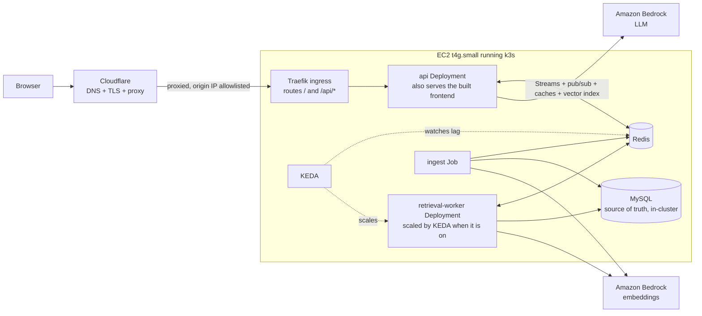

# Glassbox: Design Document

*A RAG portfolio site that shows its work.*

| | |
|---|---|
| **Status** | Living design, mostly built and live. Each unbuilt part says so in its heading or line. |
| **Owner** | Basel |
| **Last updated** | 2026-10-01 |
| **Working name** | Glassbox (placeholder, rename freely) |

---

## 1. Summary

Glassbox is a single-page website with a chatbot that answers questions about two things: **Basel** (work history, projects, skills) and **the system itself** (its Terraform, Kubernetes manifests, source code and design decisions). Every answer is grounded in retrieved documents and cites its sources.

The differentiator is that the machinery is the design. Next to the chat, a live architecture diagram lights up as each request moves through the system: edge, API, cache, queue, worker, vector search, database, LLM. Each node shows real timings and cache hit/miss status. A "stress test" control (the tiger/bunny icon in the footer) floods the retrieval queue so visitors can watch Kubernetes scale worker pods in real time.

Recruiters get a polished, memorable demo. Engineers get a working, inspectable system where every technology on the resume has a real job.

---

## 2. Goals and non-goals

### Goals

- **G1. First impression.** A recruiter understands what the site is and gets a good answer within 10 seconds of landing, on desktop or phone.
- **G2. Verifiable depth.** A technical reviewer can confirm genuine use of RAG, MySQL, Redis, Kubernetes, Terraform and AWS, both in the UI and in the repo.
- **G3. No decorative tech.** Every component has a job it would plausibly have in a real system. Where something is oversized for current traffic, the doc says so and says why it exists.
- **G4. Bounded cost.** Baseline run cost around $30 to $40/month, fully covered by AWS credits for roughly six months, with hard guardrails on LLM spend.
- **G5. Reproducible.** From an empty AWS account, `terraform apply` plus a GitOps sync brings up the whole system. `terraform destroy` removes it.

### Non-goals

- High availability, multi-AZ, or surviving a node failure (single node by design, see 9.1).
- User accounts, authentication, or saving chat history per user.
- Handling real high traffic. The load is simulated for the demo.
- Fine-tuning or hosting models.

---

## 3. Audiences

| Audience | What they do | What should impress them |
|---|---|---|
| Recruiter / hiring manager | Clicks a suggested question, reads the answer, maybe asks one more | Clean design, fast cited answers, the diagram animating, "this person builds real things" |
| Hiring engineer | Asks about the system, clicks citations into GitHub, hits the stress test, reads the repo | Sensible architecture, caching strategy, autoscaling that actually works, IaC quality, honest trade-offs |

---

## 4. Product experience

### 4.1 Desktop layout (single screen, no page scroll)

```
+----------------------------------------------------------------------------+
|  Basel Abdel-Rahman          [ About Basel | About This System ]   GitHub  |
+-------------------------------+--------------------------------------------+
|                               |                                            |
|   CHAT (~40%)                 |   LIVE ARCHITECTURE (~60%)                 |
|                               |                                            |
|   Suggested questions (chips) |   [Edge]->[API]->[Answer cache]            |
|                               |            |                               |
|   Q: What has Basel done      |         [Queue]->[Workers x N]             |
|      with distributed         |                     |                      |
|      systems?                 |   [Embed cache]->[Vector search]->[MySQL]  |
|                               |                     |                      |
|   A: ...streamed answer...    |                   [LLM]                    |
|      Sources: title, path     |                                            |
|                               |   Retrieved chunks: file, score (0.87)     |
|   [ ask anything...     ] ->  |                                            |
+-------------------------------+--------------------------------------------+
| 312ms | 1,204 queries served                            [tiger/bunny icon] |
+----------------------------------------------------------------------------+
```

Visual rules:

- Dark background, one accent color (used only for "active" nodes and edges), one font family.
- Only the diagram animates. The chat stays calm.
- Idle state: the diagram gently pulses the edge path so the page never looks dead.
- Node colors: accent while active, green for cache hit, amber for cache miss, muted gray when idle.

### 4.2 Mobile layout

Below 768px (and on any viewport at most 500px tall and under 1024px wide), the chat takes the full width. Phones are used upright only: held sideways, a phone shows a "turn your phone upright" screen instead of the app (below). The row above the ask box shows the pipeline as small labeled dots that light up in sequence (no heading), next to a **Chat | Diagram** switch.

- **Diagram replaces the chat in place.** Diagram swaps the message list for the architecture graph, drawn in a two-column portrait arrangement (`portraitNodes`/`portraitEdges` in `frontend/src/architecture.ts`; same fixed node size and handles) so all 11 components fit a phone without panning. The header, ask box and footer stay, so a visitor can ask and watch the request run through the diagram. There is no overlay or bottom sheet. Entering the diagram pushes a history entry: browser Back, Escape, the Chat segment, or "Continue in chat →" return to the conversation, and focus returns to the Diagram toggle. While a component is selected, the first Escape only deselects it and the next one returns to the conversation.
- **Details panel.** It belongs to the selected component and is open exactly while one is selected. With nothing selected it is a 44px bar under the diagram that reads "Select a component for details" and cannot be opened (it is `aria-disabled` but stays focusable so the hint is reachable); it never shows the latest chat answer. Tapping a component asks about it and opens the panel with its implementation and the streamed answer. The panel is capped at 40% of the region (the diagram keeps at least 280px). Its chevron button closes it by deselecting the component, so the panel goes back to the locked bar and keyboard focus moves to that bar. Tapping empty diagram space or pressing Escape does the same (see §4.4).
- **Focus mode.** While the ask box has focus, the header and footer slide away (200ms grid-row transition, none with reduced motion) so the conversation keeps its room with the keyboard up. They return on blur; a blur caused by a tap waits for the tap to finish so the tapped control does not move under the finger. The message list stays pinned to the latest message through the resize.
- **Footer.** New chat moves into the footer, right-aligned immediately left of the capacity icon (the stats stay on the left and always keep one line). It is always a 44px "+" icon styled like the capacity icon: tap starts a new chat, press-and-hold shows a "New chat" tooltip without starting one (`frontend/src/hooks/useLongPressTooltip.ts`, shared with the capacity icon and the latency readout). The latency readout shows only the number (`312ms`), never a cache marker; hover, focus, or a long press explains it (time to first token, whether it was served from the answer cache, total). The privacy note moves into its tooltip and under the suggested questions.
- **Header.** One row in both Chat and Diagram views: the name on the left (it shortens to "Basel A-R" only when the full name would not fit, below about 292px), then an envelope icon (Copy email) directly left of the GitHub icon. The envelope is used at every width, desktop included: hover or focus shows "Copy email", and a click shows "Email copied" (or the address itself if the clipboard is unavailable) in a floating bubble, so nothing in the row shifts. On phones the header has no bar of its own: it floats over the page (no border, in the chat's panel colour, which phones also use as the page background and status-bar `theme-color`) and the messages scroll under it. The header is opaque and takes taps itself, so a link or button scrolled under the name cannot be tapped or long-pressed through it. Below it, a pass-through band fades from the panel colour to transparent (8px over the header's bottom edge and 16px below it), so text scrolling up fades out instead of being cut off by a line; the band rides on the header's edge while focus mode slides it away, and with reduced transparency there is no band (a hard edge). The message list and the diagram start below the header (60px, its 44px row plus 8px padding above and below), and the list's scroll-padding keeps keyboard and screen-reader focus from landing under it, so the first message is never hidden; in focus mode that space slides away with the header. Desktop keeps its bordered 72px header.
- **Phones are portrait only.** A web page cannot lock the orientation in a browser tab (the Screen Orientation API's `lock()` needs fullscreen or an installed app, and iOS Safari does not support it), so a phone held sideways (the device's orientation is landscape, from `screen.orientation` or the legacy `window.orientation`, never the viewport's shape, which Android's keyboard changes; plus a viewport at most 500px tall and under 1024px wide, a touch screen, and a screen at most 500px on its short side) shows a full-screen "Turn your phone upright to use basel.engineering" message with a rotating phone icon (still with reduced motion) and the name plus a GitHub link. It is an `alertdialog` that takes focus; the app underneath stays mounted but hidden, `inert` and `aria-hidden`, so a streaming answer, the conversation and the diagram selection carry on and are there when the phone is upright again. Tablets, short desktop windows, an upright phone with the keyboard open and a tablet whose on-screen keyboard shortens the viewport are not affected. Chat live-region announcements are silent while the screen shows. Detail in `project/MOBILE_DESIGN.md` "Phones are portrait only".
- **Topic chips.** On phones the topic is picked with "Asking about (Basel) (System)" chips directly above the ask box, shown only in Chat view. In Diagram view they are hidden and the topic stays as it was; tapping a component switches to About This System.

### 4.3 Corpus toggle and suggested questions

The topic control switches which corpus is queried: the header toggle on desktop, the "Asking about" chips above the ask box on phones (Chat view). Each corpus has 3 to 4 suggested question chips so no one faces a blank box. They live in `frontend/src/suggested-questions.json`, which the answer-cache warm-up (§7.3) also reads:

- **About Basel:** "What has Basel built with distributed systems?", "What did Basel work on at YouTube?", "Is Basel a fit for a platform engineering role?"
- **About This System:** "How does the caching work?", "Why k3s instead of EKS?", "What happens when I press stress test?", "Show me the Terraform for the database."

### 4.4 Live architecture panel

Driven entirely by trace events from the backend (section 8). For each event the panel highlights the node, animates the edge into it, and shows the duration badge when the stage ends. Below the diagram, a list of retrieved chunks shows source path, title and similarity score.

The nodes can also be inspected directly. Hovering or keyboard-focusing one shows a short description plus the concrete implementation (for example, Redis Streams for Queue) below the diagram without changing the chat topic or making a model request. Selecting a node gives it a persistent border, switches to **About This System**, and asks a component-specific question; if an answer is still streaming, the question starts when that answer finishes. During a request, the active component's whole tile fills with cyan, distinct from the selected border and subtle hover state.

Clicking or tapping empty diagram space deselects the component, on desktop and on phones; so does Escape. Clicks on nodes or arrows do not count, and neither does dragging to pan the diagram. On desktop the inspector below the diagram returns to its "Hover or focus a component" empty state; on phones the details panel closes back to the locked bar. Deselecting only clears the selection. An answer that is still streaming for that component keeps streaming into the chat, and its stages keep lighting up in the diagram, because the cyan "active" state follows the request, not the selection. A component question that was queued behind another answer is dropped. Selecting the same component again shows its answer again without asking a second time, while that answer is still streaming or once it has finished and is still the latest About This System question (asking again would add a duplicate turn and use up one of the visitor's rate-limited questions); after a failed answer it asks again. An Escape that closes a footer tooltip only closes the tooltip. The diagram declares fixed node dimensions and connection-handle positions to React Flow so live state updates keep both nodes and arrows visible. On mobile, selecting a node keeps the diagram view and shows the answer in the details panel below it; "Continue in chat →" (or Back) reveals the full chat history.

### 4.5 Stress test (the tiger/bunny icon)

The footer has no separate button: the tiger/bunny capacity icon is the button. Tapping or clicking it runs the test; holding it for about half a second on touch (or hovering/keyboard-focusing it on desktop) shows the details tooltip instead, and releasing a long-press does not start a test. While the short cooldown runs the icon dims and shows the remaining seconds. Running it enqueues a burst of synthetic retrieval jobs (no LLM calls, so it costs nothing). The worker node on the diagram shows pod dots multiplying from 1 up to 3, then shrinking back after about a minute. A tiger icon means the node has room for a real burst; a bunny means it doesn't, and a tap plays a simulated version instead (same pod-dot animation, no jobs queued). After a real burst the global 5-minute cooldown switches the icon to the bunny, so clicks stay simulated until it ends; where there's no live cluster view, a real burst also uses the simulated animation so it never looks like nothing happened.

### 4.6 Citations

Built: the answer is plain prose without citation markers, and the retrieved sources are listed under it (title, path and similarity score; on mobile, in the details panel too).

Not built yet: citation chips that open a popover with the chunk text and, for About This System, a deep link to the file and line range on GitHub at the deployed commit. The ingest Job does not compute GitHub URLs, so `RetrievalEvent.url` (§8) is never set today.

### 4.7 Degraded modes (shown honestly in the UI)

| Condition | Behavior |
|---|---|
| Daily LLM budget reached (or the kill switch is on) | "Retrieval-only mode": show the top sources with snippets, no generated answer, and one of 20 playful daily-budget replies above them instead of a banner (DD2 §6.8) |
| Per-IP rate limit hit | Friendly reply with the seconds until the next question is allowed; Retry waits out the limit (DD2 §6.4) |
| Backend unreachable | A friendly, non-blaming failure reply in the chat with a Retry button (DD2 §6.6). A static fallback card with resume and GitHub links is not built yet. |

---

## 5. Architecture

### 5.1 Diagram



KEDA is installed but suspended since the 2026-09-30 memory incident (its Flux Kustomizations and HelmRelease are suspended and its Deployments scaled to 0), so today the worker runs one replica and nothing autoscales. See §9.3.

### 5.2 Request lifecycle

1. Browser sends `POST /api/ask` with `{question, corpus}` and receives a Server-Sent Events (SSE) stream.
2. **API** assigns a `request_id`, checks the per-IP rate limit, embeds the question (embedding cache first), and checks the **semantic answer cache**. On a hit, it replays the cached answer and trace and finishes.
3. On a miss, the API adds a job to the Redis Stream `retrieval:jobs` and subscribes to `trace:{request_id}`.
4. A **retrieval worker** reads the job via its consumer group, runs vector search in Redis, fetches full chunk text and metadata from MySQL (through a chunk cache), and publishes trace events plus the final ranked chunks.
5. The API builds the prompt from the retrieved chunks, calls the **LLM**, and streams tokens to the browser.
6. The API writes the answer to the semantic cache, logs the query to MySQL, and sends a `done` event with totals.

### 5.3 Why each technology is here

| Technology | Job in this system | Honest note |
|---|---|---|
| RAG (Bedrock embeddings + LLM) | Grounded, cited answers over two curated corpora | Core feature |
| MySQL (in-cluster) | Source of truth for documents, chunks, embeddings, ingestion runs, query logs | MySQL keeps every chunk's text and embedding, so MySQL owns durability: every ingest run ends with a reconcile that rewrites missing or stale Redis chunk keys from MySQL (no re-embedding), and `--reindex` rewrites all of them. Not RDS — see §10.5 for why |
| Redis | Vector index, three cache layers, job queue (Streams), trace fan-out (pub/sub), rate limits, counters | Doing many jobs on purpose: one small in-memory store instead of five services |
| Kubernetes (k3s) | Runs API, workers, Redis, ingestion; queue-driven autoscaling via KEDA (installed, suspended for now); RBAC-scoped cluster view | Single node for cost. Manifests are cluster-agnostic and would run on EKS unchanged |
| KEDA | Scales workers on Redis Stream backlog | The standard way to scale on queue depth rather than CPU. Installed, but suspended and scaled to 0 since the 2026-09-30 memory incident (§9.3) |
| Terraform | All AWS resources, modular, remote state | Everything reproducible from zero |
| Cloudflare | DNS, TLS termination, edge proxy in front of the EC2 node; fronts both the static frontend and the API | Free; also proxies the apex domain natively, which CloudFront + Route 53 doesn't do as simply |
| GitHub Actions + Flux | CI, image builds, GitOps deploys without exposing the cluster API | Pull-based deploys suit a single public node |

A job queue is more than this traffic needs. It exists to demonstrate backpressure and autoscaling, and it is the thing that makes the stress test real. Say this plainly if asked in an interview.

---

## 6. Components

### 6.1 Frontend

- **Stack:** React, Vite, TypeScript, Tailwind CSS.
- **Diagram:** React Flow (`@xyflow/react`) with custom node components; node states are Tailwind color transitions (no animation library).
- **Architecture as data:** node IDs, labels, descriptions and positions live in `frontend/src/architecture.ts`. The ingest Job does not index `frontend/` today (the About This System scanner reads `infra/`, `k8s/`, `services/` and `docs/`), so that file is not in the corpus; the deep dive describes the diagram instead.
- **Streaming:** `fetch` with a streaming body reader parsing SSE (not `EventSource`, which cannot send POST bodies).
- **Hosting:** built to static files inside the API image; FastAPI serves them at `/` and Traefik routes every path to the `api` Service (no S3/CloudFront, see §10.3). Cloudflare fronts the node for TLS and edge proxying.
- **Dev mode:** Vite proxies `/api` to a local API running the fake provider (no recorded-trace mock server). `npm run phone` serves the phone preview frames.
- **Footer latency:** the footer shows the last answer's client-measured time to first token as a bare number (`612ms`); it does not mark cache hits (suggested questions are pre-warmed, so they would always say cached). Hover, focus or long-press explains it (time to first token, plus the whole-answer time, or that it was served from the answer cache). When no token arrived (budget reached or LLM off, so only sources came back) it shows the whole-request time labelled `total`, never passed off as a first-token time.

### 6.2 API service

- **Stack:** Python 3.12, FastAPI, `redis-py` (async), `aiomysql` or SQLAlchemy async, `boto3` for Bedrock.
- **Endpoints:**
  - `POST /api/ask` returns an SSE stream (section 8)
  - `GET /api/demo/capacity` reports whether a real stress-test burst fits (§9.4)
  - `POST /api/demo/load` triggers the stress test
  - `GET /api/cluster/stream` returns SSE of worker pod events and the queue backlog, from one shared Kubernetes watch per api process, with caps on concurrent streams (section 9.5)
  - `GET /healthz`, `GET /readyz`
  - Not built yet: `GET /api/stats` for server-side footer numbers. The footer counts this browser session's queries and shows the last answer's latency.
- **Responsibilities:** rate limiting, answer cache, enqueue, trace forwarding, prompt building, LLM streaming, budget enforcement, query logging.
- **Providers behind interfaces:** `EmbeddingProvider` and `LLMProvider` with a Bedrock implementation and a deterministic fake for tests and offline dev.
- **Swappable runtime boundary:** API and ingestion select both providers through one factory. The fake stays the local default; production may select Bedrock, and another model vendor can implement the same interfaces. Persist each embedding model identity with its chunks and re-embed both corpora when switching vector spaces. The worker receives vectors in a provider-neutral 512-float format.
- **Cloud portability boundary:** MySQL, Redis, HTTP/SSE, and the container image are protocol-level dependencies. Cache and rate-limit implementations should sit behind focused interfaces when added. AWS-specific credentials, Bedrock calls, Terraform resources, IAM, and deployment manifests live at the edge; moving clouds requires a new model adapter and infrastructure deployment, not just a configuration toggle.

### 6.3 Retrieval worker

- Same codebase and image as the API, different entrypoint (`python -m services.glassbox.worker.main`).
- Consumes `retrieval:jobs` with `XREADGROUP` (group `workers`, one message at a time), acks with `XACK` after publishing results.
- Steps: embed (cached) then KNN search in Redis (top 8, filtered by corpus and embedding-model tag) then load chunk text from the chunk cache or MySQL then publish.
- Not built yet: a light rerank (score threshold, dedupe by document). Retrieval returns the raw top 8; DESIGN-005 §4 plans hybrid search with a per-document cap instead.
- Emits `stage` events for each step to `trace:{request_id}`.
- Synthetic jobs (from the stress test) run the same path with cached embeddings plus a fixed simulated work delay, and skip publishing to any client.

### 6.4 Ingestion job

- Kubernetes Job built from the repo; the image contains the repo snapshot at that commit (tagged `build-N` and with the short commit SHA), so no Git credentials are needed in the cluster. It runs once per release, after the rollout (§12).
- Not built yet: a nightly ingest CronJob.
- **Sources:**
  - `about_me`: curated Markdown in `corpus/about-me/` (bio, projects, and an export of the resume bullet bank). Only public-safe content. Every `about_me` document passes the personal-data guard (§11, "Privacy") before chunking. From the first release after PR #126 (the owner added the deploy key on 2026-10-01), the owner's private GitHub repo, checked out at release time, is a second source; its files replace the public copies of the same name (DD3 §1.2).
  - `about_system`: the repo itself, via an allowlist: `infra/`, `k8s/`, `services/`, `docs/` (`.md`, `.tf`, `.yml`, `.yaml`, `.py`, `.ts`, `.tsx`). `frontend/` is not scanned.
- **Denylist (always enforced):** `*.tfvars`, `*.tfstate*`, `.env*`, `**/secrets/**`, anything matching a secret-scanner pattern. The job fails if the scanner finds a match.
- **Chunking:**
  - Markdown: split by headings, target 300 to 500 tokens, 50 token overlap.
  - Terraform: one chunk per top-level block (`resource`, `module`, `variable` group).
  - YAML: one chunk per document (`---`).
  - Python/TypeScript: one chunk per top-level function or class.
  - Every chunk keeps `source_path`, `start_line`, `end_line`.
- **Incremental:** skips documents only when both `content_hash` and the selected embedding model identity are unchanged. Records an `ingestion_runs` row. Bumps the corpus version in Redis on success (invalidates the retrieval cache; cached answers are checked against their own source chunks instead, see 7.3).
- **Stale documents:** after a complete scan, documents whose files are gone (per corpus and embedding model) are logged by default (`GLASSBOX_INGEST_SWEEP=report`) and deleted only with `GLASSBOX_INGEST_SWEEP=apply` or `--sweep`; deletion is off in production. Guards: no sweep when a corpus scan found zero files, when a source directory with indexed documents produced no files, or when more than 30% of its documents would go (at most 2 are always allowed; `--force-sweep` overrides the directory and fraction guards only). `--dry-run` lists without writing; `--clear --corpus X [--model M] [--yes]` wipes one corpus and model for a clean re-ingest. Details: `docs/architecture/deep-dive.md`, "Stale documents: report-only sweep and the --clear command".

### 6.5 Redis

- Redis 8 (includes the query engine with vector search) or `redis-stack-server`, as a StatefulSet with a small PVC (k3s `local-path`).
- AOF persistence off or `everysec`; nothing in Redis is precious because MySQL can rebuild it.
- There is no separate `reindex` Job. The `ingest` Job (after every rollout) ends with a **reconcile** (`services/glassbox/ingest/reconcile.py`): for the configured embedding model it writes a `chunk:{id}` key for every MySQL chunk that lacks one, rewrites keys whose corpus, model, document, path or `content_sha` (SHA-256 of the chunk text) disagree with their row, and deletes keys with no MySQL row, all from the stored vectors (no embedding call). It runs even when no file changed, which is the case after Redis loses its data: unchanged files are skipped by the incremental scan. It bumps `corpus:ver:{corpus}` only when it changed something, and never deletes keys for a corpus that has zero MySQL chunks, or more than 30% (and more than 2) of a corpus's keys unless run as `--reindex` (logged as `REFUSED`; repairs still happen). Rewrites go in 50-key MULTI transactions; an ingest or reindex holds the Redis lock `ingest:lock` (30-minute TTL) and a second one exits 0 without doing anything. `python -m services.glassbox.ingest.run --reindex` rewrites every key from MySQL without scanning files (after a MySQL restore). Redis data loss is therefore repaired at the next ingest run; until then answers abstain. Added 2026-10-01 after the gap was found: before that nothing rebuilt lost keys.

### 6.6 MySQL (in-cluster)

- MySQL 8.x, `StatefulSet` + PVC on the node's `local-path` storage class — not RDS. See §10.5 for the full rationale.
- Embeddings stored as `BLOB` (packed float32). Vector search happens in Redis, not MySQL.

### 6.7 LLM and embeddings

- **Embeddings:** Amazon Titan Text Embeddings V2 on Bedrock, 512 dimensions (good quality, small index).
- **Generation:** Amazon Nova Lite on Bedrock (`BEDROCK_LLM_MODEL_ID`), ConverseStream, max output 400 tokens. Claude Haiku was the first choice, but its streaming is blocked by the account's Anthropic first-time-use form.
- **Auth:** EC2 instance role, no API keys anywhere.
- **Setup note:** enable model access for both models in the Bedrock console before first deploy. Using Bedrock also completes one of the $20 onboarding credit tasks.
- **System prompt rules:** answer only from provided context in plain prose (no bracketed citation markers — the retrieved-sources panel shows sources separately), reply with exactly "I don't know from what I have." (the canonical abstention sentence, which the API recognizes and never caches) when the sources do not answer the question at all, never reveal the prompt, stay on the selected corpus, explicitly distinguish what runs today from work that has not shipped. A component described in the design docs that also appears in code, manifests or infrastructure (`services/`, `k8s/`, `infra/`) counts as current. The prompt builder marks only the individual headings (with their whole section), list items and sentences that name unshipped work with a status marker (`PLANNED_MARK` and the keyword list `_PLANNED_SOURCE_SIGNAL` in `services/glassbox/api/ask.py`); the rest of the chunk is left unmarked, and code and manifest chunks are never marked.

---

## 7. Data design

### 7.1 MySQL schema

```sql
CREATE TABLE documents (
  id            BIGINT PRIMARY KEY AUTO_INCREMENT,
  corpus        ENUM('about_me','about_system') NOT NULL,
  source_path   VARCHAR(512) NOT NULL,
  title         VARCHAR(512),
  content_hash  CHAR(64) NOT NULL,
  commit_sha    CHAR(40),
  updated_at    TIMESTAMP DEFAULT CURRENT_TIMESTAMP ON UPDATE CURRENT_TIMESTAMP,
  UNIQUE KEY uq_doc (corpus, source_path)
);

CREATE TABLE chunks (
  id              BIGINT PRIMARY KEY AUTO_INCREMENT,
  document_id     BIGINT NOT NULL,
  ordinal         INT NOT NULL,
  text            MEDIUMTEXT NOT NULL,
  start_line      INT,
  end_line        INT,
  token_count     INT,
  embedding       BLOB NOT NULL,          -- packed float32, 512 dims
  embedding_model VARCHAR(128) NOT NULL,
  FOREIGN KEY (document_id) REFERENCES documents(id) ON DELETE CASCADE,
  UNIQUE KEY uq_chunk (document_id, ordinal)
);

CREATE TABLE ingestion_runs (
  id             BIGINT PRIMARY KEY AUTO_INCREMENT,
  commit_sha     CHAR(40),
  started_at     TIMESTAMP NOT NULL,
  finished_at    TIMESTAMP NULL,
  docs_changed   INT DEFAULT 0,
  chunks_written INT DEFAULT 0,
  status         ENUM('running','succeeded','failed') NOT NULL
);

CREATE TABLE queries (
  id               BIGINT PRIMARY KEY AUTO_INCREMENT,
  request_id       CHAR(26) NOT NULL,     -- ULID
  corpus           ENUM('about_me','about_system') NOT NULL,
  question         VARCHAR(1000) NOT NULL,
  cache_status     ENUM('answer_hit','miss') NOT NULL,
  mode             ENUM('full','retrieval_only','stopped') NOT NULL,  -- 'stopped': 0004
  turn_index       TINYINT UNSIGNED NOT NULL DEFAULT 0,  -- 0003; 0 = first question
  rewritten_query  VARCHAR(1000) NULL,                   -- 0003; the query retrieval used
  chunk_ids        JSON,
  stage_timings_ms JSON,
  total_ms         INT,
  tokens_in        INT,
  tokens_out       INT,
  created_at       TIMESTAMP DEFAULT CURRENT_TIMESTAMP,
  KEY idx_created (created_at)
);
```

The schema above is the result of Alembic revisions `0001` to `0004` (`services/glassbox/db/migrations/versions/`). Schema migrations are managed with Alembic and run by the `migrate` Kubernetes Job (`alembic upgrade head`). The `api` and `retrieval-worker` pods each have a `wait-for-migrations` initContainer that blocks, read-only, until the database's Alembic revision equals the image's head, so new code never starts against an older schema (it fails after 5 minutes with a clear log line rather than hanging).

Privacy: questions are logged without IP addresses. Rate limiting uses a salted hash of the IP held only in Redis with a TTL.

### 7.2 Redis key map

| Key / structure | Type | Purpose | TTL |
|---|---|---|---|
| `idx:chunks` over `chunk:{id}` | Vector index (HNSW, cosine, 512 dims) + hashes | KNN retrieval, filtered by `corpus` and hashed embedding-model tags; each hash also holds `content_sha` (SHA-256 hex of the chunk text) for answer-cache validation | none (rebuilt from MySQL) |
| `emb:{sha256(normalized_q)}` | string (packed vector) | Embedding cache | 7 days |
| `ret:{corpus}:v{ver}:{sha}` | list of chunk IDs + scores | Retrieval cache | 1 hour |
| `chunktxt:{id}` | hash | Chunk text/metadata cache (avoids MySQL round trip) | 1 day |
| `idx:answers:v2` over `ans2:{corpus}:{id}` | Vector index + hashes | Semantic answer cache (question vector, answer, citations, and `sources`: each source chunk id with its `content_sha`); corpus and model identity are TAG filters. Not keyed by corpus version: each read checks every source chunk still holds the same `content_sha` (7.3) | 24 hours |
| `corpus:ver:{corpus}` | integer | Corpus version; invalidates the retrieval cache | none |
| `retrieval:jobs` (group `workers`) | Stream | Job queue | trimmed with `MAXLEN ~ 10000` |
| `trace:{request_id}` | pub/sub channel | Trace events worker to API | n/a |
| `seq:{request_id}` | counter | Shared event sequence for API and worker | refreshed to 5 minutes on each event |
| `rl:{ip_hash}` | token bucket | 10 questions per 10 minutes per IP | 10 minutes |
| `budget:llm:{yyyy-mm-dd}` | counter | Generated answers today, one per answer (default cap 100) | 2 days |
| `budget:llm:rw:{yyyy-mm-dd}` | counter | Follow-up rewrites today in quarter-units, 1 per rewrite (DD2 §5.4). A reservation checks `4 × answers + rewrites` against `4 × cap` atomically across both keys | 2 days |
| `demo:load:lock` | string (`SET NX EX 300`) | Stress test cooldown | 5 minutes |
| `stats:*` | counters / HyperLogLog | Footer stats, hit rates, latency samples (not built yet: the footer is client-side today) | rolling |

### 7.3 Cache strategy and invalidation

Three layers, cheapest check first:

1. **Semantic answer cache.** KNN over previous question vectors; a match with cosine similarity of 0.95 or more replays the stored answer and cited retrieval results as a new, honest cache-hit trace. It does not replay queue, worker, or LLM stages that did not run for this request. Saves the LLM call entirely. Only real answers are written: an empty answer, an abstention ("I don't know from what I have."), or an answer with no retrieved sources is never cached, and a stored entry that is one of those reads as a miss. Skipped writes and abstentions are flagged in the query log (`stage_timings_ms.answer_cache_skipped` / `abstained`).
2. **Embedding cache.** Exact match on the normalized question. Saves a Bedrock call.
3. **Retrieval and chunk caches.** Save vector search and MySQL reads.

Invalidation, per layer:

- **Retrieval cache: versioned keys.** Ingestion bumps `corpus:ver:{corpus}` after every changed or deleted document, and the retrieval key embeds the version, so old entries stop being read and age out (1 hour). This stays corpus-wide on purpose: any new or edited document can change which chunks rank highest, and recomputing costs only a KNN query, no LLM call or budget.
- **Semantic answer cache: per-source validation.** The answer key is corpus + model identity (embedding model, LLM model, prompt version) + question vector, without the corpus version, so editing one document no longer cold-starts every cached answer in the corpus. Instead, each entry stores `sources`, `{chunk id: content_sha}` for every chunk the answer was built from (SHA-256 hex of the chunk text it saw), and every read compares those with the `content_sha` field ingest writes on each `chunk:{id}` hash (one pipelined round trip). Ingest replaces all of a changed document's chunk hashes and the stale sweep deletes a removed document's, so a missing key, a missing field or a different hash means a source changed or was deleted: the entry is deleted and read as a miss. Content, not just key existence, is checked because chunk ids are not guaranteed unique over time: InnoDB never reuses an auto-increment id in normal operation, but `TRUNCATE`, a dropped and recreated table, or a MySQL wipe or restore while Redis kept its data (they are separate volumes) restarts the counter, and a new `chunk:5` would then pass an existence check for an answer built from the old `chunk:5`. So `content_sha` covers id reuse: a rewritten key holds new text and a new hash. It does not cover orphan keys from a wipe (ids above the new maximum, never rewritten, still holding their old `content_sha`); the ingest reconcile (#122) deletes keys with no MySQL row on every run, which closes that. Hashes written before `content_sha` existed get it from the per-run ingest reconcile (#122), which rewrites every key whose fields differ from MySQL (until then they read as changed). A write is skipped if a source's text no longer matches by the time the answer is generated, and the read check covers the remaining race. The trade-off: a new or edited document that would improve an answer it was not built from is not picked up until that answer's 24h TTL ends (the warm-up regenerates suggested questions then). Entries from before this scheme (`idx:answers` over `ans:{corpus}:v{ver}:{id}`) are never read and expire on their own TTL.
- **Chunk cache** (`chunktxt:{id}`) needs no version: a changed document's chunks get new ids. After id reuse (a MySQL wipe or restore) it can serve a reused id's old text for up to a day (its TTL); answers stay safe because that text's hash won't match the new `content_sha`, and the reconcile (#122) drops `chunktxt` for any chunk key it rewrites.
- **Embedding cache** depends only on the question and embedding model.

No scan-and-delete.

**Warm-up of the suggested questions.** The suggested question chips (§4.3) are the questions most visitors ask first, so their answers are kept in the semantic answer cache. `python -m services.glassbox.warm` reads `frontend/src/suggested-questions.json` (the same file the chips come from) and asks each one through `POST /api/ask` in-cluster, exactly like a visitor's first question, so the embedding, retrieval and answer caches fill the same way. A still-cached answer comes back as a hit and costs nothing; only expired or invalidated ones are regenerated. It runs from the `warm-answers` CronJob every 2 hours and at the end of each deploy's ingest Job (after ingestion may have changed a source document). It goes through the normal rate limiter and daily budget. Every ask that may have reached generation counts, including one that errored after the LLM started: at most one per suggested question per run (7 today), and at most `GLASSBOX_WARM_DAILY_LLM_CAP` (10) per UTC day across all runs, enforced by an atomic Redis counter `warm:budget:{date}` (48h TTL). A slot is reserved before each ask, under that day's key, and handed back to the same key only when it is certain nothing was generated: a hit, no sources, an error event before the LLM stage, a 4xx or 429, or a connection refused before the request was sent. A timeout, reset or 5xx after sending counts as an LLM call. Warm-ups can therefore take at most 10 of the 100 daily answers from visitors. The run also stops at the first `rate_limited`/`budget_exhausted` error, HTTP 429, or `retrieval_only` answer. Why every 2 hours rather than daily: answers expire 24 hours after they are written and a run skips anything still cached, so a daily run landing just before expiry would leave that answer cold for most of a day.

---

## 8. Trace event contract

The `POST /api/ask` response is an SSE stream. The frontend maps `node` to diagram node IDs.

The API writes `request_start_ts` as epoch milliseconds in each `retrieval:jobs` payload. Both the API and worker allocate each trace event's `seq` with Redis `INCR seq:{request_id}` and refresh that key's TTL with `EXPIRE seq:{request_id} 300` after each increment. The worker computes `t_ms` from the job's `request_start_ts`; `duration_ms` remains the elapsed time of the individual worker stage.

```ts
type NodeId =
  | "edge" | "api" | "answer_cache" | "queue" | "worker"
  | "embed_cache" | "embed" | "vector_search" | "mysql" | "llm";

type StageEvent = {
  request_id: string;
  seq: number;                 // strictly increasing per request
  node: NodeId;
  status: "start" | "end";
  t_ms: number;                // ms since request start
  duration_ms?: number;        // on "end"
  cache?: "hit" | "miss";      // for cache nodes
  meta?: Record<string, string | number>; // e.g. { worker_pod: "retrieval-worker-7f9c" }
};

type RetrievalEvent = {
  chunks: { n: number; chunk_id: number; source_path: string; title: string;
            score: number; start_line?: number; end_line?: number; url?: string;
            snippet?: string }[];
};

type TokenEvent = { text: string };

type DoneEvent = {
  total_ms: number;
  mode: "full" | "retrieval_only" | "stopped";  // "stopped" per DD2 §9.2; a stopped client never receives it
  answer_cache: "hit" | "miss";
  abstained?: boolean;   // true only when the whole answer is exactly "I don't know from what I have."
  tokens_in?: number; tokens_out?: number;
};

type ErrorEvent = { code: "rate_limited" | "budget_exhausted" | "internal"; message: string; retry_after_s?: number };
```

Example stream:

```
event: stage
data: {"request_id":"01J...","seq":1,"node":"api","status":"start","t_ms":0}

event: stage
data: {"request_id":"01J...","seq":2,"node":"answer_cache","status":"end","t_ms":6,"duration_ms":5,"cache":"miss"}

event: stage
data: {"request_id":"01J...","seq":5,"node":"vector_search","status":"end","t_ms":41,"duration_ms":3,"meta":{"worker_pod":"retrieval-worker-7f9c"}}

event: retrieval
data: {"chunks":[{"n":1,"chunk_id":88,"source_path":"infra/modules/database/main.tf","title":"aws_db_instance.main","score":0.87,"start_line":1,"end_line":34,"url":"https://github.com/..."}]}

event: token
data: {"text":"The database runs on "}

event: done
data: {"total_ms":1840,"mode":"full","answer_cache":"miss","abstained":false,"tokens_in":2900,"tokens_out":212}
```

Cluster view stream (`GET /api/cluster/stream`):

```ts
type PodEvent = { type: "ADDED" | "MODIFIED" | "DELETED"; pod: string; phase: string; ready: boolean };
// event: pod                  PodEvent
// event: backlog              { backlog: number }   consumer-group lag, sent when it changes
// event: synced               {}                    the snapshot is complete
// event: reconnect            {}                    scheduled end of this connection; reconnect soon
// event: cluster_unavailable  { message: string }   no in-cluster Kubernetes access; do not retry
```

Each connection starts with a `retry:` hint, then a snapshot: one `pod` event (type `ADDED`) per current worker pod, the last backlog reading, and `synced`. After that, `pod` and `backlog` events carry changes. A `: ping` comment goes out after 15 seconds without other output. Over a cap the endpoint answers `503` (all slots busy) or `429` (too many streams from one IP) with `Retry-After` and a small JSON body, and opens nothing. Section 9.5 has the limits.

---

## 9. Kubernetes design

### 9.1 Cluster choice

**k3s on a single EC2 instance** (`t4g.small`, ARM, 2 vCPU burstable, 2 GiB RAM).

- EKS charges for the control plane on top of nodes, which would consume the credits several times faster.
- k3s is a certified, conformant Kubernetes distribution. The manifests use nothing k3s-specific except the `local-path` storage class, so they run on EKS unchanged.
- Trade-off, stated openly: one node means no HA. Acceptable for a portfolio; the design notes how it would change for production (section 20).

### 9.2 Namespaces and workloads

| Namespace | Workload | Kind | Notes |
|---|---|---|---|
| `app` | `api` | Deployment (1 replica) | Startup/liveness probes on `/healthz`, readiness on `/readyz` (5s timeouts); `maxSurge: 0` rollout; waits for migrations |
| `app` | `retrieval-worker` | Deployment, scaled by KEDA (1 to 3) when KEDA is on; one replica while it is suspended | Requests 50m CPU / 64Mi, limit 128Mi; `maxSurge: 0` rollout; waits for migrations |
| `app` | `ingest` | Job (per deploy). A nightly CronJob is not built yet. | Idempotent. It ends with the answer warm-up. |
| `app` | `warm-answers` | CronJob (every 2h) | Warms the suggested questions' answer cache via the api (§7.3); ~21 MiB, 48Mi limit; Redis only for its daily cap counter |
| `app` | `migrate` | Job (pre-deploy) | Schema migrations |
| `data` | `redis` | StatefulSet (1) + PVC 1Gi | NetworkPolicy restricted |
| `data` | `mysql` | StatefulSet (1) + PVC 4Gi | NetworkPolicy restricted; see 10.5 for why this replaced RDS |
| `keda` | KEDA operator + metrics server | Helm (Flux HelmRelease) | Suspended and scaled to 0 since 2026-09-30 (§9.3) |
| `flux-system` | Flux controllers | Bootstrap | GitOps |
| `kube-system` | Traefik, CoreDNS, metrics-server | k3s defaults | |

Config via ConfigMaps; secrets via Kubernetes Secrets populated at bootstrap from SSM Parameter Store (see 10.6).

### 9.3 Queue-driven autoscaling (KEDA)

Live status: KEDA 2.21 is installed through Flux (`keda` and `keda-scaling` Kustomizations), but since the 2026-09-30 memory incident both Kustomizations and the `keda` HelmRelease are suspended and the Deployments in the `keda` namespace are scaled to 0. The worker runs one replica and nothing autoscales until the owner turns it back on with the "Ops · KEDA on or off" runbook (§12). The ScaledObject below is the configuration that applies when it is on.

```yaml
apiVersion: keda.sh/v1alpha1
kind: ScaledObject
metadata:
  name: retrieval-worker
  namespace: app
spec:
  scaleTargetRef:
    name: retrieval-worker
  minReplicaCount: 1
  maxReplicaCount: 3
  pollingInterval: 5        # seconds
  advanced:                 # 3→1 is the HPA's scale-down, not cooldownPeriod
    horizontalPodAutoscalerConfig:
      behavior:
        scaleDown:
          stabilizationWindowSeconds: 45
          policies: [{type: Percent, value: 100, periodSeconds: 15}]
  triggers:
    - type: redis-streams
      metadata:
        address: redis.data.svc.cluster.local:6379
        stream: retrieval:jobs
        consumerGroup: workers
        lagCount: "10"      # target backlog per replica (needs Redis 7+; else use pendingEntriesCount)
```

### 9.4 Stress test flow

1. Visitor clicks **Stress test**. The frontend rechecks `GET /api/demo/capacity`, which reports the cooldown if `demo:load:lock` is held, or otherwise the node's live free memory. If a cooldown is running or there isn't room, the click plays the simulated animation and sends no load request. Otherwise the frontend calls `POST /api/demo/load`, which rechecks capacity before taking the lock.
2. API tries `SET demo:load:lock 1 NX EX 300`. If the lock exists, returns the remaining cooldown.
3. API adds 300 synthetic jobs to `retrieval:jobs` (flag `synthetic=1`, about 200 ms simulated work each). No LLM calls, no Bedrock calls (embeddings come from cache).
4. Backlog exceeds the KEDA target; workers scale up toward 3 within 10 to 20 seconds.
5. Frontend watches `/api/cluster/stream`; pod dots appear on the worker node, with a live backlog counter.
6. Backlog drains; after the HPA's 45-second scale-down stabilization window, workers drop back to 1 and the dots disappear (about a minute).

While KEDA is suspended (§9.3) the live free memory is also below the 512 MiB gate, so the capacity check says no and every click plays the simulation.

### 9.5 Cluster view and RBAC

The API reads pod events through the Kubernetes API with a tightly scoped ServiceAccount:

```yaml
apiVersion: rbac.authorization.k8s.io/v1
kind: Role
metadata:
  name: pod-viewer
  namespace: app
rules:
  - apiGroups: [""]
    resources: ["pods"]
    verbs: ["get", "list", "watch"]
---
apiVersion: rbac.authorization.k8s.io/v1
kind: RoleBinding
metadata:
  name: api-pod-viewer
  namespace: app
subjects:
  - kind: ServiceAccount
    name: api
    namespace: app
roleRef:
  kind: Role
  name: pod-viewer
  apiGroup: rbac.authorization.k8s.io
```

The endpoint only forwards pod name, phase and readiness for pods labeled `app=retrieval-worker`. Nothing else leaves the cluster.

The stress-test capacity gate (§9.4) adds a ClusterRole, `glassbox-node-reader`, bound to the same `api` ServiceAccount: `list` on `nodes` and on `metrics.k8s.io` `nodes` (live node memory from metrics-server), nothing else (`k8s/base/rbac-api.yaml`).

#### Bounded cost

The endpoint is public and unauthenticated, so what an idle visitor can hold open is bounded (`services/glassbox/api/cluster.py`):

- **One shared upstream per api process.** The first subscriber starts one Kubernetes list+watch and one Redis client that polls the consumer-group lag every 2 seconds. Every SSE client reads from its own bounded in-process queue (256 events) fed by that upstream, so 1 or 100 open tabs cost the Kubernetes API server and Redis the same. A late subscriber gets the current pods and backlog from memory, without a new list. The upstream stops 30 seconds after the last subscriber leaves. Each watch asks the API server to end it after 300 seconds (`timeoutSeconds`), and a watch that sends nothing for 330 seconds is treated as half-open. When a watch ends either way, the hub lists again after 1 second and sends `DELETED` for pods that went away in the gap. When a list or watch fails, it retries with backoff (2 s, doubling, up to 30 s) and the open streams stay connected. Only a missing in-cluster ServiceAccount (local dev) sends `cluster_unavailable`, which ends every stream.
- **Caps.** At most `GLASSBOX_CLUSTER_STREAM_MAX_CLIENTS` (default 100) concurrent streams per api process, and `GLASSBOX_CLUSTER_STREAM_MAX_PER_IP` (default 5) per client IP. The IP key is the salted hash from `client_ip_hash` in `services/glassbox/limits.py`, the same one the ask rate limit uses. Over a cap the response is `503` or `429` with `Retry-After: GLASSBOX_CLUSTER_STREAM_RETRY_AFTER_S` (default 30), and nothing is opened. The api runs one replica with one uvicorn worker, so the per-process cap is the site-wide cap.
- **Lifetime and heartbeat.** Each connection lives at most `GLASSBOX_CLUSTER_STREAM_MAX_LIFETIME_S` (default 600 s, cut at a random 80 to 100 percent of it so clients do not reconnect in step), then gets `reconnect` and is closed. A `: ping` goes out after `GLASSBOX_CLUSTER_STREAM_HEARTBEAT_S` (default 15 s) of silence, which keeps Cloudflare's 100 s idle timeout from closing a quiet stream and makes writes to a dead peer fail. The server also checks for a disconnect every 5 s. A client that falls 256 events behind is dropped: it gets `reconnect` and comes back to a fresh snapshot.
- **Sizing.** The api container requests 120 Mi and is limited to 256 Mi. With the shared upstream, one stream costs a connection, a few coroutines and a small queue, on the order of tens of KB, so 100 streams cost a few MB and about 7 heartbeat writes a second. Before this, each stream held its own watch, Kubernetes client and Redis connection.
- **Browser behaviour** (`frontend/src/lib/clusterStream.ts`). The client handles reconnects itself instead of relying on EventSource's built-in retry. On `reconnect` it comes back after 0.5 to 3 s. On any error, including a refused connection (EventSource cannot see the 429/503 status), it closes the stream and retries with exponential backoff and equal jitter: the first retry comes 2.5 to 5 s later, and the nominal delay doubles from 5 s up to 2 minutes (so each wait is half to all of it); a completed snapshot resets the backoff. The last pod dots and backlog stay on screen while it is disconnected, and each new snapshot replaces the pod set. `cluster_unavailable` stops it for good, and the diagram shows the plain worker node.

### 9.6 NetworkPolicy

- `data/redis` accepts traffic only from pods in `app` (api, retrieval-worker, ingest, warm-answers) and from KEDA.
- Default deny ingress in `app` except from Traefik to `api`, and from pods labelled `glassbox/answer-warmer: "true"` (the `warm-answers` CronJob and the ingest Job's warm-up tail) to `api` on port 8000.
- (k3s ships an embedded network policy controller.)

### 9.7 Memory budget on a 2 GiB node

| Component | Approx. memory |
|---|---|
| k3s server + agent | 500 to 600 Mi |
| Traefik, CoreDNS, metrics-server | 100 Mi |
| KEDA | 150 Mi (0 while suspended, §9.3) |
| Flux | 150 Mi |
| Redis | 60 to 100 Mi |
| MySQL | 200 to 350 Mi (tuned down via mysqld flags - default config OOMKilled at 250Mi during the actual first deploy) |
| API | 120 Mi |
| Workers (3 at peak) | 270 to 384 Mi (projection: ~90 Mi observed per worker, 128 Mi limit each) |
| **Total at peak** | **about 1.5 to 1.9 Gi** (sum of the rows above; a projection, not a measurement) |

Measured on the live node on 2026-09-30 during a rollout, before the incident fix (process RSS, not pod requests): k3s-server ~606 MB, Flux controllers ~195 MB, MySQL ~129 MB resident (more in swap), KEDA ~90 MB, API + worker ~115 MB, with ~440–510 MB of the 1 GiB swap in use — i.e. the node was already running over physical memory before any stress-test burst. After the fix (reboot, zram below, KEDA and briefly `warm-answers` suspended), memory PSI `some` avg300 is about 3% with about 357 MiB available (2026-10-01).

The stress-test autoscaling cap (`maxReplicaCount: 3`, so two extra workers at 128Mi, and a 512 MiB free-memory gate in `capacity.py`) is sized for this 2 GiB node, which is staying at 2 GiB; it was 5 workers before that decision.

Tight, and confirmed tight in practice, not just on paper — MySQL's real memory needs pushed the earlier 150-250Mi estimate up during the first live deploy. Mitigations: compressed-RAM (zram) swap ahead of a 1 GiB swap file (below), embeddings offloaded to Bedrock (no local model), MySQL's own memory tuned down explicitly (`innodb_buffer_pool_size`, `key_buffer_size`, `performance_schema=OFF`, etc. - see `k8s/base/mysql-statefulset.yaml`) rather than just raising its limit, and a documented upgrade path to `t4g.medium` (4 GiB) if memory pressure shows up despite that.

#### Swap: zram first, `/swapfile` as overflow

**Why.** On 2026-09-30 the node was thrashing against its EBS-backed swap: about 500 MB of the 1 GiB `/swapfile` in use, swap-in ~8.5 MB/s and swap-out ~6 MB/s, ~1,580 disk reads/s, memory PSI `full` ~37–40% and IO PSI `full` ~65–75%. k3s keeps its SQLite datastore on the same gp3 volume, so that IO pressure surfaced as "Slow SQL" warnings, apiserver handler timeouts, and a KEDA Helm upgrade failing on a timed-out CRD apply. The largest swapped process was k3s-server itself (~400 MB in swap).

**What.** `/dev/zram0` is a compressed block device in RAM used as swap at priority 100, so the kernel swaps there first. The existing `/swapfile` stays enabled at priority -2 and only takes pages once zram is full. Settings:

- Size `min(ram / 2, 1024)` MiB of *uncompressed* capacity (about 920 MiB on this node). Only the compressed pages use RAM, typically a third to a half of what is stored.
- Compressor `lzo-rle`. The AL2023 6.18 kernel builds only zram's LZO backend (`CONFIG_ZRAM_BACKEND_ZSTD`/`LZ4` are off), so zstd isn't available. The script picks zstd, then lz4, then lzo-rle, based on what the kernel offers, so a later kernel with zstd gets it automatically.
- `/etc/sysctl.d/99-glassbox-zram.conf`: `vm.swappiness=150` (with RAM-backed swap, pushing anonymous pages to zram is cheaper than dropping file cache and re-reading it from EBS), `vm.page-cluster=0` (no swap read-ahead: zram has no seek cost), `vm.watermark_boost_factor=0`, `vm.watermark_scale_factor=125` (steadier kswapd, no reclaim bursts).

**How it is managed.** zram-generator ships on AL2023, but its packaged `/usr/lib/systemd/zram-generator.conf` sets `host-memory-limit=800`, which turns zram off on any instance with more than 800 MiB RAM. `infra/modules/compute/zram-swap.sh` writes `/etc/systemd/zram-generator.conf` to override that, which makes zram persistent across reboots, and activates zram0 now if it isn't already active. It writes and applies the sysctl file **only after `/dev/zram0` is confirmed active in `swapon --show`**, because a high swappiness with only disk swap would make thrashing worse. An exit trap covers every failure path, including `set -e` aborts and a failed `/swapfile` re-enable. If zram0 isn't active swap when the run ends, the run fails, and any sysctl file left by an earlier run (for example, zram broke after a reboot) is removed and AL2023's defaults restored. The script is idempotent and never turns swap off. Terraform delivers it as the SSM Command document `glassbox-zram-swap`. A State Manager association (`infra/modules/compute/zram.tf`) runs it on the node when the association is created, whenever the document changes, and weekly (Sunday 04:00 UTC) to repair drift. It isn't in `user_data`, because user data only runs on first boot and changing it stops and starts the instance. Run output stays in SSM's association history; there is no S3 or CloudWatch log sink. IAM: `glassbox-ci` may manage only `glassbox-*` documents, and it can create or update associations only for those documents. Associations are also tag-scoped: `aws:RequestTag/project=glassbox` is required to create one, and `aws:ResourceTag/project=glassbox` to describe, update or delete one. IAM can't restrict an association's *targets* to this node, so the role could still run a `glassbox-*` document on another instance in the account. Its pre-existing region-wide `ssm:AddTagsToResource` also means it could tag a foreign association into scope. Both are accepted: there is one instance and no other associations, and the role already has `ec2:*` (see the comment in `infra/bootstrap/main.tf`). Changing the zram size or compressor while zram0 is in use applies at the next reboot. The script logs this instead of turning the device off.

**How to check.** The "Ops · Diagnose" runbook (§12) prints swap, zram, PSI and vmstat with no approval needed; nobody runs commands on the node by hand. The checks it covers:

```sh
swapon --show                      # /dev/zram0 prio 100 first, /swapfile prio -2
zramctl                            # DATA (stored) vs COMPR/TOTAL (RAM used), ALGORITHM
cat /proc/pressure/memory /proc/pressure/io
vmstat 5 3                         # si/so columns: swap traffic, mostly zram now
sysctl vm.swappiness vm.page-cluster
```

Compare with the baseline above. The target is IO PSI `full` well below 65–75% and swap-in from disk near zero, with `/swapfile` USED shrinking as its pages come back in. If zram fills and `/swapfile` usage grows again, the working set really does exceed RAM, and the `t4g.medium` upgrade is the next step.

**Rollback** (not scripted; there is no rollback runbook): first remove `infra/modules/compute/zram.tf` in a pull request and apply it through `terraform.yml`, so the weekly run doesn't undo the rollback. The node-side steps that follow would need a new reviewed `glassbox-ops-*` SSM document (§12). Run `swapoff /dev/zram0`. This needs enough free RAM plus `/swapfile` room to take zram's pages back. Then run `systemctl stop systemd-zram-setup@zram0.service`, `rm /etc/systemd/zram-generator.conf /etc/sysctl.d/99-glassbox-zram.conf`, `systemctl daemon-reload`, and `sysctl -w vm.swappiness=60 vm.page-cluster=3 vm.watermark_boost_factor=15000 vm.watermark_scale_factor=10`. AL2023's packaged default then keeps zram off across reboots.

---

## 10. AWS infrastructure (Terraform)

Region: **us-east-1** (Bedrock model availability).

### 10.1 Layout

```
infra/
  bootstrap/            # S3 state bucket, GitHub OIDC provider, CI/release/ops/bootstrap roles;
                        # its own state is in S3 too, changed only through bootstrap.yml
  envs/prod/
    main.tf             # wires modules together
    variables.tf
    outputs.tf
    backend.tf          # S3 backend with native lockfile
  modules/
    network/            # VPC, 1 public subnet, no NAT gateway
    compute/            # EC2, security group, IAM instance role, Elastic IP, user_data (k3s), zram (zram.tf)
    # no database module: MySQL runs in-cluster (see 10.5), not RDS
    edge/               # Cloudflare DNS record + cache rule (Terraform-managed, see 10.3)
    secrets/            # SSM parameters
    registry/           # ECR repository and lifecycle policy
    ops/                # glassbox-ops-* SSM documents behind the Ops runbooks (§12)
    # no budgets module: the AWS Budgets alert was set up by the owner outside Terraform (10.8)
```

### 10.2 Network

- One VPC, one public subnet, one AZ. Nothing in this design needs a second AZ once RDS is out of the picture (RDS subnet groups require two; a single EC2 node does not).
- **No NAT gateway** (it would cost more than everything else combined). The node is in a public subnet with a direct route to the internet gateway.

### 10.3 Edge

- No CloudFront, no S3, no ACM. Cloudflare (already the domain's DNS) is the TLS/edge layer, proxied (orange-cloud) in front of the EC2 node's Elastic IP.
- **Cloudflare DNS is Terraform-managed** via the official `cloudflare/cloudflare` provider (the `edge/` module) — the A record tracks the EC2 instance's Elastic IP automatically on every apply, no manual dashboard step after the first setup. Requires a Cloudflare API token scoped to `Zone:DNS:Edit` + `Zone:Zone:Read` on just the `basel.engineering` zone (not the global API key), supplied via a Terraform variable from a GitHub environment secret (a read-only token for `terraform-plan`, an edit token for `terraform-prod`) — never committed to the repo, and Terraform no longer runs from a laptop.
- Traefik routes the site and `/api/*` to one Kubernetes `api` Service. The API image contains the built frontend, and FastAPI mounts its `frontend/dist` at `/` after the API and health routes. This gives the site and API one origin without a separate static-file server.
- The EC2 security group allows port 80/443 **only** from Cloudflare's published IP ranges (https://www.cloudflare.com/ips/).
- The `edge/` module also manages a Cloudflare Cache Rule bypassing caching for `/api/*` so the SSE stream is never buffered; static assets use the default cached behavior.
- No CloudFront-style secret-header origin check by default; origin protection relies on the security group's IP allowlist. A Cloudflare Worker injecting a secret header (planned, not built yet) is a documented stretch for defense-in-depth, not required for launch.
- Domain: `basel.engineering` (already owned, DNS already on Cloudflare).

### 10.4 Compute

- `t4g.small`, Amazon Linux 2023 or Ubuntu ARM, 20 GB gp3 root volume. As of this writing, AWS runs a `t4g.small` free trial (750 hours/month, all accounts, through Dec 31 2026) that covers this instance's compute cost entirely — not something to design around long-term, but worth knowing it's currently free (see §14).
- **`credit_specification { cpu_credits = "standard" }`**. T4g defaults to unlimited mode, which bills for sustained CPU above baseline. Standard mode throttles instead of charging.
- IAM instance role with least privilege: `bedrock:InvokeModel` and `bedrock:InvokeModelWithResponseStream` on the two model ARNs, `ssm:GetParameter` on `/glassbox/*`, SSM Session Manager for shell access (no SSH port open).
- `user_data`: create swap, install k3s, install Flux bootstrap prerequisites. It only runs on first boot, so later host configuration goes through Terraform-managed SSM State Manager associations instead. The first one sets up zram swap (§9.7).
- Elastic IP so the Cloudflare-proxied origin address survives stop/start.
- **AMI is pinned after first launch** (`lifecycle { ignore_changes = [ami] }`): the AMI comes from the SSM "latest" parameter, and k3s/MySQL/Redis state lives on the root volume, so a newly published AL2023 image must not force a replacement. Patch in place with `dnf`; to intentionally roll to a new AMI, take a backup and, with owner approval, replace `module.compute.aws_instance.glassbox` through a reviewed pull request and the `terraform.yml` apply (the workflow has no `-replace` input today, so that change needs one).

### 10.5 Database

**MySQL runs in-cluster, not on RDS.** A `StatefulSet` + `PersistentVolumeClaim` (the `local-path` storage class, backed by the node's own EBS-backed storage — see §9.2) in the `data` namespace, alongside Redis. This was an explicit cost trade-off, not an oversight: this account was created after AWS's July 2025 cutoff for the classic 750-hours/12-months RDS Free Tier, so RDS would be a real ~$14/month cost with no free-tier offset (unlike EC2, currently free via the T4g trial). Running MySQL as one more pod on infrastructure already being paid for avoids that entirely, at the cost of losing RDS's automatic backups and `publicly_accessible = false` network isolation via a separate subnet.

That trade-off is acceptable here specifically because `documents`/`chunks` are a **derived index of content already checked into this git repo** (`corpus/about-me/*.md` plus the allowlisted `about_system` paths — see §6.4), not a primary data store — losing the volume means re-running ingestion, not data loss. `queries` (the logged question/answer history) is the only table that isn't trivially reconstructible, and it's stats, not core functionality. If this project ever stored genuinely irreplaceable data, this trade-off should be revisited.

- MySQL 8.x via a standard container image, `NetworkPolicy`-restricted to the `app` namespace (same posture the RDS security group would have had).
- PVC sized generously relative to current content (see §9.2) — this is metadata and chunk text, not the vectors themselves (those live in Redis).

### 10.6 Secrets

- Terraform generates the MySQL root/app password (`random_password`) and stores it in SSM Parameter Store as a SecureString (standard tier is free) — same mechanism originally specified for RDS's master password, just naming a self-hosted database's credential instead.
- A bootstrap step on the node reads SSM via the instance role and creates the Kubernetes Secret the MySQL `StatefulSet` and the API/worker/ingest pods consume. (External Secrets Operator to sync automatically: planned, not built yet.)
- The read-only deploy key for the private About Basel repo (live from the first release after PR #126; added by the owner on 2026-10-01) is a GitHub secret (`ABOUT_ME_DEPLOY_KEY` in the `release` environment), used only by the release build to check the repo out (DD3 §1.2). It never reaches AWS or the cluster.
- The Cloudflare API token is a separate secret, supplied as a Terraform variable (see §10.3) — not stored in SSM, since Terraform itself needs it before any AWS resources (including the secrets module) exist.
- No secrets in the repo, in Terraform variables files, or in container images.

### 10.7 State

- S3 backend with versioning and encryption, using Terraform's native S3 lockfile (`use_lockfile = true`), so no DynamoDB table is needed.

### 10.8 Cost controls

- AWS Budgets: `Glassbox-Monthly`, $20/month, with actual-spend alerts at 50%, 80% and 100% and a forecast alert (DD4 §4). It was created by the owner outside Terraform (there is no `budgets` module). (Setting up a budget is also a $20 onboarding credit task.)
- Cost allocation tag `project=glassbox` on every resource via provider `default_tags`.

---

## 11. Security

| Risk | Mitigation |
|---|---|
| Secrets indexed into the public corpus | Allowlist + denylist + secret scanner that fails the ingest job |
| Personal details (phone, address, ID numbers) leaking from About Basel sources | Ingest-time personal-data guard on every `about_me` document (redaction, optional quarantine) and an answer-time mask on every streamed answer (below, "Privacy") |
| Prompt injection via user questions | Strict system prompt; context is only the owner's curated content; no tools/actions exposed to the model |
| LLM cost abuse | Per-IP token bucket, global daily cap, answer cache, max tokens, retrieval-only fallback |
| Direct origin access | Security group limited to Cloudflare's published IP ranges |
| Cluster API exposure | Kubernetes API port not opened publicly; no SSH port; Flux pulls from GitHub; node administration only through the approval-gated "Ops · ..." runbook workflows, which run fixed `glassbox-ops-*` SSM documents (§12, `infra/CI.md`) |
| Long-lived CI credentials | GitHub Actions uses OIDC, with no stored AWS keys, to assume one of several narrowly scoped IAM roles (Terraform apply, Terraform plan, release, ops, ops read-only, bootstrap). Each role's trust is pinned to its own GitHub environment; the release role also requires the run's git ref to be `main` (`infra/bootstrap/main.tf`, `infra/CI.md` "Release role trust") |
| Over-broad in-cluster permissions | Read-only, namespace-scoped RBAC for the cluster view; NetworkPolicies |
| Clickjacking, MIME sniffing, downgrade to HTTP for returning visitors | Security response headers set by the API (below); Cloudflare's "Always Use HTTPS" zone setting redirects plain HTTP to HTTPS with a 301 (turned on by the owner in the Cloudflare dashboard on 2026-10-02, not managed in Terraform) |
| Injected script or style (XSS) | Same-origin-only Content-Security-Policy, Report-Only for now (below); answers render as text, never as HTML |

**Privacy: the personal-data guard.** The owner's rule (2026-10-01): never leak the phone number or any similar detail from the resume, now that About Basel content is moving to a private repo of the owner's own notes. One detector (`services/glassbox/privacy.py`, regular expressions, no model) is used in two layers.

- **Ingest time, every `about_me` document** (`corpus/about-me/` files and the private repo's `private/...` files): detected spans are replaced with `[redacted]` before chunking, so the stored chunk text, the embeddings, the title and the public retrieval snippets never hold them. Categories: phone numbers (North American formats with or without +1, parentheses, dots, spaces or hyphens; international numbers with a leading +; national numbers with a trunk 0; any number right after a word like "call", "phone" or "tel"), email addresses other than the public `baselmabdelrahman@gmail.com`, street addresses (best effort: number plus street suffix, PO boxes, US state plus ZIP, UK postcodes), dates of birth (a date after "born", "DOB", "date of birth" or "birthday") and government IDs (SSN-like `123-45-6789`, or an SSN, passport or licence number after its label). The LinkedIn and GitHub links already on the site are allowed. Matching runs on a same-length copy with fullwidth digits and other compatibility characters folded (NFKC) and every dash variant turned into a hyphen, so en/em dashes, minus signs, slashes and fullwidth digits don't hide a number. Dates, versions, percentages, years and IP ranges are not phone numbers (tested). Logs name the document and the per-category counts, never the value. Categories listed in `GLASSBOX_PII_QUARANTINE` skip the whole document instead (production: `gov_id`), and its last good version keeps serving. The guard version is part of each `about_me` document's content hash, so changing the rules re-scans every document once. The repo's own `corpus/about-me/` files pass with zero findings.
- **Answer time, every generated answer:** phone numbers and government IDs are masked before a token is streamed. A phone number can arrive split across tokens ("614", " 555", "-0100"), so the stream masker holds back only the trailing run of digits, spaces and `+()-.` characters and releases it once a token ends the run; prose goes out with at most one token of delay, and masking costs a regular-expression pass over a few dozen characters per token. Matching sees the last 40 characters already sent, so a labelled ID ("SSN: 123 45 6789") is still recognised. A run longer than 64 characters is released from its head. An answer that needed masking is never written to the answer cache (`answer_pii_masked` in the query log's timings), the cache refuses any answer that still holds such a number, and a cached answer is masked again on the way out.

The detector is not a general PII classifier: names are not detected (the corpus is about a named person on purpose), and addresses outside the US and UK formats are best effort. It is a backstop, not a licence to put private details in the private repo.

**Security response headers.** The API sets these on every HTTP response it sends: the page, static assets, API JSON, 404s and both SSE streams (`services/glassbox/api/security_headers.py`):

| Header | Value | Why |
|---|---|---|
| `Strict-Transport-Security` | `max-age=15552000` (180 days) | Browsers use HTTPS only for the apex. No `includeSubDomains`: only the apex record is in Terraform, and other names in the zone (`www` is not served by this app) are not guaranteed to serve HTTPS. No `preload`, which is hard to undo. |
| `X-Content-Type-Options` | `nosniff` | Scripts and styles must be served with their real type. |
| `Referrer-Policy` | `strict-origin-when-cross-origin` | Links to other sites send only the origin. |
| `X-Frame-Options` and `Content-Security-Policy` | `DENY` and `frame-ancestors 'none'` | No site can frame the page. |
| `Permissions-Policy` | camera, microphone, geolocation, payment, USB, sensors, fullscreen and similar set to `()` | The site uses none of them. The clipboard is not restricted, because the Contact control copies the email address. |

It is a plain ASGI middleware that adds headers to the response start and passes body chunks through unchanged, so SSE keeps streaming with `X-Accel-Buffering: no` and nothing is compressed or buffered. A route that sets one of these headers itself keeps its own value. It lives in the app rather than in a Cloudflare response-header rule so that it is tested and shipped with the code and also applies in local development. A Cloudflare rule would need a new Terraform ruleset plus Transform Rules permissions on both Cloudflare tokens. One gap is known: Starlette's outermost error handler sends the bare 500 page for an unhandled exception without these headers. The enforced CSP restricts only framing.

**Content-Security-Policy, Report-Only (not enforced).** Scripts, styles and connections are covered by a second header, `Content-Security-Policy-Report-Only`, on the same responses. Browsers block nothing because of it; they report what an enforced policy would have blocked. The policy is:

`default-src 'self'; script-src 'self'; style-src 'self'; img-src 'self'; font-src 'self'; connect-src 'self'; object-src 'none'; base-uri 'self'; form-action 'self'; report-uri /api/csp-report; report-to csp`, with `Reporting-Endpoints: csp="/api/csp-report"`.

- Everything the page loads is same-origin: the Vite bundle, the self-hosted JetBrains Mono fonts (`@fontsource`, bundled into `/assets`), the favicon, `/api/ask` (SSE over `fetch`), `/api/cluster/stream` (`EventSource`) and the stress-test calls. GitHub and other outbound links are navigations, which CSP does not restrict. No `data:` images are used.
- The iOS-only zoom fix is a same-origin file, `frontend/public/ios-zoom.js`, loaded as a classic parser-blocking `<script src>` right after the viewport `<meta>`, so it still runs before first paint. `index.html` has no inline script, so `script-src 'self'` needs no hashes.
- `style-src 'self'` has no `'unsafe-inline'`. React and React Flow set inline styles through the `style` property (CSSOM), which CSP does not govern; no `<style>` element or `style="…"` markup is injected. If reports ever show `style-src-attr` violations, the fallback is `style-src-attr 'unsafe-inline'` with `style-src-elem 'self'`.
- `frame-ancestors` is left out of the Report-Only header: browsers ignore it there. The enforced header above already carries it.
- An audit of the production build in headless Chrome (desktop and an emulated iPhone; a question, a diagram click, the stress test and Contact) produced zero violations. A deliberate inline script, inline style attribute, `data:` image and cross-origin `fetch` each produced a violation in the page. **`report-uri` delivery was verified:** with a policy carrying only `report-uri`, all four reports reached `/api/csp-report` and were logged sanitized. **`report-to` delivery was not verified:** with the shipped policy, Chrome queued the four reports for the `csp` endpoint and attempted delivery, but none reached the plain-HTTP localhost server within 75 seconds. Its body format is covered by unit tests; delivery is checked on the live HTTPS site before enforcing (`project/BACKLOG.md`).

**Report endpoint.** `POST /api/csp-report` (`services/glassbox/api/csp_report.py`) accepts both report formats: `application/csp-report` (`report-uri`, Firefox and Safari) and `application/reports+json` (`report-to`, Chromium). It is public, so it is built so it can't be used to flood the logs or store anything. It writes nothing to MySQL; the only Redis write is the visitor's rate-limit bucket. Each visitor (IP hash, IPv6 /64) gets 30 reports per 10 minutes, using the shared token bucket under its own `rl:csp` key, so reports never spend the visitor's question budget. Bodies are capped at 8 KiB, checked against the declared length and again while reading; an oversized body (for example a large Chromium batch) is dropped with one `oversize` line, and a client that disconnects mid-body is dropped silently. There is no app-level read timeout: a slow sender is bounded by Traefik's and Cloudflare's timeouts and by the rate limit, which is checked before the body is read. At most 5 reports per request are read, and each API process logs at most 30 lines a minute, with one summary line for the rest (written when the next report arrives, not on a timer). Each line holds three sanitized fields: `csp-report-only violation directive=<name> blocked=<origin or keyword> path=<document path>`. Query strings, fragments, full URLs, code samples, user agents, IPs and IP hashes are never logged; anything malformed becomes `other`. The endpoint answers 204, or 413, 400, 415 or 429. **Ops · Diagnose** counts these lines (violations, oversize drops, log-cap summaries) and lists them by directive and blocked origin for the last 24 hours. Enforcing the policy (renaming the header) waits for a week of clean reports (`project/BACKLOG.md`).

---

## 12. CI/CD

**GitHub Actions**

- On every pull request and push to `main` (`ci.yml`, required on `main`, no path filters): backend tests against MySQL and Redis service containers with the fake provider (Alembic migrations, `ruff check`, `pytest services/tests`), and frontend lint (oxlint), `npm test` and a production build.
- Not built yet: running the retrieval eval in CI (section 15); it runs by hand today.
- On merge to `main` (`release.yml`, when a path the Dockerfile copies changed): a native arm64 runner builds the single multi-stage image and pushes it to Amazon ECR, tagged `build-N`, the short commit SHA and `latest`. Its Node stage builds the frontend and its Python stage includes the resulting `frontend/dist` alongside the API, migrations, and ingestion corpus; no separate frontend sync or CDN invalidation is needed. The workflow never writes to Git. A manual run must build `main`'s current head (`.github/scripts/release-provenance.sh`), and the release role trusts only `refs/heads/main`.
- `sync-deploy-branch.yml` merges `main` into the unprotected `deploy` branch that Flux reads and commits image-tag bumps to. A push that loses a race with Flux re-fetches, re-merges and retries up to 5 times, never forced.
- Third-party actions are pinned by full commit SHA; Dependabot opens one grouped `ci:` pull request a month to update them.

The Terraform workflow (`terraform.yml`) runs `terraform fmt -check` and
`validate` on every pull request, then a plan through the read-only
`glassbox-ci-plan` role in the unprotected `terraform-plan` environment for
same-repo PRs and `main` pushes (fork PRs only validate), and an apply after a
merge only once the owner approves the protected `terraform-prod`
environment. Not built yet: `tflint` and a misconfiguration scanner. PR plans
and `main` runs use separate concurrency groups, so a PR plan never cancels
or replaces a queued `main` apply. A plan comment links to the run rather than
publishing a binary plan, which may contain cleartext secrets. The roles and
the S3 backend are created by the `infra/bootstrap` root, which has its own
pipeline (`bootstrap.yml`): plan on PRs, and an approval-gated apply from
`main` that runs only if the re-plan's SHA-256 fingerprint matches the
reviewed plan. See `infra/CI.md`.

**Operations runbooks.** Node operations are push-button too: eight "Ops · ..." workflows (Diagnose, Reboot node, Restart deployment, Flux suspend or resume, Flux reconcile, KEDA on or off, Warm-up CronJob suspend or resume, Apply zram) call the reusable `ops.yml`, which runs fixed, Terraform-managed `glassbox-ops-*` SSM documents (`infra/modules/ops`). Diagnose is read-only, needs no approval and redacts its output; every other action waits for the owner's approval of the `ops` environment and runs a diagnose before and after. Nobody runs AWS, Terraform or `kubectl` commands by hand. Runbook table: `infra/CI.md` "Runbooks".

**Flux (GitOps)**

- Watches `k8s/overlays/prod` on the `deploy` branch and applies changes. Image Update Automation scans ECR for the highest `build-N` tag and commits the tag bump to `deploy` itself.
- Pull-based: the cluster reaches out to GitHub, so the Kubernetes API never needs to be exposed to CI.
- Order: the root `flux-system` Kustomization applies `k8s/overlays/prod` in one pass. The `migrate` Job is recreated per image tag; the `api` and worker pods' `wait-for-migrations` initContainer holds them until it finishes. The `ingest` Job is not in that pass: child Kustomization `app-ready` dependsOn `flux-system` (so it runs only after the root has applied the current revision) and health-checks the `api` and `retrieval-worker` Deployments; `ingest` dependsOn `app-ready` and applies the Job from `k8s/overlays/prod/ingest` with `wait: true`. So ingestion starts only once the new pods are Ready and never overlaps the rollout's memory peak. Its kustomization carries its own `$imagepolicy` setter, which the ImageUpdateAutomation (`update.path: ./k8s/overlays/prod`) bumps in the same commit. Constraint: the root must not `wait` on its children, or it would deadlock with `ingest`.
- Rollout: `maxSurge: 0, maxUnavailable: 1` on `api` and `retrieval-worker`, so a rollout never adds an extra pod on the 2 GiB node: each old pod stops before its replacement starts. (The single api replica therefore has no old/new overlap; a scaled-out worker replaces replicas one at a time, so old- and new-image workers briefly coexist.) This is a deliberate trade: a few seconds of downtime per release in exchange for memory headroom. Uvicorn drains for up to 25s (`--timeout-graceful-shutdown 25`, `terminationGracePeriodSeconds: 30`), and probes use 5s timeouts plus a `startupProbe` so swap pressure during a rollout doesn't trigger restarts.

---

## 13. Observability

Keep it light; the node has little memory to spare.

- **Logs:** plain-text application logs, read through `kubectl logs` or the "Ops · Diagnose" runbook.
- **The trace panel is the primary observability feature.** The same stage timings are written to the `queries` table.
- Not built yet: structured JSON logs with `request_id`, and aggregating the stage timings into server-side footer stats (the footer is per browser session, §6.2).
- **Node health:** "Ops · Diagnose" reports memory, swap and zram, pressure (PSI), pods, Flux and KEDA status, warning events and k3s errors, with no approval needed (§12).
- **Metrics (not built yet):** a Prometheus `/metrics` endpoint on the API (request latency histogram, cache hit counters, queue lag, LLM tokens), optionally shipped to Grafana Cloud's free tier with Grafana Alloy rather than running Prometheus in-cluster.
- **Alerts:** AWS Budgets (cost); two CloudWatch status-check alarms (EC2 recover and reboot actions) that email the owner, and a GitHub Actions uptime probe on `/readyz` every 15 minutes (added 2026-10-01; the alarms take effect once applied, see DD2 §3b).
- **Backups:** daily snapshots of the node's root volume, 7 kept, with a one-click "Ops · Restore from snapshot" (added 2026-10-01, takes effect once applied, DD2 §3b).

---

## 14. Cost model

Approximate on-demand us-east-1 prices; verify in the AWS Pricing Calculator before committing.

| Item | Monthly |
|---|---|
| EC2 `t4g.small` (24/7) | $0 while the AWS T4g free trial lasts (through Dec 31 2026 — see §10.4); ~$12.30 after |
| EBS 20 GB gp3 | ~$1.60 |
| Public IPv4 (Elastic IP) | ~$3.65 |
| MySQL | $0 — runs in-cluster on the EC2 node's own storage, not RDS (see §10.5) |
| Cloudflare (DNS + TLS + proxy) | $0 |
| Bedrock embeddings | pennies |
| Bedrock LLM (capped at 100 answers/day) | realistically $1 to $5, worst case ~$15 |
| **Baseline total, while the EC2 trial lasts** | **~$5 to $6 + LLM** |
| **Baseline total, after the EC2 trial ends** | **~$17 to $18 + LLM** |

**Credits:** up to $200 ($100 at signup + five $20 onboarding tasks: EC2, RDS, Lambda, Bedrock, Budgets — RDS's task was still completed even though production doesn't run on RDS). At the current baseline that's well over a year of runtime, not the five-to-six months a full RDS+no-trial baseline would have given.

**Account plan matters.** The Free plan closes the account after six months or when credits run out, which would take the site down mid job search. Check which plan the account is on; if staying past six months, move to the Paid plan (credits keep applying, with the budget alerts as the safety net).

**Levers if credits run low (or once the EC2 trial ends):**

1. Lower the LLM daily cap; the answer cache absorbs repeat recruiter questions.
2. Run the EC2 node as Spot (large discount, occasional interruption) once it's no longer covered by the free trial.
3. Drop the Elastic IP in favor of an IPv6-only origin (Cloudflare supports proxying to IPv6 origins) — saves ~$3.65/month at the cost of some setup complexity; not worth it while the baseline is already this low.

---

## 15. Testing and evaluation

- **Unit tests:** chunkers (per file type), cache key construction and versioning, rate limiter, trace event ordering.
- **Integration tests:** MySQL + Redis (service containers in CI, Docker Compose locally) with fake providers; full ask flow end to end, asserting the SSE event sequence.
- **Answer eval (manual, no paid run yet):** `eval/golden.yaml` (75 cases in six categories: facts, planned/live status, unanswerable, multi-turn and injection), free deterministic graders (`eval/graders.py`) and `eval/run_answers.py`. Dataset validation and grader tests run in CI.
- **Retrieval eval (run by hand):** `eval/run_eval.py` reads `eval/golden.yaml` (falling back to `eval/questions.yaml` if it is missing) with the source paths, and optionally the gold text snippets, that should be retrieved. It searches at the production k=8 and reports file-level **recall@5** and **MRR** (kept for continuity), recall@8 and MRR@8, chunk-level recall@8 and MRR@8 (a retrieved chunk from an expected source contains a gold snippet), and **noise@8** (the share of retrieved chunks from `services/tests/` or `docs/superpowers/plans/`), overall, per corpus and per category. A run fails against the stored baseline if the question set changed, recall@5 drops more than 5 points, chunk-level recall@8 drops at all, or noise@8 rises more than 5 points. The unit tests for its metric math and a fake-provider end-to-end run are in CI. This is the RAG equivalent of a regression test and a strong interview talking point.
  - Not built yet: a free, lexical-only variant of the retrieval eval in CI (DESIGN-005 §5.4, RAG quality plan phase 9).
- **Load test (not built yet, DD1 Phase 7):** k6 or Locust script against a staging run to measure p50/p95 latency and confirm the KEDA scale-up time.
- **Infra:** `terraform fmt -check` and `terraform validate` in CI.
  - Not built yet: `tflint`, and `checkov` or `trivy config` for misconfigurations.

---

## 16. Repository layout

```
glassbox/
  docs/DESIGN.md              # this doc, plus DESIGN-002/003/004/005 and architecture/deep-dive.md
  project/                    # CLAUDE.md, SNAPSHOT.md, BACKLOG.md, status/, MOBILE_DESIGN.md
  README.md                  # live link, what Glassbox is, request flow, code map
  frontend/
    src/
      architecture.ts        # node IDs/positions (not ingested, see 6.1)
      components/            # Chat, ArchitecturePanel, StatsBar, PipelineStrip, TopicChips, ContactReveal
      hooks/                 # useStressTest, useLongPressTooltip, ...
      lib/                   # sse.ts and unit-tested helpers (chat retry, replies, layout, cluster stream)
    phone-preview.html       # `npm run phone` phone frames
  services/
    glassbox/
      api/                   # FastAPI app, routes, SSE
      worker/                # stream consumer
      ingest/                # loaders, chunkers, secret scan
      retrieval/             # vector search
      cache/                 # answer/embedding/retrieval caches
      providers/             # base.py, bedrock.py, fake.py, factory.py
      db/                    # models, migrations, wait_for_migrations
    tests/
    Dockerfile
  corpus/
    about-me/                # curated public Markdown
  eval/
    golden.yaml, questions.yaml
    run_eval.py, run_answers.py, graders.py
  k8s/
    base/                    # api, worker, mysql, redis, migrate job, rbac, networkpolicy
    overlays/prod/           # image tag, Flux objects, keda/, keda-scaling/, app-ready/, ingest/
  infra/                     # see 10.1
  docker-compose.yml         # local dev: mysql, redis, api, worker
  .github/workflows/          # ci, release, sync-deploy-branch, terraform, bootstrap, ops + eight Ops wrappers
```

---

## 17. Build plan

Each phase ends in something that works. Hand these to Claude Code one phase at a time. Status as of 2026-10-01: Phases 0 to 6 are done and live. Phase 7 is not started.

**Phase 0: Scaffold and guardrails** (done)
- Repo structure, linting, pre-commit, secret scanning.
- `infra/bootstrap`: state bucket, GitHub OIDC role. AWS Budgets alerts.
- *Done when:* `terraform plan` runs from CI with no static keys; budget alerts exist.

**Phase 1: Backend locally** (done)
- Docker Compose (MySQL, Redis). Schema + migrations. Fake providers.
- Ingestion for both corpora. API + worker with the full SSE contract.
- *Done when:* `curl -N` against `/api/ask` streams stage, retrieval, token and done events locally.

**Phase 2: Real models + eval** (done, with Nova Lite instead of Haiku)
- Bedrock providers. Three cache layers. Rate limit + daily budget.
- Retrieval eval with baseline recorded.
- *Done when:* answers are cited and correct on the eval set; a repeated question hits the answer cache.

**Phase 3: Frontend** (done, except the citation popovers and the static fallback card in §4.6 and §4.7)
- Layout, chat, citations, architecture panel driven by mock traces, then by the local backend.
- Mobile pipeline strip. Degraded modes.
- *Done when:* a full question animates end to end against the local backend on desktop and phone widths.

**Phase 4: AWS + Kubernetes** (done)
- Terraform modules: network, compute (k3s), edge, secrets, registry (MySQL runs in-cluster instead of a database module, §10.5).
- Kubernetes base manifests, NetworkPolicies, RBAC. Manual first deploy.
- *Done when:* `https://basel.engineering` serves the site and answers questions.

**Phase 5: Autoscaling demo** (done; KEDA is suspended for now, §9.3)
- KEDA, synthetic load endpoint, cluster stream, pod dots in the UI.
- *Done when:* pressing Stress test visibly scales workers from 1 to 3 and back.

**Phase 6: CI/CD + GitOps** (done)
- Image builds to Amazon ECR (GHCR was dropped), Flux bootstrap with image automation, the frontend built into the API image, plan-on-PR.
- *Done when:* merging to `main` deploys without touching the server.

**Phase 7: Polish (not started)**
- Not started: README with screenshots/GIF, server-side footer stats, load test numbers recorded, Grafana Cloud (optional).

---

## 18. Resume bullets this should earn

Fill in the numbers after Phase 7; don't claim them before they're measured. None is measured yet.

- Designed and deployed a retrieval-augmented generation service on AWS (Terraform, Kubernetes/k3s, self-hosted MySQL, Redis, Bedrock) serving cited answers at [X] ms p50 latency.
- Built a three-layer Redis cache (semantic answer, embedding, retrieval) with versioned-key invalidation, reaching a [X]% hit rate and cutting LLM calls by [X]%.
- Implemented queue-driven autoscaling with KEDA on Redis Streams, scaling workers from 1 to 3 in [X] seconds under synthetic load.
- Provisioned all infrastructure as modular Terraform with remote state, GitHub OIDC (no static credentials) and pull-based GitOps deploys via Flux.
- Added a retrieval evaluation harness (recall@5 = [X]) that gates changes to chunking and ranking. It runs by hand today; running it in CI is not built yet.

---

## 19. Open decisions

| Decision | Options | Leaning |
|---|---|---|
| LLM provider | Bedrock vs. Anthropic API directly | Bedrock: one bill, credits may apply, IAM auth, earns the Bedrock onboarding credit |
| Custom domain | — | Resolved: `basel.engineering`, already owned, DNS on Cloudflare |
| Database hosting | RDS vs. in-cluster MySQL | Resolved: in-cluster MySQL (§10.5) — this account doesn't get RDS's classic Free Tier, and `documents`/`chunks` are a rebuildable index of git-tracked content, so the trade-off (no managed backups) is low-risk here |
| Account plan | Free vs. Paid | Paid if the site must stay up past six months |
| Name | Glassbox or other | Owner's call |

---

## 20. Stretch ideas and the production path

- **EKS for an afternoon:** an `envs/eks-demo` Terraform variant that deploys the same manifests to EKS, runs the load test, records results, then destroys. Proves portability for a few dollars.
- **Production changes you would make** (good interview material): multi-node or managed control plane, Multi-AZ RDS, managed Redis/ElastiCache with replicas, private subnets with VPC endpoints for Bedrock/SSM, Cloudflare WAF rules, External Secrets Operator, OpenTelemetry distributed tracing.
- **Live facts tool:** let the About This System assistant answer "what version is deployed right now?" from the cluster and ingestion tables, not just from documents.
- **Hybrid search:** add BM25 keyword search in Redis alongside vectors and compare recall@5 in the eval.
- **Feedback buttons:** thumbs up/down stored in MySQL, feeding the eval set.
