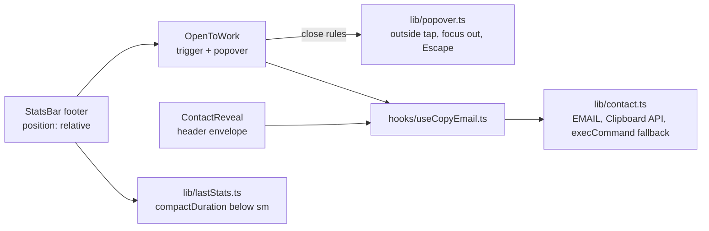

# Footer "Open to work" Callout Implementation Plan

> **For agentic workers:** REQUIRED SUB-SKILL: Use superpowers:subagent-driven-development (recommended) or superpowers:executing-plans to implement this plan task-by-task. Steps use checkbox (`- [ ]`) syntax for tracking.

**Goal:** Add a footer item, a green dot plus "Open to work", that opens a small popover with one **Copy email** button. Shorten the long latency reading on phones in the same PR so the footer never scrolls sideways at 280–393px.

**Architecture:** The email address and copy logic move out of `ContactReveal.tsx` into a pure, injectable `lib/contact.ts`. A shared `hooks/useCopyEmail.ts` holds the visible result for the header envelope and the new popover. The popover's close rules (outside tap, focus leaving, Escape) live as pure functions in `lib/popover.ts`. `components/OpenToWork.tsx` wires those rules to DOM events, and `StatsBar` renders it first in its right-hand group. The popover is positioned against the footer, which becomes `relative`, so it can span the screen at 280px. `lib/lastStats.ts` gains a reading of at most 5 characters that the footer shows below `sm`.

**Tech Stack:** React 19, TypeScript 6, Tailwind CSS v4, Vite 8. Unit tests use Node's built-in runner (`node --test`, `node:assert/strict`). The repo has **no** vitest, testing-library or jsdom; see "Testing approach" below.

**Spec:** `docs/superpowers/specs/2026-10-02-portfolio-design.md` §4 only (PR 1 of 3). Until the docs PR merges, the spec and this plan are on branch `docs/portfolio-spec`. Read them there with `git show docs/portfolio-spec:docs/superpowers/specs/2026-10-02-portfolio-design.md`. Visual and behaviour reference only (do not copy code from it): variant D on branch `mock/hire-banner` (`frontend/src/components/HireCallout.tsx` `HireFooterItem`/`HirePopover`, `frontend/src/lib/contact.ts`).

## Global Constraints

- **Hard rules (restate in every implementer and reviewer dispatch):** never read, open or copy any `terraform.tfstate`, `*.tfstate.backup`, `*.tfvars` or plan file; no `terraform apply`; no AWS/SSM/`kubectl` writes against the live system; no GitHub environment or secret changes; never `git stash`.
- **Wording is fixed, verbatim:** trigger label and accessible name `Open to work`; popover headline `Open to full-time work and freelancing`; body `Talking to teams about full-time roles and taking on freelance projects. Copy my email and say hi.`; button `Copy email`.
- **Not in this PR:** the popover's "See portfolio →" link (spec §5.7, PR 3). Nothing about the Portfolio topic, corpus or sheets.
- **Placement:** footer, right group, left of New chat (phones) or Stress test (desktop). In DOM and focus order: stats, Open to work, New chat "+", stress controls.
- **Widths:** label shown from 360px; dot only from 300px to 359px (accessible name still `Open to work`); item left out entirely below 300px.
- **Copy feedback** is identical to the header envelope: `Email copied` for 2s, or the address itself for 5s when both the Clipboard API and the `execCommand` fallback fail.
- **Closing:** Escape (focus back to the trigger), an outside tap, a second tap on the trigger. The popover stays on screen at every width down to 280px.
- **Focus mode:** the footer still slides away with the item (`Collapsible open={!focusMode}` in `App.tsx`, unchanged).
- **The address never appears in `frontend/index.html`;** it lives in the JS bundle only.
- **Wording constants live in `OpenToWork.tsx`,** not in a separate copy or mock module.
- **Tap targets ≥ 44×44px below md** (`project/MOBILE_DESIGN.md`). No `text-[10px]`. Footer metadata is 11px minimum, and popover text is `text-xs` like the other footer tooltips.
- **No horizontal scroll** at 280, 320, 360, 375, 393, 640, 1024 and 1280px with any latency value.
- **Testing approach (resolved, see the Spec ambiguities section):** no new test framework. Pure logic goes in `src/lib/*.ts` with `node:test` tests. Component behaviour (open/close, Escape focus return, outside tap, widths) is checked by the headless-Chrome script in Task 6 against the phone-preview dev server.
- Before any UI work, load the `impeccable` skill as `project/MOBILE_DESIGN.md` "Before starting UI work" says.

## Spec ambiguities resolved in this plan

1. **"A component test for open/close and Escape focus return" (§4 Tests).** The frontend has no jsdom or testing-library; `npm test` is `node --test 'src/**/*.test.ts'`. Adding a DOM test framework for one component is out of proportion. The decisions (what closes the popover, when Escape belongs to it) are pure functions in `lib/popover.ts` with unit tests. The DOM behaviour (trigger toggles, Escape returns focus to the trigger, an outside pointerdown closes it) is asserted in headless Chrome by `footer-check.mjs` (Task 6) and recorded in the status report.
2. **"Shorten that reading on phones (for example "12.3s")".** Below `sm` (640px; every phone width), the footer shows `compactDuration`, which is at most 5 characters: `312ms`, `1.8s`, `12.3s`, `100s`, `999s+`. It applies to both readings (first token and total), and the word "total" is dropped there, as in the spec's example. The accessible name and the tooltip keep the full text ("Total request time…", "Total time: 12345ms."). From 640px the reading is unchanged (`1840ms`, `total 12345ms`).
3. **"Removing the label's side padding".** Read as: the trigger has no horizontal padding. Its width is the dot, a 6px gap and the label, with `min-w-11` keeping a 44px target in dot-only mode.
4. **Popover body size.** The mock used 11px. The plan uses `text-xs` (12px), the size of every other footer popup text, because `MOBILE_DESIGN.md` keeps 11px for metadata, not sentences.
5. **Popover close when focus leaves.** The spec does not cover focus moving away (Tab past the popover, or the ask box taking focus on a phone, which starts focus mode). Focus moving to another element outside the item closes it. Focus moving to nothing (a click on the popover's plain text) does not.

## Review Focus

The five inputs most likely to bite a visitor that the spec implies but does not spell out. Each has a test in the owning task.

1. **Clipboard API rejects and the `execCommand` fallback throws** (locked-down browser, insecure context): the visitor must see the address, not a stuck button or an unhandled rejection. Test: Task 1, "a fallback that throws counts as a failure".
2. **Latency at rounding boundaries or broken values** (999.6ms, 99,950ms, NaN, negative, very large): the phone reading must stay at most 5 characters and never show `NaN`. Tests: Task 2, `compactDuration` boundary tests.
3. **Escape already used by another layer, or pressed during IME composition:** the popover must not close on an Escape that a showing footer tooltip took, or one that ends an IME composition. Test: Task 3, `takesEscape`.
4. **Focus leaving the item** (Tab past the popover, the phone ask box taking focus and starting focus mode): the popover must close and not sit open inside a collapsed, inert footer. A click on the popover's own text must not close it. Tests: Task 3, `closesOnFocusOut`.
5. **Widths between `sm` and `md` (640–767px):** the long desktop reading `total 12345ms`, `128 queries served`, Open to work, New chat "+", the labelled Stress test button and the capacity icon all share one row. They must fit without sideways scroll. Check: Task 6, `footer-check.mjs` includes 640×900.

---

## File Structure

| File | Status | Responsibility |
|---|---|---|
| `frontend/src/lib/contact.ts` | Create | `EMAIL`, `COPIED_TEXT`, `copyText` (injectable Clipboard API and fallback), `copyFeedback`, `copyEmail` (browser wiring, including the `execCommand` fallback). No imports, so Node can test it. |
| `frontend/src/lib/contact.test.ts` | Create | Copy success, fallback, failure, throwing fallback, feedback text and duration, address not in `index.html`. |
| `frontend/src/hooks/useCopyEmail.ts` | Create | React state for the visible result plus its timer; shared by both copy buttons. |
| `frontend/src/components/ContactReveal.tsx` | Modify | Uses `useCopyEmail`; its own address and copy code are removed. Behaviour unchanged. |
| `frontend/src/lib/lastStats.ts` | Modify | `compactDuration`; `lastStatsParts` gains `short`. |
| `frontend/src/lib/lastStats.test.ts` | Modify | Tests for `compactDuration` and `short`; the existing deepEqual test is updated. |
| `frontend/src/lib/popover.ts` | Create | `closesOnPointerDown`, `closesOnFocusOut`, `takesEscape`. No imports. |
| `frontend/src/lib/popover.test.ts` | Create | Unit tests for the three rules. |
| `frontend/src/lib/escapeKey.ts` | Modify | Comment only: the popover's place in the Escape order. |
| `frontend/src/components/OpenToWork.tsx` | Create | Footer trigger and popover, with wording constants. |
| `frontend/src/components/OpenToWork.test.ts` | Create | Reads the `.tsx` source and checks that the fixed wording is present and that "See portfolio" is absent. |
| `frontend/src/components/StatsBar.tsx` | Modify | Footer `relative`; renders `<OpenToWork />`; latency shows `short` below `sm`. |
| `project/MOBILE_DESIGN.md` | Modify | Layout bullet and Owner decisions line for the footer item and the phone latency reading. |
| `project/SNAPSHOT.md` | Modify | Desktop and mobile frontend descriptions mention the item. |
| `project/status/2026-10-02-1013-open-to-work-footer.md` | Create | Owner-facing status report. |
| `project/status/README.md` | Modify | Index row. |

Scratch only (never committed): `$SCRATCH/open-to-work/footer-check.mjs` and its screenshots, where `$SCRATCH` is the session scratchpad directory.

---

### Task 0: Worktree

**Files:** none in the repo.

- [ ] **Step 1: Create the worktree from `origin/main`**

```bash
cd /Users/baselabdel-rahman/Coding/basel.engineering
git fetch origin
git worktree add .worktrees/open-to-work -b feat/open-to-work origin/main
cd .worktrees/open-to-work/frontend && npm ci
```

- [ ] **Step 2: Baseline**

Run: `cd /Users/baselabdel-rahman/Coding/basel.engineering/.worktrees/open-to-work/frontend && npm test && npm run lint`
Expected: all tests pass, lint clean. (If anything fails on a clean `origin/main`, stop and report it; do not fix unrelated failures here.)

---

### Task 1: `lib/contact.ts`, `useCopyEmail`, ContactReveal refactor

**Files:**
- Create: `frontend/src/lib/contact.ts`
- Create: `frontend/src/lib/contact.test.ts`
- Create: `frontend/src/hooks/useCopyEmail.ts`
- Modify: `frontend/src/components/ContactReveal.tsx` (whole file)

**Interfaces:**
- Consumes: nothing.
- Produces:
  - `export const EMAIL: string` (`'baselmabdelrahman@gmail.com'`)
  - `export const COPIED_TEXT = 'Email copied'`
  - `export type CopyDeps = { writeText?: (text: string) => Promise<void>; legacyCopy: (text: string) => boolean }`
  - `export function copyText(text: string, deps: CopyDeps): Promise<boolean>`
  - `export function copyFeedback(ok: boolean): { text: string; ms: number }`
  - `export function copyEmail(): Promise<boolean>`
  - `export function useCopyEmail(): { result: string; copy: () => Promise<void> }` (`result` is `''` when idle)

- [ ] **Step 1: Write the failing tests** in `frontend/src/lib/contact.test.ts`

```ts
import assert from 'node:assert/strict'
import { readFileSync } from 'node:fs'
import { test } from 'node:test'
import { COPIED_TEXT, copyFeedback, copyText, EMAIL } from './contact.ts'

const fallbackMustNotRun = (): boolean => {
  throw new Error('the execCommand fallback should not run')
}

test('the Clipboard API copies the text and the fallback is not used', async () => {
  const written: string[] = []
  const ok = await copyText('a@b.c', { writeText: async (text) => { written.push(text) }, legacyCopy: fallbackMustNotRun })
  assert.equal(ok, true)
  assert.deepEqual(written, ['a@b.c'])
})

test('a rejected Clipboard API (permission denied) falls back to the execCommand copy', async () => {
  const fallback: string[] = []
  const ok = await copyText('a@b.c', {
    writeText: async () => { throw new Error('NotAllowedError') },
    legacyCopy: (text) => { fallback.push(text); return true },
  })
  assert.equal(ok, true)
  assert.deepEqual(fallback, ['a@b.c'])
})

test('a missing Clipboard API (insecure context, old browser) goes straight to the fallback', async () => {
  const ok = await copyText('a@b.c', { writeText: undefined, legacyCopy: () => true })
  assert.equal(ok, true)
})

test('when both the Clipboard API and the fallback fail, copying reports failure', async () => {
  const ok = await copyText('a@b.c', { writeText: async () => { throw new Error('denied') }, legacyCopy: () => false })
  assert.equal(ok, false)
})

test('a fallback that throws counts as a failure, never an unhandled error', async () => {
  const ok = await copyText('a@b.c', {
    writeText: async () => { throw new Error('denied') },
    legacyCopy: () => { throw new Error('execCommand blew up') },
  })
  assert.equal(ok, false)
})

test('success says Email copied for 2s; failure shows the address itself for 5s', () => {
  assert.equal(COPIED_TEXT, 'Email copied')
  assert.deepEqual(copyFeedback(true), { text: 'Email copied', ms: 2000 })
  assert.deepEqual(copyFeedback(false), { text: EMAIL, ms: 5000 })
})

test('the address stays out of the static HTML (bundle only)', () => {
  const html = readFileSync(new URL('../../index.html', import.meta.url), 'utf8')
  assert.equal(html.includes(EMAIL), false)
  assert.match(EMAIL, /^[^@\s]+@[^@\s]+\.[a-z]+$/)
})
```

- [ ] **Step 2: Run the tests to verify they fail**

Run: `cd /Users/baselabdel-rahman/Coding/basel.engineering/.worktrees/open-to-work/frontend && node --test src/lib/contact.test.ts`
Expected: FAIL with `ERR_MODULE_NOT_FOUND` for `./contact.ts`.

- [ ] **Step 3: Implement `frontend/src/lib/contact.ts`**

```ts
// The contact address and how it is copied. Shared by the header envelope
// (ContactReveal) and the footer "Open to work" popover.
//
// The address lives in the JS bundle only (never in the static HTML), so a
// naive scraper of index.html doesn't see it. contact.test.ts checks that.
export const EMAIL = 'baselmabdelrahman@gmail.com'

export const COPIED_TEXT = 'Email copied'

export type CopyDeps = {
  /** The async Clipboard API, or undefined where it is missing (insecure context, old browser). */
  writeText?: (text: string) => Promise<void>
  /** The execCommand('copy') fallback; true when it copied. */
  legacyCopy: (text: string) => boolean
}

/**
 * Copies `text`: the Clipboard API first, the execCommand fallback second.
 * Resolves true when either worked. Never rejects: a fallback that throws
 * counts as a failure, so the caller can show the address instead.
 */
export async function copyText(text: string, deps: CopyDeps): Promise<boolean> {
  if (deps.writeText) {
    try {
      await deps.writeText(text)
      return true
    } catch {
      // Denied or unavailable: try the fallback.
    }
  }
  try {
    return deps.legacyCopy(text)
  } catch {
    return false
  }
}

/** What the copy button shows afterwards, and for how long. */
export function copyFeedback(ok: boolean): { text: string; ms: number } {
  return ok ? { text: COPIED_TEXT, ms: 2000 } : { text: EMAIL, ms: 5000 }
}

/** Legacy copy path for when the async Clipboard API is missing or denied. */
function legacyCopy(text: string): boolean {
  const previouslyFocused = document.activeElement as HTMLElement | null
  const textarea = document.createElement('textarea')
  textarea.value = text
  textarea.setAttribute('readonly', '')
  textarea.style.position = 'fixed'
  textarea.style.top = '0'
  textarea.style.left = '0'
  textarea.style.opacity = '0'
  document.body.appendChild(textarea)
  textarea.select()
  textarea.setSelectionRange(0, text.length)
  try {
    return document.execCommand('copy')
  } catch {
    return false
  } finally {
    document.body.removeChild(textarea)
    // Selecting the textarea stole focus; hand it back (keyboard users).
    previouslyFocused?.focus?.()
  }
}

/** Copies the address in the browser. Resolves false when nothing worked. */
export function copyEmail(): Promise<boolean> {
  const clipboard = typeof navigator === 'undefined' ? undefined : navigator.clipboard
  return copyText(EMAIL, {
    writeText: clipboard ? (text) => clipboard.writeText(text) : undefined,
    legacyCopy,
  })
}
```

- [ ] **Step 4: Run the tests to verify they pass**

Run: `node --test src/lib/contact.test.ts`
Expected: PASS, 7 tests.

- [ ] **Step 5: Create `frontend/src/hooks/useCopyEmail.ts`**

```ts
import { useEffect, useRef, useState } from 'react'
import { copyEmail, copyFeedback } from '../lib/contact'

/**
 * Copies the email address and holds what the button shows afterwards:
 * "Email copied" for 2s, or the address itself for 5s when copying failed
 * (lib/contact.ts). `result` is '' while idle. Used by the header envelope
 * (ContactReveal) and the footer "Open to work" popover (OpenToWork).
 */
export function useCopyEmail(): { result: string; copy: () => Promise<void> } {
  const [result, setResult] = useState('')
  const timerRef = useRef<number | null>(null)

  useEffect(() => () => {
    if (timerRef.current !== null) window.clearTimeout(timerRef.current)
  }, [])

  async function copy() {
    const feedback = copyFeedback(await copyEmail())
    setResult(feedback.text)
    if (timerRef.current !== null) window.clearTimeout(timerRef.current)
    timerRef.current = window.setTimeout(() => setResult(''), feedback.ms)
  }

  return { result, copy }
}
```

- [ ] **Step 6: Replace `frontend/src/components/ContactReveal.tsx` with the hook-based version** (same markup, classes and behaviour; only the state source changes)

```tsx
import { useCopyEmail } from '../hooks/useCopyEmail'

/** Sized like the GitHub mark beside it (24px, 28px from sm); the tight viewBox makes the envelope fill it optically. */
function EnvelopeIcon() {
  return (
    <svg viewBox="2 2 20 20" className="size-6 sm:size-7 md:size-6" fill="none" stroke="currentColor" strokeWidth="1.5" strokeLinecap="round" strokeLinejoin="round" aria-hidden="true">
      <rect x="3" y="5" width="18" height="14" rx="2" />
      <path d="m3.5 6.5 8.5 6.5 8.5-6.5" />
    </svg>
  )
}

/**
 * Contact: an envelope button (aria-label "Copy email") directly left of the
 * GitHub icon, at every width. Click/tap copies the address and a toast under
 * the button says "Email copied" (announced via aria-live). If both the
 * Clipboard API and the execCommand fallback fail, the toast shows the address
 * itself for 5s so the visitor can still read it (lib/contact.ts). Hover (on
 * devices that can hover) or keyboard focus shows a "Copy email" tooltip in
 * the same place. The bubble is out of flow, so the header row never changes
 * width.
 */
function ContactReveal() {
  const { result, copy } = useCopyEmail()

  return (
    <button
      type="button"
      onClick={() => { void copy() }}
      aria-label="Copy email"
      className={`group relative flex size-11 shrink-0 items-center justify-center transition-colors hover:text-primary md:size-auto ${result ? 'text-primary' : 'text-muted'}`}
    >
      <EnvelopeIcon />
      {/* Tooltip while idle (hover/focus), the result after a click. */}
      <span
        aria-hidden="true"
        className={`pointer-events-none absolute right-0 top-full z-20 mt-1 whitespace-nowrap rounded-[3px] border border-hairline bg-panel px-2 py-1 text-xs font-normal text-primary shadow-lg ${
          result ? 'block' : 'hidden [@media(hover:hover)]:group-hover:block group-focus-visible:block'
        }`}
      >
        {result || 'Copy email'}
      </span>
      <span aria-live="polite" className="sr-only">{result}</span>
    </button>
  )
}

export default ContactReveal
```

- [ ] **Step 7: Check that the address now exists in exactly one source file**

Run: `cd /Users/baselabdel-rahman/Coding/basel.engineering/.worktrees/open-to-work/frontend && grep -rln "baselmabdelrahman@gmail.com" src index.html`
Expected: only `src/lib/contact.ts`.

- [ ] **Step 8: Full frontend checks**

Run: `npm test && npm run lint && npx tsc -b`
Expected: all pass.

- [ ] **Step 9: Commit**

```bash
git add frontend/src/lib/contact.ts frontend/src/lib/contact.test.ts frontend/src/hooks/useCopyEmail.ts frontend/src/components/ContactReveal.tsx
git commit -m "refactor(frontend): move email copy logic to lib/contact and useCopyEmail

Co-Authored-By: Claude Opus 5.5 <noreply@anthropic.com>"
```

---

### Task 2: Phone latency reading of at most 5 characters (footer width fix)

**Files:**
- Modify: `frontend/src/lib/lastStats.ts`
- Modify: `frontend/src/lib/lastStats.test.ts`
- Modify: `frontend/src/components/StatsBar.tsx` (the latency button's visible `<span>{latency.timing}</span>`)

**Interfaces:**
- Consumes: nothing new.
- Produces:
  - `export function compactDuration(ms: number): string` (at most 5 characters; `'—'` for non-finite or negative values)
  - `lastStatsParts(stats: LastStats | null): { timing: string; short: string; description: string }` (`short` is new)

- [ ] **Step 1: Write the failing tests.** In `frontend/src/lib/lastStats.test.ts`, change the import line to

```ts
import { compactDuration, lastStatsDetails, lastStatsParts } from './lastStats.ts'
```

replace the existing test `'parts carry the timing and its description'` with

```ts
test('parts carry the timing, the phone reading and the description', () => {
  assert.deepEqual(lastStatsParts({ firstTokenMs: 1234, totalMs: 1300, cacheStatus: 'hit' }), { timing: '1234ms', short: '1.2s', description: 'Time to first token' })
  assert.deepEqual(lastStatsParts({ firstTokenMs: null, totalMs: 900, cacheStatus: 'hit' }), { timing: 'total 900ms', short: '900ms', description: 'Total request time (no answer text was generated)' })
})
```

and append

```ts
test('phone readings: ms under a second, tenths of a second up to 99.9s, whole seconds after', () => {
  assert.equal(compactDuration(0), '0ms')
  assert.equal(compactDuration(312), '312ms')
  assert.equal(compactDuration(999), '999ms')
  assert.equal(compactDuration(999.6), '1.0s')
  assert.equal(compactDuration(1840), '1.8s')
  assert.equal(compactDuration(9950), '10.0s')
  assert.equal(compactDuration(12345), '12.3s')
  assert.equal(compactDuration(99949), '99.9s')
  assert.equal(compactDuration(99950), '100s')
  assert.equal(compactDuration(999499), '999s')
  assert.equal(compactDuration(999500), '999s+')
})

test('a phone reading is at most five characters for any value, so the footer fits at 280px', () => {
  for (const ms of [0, 7, 999, 999.6, 1000, 1840, 9949, 9950, 12345, 99949, 99950, 999499, 999500, 1e9, Number.MAX_SAFE_INTEGER]) {
    assert.ok(compactDuration(ms).length <= 5, `${ms} -> ${compactDuration(ms)}`)
  }
})

test('a missing or broken number reads as a dash, never NaN', () => {
  assert.equal(compactDuration(Number.NaN), '—')
  assert.equal(compactDuration(-5), '—')
  assert.equal(compactDuration(Number.POSITIVE_INFINITY), '—')
})

test('the phone reading drops the word total; the description and long reading keep it', () => {
  const parts = lastStatsParts({ firstTokenMs: null, totalMs: 12345, cacheStatus: 'miss' })
  assert.equal(parts.short, '12.3s')
  assert.equal(parts.timing, 'total 12345ms')
  assert.match(parts.description, /total/i)
  assert.match(lastStatsDetails({ firstTokenMs: null, totalMs: 12345, cacheStatus: 'miss' })[0], /Total time: 12345ms/)
})

test('before any answer the phone reading is a dash too', () => {
  assert.equal(lastStatsParts(null).short, '—')
})
```

- [ ] **Step 2: Run the tests to verify they fail**

Run: `node --test src/lib/lastStats.test.ts`
Expected: FAIL, with `compactDuration` not exported (SyntaxError: the requested module does not provide an export named 'compactDuration').

- [ ] **Step 3: Implement in `frontend/src/lib/lastStats.ts`.** Add above `lastStatsParts`

```ts
/**
 * The phone reading (below `sm`): at most five characters for any value, so
 * the footer fits beside the Open to work item, New chat and the capacity
 * icon at 280–393px (a "total 12345ms" reading overflowed at 280px).
 * Under a second: whole ms ("312ms"); then tenths of a second up to 99.9s
 * ("1.8s", "12.3s"); then whole seconds ("100s"), capped at "999s+".
 */
export function compactDuration(ms: number): string {
  if (!Number.isFinite(ms) || ms < 0) return '—'
  const whole = Math.round(ms)
  if (whole < 1000) return `${whole}ms`
  const tenths = Math.round(whole / 100)
  if (tenths < 1000) return `${(tenths / 10).toFixed(1)}s`
  const seconds = Math.round(whole / 1000)
  return seconds < 1000 ? `${seconds}s` : '999s+'
}
```

and replace `lastStatsParts` with

```ts
/**
 * The visible timing, its phone form and the description used for the
 * tooltip and screen readers. `short` drops the word "total" for room; the
 * accessible name and tooltip still say what the number is. Cache hits are
 * not marked here; only the tooltip mentions them.
 */
export function lastStatsParts(stats: LastStats | null): { timing: string; short: string; description: string } {
  const firstToken = 'Time to first token'
  if (!stats) return { timing: '—', short: '—', description: firstToken }
  if (stats.firstTokenMs === null) {
    return { timing: `total ${stats.totalMs}ms`, short: compactDuration(stats.totalMs), description: 'Total request time (no answer text was generated)' }
  }
  return { timing: `${stats.firstTokenMs}ms`, short: compactDuration(stats.firstTokenMs), description: firstToken }
}
```

Also extend the file's top comment: after "The visible text is just the number (`312ms`); …" add the sentence "Below `sm` the footer shows `short`, the same time in at most five characters (`1.8s`)."

- [ ] **Step 4: Run the tests to verify they pass**

Run: `node --test src/lib/lastStats.test.ts`
Expected: PASS (all previous tests plus the 5 new ones).

- [ ] **Step 5: Use `short` below `sm` in `frontend/src/components/StatsBar.tsx`.** Replace

```tsx
          <span>{latency.timing}</span>
```

with

```tsx
          {/* Phones (below sm) get the at-most-5-character reading so the
              row fits at 280px; the aria-label keeps the full description. */}
          <span className="sm:hidden">{latency.short}</span>
          <span className="hidden sm:inline">{latency.timing}</span>
```

In the same button's `className`, change `group relative -mx-2 flex min-h-11` to `group relative -mx-2 flex min-h-11 min-w-11` and `md:min-h-0 md:px-0 md:mx-0` to `md:min-h-0 md:min-w-0 md:px-0 md:mx-0`. The reason: `1.8s` plus the button's 16px of padding is about 42px wide, and the `—` shown before any answer is about 23px (already under 44px today). `min-w-11` keeps a 44px tap target. Task 6's script checks it.

- [ ] **Step 6: Full frontend checks**

Run: `npm test && npm run lint && npx tsc -b`
Expected: all pass.

- [ ] **Step 7: Commit**

```bash
git add frontend/src/lib/lastStats.ts frontend/src/lib/lastStats.test.ts frontend/src/components/StatsBar.tsx
git commit -m "fix(frontend): short latency reading on phones so the footer never scrolls sideways

Co-Authored-By: Claude Opus 5.5 <noreply@anthropic.com>"
```

---

### Task 3: Popover close rules (`lib/popover.ts`)

**Files:**
- Create: `frontend/src/lib/popover.ts`
- Create: `frontend/src/lib/popover.test.ts`
- Modify: `frontend/src/lib/escapeKey.ts` (top comment only)

**Interfaces:**
- Consumes: nothing.
- Produces:
  - `export type ContainerLike = { contains: (node: never) => boolean } | null`
  - `export function closesOnPointerDown(target: unknown, item: ContainerLike): boolean`
  - `export function closesOnFocusOut(next: unknown, item: ContainerLike): boolean`
  - `export function takesEscape(event: { key: string; defaultPrevented: boolean; isComposing?: boolean; keyCode?: number }): boolean`
  - `item` is the element that wraps both the trigger and the popover.

- [ ] **Step 1: Write the failing tests** in `frontend/src/lib/popover.test.ts`

```ts
import assert from 'node:assert/strict'
import { test } from 'node:test'
import { closesOnFocusOut, closesOnPointerDown, takesEscape } from './popover.ts'

const trigger = { name: 'trigger' }
const copyButton = { name: 'copy button' }
const askBox = { name: 'ask box' }
const page = { name: 'page' }
const item = { contains: (node: never) => node === trigger || node === copyButton }

test('a tap on the trigger or inside the popover does not close it from outside', () => {
  // The trigger's own click toggles; the Copy email button keeps it open.
  assert.equal(closesOnPointerDown(trigger, item), false)
  assert.equal(closesOnPointerDown(copyButton, item), false)
})

test('a tap anywhere else closes it, including when the item is gone', () => {
  assert.equal(closesOnPointerDown(page, item), true)
  assert.equal(closesOnPointerDown(askBox, item), true)
  assert.equal(closesOnPointerDown(page, null), true)
})

test('focus moving to a control outside (Tab past it, the phone ask box in focus mode) closes it', () => {
  assert.equal(closesOnFocusOut(askBox, item), true)
  assert.equal(closesOnFocusOut(page, null), true)
})

test('focus moving inside the item, or to nowhere (a click on the popover text), keeps it open', () => {
  assert.equal(closesOnFocusOut(copyButton, item), false)
  assert.equal(closesOnFocusOut(trigger, item), false)
  assert.equal(closesOnFocusOut(null, item), false)
})

test('Escape belongs to the open popover unless another handler used it or an IME is composing', () => {
  const escape = { key: 'Escape', defaultPrevented: false }
  assert.equal(takesEscape(escape), true)
  assert.equal(takesEscape({ ...escape, defaultPrevented: true }), false)
  assert.equal(takesEscape({ ...escape, isComposing: true }), false)
  assert.equal(takesEscape({ ...escape, keyCode: 229 }), false)
  assert.equal(takesEscape({ key: 'Enter', defaultPrevented: false }), false)
})
```

- [ ] **Step 2: Run the tests to verify they fail**

Run: `node --test src/lib/popover.test.ts`
Expected: FAIL with `ERR_MODULE_NOT_FOUND` for `./popover.ts`.

- [ ] **Step 3: Implement `frontend/src/lib/popover.ts`**

```ts
// When a small non-modal footer popover (the "Open to work" item) closes.
// `item` is the element wrapping both the trigger and the popover. The
// trigger's own click toggles it; these rules cover everything else.

export type ContainerLike = { contains: (node: never) => boolean } | null

function inside(node: unknown, item: ContainerLike): boolean {
  return item !== null && node !== null && node !== undefined && (item.contains as (node: unknown) => boolean)(node)
}

/** A pointerdown outside the trigger and the popover closes it. */
export function closesOnPointerDown(target: unknown, item: ContainerLike): boolean {
  return !inside(target, item)
}

/**
 * Focus moving to another element outside the item closes it (Tab past the
 * popover; on phones, the ask box taking focus starts focus mode, which
 * slides the footer away). Focus going nowhere (`relatedTarget` null: a
 * click on the popover's plain text, or the window losing focus) keeps it
 * open; an outside tap is handled by `closesOnPointerDown`.
 */
export function closesOnFocusOut(next: unknown, item: ContainerLike): boolean {
  return next !== null && next !== undefined && !inside(next, item)
}

/**
 * Escape closes the open popover unless an earlier handler used it (a
 * showing footer tooltip, see lib/escapeKey.ts) or it ends an IME
 * composition (Safari reports that as keyCode 229 rather than isComposing).
 */
export function takesEscape(event: { key: string; defaultPrevented: boolean; isComposing?: boolean; keyCode?: number }): boolean {
  return event.key === 'Escape' && !event.defaultPrevented && !event.isComposing && event.keyCode !== 229
}
```

- [ ] **Step 4: Run the tests to verify they pass**

Run: `node --test src/lib/popover.test.ts`
Expected: PASS, 5 tests.

- [ ] **Step 5: Document the Escape order in `frontend/src/lib/escapeKey.ts`.** Replace

```ts
//   1. a showing footer tooltip closes (window, capture phase; this file),
```

with

```ts
//   1. a showing footer tooltip closes (window, capture phase; this file);
//      otherwise an open footer "Open to work" popover closes and focus
//      returns to its trigger (window, capture phase, listening only while
//      open; `takesEscape` in lib/popover.ts, components/OpenToWork.tsx),
```

- [ ] **Step 6: Full frontend checks**

Run: `npm test && npm run lint && npx tsc -b`
Expected: all pass.

- [ ] **Step 7: Commit**

```bash
git add frontend/src/lib/popover.ts frontend/src/lib/popover.test.ts frontend/src/lib/escapeKey.ts
git commit -m "feat(frontend): close rules for the footer popover (outside tap, focus leaving, Escape)

Co-Authored-By: Claude Opus 5.5 <noreply@anthropic.com>"
```

---

### Task 4: `OpenToWork` component in the footer

**Files:**
- Create: `frontend/src/components/OpenToWork.tsx`
- Create: `frontend/src/components/OpenToWork.test.ts`
- Modify: `frontend/src/components/StatsBar.tsx` (import, footer `relative`, comment, right group)

**Interfaces:**
- Consumes: `useCopyEmail()` from `hooks/useCopyEmail.ts` (Task 1); `COPIED_TEXT` from `lib/contact.ts` (Task 1); `closesOnPointerDown`, `closesOnFocusOut`, `takesEscape` from `lib/popover.ts` (Task 3).
- Produces: `export default function OpenToWork(): JSX.Element`, with no props. It renders a `display: contents` wrapper holding the trigger button (`aria-label="Open to work"`, `aria-expanded`, `aria-controls`) and the popover (`role="dialog"`, `hidden` while closed). The popover is positioned against the nearest positioned ancestor, which must be the `<footer>`.

- [ ] **Step 1: Write the failing wording test** in `frontend/src/components/OpenToWork.test.ts`

```ts
import assert from 'node:assert/strict'
import { readFileSync } from 'node:fs'
import { test } from 'node:test'

// The component is TSX (not runnable under node --test), so this pins the
// owner-approved wording in its source (spec §4).
const source = readFileSync(new URL('./OpenToWork.tsx', import.meta.url), 'utf8')

test('the footer item uses the approved wording, verbatim', () => {
  for (const text of [
    "'Open to work'",
    "'Open to full-time work and freelancing'",
    "'Talking to teams about full-time roles and taking on freelance projects. Copy my email and say hi.'",
    "'Copy email'",
  ]) {
    assert.ok(source.includes(text), `missing ${text}`)
  }
})

test('the portfolio link waits for the portfolio PR', () => {
  assert.doesNotMatch(source, /See portfolio/i)
})
```

- [ ] **Step 2: Run the test to verify it fails**

Run: `node --test src/components/OpenToWork.test.ts`
Expected: FAIL with `ENOENT: no such file or directory` for `OpenToWork.tsx`.

- [ ] **Step 3: Implement `frontend/src/components/OpenToWork.tsx`**

```tsx
import { useEffect, useId, useRef, useState } from 'react'
import { useCopyEmail } from '../hooks/useCopyEmail'
import { COPIED_TEXT } from '../lib/contact'
import { closesOnFocusOut, closesOnPointerDown, takesEscape } from '../lib/popover'

// Owner-approved wording (spec 2026-10-02 §4). OpenToWork.test.ts pins it.
const LABEL = 'Open to work'
const HEADLINE = 'Open to full-time work and freelancing'
const BODY = 'Talking to teams about full-time roles and taking on freelance projects. Copy my email and say hi.'
const COPY_LABEL = 'Copy email'

/** Green "available" dot with a soft ping (none with reduced motion). */
function StatusDot() {
  return (
    <span aria-hidden="true" className="relative flex size-2 shrink-0">
      <span className="absolute inline-flex size-full animate-ping rounded-full bg-hit opacity-50 motion-reduce:hidden" />
      <span className="relative inline-flex size-2 rounded-full bg-hit" />
    </span>
  )
}

/** Copies the email; its label turns into the result, like the header envelope's toast. */
function CopyEmailButton() {
  const { result, copy } = useCopyEmail()
  return (
    <button
      type="button"
      onClick={() => { void copy() }}
      className="inline-flex min-h-11 max-w-full items-center gap-2 rounded-[3px] border border-cyan/60 px-3 text-left text-xs text-cyan outline-none transition-colors hover:border-cyan focus-visible:ring-1 focus-visible:ring-cyan md:min-h-0 md:py-1.5"
    >
      <span aria-hidden="true">{result === COPIED_TEXT ? '✓' : '@'}</span>
      <span className="min-w-0 break-all">{result || COPY_LABEL}</span>
      <span aria-live="polite" className="sr-only">{result}</span>
    </button>
  )
}

/**
 * Footer "Open to work" item: a green dot plus label that opens a small
 * non-modal popover above the footer with one Copy email button.
 *
 * - Widths: label from 360px, dot only below (accessible name unchanged),
 *   left out below 300px, where the header envelope still copies the email.
 *   The trigger has no side padding: the label is wider than 44px, and
 *   `min-w-11` keeps a 44px target in dot-only mode.
 * - The popover is positioned against the <footer> (StatsBar makes it
 *   `relative`), right-aligned with the footer's own padding, so it spans
 *   the screen at 280px instead of hanging off the trigger.
 * - Closes on a second tap on the trigger, a pointerdown outside, focus
 *   moving to another control outside, or Escape (focus back to the
 *   trigger). Rules in lib/popover.ts; Escape order in lib/escapeKey.ts.
 * - It stays mounted (`hidden` while closed) so `aria-controls` always
 *   points at an element.
 */
function OpenToWork() {
  const [open, setOpen] = useState(false)
  const popoverId = useId()
  const headlineId = useId()
  const itemRef = useRef<HTMLDivElement>(null)
  const triggerRef = useRef<HTMLButtonElement>(null)

  useEffect(() => {
    if (!open) return
    function onPointerDown(event: PointerEvent) {
      if (closesOnPointerDown(event.target, itemRef.current)) setOpen(false)
    }
    // Window capture phase, after the footer tooltips' listeners (which
    // register at mount), before the diagram's document listeners.
    function onKeyDown(event: KeyboardEvent) {
      if (!takesEscape(event)) return
      event.preventDefault()
      setOpen(false)
      triggerRef.current?.focus()
    }
    document.addEventListener('pointerdown', onPointerDown)
    window.addEventListener('keydown', onKeyDown, true)
    return () => {
      document.removeEventListener('pointerdown', onPointerDown)
      window.removeEventListener('keydown', onKeyDown, true)
    }
  }, [open])

  return (
    <div
      ref={itemRef}
      className="contents max-[299px]:hidden"
      onBlur={(event) => {
        if (closesOnFocusOut(event.relatedTarget, itemRef.current)) setOpen(false)
      }}
    >
      <button
        ref={triggerRef}
        type="button"
        aria-label={LABEL}
        aria-expanded={open}
        aria-controls={popoverId}
        onClick={() => setOpen((value) => !value)}
        className="flex min-h-11 min-w-11 shrink-0 cursor-pointer touch-manipulation items-center justify-center gap-1.5 whitespace-nowrap text-muted outline-none transition-colors hover:text-primary focus-visible:ring-1 focus-visible:ring-cyan aria-expanded:text-primary md:min-h-0"
      >
        <StatusDot />
        <span className="max-[359px]:hidden">{LABEL}</span>
      </button>
      <div
        id={popoverId}
        role="dialog"
        aria-labelledby={headlineId}
        hidden={!open}
        className="absolute bottom-full right-[max(1rem,env(safe-area-inset-right))] z-30 mb-1 w-72 max-w-[calc(100vw-2rem)] whitespace-normal rounded-[3px] border border-hairline bg-panel p-3 text-left font-normal shadow-lg sm:right-4 md:right-8"
      >
        <p id={headlineId} className="flex items-center gap-2 text-xs font-medium text-primary">
          <StatusDot />
          {HEADLINE}
        </p>
        <p className="mt-1.5 text-xs leading-relaxed text-muted">{BODY}</p>
        <div className="mt-2 flex">
          <CopyEmailButton />
        </div>
      </div>
    </div>
  )
}

export default OpenToWork
```

- [ ] **Step 4: Run the wording test to verify it passes**

Run: `node --test src/components/OpenToWork.test.ts`
Expected: PASS, 2 tests.

- [ ] **Step 5: Render it from `frontend/src/components/StatsBar.tsx`.** Four edits:

(a) After `import { RABBIT_FACE_PATHS, TIGER_FACE_PATHS } from './capacityIcons'` add

```tsx
import OpenToWork from './OpenToWork'
```

(b) Replace the comment directly above `<footer`

```tsx
    // Below md, gaps/padding/font are tightened (rather than left at the
    // desktop md: values) so this row fits at ~375px. It must not scroll
    // (overflow-x-auto would clip the absolutely-positioned tooltips, which
    // open upward out of the footer). "queries served" also drops to "queries" below `sm`,
    // since that's the single biggest chunk of text width at this size.
```

with

```tsx
    // Below md, gaps/padding/font are tightened (rather than left at the
    // desktop md: values) so this row fits from 280px with the Open to work
    // item. It must not scroll (overflow-x-auto would clip the
    // absolutely-positioned tooltips, which open upward out of the footer).
    // Below `sm` "queries served" drops to "queries" and the latency shows
    // its short form (at most 5 characters). `relative` anchors the Open to
    // work popover to the footer so it can span the screen at 280px.
```

(c) Replace

```tsx
    <footer className="flex min-h-[58px]
```

with

```tsx
    <footer className="relative flex min-h-[58px]
```

(the rest of that className string is unchanged).

(d) Replace

```tsx
      <div className="flex shrink-0 items-center gap-1 sm:gap-2">
        {/* Below md: the "+" New chat icon sits at the right, in the same
```

with

```tsx
      <div className="flex shrink-0 items-center gap-1 sm:gap-2">
        {/* First in the right group: left of New chat (phones) or Stress
            test (desktop), and before them in focus order. */}
        <OpenToWork />
        {/* Below md: the "+" New chat icon sits at the right, in the same
```

- [ ] **Step 6: Full frontend checks**

Run: `npm test && npm run lint && npx tsc -b && npm run build`
Expected: all pass. `grep -c "baselmabdelrahman" dist/index.html` prints `0`.

- [ ] **Step 7: Quick look in the phone preview**

Run (background): `cd /Users/baselabdel-rahman/Coding/basel.engineering/.worktrees/open-to-work/frontend && npx vite --config vite.phone.config.ts --port 5240`
Open `http://localhost:5240/phone-preview.html` and check: the dot and label at 393/375/360, dot only at 320, nothing at 280; the popover opens above the footer and stays inside every frame; Copy email shows "Email copied". Tapping the trigger again closes it, as does a tap on the chat area. Stop the server afterwards. Full measurements are in Task 6.

- [ ] **Step 8: Commit**

```bash
git add frontend/src/components/OpenToWork.tsx frontend/src/components/OpenToWork.test.ts frontend/src/components/StatsBar.tsx
git commit -m "feat(frontend): footer Open to work item with a Copy email popover

Co-Authored-By: Claude Opus 5.5 <noreply@anthropic.com>"
```

---

### Task 5: Docs: MOBILE_DESIGN, SNAPSHOT, status report

**Files:**
- Modify: `project/MOBILE_DESIGN.md`
- Modify: `project/SNAPSHOT.md`
- Create: `project/status/2026-10-02-1013-open-to-work-footer.md`
- Modify: `project/status/README.md`

**Interfaces:**
- Consumes: the behaviour from Tasks 1–4. The measurements come from Task 6; write the report now, then fill its Measurements section from Task 6's output.
- Produces: docs only.

- [ ] **Step 1: `project/MOBILE_DESIGN.md`, Layout section.** Replace the bullet that starts `- Below md, New chat lives in the footer as an icon-only 44px "+"` with

```markdown
- Below md, New chat lives in the footer as an icon-only 44px "+" on the right of the footer, immediately left of the bunny/tiger capacity icon (stats stay on the left; DOM order is stats, Open to work, "+", capacity icon; its tooltip is right-anchored so it never clips) (same look and long-press/tooltip behaviour as the capacity icon, via `hooks/useLongPressTooltip.ts`); there is no label-vs-icon width switching. The latency stat is a focusable control with the same tooltip. The stats stay on one line. Below `sm` the latency shows a short form of at most 5 characters (`312ms`, `1.8s`, `12.3s`, `100s`, `999s+`; `compactDuration` in `lib/lastStats.ts`) without the word "total"; its accessible name and tooltip keep the full text, and from 640px the reading is unchanged (`1840ms`, `total 12345ms`). Before this, a `total 12345ms` reading overflowed the footer at 280px.
- **Footer "Open to work" (owner, 2026-10-02):** a green dot plus "Open to work" first in the footer's right group, left of New chat (phones) or Stress test (desktop) (`components/OpenToWork.tsx`). It is a button, 44px tall below md, with no side padding. The label shows from 360px; below that only the dot shows (`min-w-11`, accessible name still "Open to work"); below 300px (Fold cover screen) the item is left out, and the header envelope still copies the email there. A tap opens a non-modal popover (`role="dialog"`) above the footer, positioned against the `relative` footer and right-aligned with its padding (`w-72`, `max-w-[calc(100vw-2rem)]`), so it stays on screen down to 280px. It contains "Open to full-time work and freelancing", "Talking to teams about full-time roles and taking on freelance projects. Copy my email and say hi." (both `text-xs`) and one **Copy email** button with the envelope's feedback ("Email copied", or the address for 5s; `lib/contact.ts`, `hooks/useCopyEmail.ts`). It closes on a second tap on the trigger, a tap outside, focus moving to another control outside (so it never stays open inside the footer when focus mode slides it away), or Escape (focus back to the trigger; order in `lib/escapeKey.ts`). The dot's ping is off with reduced motion. Chosen from five live mocks (banner, header pill, empty-state card, footer item, envelope dot; branch `mock/hire-banner`); spec `docs/superpowers/specs/2026-10-02-portfolio-design.md` §4. The "See portfolio →" link joins the popover with the portfolio PR. Any new footer content must be re-checked at 300–360px, where this item leaves little room.
```

- [ ] **Step 2: `project/MOBILE_DESIGN.md`, "Owner decisions (index)".** Append

```markdown
- **Footer "Open to work" (2026-10-02):** green dot plus "Open to work" in the footer, left of New chat (phones) or Stress test (desktop); dot only below 360px, left out below 300px; it opens a popover "Open to full-time work and freelancing" with one Copy email button. Chosen from five mocks. On phones the latency reads in at most 5 characters (`1.8s`, `12.3s`) so the footer never scrolls sideways at 280–393px. Detail in the Layout section above.
```

- [ ] **Step 3: `project/SNAPSHOT.md`.** In the Desktop bullet, replace

```markdown
footer stats (latency as bare `ms` with a tooltip, queries served with correct singular "1 query served", tiger/bunny capacity icon, Stress test control).
```

with

```markdown
footer stats (latency as bare `ms` with a tooltip, queries served with correct singular "1 query served"), an "Open to work" item whose popover copies the email (`components/OpenToWork.tsx`; address and copy logic in `lib/contact.ts`, shared with the header envelope through `hooks/useCopyEmail.ts`), tiger/bunny capacity icon, Stress test control.
```

In the Mobile bullet, replace

```markdown
footer "+" New chat on the right beside the capacity icon
```

with

```markdown
footer "Open to work" dot (label from 360px, left out below 300px) and "+" New chat on the right beside the capacity icon, latency in at most 5 characters (`1.8s`)
```

- [ ] **Step 4: Create `project/status/2026-10-02-1013-open-to-work-footer.md`**

````markdown
# Footer "Open to work" callout

**Status:** PR open, [#<n>](https://github.com/hacka-tron/basel.engineering/pull/<n>). Not merged.

## TL;DR

The footer now says Basel is open to work. A green dot with "Open to work" sits left of New chat on phones and left of Stress test on desktop. A tap opens a small popover, "Open to full-time work and freelancing", with one Copy email button. On phones the latency readout is shorter (`12.3s` instead of `total 12345ms`), so the footer never scrolls sideways, even on a Fold cover screen. This is PR 1 of 3 in the portfolio spec; the "See portfolio →" link comes with PR 3.

## What changed for a visitor

- Footer, right group: a green dot plus "Open to work" (dot only from 300 to 359px; left out below 300px, where the header envelope still copies the email).
- Tap or click: a popover above the footer with the headline, "Talking to teams about full-time roles and taking on freelance projects. Copy my email and say hi." and **Copy email**. Feedback matches the header envelope: "Email copied", or the address itself if copying is blocked.
- It closes on Escape (focus back to the button), a tap outside, a second tap on the button, or focus moving elsewhere.
- Phones: the latency shows at most 5 characters (`312ms`, `1.8s`, `12.3s`). The tooltip and screen readers still say "Total request time" when no answer text was generated. Desktop readings are unchanged.

## How it works



The address and copy logic moved out of the header envelope into `lib/contact.ts`, so both copy buttons share one path and one set of tests. The popover is positioned against the footer, not its button, so it can use the full screen width at 280px.

## Key design decisions and trade-offs

- **Footer item, not a banner or header pill.** The owner compared five live mocks. The footer item costs no chat height, and it slides away with the footer while typing.
- **Phones drop the word "total".** The spec allowed shortening; 5 characters is what fits at 280px beside the new item. The meaning stays in the tooltip and accessible name.
- **No component test framework.** The frontend tests run on Node's built-in runner with no DOM. The popover's rules are pure functions with unit tests; the DOM behaviour is checked in headless Chrome (below).
- **Focus leaving closes the popover.** Otherwise it could stay open inside the footer while focus mode hides it.

## What review caught

(Filled in after each review round: reviewer, round, verdict, findings and fixes.)

## Measurements

Headless Chrome against the phone preview server, footer numbers set to realistic and worst-case values: typical `1.8s` / `1840ms` with 128 queries, worst `999s+` / `total 12345ms` with 128 queries.

(Paste the table printed by `footer-check.mjs`: viewport, reading, page overflow, footer overflow, rightmost control edge, smallest phone tap target, trigger shown, popover rect, Escape focus return, outside tap, fallback address fits.)

## Operational notes and risks

- Frontend only; no API, infra or data change. Ships with the next release.
- The footer has little room left at 300–360px. Any new footer content must be checked there.

## How to see it / verify it

- `cd frontend && npm run phone`, then open http://localhost:5230/phone-preview.html: dot and label at 393/375/360, dot only at 320, nothing at 280.
- `npm test` covers the copy paths, the phone reading and the popover rules.

## Open items

- "See portfolio →" in the popover (portfolio PR 3, spec §5.7).
````

- [ ] **Step 5: `project/status/README.md` index.** Insert as the first row under the table header

```markdown
| 2026-10-02 | [Footer "Open to work" callout](2026-10-02-open-to-work-footer.md) — PR [#<n>](https://github.com/hacka-tron/basel.engineering/pull/<n>) | Green dot plus "Open to work" in the footer (dot only below 360px, left out below 300px) opens a popover, "Open to full-time work and freelancing", with one Copy email button; email copy logic shared with the header envelope (`lib/contact.ts`). Phone latency reads in at most 5 characters (`12.3s`) so the footer never scrolls sideways at 280–393px. | PR open |
```

(Replace `<n>` with the PR number once Task 7 opens the PR, in the same commit as the PR body update.)

- [ ] **Step 6: Commit**

```bash
git add project/MOBILE_DESIGN.md project/SNAPSHOT.md project/status/2026-10-02-1013-open-to-work-footer.md project/status/README.md
git commit -m "docs: Open to work footer in MOBILE_DESIGN, SNAPSHOT and a status report

Co-Authored-By: Claude Opus 5.5 <noreply@anthropic.com>"
```

---

### Task 6: Final verification

**Files:**
- Create (scratch, not committed): `$SCRATCH/open-to-work/footer-check.mjs`
- Modify: `project/status/2026-10-02-1013-open-to-work-footer.md` (Measurements section)

**Interfaces:**
- Consumes: the DOM shape produced by Tasks 2 and 4:
  - the footer's first `button[aria-describedby]` is the latency control, and its first two `span`s are the short and long readings;
  - `footer > div:first-child > span` is the queries count;
  - `footer button[aria-controls]` is the Open to work trigger;
  - its `aria-controls` names the popover.
- Produces: screenshots and a measurement table for the status report and the reviewer.

- [ ] **Step 1: Static checks**

Run: `cd /Users/baselabdel-rahman/Coding/basel.engineering/.worktrees/open-to-work/frontend && npm run lint && npx tsc -b && npm test && npm run build`
Expected: all pass; `npm test` includes `contact.test.ts`, `popover.test.ts`, `OpenToWork.test.ts` and the new `lastStats` tests.

- [ ] **Step 2: Start the phone preview server** (background). `/api` is proxied read-only to the live site; the script never asks a question.

Run: `cd /Users/baselabdel-rahman/Coding/basel.engineering/.worktrees/open-to-work/frontend && npx vite --config vite.phone.config.ts --port 5240`

- [ ] **Step 3: Write `$SCRATCH/open-to-work/footer-check.mjs`** (Node 22+, which has a global `WebSocket`; uses the installed Google Chrome)

```js
// Footer check for the Open to work PR: widths, popover placement, Escape,
// outside tap and the copy-failure address, in headless Chrome over CDP.
// Usage: node footer-check.mjs <outDir>   (server on BASE, default :5240)
import { spawn } from 'node:child_process'
import { mkdirSync, writeFileSync } from 'node:fs'
import { setTimeout as sleep } from 'node:timers/promises'

const OUT = process.argv[2]
if (!OUT) throw new Error('usage: node footer-check.mjs <outDir>')
const BASE = process.env.BASE ?? 'http://localhost:5240/'
const CHROME = '/Applications/Google Chrome.app/Contents/MacOS/Google Chrome'
const PORT = 9333
mkdirSync(OUT, { recursive: true })

const chrome = spawn(CHROME, ['--headless=new', `--remote-debugging-port=${PORT}`, `--user-data-dir=${OUT}/profile`, '--hide-scrollbars', 'about:blank'], { stdio: 'ignore' })
let targets
for (let i = 0; i < 50 && !targets; i++) {
  try { targets = await (await fetch(`http://127.0.0.1:${PORT}/json/list`)).json() } catch { await sleep(200) }
}
const ws = new WebSocket(targets.find((t) => t.type === 'page').webSocketDebuggerUrl)
await new Promise((resolve) => ws.addEventListener('open', resolve, { once: true }))
let seq = 0
const pending = new Map()
ws.addEventListener('message', (event) => {
  const msg = JSON.parse(event.data)
  if (msg.id && pending.has(msg.id)) { pending.get(msg.id)(msg); pending.delete(msg.id) }
})
const send = (method, params = {}) => new Promise((resolve) => { const id = ++seq; pending.set(id, resolve); ws.send(JSON.stringify({ id, method, params })) })
const evaluate = async (expression) => (await send('Runtime.evaluate', { expression, returnByValue: true, awaitPromise: true })).result.result.value
const shot = async (name) => writeFileSync(`${OUT}/${name}.png`, Buffer.from((await send('Page.captureScreenshot', { format: 'png' })).result.data, 'base64'))

const VIEWPORTS = [
  { w: 280, h: 653, phone: true }, { w: 320, h: 568, phone: true }, { w: 360, h: 780, phone: true },
  { w: 375, h: 667, phone: true }, { w: 393, h: 852, phone: true },
  { w: 640, h: 900, phone: false }, { w: 1024, h: 768, phone: false }, { w: 1280, h: 800, phone: false },
]
const READINGS = [
  { name: 'typical', short: '1.8s', long: '1840ms', queries: 128 },
  { name: 'worst', short: '999s+', long: 'total 12345ms', queries: 128 },
]

// Runs in the page. Sets the footer numbers, opens or closes the popover,
// and measures. Text set this way survives re-renders: React only rewrites
// a text node whose value it changed.
const measure = async (reading, wantOpen) => {
  const footer = document.querySelector('footer')
  const [shortEl, longEl] = footer.querySelector('button[aria-describedby]').querySelectorAll('span')
  shortEl.textContent = reading.short
  longEl.textContent = reading.long
  footer.querySelector(':scope > div:first-child > span').firstChild.nodeValue = `${reading.queries} `
  const trigger = footer.querySelector('button[aria-controls]')
  const shown = !!trigger && trigger.getClientRects().length > 0
  if (shown && (trigger.getAttribute('aria-expanded') === 'true') !== wantOpen) trigger.click()
  await new Promise((resolve) => requestAnimationFrame(() => requestAnimationFrame(resolve)))
  const popover = trigger ? document.getElementById(trigger.getAttribute('aria-controls')) : null
  const rect = popover && !popover.hidden ? popover.getBoundingClientRect() : null
  const buttons = [...footer.querySelectorAll('button')].filter((b) => b.getClientRects().length > 0).map((b) => b.getBoundingClientRect())
  return {
    pageOverflow: document.documentElement.scrollWidth - innerWidth,
    footerOverflow: footer.scrollWidth - footer.clientWidth,
    rightmost: Math.round(Math.max(...buttons.map((b) => b.right))),
    smallestTarget: Math.round(Math.min(...buttons.map((b) => Math.min(b.width, b.height)))),
    triggerShown: shown,
    popover: rect && { left: Math.round(rect.left), right: Math.round(rect.right), top: Math.round(rect.top) },
  }
}

// Runs in the page with the popover open: Escape from the Copy button must
// close it and focus the trigger; then reopen and a pointerdown outside
// must close it; then a second trigger click must close it.
const behaviour = async () => {
  const trigger = document.querySelector('footer button[aria-controls]')
  const popover = document.getElementById(trigger.getAttribute('aria-controls'))
  const frame = () => new Promise((resolve) => requestAnimationFrame(() => requestAnimationFrame(resolve)))
  if (popover.hidden) { trigger.click(); await frame() }
  popover.querySelector('button').focus()
  window.dispatchEvent(new KeyboardEvent('keydown', { key: 'Escape', bubbles: true, cancelable: true }))
  await frame()
  const escape = popover.hidden && document.activeElement === trigger
  trigger.click(); await frame()
  document.body.dispatchEvent(new PointerEvent('pointerdown', { bubbles: true }))
  await frame()
  const outside = popover.hidden
  trigger.click(); await frame()
  trigger.click(); await frame()
  const secondTap = popover.hidden
  return { escape, outside, secondTap }
}

// Runs in the page: both copy paths fail, so the button must show the
// address, and it must stay inside the screen.
const fallback = async () => {
  Object.defineProperty(navigator, 'clipboard', { value: undefined, configurable: true })
  document.execCommand = () => false
  const trigger = document.querySelector('footer button[aria-controls]')
  const popover = document.getElementById(trigger.getAttribute('aria-controls'))
  if (popover.hidden) trigger.click()
  await new Promise((resolve) => setTimeout(resolve, 50))
  popover.querySelector('button').click()
  await new Promise((resolve) => setTimeout(resolve, 100))
  const rect = popover.getBoundingClientRect()
  return { text: popover.querySelector('button').innerText.trim(), inside: rect.left >= 0 && rect.right <= innerWidth && rect.top >= 0, pageOverflow: document.documentElement.scrollWidth - innerWidth }
}

const rows = []
let failed = false
await send('Page.enable')
await send('Runtime.enable')
for (const vp of VIEWPORTS) {
  await send('Emulation.setDeviceMetricsOverride', { width: vp.w, height: vp.h, deviceScaleFactor: 2, mobile: vp.phone })
  await send('Emulation.setTouchEmulationEnabled', { enabled: vp.phone, maxTouchPoints: vp.phone ? 5 : 0 })
  await send('Page.navigate', { url: BASE })
  await sleep(3000)
  for (const reading of READINGS) {
    for (const state of ['closed', 'open']) {
      const m = await evaluate(`(${measure})(${JSON.stringify(reading)}, ${state === 'open'})`)
      await shot(`${vp.w}-${reading.name}-${state}`)
      const problems = []
      if (m.pageOverflow > 0) problems.push('page scrolls sideways')
      if (m.footerOverflow > 0) problems.push('footer overflows')
      if (m.rightmost > vp.w) problems.push('control past the right edge')
      if (vp.phone && m.smallestTarget < 44) problems.push(`tap target ${m.smallestTarget}px`)
      if (m.triggerShown !== vp.w >= 300) problems.push('trigger visibility wrong for width')
      if (state === 'open' && m.triggerShown && (!m.popover || m.popover.left < 0 || m.popover.right > vp.w || m.popover.top < 0)) problems.push('popover off screen')
      if (problems.length) failed = true
      rows.push({ viewport: `${vp.w}x${vp.h}`, reading: reading.name, state, ...m, popover: m.popover ? `${m.popover.left}-${m.popover.right} top ${m.popover.top}` : '', problems: problems.join('; ') })
    }
  }
  if (vp.w >= 300) {
    const b = await evaluate(`(${behaviour})()`)
    const f = await evaluate(`(${fallback})()`)
    await shot(`${vp.w}-fallback-address`)
    const problems = []
    if (!b.escape) problems.push('Escape did not close or return focus')
    if (!b.outside) problems.push('outside tap did not close')
    if (!b.secondTap) problems.push('second tap did not close')
    // The button's "@" icon is always there, so look for a whole address.
    if (!/[^\s@]+@[^\s@]+\.[a-z]+/.test(f.text) || !f.inside || f.pageOverflow > 0) problems.push(`fallback address: ${JSON.stringify(f)}`)
    if (problems.length) failed = true
    rows.push({ viewport: `${vp.w}x${vp.h}`, reading: 'behaviour', state: '', ...b, fallbackInside: f.inside, problems: problems.join('; ') })
  }
}
console.table(rows)
writeFileSync(`${OUT}/results.json`, JSON.stringify(rows, null, 2))
ws.close()
chrome.kill()
process.exitCode = failed ? 1 : 0
```

- [ ] **Step 4: Run it**

Run: `node $SCRATCH/open-to-work/footer-check.mjs $SCRATCH/open-to-work/shots`
Expected: exit code 0, every `problems` cell empty, 40 screenshots plus 7 `*-fallback-address.png` (one per width from 300px). If anything fails, fix all findings in one batch, re-run once, and stop (`MOBILE_DESIGN.md` Verification step 4).

- [ ] **Step 5: Look at the screenshots** (`Read` the PNGs): 280 worst closed (no item, footer fits), 320 worst open (dot only, popover within the frame), 360 typical open (label shown), 393 typical open, 640 worst closed, 1280 typical open. Check for overlap, clipped text, and the popover sitting directly above the footer's right side.

- [ ] **Step 6: Manual phone-preview checks** at `http://localhost:5240/phone-preview.html`, which the script cannot cover:
  - Tap the ask box with the popover open: focus mode slides the footer away and the popover is closed when the footer comes back.
  - Landscape frames still show the rotate screen.
  - Header envelope: still "Copy email" on hover/focus and "Email copied" after a click (the refactor did not change it).
  - With a footer tooltip showing (long-press the latency), Escape closes the tooltip first; the next Escape closes the popover.
  - With reduced motion emulated (Chrome DevTools Rendering panel), the dot does not ping.

- [ ] **Step 7: Stop the server**, delete `$SCRATCH/open-to-work/shots/profile`, and paste the `console.table` output into the status report's Measurements section.

- [ ] **Step 8: Commit**

```bash
git add project/status/2026-10-02-1013-open-to-work-footer.md
git commit -m "docs: Open to work footer measurements

Co-Authored-By: Claude Opus 5.5 <noreply@anthropic.com>"
```

---

### Task 7: PR and review gate

**Files:** `project/status/2026-10-02-1013-open-to-work-footer.md` and `project/status/README.md` (PR number, review record).

**Interfaces:** follows `project/orchestration/README.md` "What checked in means" and "Merging".

- [ ] **Step 1: Push and open the PR** against `main`. The PR body covers: the spec link (§4); "Not in this PR: See portfolio link"; the testing approach (no DOM test framework; `footer-check.mjs` results); the measurement table; the status report link; and it ends with `🤖 Generated with [Claude Code](https://claude.com/claude-code)`.

```bash
git push -u origin feat/open-to-work
gh pr create --base main --title "Footer: Open to work callout with Copy email" --body-file $SCRATCH/open-to-work/pr-body.md
```

- [ ] **Step 2: Replace `<n>`** in the status report and README index row with the PR number; commit and push.

- [ ] **Step 3: Review gate.** Dispatch an Opus subagent with `project/orchestration/reviewer-brief.md`, which has it read `reviewer-primer.md` first. Restate the hard rules. Include this plan's Review Focus list, the width checklist (280, 320, 360, 375, 393, 640, 1024, 1280), the path to `footer-check.mjs` so the reviewer can re-run it, and the status report path. Round cap 2: after round 2 only Critical findings, or Important ones with a reachable failure scenario, block; the rest go to `project/BACKLOG.md`.

- [ ] **Step 4: Record the review** in the PR body with `gh api -X PATCH repos/hacka-tron/basel.engineering/pulls/<n> -F body=@$SCRATCH/open-to-work/pr-body.md` (never `gh pr edit`), and in the report's "What review caught".

- [ ] **Step 5: Merge sequence** once APPROVED: `gh pr update-branch <n>`; pull; run `npm run lint && npx tsc -b && npm test && npm run build` in `frontend/` on the merged tree; `gh pr checks <n> --watch --fail-fast`; then `gh pr merge <n> --merge` as its own command. Update the report's status line and README row to "Merged", and later to "Live (build-N)" once the release is deployed.
