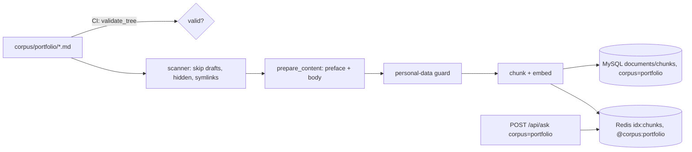

# Portfolio corpus and backend (PR 2) Implementation Plan

> **For agentic workers:** REQUIRED SUB-SKILL: Use superpowers:subagent-driven-development (recommended) or superpowers:executing-plans to implement this plan task-by-task. Steps use checkbox (`- [ ]`) syntax for tracking.

**Goal:** Make `portfolio` a third corpus end to end in the backend (content format, CI check, scanner, ingest, sweep, retrieval, API, MySQL, warm-up, docs) while visitors see no change.

**Architecture:** One small module, `services/glassbox/corpora.py`, becomes the single list of corpus names that the API, retrieval, ingest, sweep, reconcile and warm-up import. A new module, `services/glassbox/portfolio.py`, is the one Python definition of the portfolio file format: it parses YAML front matter, validates it, builds the text the chatbot indexes, and validates the whole `corpus/portfolio/` tree for CI (as a pytest test) and for the owner (`python -m services.glassbox.portfolio`). The scanner yields non-draft project files as `portfolio` sources; ingest turns each into "preface + body", runs the personal-data guard over it, and embeds it like any other Markdown. Alembic `0007` appends `portfolio` to both `corpus` ENUM columns.

**Tech Stack:** Python 3.12, FastAPI/pydantic, SQLAlchemy + Alembic on MySQL 8.0, redis-stack (RediSearch), PyYAML 6.0.3, pytest + pytest-asyncio, ruff.

**Spec:** `docs/superpowers/specs/2026-10-02-portfolio-design.md` (approved 2026-10-02). This plan is §6 (PR 2) only, plus the §9 backend tests and the `portfolio` key of §5.1's suggested questions. Read §6 and §9 before starting.

**Where to work:** a fresh worktree from `origin/main`: `git worktree add .worktrees/portfolio-backend -b feat/portfolio-backend origin/main`. PR 1 (the footer "Open to work" callout) is independent but may touch `project/SNAPSHOT.md`, `project/BACKLOG.md` and `project/status/README.md` at the same time: trial-merge before merging.

## Global Constraints

- **Hard rules (restate in every dispatch):** never read, open or copy any `terraform.tfstate` or plan file; no `terraform apply`; no live AWS or Kubernetes writes; never `git stash`. No pushes or merges except the PR flow in Task 9.
- **Visitors see no change in this PR.** No frontend code changes. The only file under `frontend/` that changes is `frontend/src/suggested-questions.json` (a new `portfolio` key, which the desktop/phone chat does not read yet).
- **Corpus value:** `portfolio` (API body `corpus: "portfolio"`; MySQL ENUM member `portfolio`, appended last).
- **Content path:** `corpus/portfolio/<slug>.md`, public, one file per project. Images: `frontend/public/portfolio/<slug>/`, served from the site's own origin (CSP `img-src 'self'`).
- **Front matter (spec §6.1):** required `title`, `one_liner`, `kind`, `year`, `stack`; `kind` is `personal | freelance`; `aspect` is `16/10 | 4/3 | 9/19.5`; links must be `https`; `draft: true` means "not built into the site and not indexed".
- **CI schema check (spec §6.1)** rejects: a missing required field, an unknown `kind` or `aspect`, a visual whose `src` does not exist, a missing `alt`, a non-`https` link.
- **PR 2 ships one placeholder:** `corpus/portfolio/_example.md` with `draft: true`, whose comments explain every field.
- **Suggested questions (spec §5.1), verbatim:** "What can Basel build for me?", "Which project is most like a SaaS app?", "Is Basel available for freelance work?".
- **Owner content rules (project/CLAUDE.md, spec §6.3):** no RAG evaluation runs (free or paid), no golden-set additions, no prompt or model changes (`_PROMPT_VERSION` stays `v14`; `_PLANNED_SOURCE_SIGNAL` unchanged).
- **Migration:** Alembic `0007_portfolio_corpus`, down revision `0006_ingestion_run_notes`, appends `portfolio` to `documents.corpus` and `queries.corpus`, has a working downgrade. The deploy applies it automatically; the owner does nothing by hand.
- **Environment:** Docker is down on the owner's Mac, so every MySQL/Redis test skips locally. Implementers report a task done only after CI's `backend-tests` job is green on the pushed branch (Task 9), not on a local run that skipped them.
- **Style:** ruff `E, F, I, UP, B`, line length 100 (`ruff check services eval`). Tests live in `services/tests/`.
- **`docs/` is chatbot corpus** (About This System) and passes through the planned marker (`_PLANNED_SOURCE_SIGNAL` in `services/glassbox/api/ask.py`). Text describing what this PR ships must avoid the words `planned`, `deferred`, `not built/started/implemented (yet)`, `future work/features/plans`, `M4`, `ASG`, `SQS`, `self-healing`; text describing the frontend that is still to come should carry "(planned)" so it is marked.

## Review Focus

1. **The owner switches a published project to `draft: true` (or deletes it) and expects the chatbot to stop citing it.** Expected: it becomes stale for the sweep; production runs the sweep in report mode, so it stays searchable until the sweep is applied or `--clear --corpus portfolio` runs, and drafting the *last* project is refused by the zero-file guard. Pinned in Task 4 (`test_a_project_switched_to_draft_becomes_stale`, `test_drafting_the_last_project_is_refused_by_the_zero_file_guard`) and documented in DESIGN-003 §1.3 (Task 7).
2. **YAML type gotchas in hand-written front matter:** `year: "2026"`, `title: 2048`, `stack: React` (not a list), `aspect: 16:10` (PyYAML reads it as the base-60 integer 970), `draft: "false"`. Expected: each is a clear validation error naming the field, never a silent coercion. Pinned in Task 3 (`test_yaml_type_gotchas_are_errors`).
3. **A malformed project file reaches the ingest Job** (for example merged before this check existed, or a draft with a typo flipped to published). Expected: that file is skipped and listed under "skipped", counted as seen (its last good version keeps serving), every other file is still ingested, and the Job exits 0. Pinned in Task 5 (unit: `test_an_invalid_portfolio_file_is_an_error_not_an_exception`; CI integration: `test_portfolio_projects_are_ingested_with_their_preface`).
4. **A symlinked file or folder, or a hidden file, under `corpus/portfolio/`.** Expected: never read (same rule as the private About Basel scan), including a symlinked directory pointing outside the repo. Pinned in Task 4 (`test_symlinked_files_and_folders_are_not_followed`, hidden paths in `test_published_projects_are_portfolio_sources_and_drafts_are_not`).
5. **Version skew during a rollout:** the `warm-answers` CronJob (new image, new questions file) can run while the old api pod, which rejects `portfolio` with HTTP 422, is still serving. Expected: the three Portfolio asks are logged as failed, spend no warm-up budget slot, and the other seven questions still run. Pinned in Task 6 (`test_an_api_without_portfolio_fails_only_those_questions_and_spends_nothing`).

---

## File Structure

| File | Change | Responsibility |
|---|---|---|
| `services/glassbox/corpora.py` | Create | The one list of corpus names: `Corpus` (a `Literal`) and `CORPORA` (tuple). |
| `services/glassbox/retrieval/search.py` | Modify | Accept any name in `CORPORA`. |
| `services/glassbox/api/ask.py` | Modify | `AskRequest.corpus: Corpus`. Nothing else (no prompt change). |
| `services/glassbox/ingest/sweep.py` | Modify | `CORPORA` comes from `corpora.py` (re-exported; `run.py` and `reconcile.py` keep importing it from here). |
| `services/glassbox/db/models.py` | Modify | Both `corpus` columns are `ENUM(*CORPORA)`. |
| `services/glassbox/db/migrations/versions/0007_portfolio_corpus.py` | Create | Append `portfolio` to both ENUM columns; lossy downgrade. |
| `.github/workflows/ci.yml` | Modify | Migration round trip: newest revision down, then up, before pytest. |
| `services/glassbox/portfolio.py` | Create | Portfolio file format: parse, validate, index text, content-hash version, tree validation, CLI. |
| `services/requirements.txt`, `services/requirements-dev.txt` | Modify | PyYAML becomes a runtime dependency (ingest parses front matter in the image). |
| `corpus/portfolio/_example.md` | Create | Draft placeholder explaining every field. |
| `corpus/README.md` | Modify | Mention `corpus/portfolio/`. |
| `services/glassbox/ingest/scanner.py` | Modify | `_portfolio_sources`: non-draft, non-hidden, non-symlinked `corpus/portfolio/**/*.md` as `portfolio`. |
| `services/glassbox/privacy.py` | Modify | `GUARDED_CORPORA = {"about_me", "portfolio"}`; docstrings. |
| `services/glassbox/ingest/run.py` | Modify | `content_hash_for`, `prepare_content`; `_ingest` uses them. |
| `k8s/base/configmap-app.yaml` | Modify | Comment only: the quarantine setting also applies to portfolio documents. |
| `services/glassbox/warm.py` | Modify | `CORPORA` from `corpora.py`. |
| `frontend/src/suggested-questions.json` | Modify | `portfolio` key with the spec's three questions. |
| `docs/DESIGN.md`, `docs/DESIGN-003-ingestion.md`, `docs/architecture/deep-dive.md` | Modify | Corpora, schema, warm-up count, privacy, new DD3 §1.3. |
| `project/status/2026-10-02-portfolio-backend.md`, `project/status/README.md`, `project/SNAPSHOT.md`, `project/BACKLOG.md` | Create/Modify | Owner report and session memory. |
| Tests | Create: `services/tests/test_corpora.py`, `test_portfolio.py`, `test_portfolio_scanner.py`, `test_portfolio_ingest.py`, `test_portfolio_migration.py`. Modify: `test_ingest_sweep.py`, `test_ask_endpoint.py`, `test_db_models.py`, `test_ingest_run.py`, `test_warm.py`, `test_eval_golden.py`, `test_planned_labels.py`. | |

**Where the shared validator lives (decision):** in Python, `services/glassbox/portfolio.py`, because the ingest Job needs it inside the image and CI already runs Python. CI runs it as an ordinary pytest test (`test_every_portfolio_file_in_the_repo_is_valid`) in the required `backend-tests` job, so no new workflow or job is needed, and any change under `corpus/` or `frontend/` already triggers that job (`.github/scripts/ci-code-changed.sh`). PR 3's frontend gets its own TypeScript parser (spec §7); the rules are written out in the module docstring and in DESIGN-003 §1.3 so the two can be kept in step.

**Hard-coded corpus spots found by grep, and what happens to each:**

| Spot | In spec §6.2? | This plan |
|---|---|---|
| `ingest/scanner.py`, `ingest/sweep.py` `CORPORA`, `warm.py` `CORPORA`, `retrieval/search.py`, `api/ask.py` Literal, `db/models.py` (two ENUMs) | yes | Tasks 1, 2, 4, 6 |
| `ingest/run.py` (`about_me`-only guard branch) | implied by "privacy guard over portfolio docs" | Task 5 |
| `privacy.py` docstrings ("every `about_me` document") | implied | Task 5 |
| `ingest/reconcile.py` | no (imports `CORPORA` from `sweep.py`) | picks up `portfolio` automatically |
| `frontend/src/suggested-questions.json` + `warm.load_questions` (raises `unknown corpora` on an extra key) | yes | Task 6; the two change in the same commit |
| `services/tests/test_eval_golden.py::test_suggested_questions_are_covered` (every suggested question must have a golden case) | **no** | Task 6: skip `portfolio` there (no golden additions, owner rule) |
| `services/tests/test_ingest_sweep.py` (expects exactly two corpora loaded) | **no** | Task 1 |
| `k8s/base/configmap-app.yaml` comment on `GLASSBOX_PII_QUARANTINE` | **no** | Task 5 (comment only) |
| `docs/architecture/deep-dive.md` (two corpora, `corpus` values) | **no** | Task 7 |
| `infra/modules/ops/scripts/diagnose.sh` (prints `corpus:ver` for two corpora) | **no** | Not changed: it ships through an SSM document and needs a Terraform apply. BACKLOG item (Task 8). |
| `eval/run_eval.py`, `eval/schema.py` `CORPORA`; `eval/questions.yaml`, baselines | **no** | Deliberately unchanged (no evaluations, no golden additions). BACKLOG item. |
| `worker/main.py:95` (synthetic stress jobs tagged `about_me`) | **no** | Unchanged; synthetic jobs never search. |
| `frontend/src/App.tsx`, `components/Chat.tsx`, `lib/conversation.ts` | §5 (PR 3) | Not in this PR. |
| `Dockerfile` (`COPY corpus/ corpus/`), `.dockerignore`, `release.yml` paths (`corpus/**`, `frontend/**`) | — | Already cover `corpus/portfolio/` and `frontend/public/portfolio/`; no change. |

**Migration rollout (how it reaches production, owner does nothing):** merging to `main` triggers `release.yml` (paths include `services/**`, `corpus/**`, `frontend/**`); Flux then applies `k8s/base/migrate-job.yaml`, whose container runs `alembic upgrade head`. The `api` and `retrieval-worker` Deployments have `wait-for-migrations` initContainers (`services/glassbox/db/wait_for_migrations.py`) that hold the new pods until the database is at this image's head (`0007_portfolio_corpus`). The ingest Job runs after `app-ready`. Appending an ENUM member at the end is metadata-only in MySQL 8.0 (`ALGORITHM=INSTANT`, concurrent DML allowed), and the tables are small (hundreds of `documents`, at most thousands of `queries`), so even a fallback copy takes well under a second. Old pods keep working against the widened column because they never write `portfolio`. **Backing out:** revert the code but keep `0007_portfolio_corpus.py` (and the ENUM in `models.py`): a reverted image whose migrations stop at `0006` would fail `alembic upgrade head` ("Can't locate revision") and its pods would wait in `Init` until the timeout. The widened ENUM is harmless to old code.

---

### Task 1: One corpus list; retrieval and the API accept `portfolio`

**Files:**
- Create: `services/glassbox/corpora.py`
- Modify: `services/glassbox/retrieval/search.py:1-20`, `services/glassbox/api/ask.py:20-30,128-131`, `services/glassbox/ingest/sweep.py:47-54`
- Test: create `services/tests/test_corpora.py`; modify `services/tests/test_ingest_sweep.py:160-191`, `services/tests/test_ingest_reconcile.py:314-317`, `services/tests/test_ask_endpoint.py` (new test after `test_empty_model_filtered_retrieval_answers_without_llm`)

**Interfaces:**
- Consumes: nothing.
- Produces: `services.glassbox.corpora.Corpus = Literal["about_me", "about_system", "portfolio"]`; `services.glassbox.corpora.CORPORA: tuple[str, ...] == ("about_me", "about_system", "portfolio")`; `services.glassbox.ingest.sweep.CORPORA` is the same object.

- [ ] **Step 1: Write the failing tests**

Create `services/tests/test_corpora.py`:

```python
"""One corpus list for the API, retrieval, ingest and the warm-up (portfolio spec §6.2)."""

import pytest

from services.glassbox import corpora
from services.glassbox.api.ask import AskRequest
from services.glassbox.ingest import sweep
from services.glassbox.retrieval.search import search_chunks


def test_portfolio_is_the_third_corpus():
    assert corpora.CORPORA == ("about_me", "about_system", "portfolio")
    assert sweep.CORPORA is corpora.CORPORA


def test_ask_request_accepts_every_corpus_and_nothing_else():
    for corpus in corpora.CORPORA:
        assert AskRequest(question="What did Basel build?", corpus=corpus).corpus == corpus
    with pytest.raises(ValueError):
        AskRequest(question="Hi?", corpus="about_you")


class _CapturingRedis:
    def __init__(self):
        self.args = None

    async def execute_command(self, *args):
        self.args = args
        return [0]  # FT.SEARCH reply with zero matches


@pytest.mark.asyncio
async def test_search_filters_portfolio_by_its_own_tag():
    client = _CapturingRedis()
    assert await search_chunks(client, [0.0] * 512, "portfolio", "fake-v1") == []
    assert "@corpus:{portfolio}" in client.args[2]


@pytest.mark.asyncio
async def test_search_rejects_an_unknown_corpus():
    with pytest.raises(ValueError, match="unknown corpus"):
        await search_chunks(_CapturingRedis(), [0.0] * 512, "about_you", "fake-v1")
```

Add to `services/tests/test_ask_endpoint.py`, directly after `test_empty_model_filtered_retrieval_answers_without_llm`:

```python
def test_portfolio_question_with_no_projects_indexed_abstains_without_llm(monkeypatch):
    # The state right after this PR deploys: the corpus exists but holds only a draft.
    from services.glassbox.api import ask

    class NoBudget:
        async def reserve(self):
            pytest.fail("empty retrieval must not reserve LLM budget")

    class NoLLM:
        model_id = "no-llm"

        async def generate(self, prompt, *, max_tokens):
            pytest.fail("empty retrieval must not invoke the LLM")
            yield ""

    saved = []
    client = MemoryRedis("empty")
    monkeypatch.setenv("REDIS_URL", "redis://unused")
    monkeypatch.setattr(ask.redis, "from_url", lambda url: client)
    monkeypatch.setattr(ask, "get_daily_budget", lambda client: NoBudget())
    monkeypatch.setattr(ask, "get_llm_provider", lambda: NoLLM())
    monkeypatch.setattr(ask, "_save_query", lambda **kwargs: saved.append(kwargs))
    stream = events(
        TestClient(app).post(
            "/api/ask", json={"question": "What can Basel build for me?", "corpus": "portfolio"}
        )
    )
    assert client.enqueued["corpus"] == "portfolio"
    assert next(data for name, data in stream if name == "token")["text"] == (
        "I don't know from what I have."
    )
    assert all(name != "error" for name, _ in stream)
    assert saved[0]["request"].corpus == "portfolio"
```

- [ ] **Step 2: Run the tests to verify they fail**

Run: `pytest services/tests/test_corpora.py services/tests/test_ask_endpoint.py::test_portfolio_question_with_no_projects_indexed_abstains_without_llm -v`
Expected: FAIL: `ModuleNotFoundError: No module named 'services.glassbox.corpora'` (collection error), and the ask test fails with a 422 response (no `token` event).

- [ ] **Step 3: Write the implementation**

Create `services/glassbox/corpora.py`:

```python
"""The chat corpora, in one place (portfolio spec §6.2).

``Corpus`` is what ``POST /api/ask`` accepts; ``CORPORA`` holds the same names as a
tuple for loops (ingest, the stale sweep, the Redis reconcile, the warm-up). The
MySQL ``corpus`` ENUM columns hold the same list (``db/models.py``; migration
``0007`` appended ``portfolio``). The eval tooling under ``eval/`` keeps its own
two-corpus list on purpose: no portfolio evaluations until the owner adds projects.
"""

from typing import Literal, get_args

Corpus = Literal["about_me", "about_system", "portfolio"]
CORPORA: tuple[str, ...] = get_args(Corpus)
```

In `services/glassbox/retrieval/search.py`, add the import after the `cache.answer` import and replace the hard-coded check:

```python
from services.glassbox.cache.answer import _model_tag
from services.glassbox.corpora import CORPORA
from services.glassbox.ingest.redis_index import INDEX_NAME
```

```python
    if corpus not in CORPORA:
        raise ValueError("unknown corpus")
```

In `services/glassbox/api/ask.py`, add the import after the `services.glassbox.cache.embedding` import block (keep `from typing import Literal`, it is used elsewhere) and change the field:

```python
from services.glassbox.corpora import Corpus
```

```python
class AskRequest(BaseModel):
    question: str = Field(min_length=1, max_length=1000)
    corpus: Corpus
```

In `services/glassbox/ingest/sweep.py`, delete `CORPORA = ("about_me", "about_system")` and import it instead (between the `cache.answer` and `db.models` imports, so ruff's import order holds). `run.py` and `reconcile.py` keep `from services.glassbox.ingest.sweep import CORPORA`:

```python
from services.glassbox.cache.answer import _model_tag
from services.glassbox.corpora import CORPORA
from services.glassbox.db.models import Chunk as DbChunk
```

- [ ] **Step 4: Update the sweep tests that list exactly two corpora**

In `services/tests/test_ingest_sweep.py`:

```python
    assert recorder.loaded == [
        ("about_me", "titan"),
        ("about_system", "titan"),
        ("portfolio", "titan"),
    ]
```

```python
    assert [len(plan.stale) for plan in plans] == [1, 5, 0]
```

`test_force_lifts_the_threshold` stays as is (the recorder knows no portfolio documents, so nothing is deleted for it).

In `services/tests/test_ingest_reconcile.py::test_unknown_report_is_returned_only_when_it_had_keys` (the reconcile returns one report per corpus in `CORPORA`):

```python
    assert [r.corpus for r in await rec.reconcile(None, redis, MODEL)] == [
        "about_me",
        "about_system",
        "portfolio",
    ]
```

The planner applied Tasks 1-5 to a scratch copy and ran the whole suite: these three tests are the only ones that list exactly two corpora.

- [ ] **Step 5: Run the tests to verify they pass**

Run: `pytest services/tests/test_corpora.py services/tests/test_ingest_sweep.py services/tests/test_ask_endpoint.py services/tests/test_ingest_reconcile.py -q -rs`
Expected: PASS (MySQL/Redis integration tests skip locally). If any other test fails only because it lists exactly two corpora, add `portfolio` to its expectation; change nothing else.

- [ ] **Step 6: Lint and commit**

```bash
ruff check services eval
git add services/glassbox/corpora.py services/glassbox/retrieval/search.py services/glassbox/api/ask.py services/glassbox/ingest/sweep.py services/tests/test_corpora.py services/tests/test_ingest_sweep.py services/tests/test_ingest_reconcile.py services/tests/test_ask_endpoint.py
git commit -m "feat(corpus): one corpus list; retrieval and the API accept portfolio"
```

---

### Task 2: Alembic 0007 widens both corpus ENUM columns

**Files:**
- Create: `services/glassbox/db/migrations/versions/0007_portfolio_corpus.py`
- Modify: `services/glassbox/db/models.py:1-17,60-66`, `.github/workflows/ci.yml:78-79`
- Test: modify `services/tests/test_db_models.py:28,129,198,210` and append one test; create `services/tests/test_portfolio_migration.py`

**Interfaces:**
- Consumes: `services.glassbox.corpora.CORPORA` (Task 1).
- Produces: Alembic head `0007_portfolio_corpus`; module attributes `TABLES = ("documents", "queries")`, `OLD`, `NEW` (both `mysql.ENUM`).

- [ ] **Step 1: Write the failing tests**

In `services/tests/test_db_models.py`, change the four two-corpus expectations:

```python
    assert documents.c.corpus.type.enums == ["about_me", "about_system", "portfolio"]
```

```python
    assert queries.c.corpus.type.enums == ["about_me", "about_system", "portfolio"]
```

```python
    assert "ENUM('about_me','about_system','portfolio')" in ddl["documents"]
```

```python
    assert "ENUM('about_me','about_system','portfolio') NOT NULL" in ddl["queries"]
```

Append to `services/tests/test_db_models.py`:

```python
def test_portfolio_migration_appends_the_enum_member_on_both_tables():
    import importlib
    import inspect

    from services.glassbox.db.wait_for_migrations import get_head_revisions

    migration = importlib.import_module(
        "services.glassbox.db.migrations.versions.0007_portfolio_corpus"
    )
    assert migration.down_revision == "0006_ingestion_run_notes"
    assert migration.revision == "0007_portfolio_corpus"
    assert len(migration.revision) <= 32
    assert get_head_revisions() == frozenset({"0007_portfolio_corpus"})
    assert migration.TABLES == ("documents", "queries")
    assert migration.OLD.enums == ["about_me", "about_system"]
    # Appended at the end only: existing values keep their index, storage stays 1 byte.
    assert migration.NEW.enums == [*migration.OLD.enums, "portfolio"]
    assert migration.NEW.enums == list(Document.__table__.c.corpus.type.enums)
    upgrade = inspect.getsource(migration.upgrade)
    assert "alter_column" in upgrade
    assert "drop_column" not in upgrade and "DELETE" not in upgrade
    downgrade = inspect.getsource(migration.downgrade)
    assert "DELETE FROM queries WHERE corpus = 'portfolio'" in downgrade
    assert "DELETE FROM documents WHERE corpus = 'portfolio'" in downgrade
```

Create `services/tests/test_portfolio_migration.py`:

```python
"""Migration 0007 on a real MySQL: both corpus columns take 'portfolio'.

CI runs ``alembic upgrade head`` before pytest, so an unmigrated column fails there;
locally (no MySQL, or an old schema) these tests skip.
"""

import os

import pytest
from sqlalchemy import delete, select

from services.glassbox.db.models import Document, Query
from services.glassbox.db.session import create_db_engine, get_session_factory

TEST_MYSQL_PORT = os.environ.get("GLASSBOX_TEST_MYSQL_PORT", "3306")
EXPECTED = "enum('about_me','about_system','portfolio')"


@pytest.fixture
def engine(monkeypatch):
    for key, value in {
        "MYSQL_HOST": "127.0.0.1",
        "MYSQL_PORT": TEST_MYSQL_PORT,
        "MYSQL_USER": "glassbox",
        "MYSQL_PASSWORD": "glassbox",  # pragma: allowlist secret (throwaway test DB)
        "MYSQL_DATABASE": "glassbox",
    }.items():
        monkeypatch.setenv(key, value)
    get_session_factory.cache_clear()
    engine = create_db_engine()
    try:
        with engine.connect() as connection:
            connection.exec_driver_sql("SELECT 1")
    except Exception as exc:  # pragma: no cover - depends on local services
        engine.dispose()
        pytest.skip(f"MySQL unavailable: {exc}")
    yield engine
    engine.dispose()
    get_session_factory.cache_clear()


def _corpus_type(engine, table: str) -> str:
    with engine.connect() as connection:
        raw = connection.exec_driver_sql(f"SHOW COLUMNS FROM {table} LIKE 'corpus'").one()[1]
    return raw.decode() if isinstance(raw, bytes) else raw


def _require_migrated(engine) -> None:
    for table in ("documents", "queries"):
        if "'portfolio'" not in _corpus_type(engine, table):
            message = f"MySQL {table}.corpus is not migrated to 0007"
            if os.environ.get("CI"):
                pytest.fail(message)
            pytest.skip(message)


@pytest.mark.parametrize("table", ["documents", "queries"])
def test_portfolio_is_appended_to_the_corpus_enum(engine, table):
    _require_migrated(engine)
    assert _corpus_type(engine, table) == EXPECTED


def test_portfolio_documents_and_queries_are_storable(engine):
    _require_migrated(engine)
    path = "corpus/portfolio/migration-test.md"
    request_id = "01PORTFOLIOMIGRATIONTEST00"
    sessions = get_session_factory()
    try:
        with sessions() as session:
            session.add(
                Document(
                    corpus="portfolio", source_path=path, content_hash="a" * 64, title="Test"
                )
            )
            session.add(
                Query(
                    request_id=request_id,
                    corpus="portfolio",
                    question="What can Basel build for me?",
                    cache_status="miss",
                    mode="full",
                )
            )
            session.commit()
            stored = session.scalar(select(Document.corpus).where(Document.source_path == path))
            assert stored == "portfolio"
            logged = session.scalar(select(Query.corpus).where(Query.request_id == request_id))
            assert logged == "portfolio"
    finally:
        with sessions() as session:
            session.execute(
                delete(Document).where(Document.source_path == path, Document.corpus == "portfolio")
            )
            session.execute(delete(Query).where(Query.request_id == request_id))
            session.commit()
```

- [ ] **Step 2: Run the tests to verify they fail**

Run: `pytest services/tests/test_db_models.py services/tests/test_portfolio_migration.py -v`
Expected: FAIL in `test_db_models.py` (enum lists are still two members; `ModuleNotFoundError` for `0007_portfolio_corpus`). The migration tests skip locally (no MySQL).

- [ ] **Step 3: Write the migration and the model change**

Create `services/glassbox/db/migrations/versions/0007_portfolio_corpus.py`:

```python
"""Add 'portfolio' to both corpus ENUM columns (portfolio spec §6.2)."""

import sqlalchemy as sa
from alembic import op
from sqlalchemy.dialects import mysql

revision = "0007_portfolio_corpus"
down_revision = "0006_ingestion_run_notes"
branch_labels = None
depends_on = None

OLD = mysql.ENUM("about_me", "about_system")
NEW = mysql.ENUM("about_me", "about_system", "portfolio")
TABLES = ("documents", "queries")


def upgrade() -> None:
    # Appending a member at the end keeps every existing value's index and the 1-byte
    # storage size, so MySQL 8.0 changes only the table metadata (ALGORITHM=INSTANT,
    # concurrent DML allowed), also on documents, where corpus leads the uq_doc key.
    # Both tables are small (hundreds of documents, at most thousands of query rows),
    # so even a fallback table copy would take well under a second. Pods still on the
    # previous image keep working during the rollout: they never write 'portfolio'.
    for table in TABLES:
        op.alter_column(table, "corpus", existing_type=OLD, type_=NEW, existing_nullable=False)


def downgrade() -> None:
    # Lossy: the old ENUM can't hold portfolio rows, so they are deleted first (chunks
    # follow their documents through ON DELETE CASCADE). Run
    # `python -m services.glassbox.ingest.run --clear --corpus portfolio --yes` before
    # downgrading so the Redis chunk keys go too; otherwise the previous image's
    # reconcile removes them as keys of an unknown corpus.
    op.execute(sa.text("DELETE FROM queries WHERE corpus = 'portfolio'"))
    op.execute(sa.text("DELETE FROM documents WHERE corpus = 'portfolio'"))
    for table in TABLES:
        op.alter_column(table, "corpus", existing_type=NEW, type_=OLD, existing_nullable=False)
```

In `services/glassbox/db/models.py`, import the list and use it for both columns:

```python
from services.glassbox.corpora import CORPORA
```

```python
    corpus: Mapped[str] = mapped_column(ENUM(*CORPORA), nullable=False)
```

(Same line in `Document` and in `Query`.)

- [ ] **Step 4: Add the migration round trip to CI**

In `.github/workflows/ci.yml`, directly after the "Apply database migrations" step:

```yaml
      - name: Migration round trip (newest revision down, then up again)
        run: alembic downgrade -1 && alembic upgrade head
```

- [ ] **Step 5: Run the tests to verify they pass**

Run: `pytest services/tests/test_db_models.py services/tests/test_portfolio_migration.py services/tests/test_wait_for_migrations.py -q -rs`
Expected: `test_db_models.py` PASS; `test_portfolio_migration.py` SKIPPED locally ("MySQL unavailable"); in CI they must PASS (Task 9).

- [ ] **Step 6: Lint and commit**

```bash
ruff check services eval
git add services/glassbox/db/migrations/versions/0007_portfolio_corpus.py services/glassbox/db/models.py .github/workflows/ci.yml services/tests/test_db_models.py services/tests/test_portfolio_migration.py
git commit -m "feat(db): migration 0007 adds portfolio to both corpus ENUM columns"
```

---

### Task 3: Portfolio file format, CI check and the draft example

**Files:**
- Create: `services/glassbox/portfolio.py`, `corpus/portfolio/_example.md`
- Modify: `services/requirements.txt`, `services/requirements-dev.txt`, `corpus/README.md`
- Test: create `services/tests/test_portfolio.py`

**Interfaces:**
- Consumes: `services.glassbox.privacy.find_pii(text) -> list[Finding]` (existing; `Finding.category`, `.start`, `.end`).
- Produces (all in `services.glassbox.portfolio`):
  - `PORTFOLIO_DIR = ("corpus", "portfolio")`, `PUBLIC_DIR = ("frontend", "public", "portfolio")`, `INDEX_VERSION = "1"`
  - `class PortfolioError(ValueError)`
  - `@dataclass(frozen=True) class Visual: src: str; alt: str; aspect: str; caption: str | None = None`
  - `@dataclass(frozen=True) class Project: slug, title, one_liner, kind, year: int, stack: tuple[str, ...], body: str, order: int | None = None, links: dict[str, str], visuals: tuple[Visual, ...] = (), draft: bool = False`
  - `split_front_matter(text: str) -> tuple[dict, str]`
  - `is_draft(text: str) -> bool`
  - `parse_project(text: str, slug: str) -> Project` (raises `PortfolioError` listing every problem, joined with `"; "`)
  - `index_text(project: Project) -> str`
  - `index_content_hash(raw_hash: str) -> str`
  - `portfolio_files(root: Path) -> list[Path]`
  - `missing_visual_files(project: Project, public_root: Path) -> list[str]`
  - `personal_data_problems(text: str) -> list[str]`
  - `validate_tree(root: Path) -> dict[str, list[str]]` (repo-relative POSIX path → problems; `{}` when all valid)
  - `main(argv: list[str] | None = None) -> int`

- [ ] **Step 1: Write the failing tests**

Create `services/tests/test_portfolio.py`:

```python
"""The portfolio file format (portfolio spec §6.1) and the CI check over the repo."""

from pathlib import Path

import pytest
import yaml

from services.glassbox import portfolio
from services.glassbox.portfolio import (
    PortfolioError,
    index_content_hash,
    index_text,
    is_draft,
    parse_project,
    validate_tree,
)

REPO = Path(__file__).resolve().parents[2]

VALID = """---
title: JobPilot
one_liner: Job-search copilot that tailors applications and tracks every lead.
kind: personal
year: 2026
order: 1
stack: [TypeScript, React, FastAPI, Postgres]
links:
  live: https://jobpilot.example.com
  code: https://github.com/hacka-tron/jobpilot
visuals:
  - src: jobpilot/board.png
    alt: Pipeline board with applications grouped by stage
    caption: Pipeline board, from saved to offer.
    aspect: 16/10
---

## The problem

Tailoring each application took an hour.
"""

BASE = {
    "title": "JobPilot",
    "one_liner": "Job-search copilot.",
    "kind": "personal",
    "year": 2026,
    "stack": ["React"],
}


def doc(fields: dict, body: str = "Body.\n") -> str:
    return "---\n" + yaml.safe_dump(fields, sort_keys=False) + "---\n\n" + body


def errors_for(text: str, slug: str = "jobpilot") -> str:
    with pytest.raises(PortfolioError) as caught:
        parse_project(text, slug)
    return str(caught.value)


# --- the repo's own files: this is the CI schema check -------------------------------


def test_every_portfolio_file_in_the_repo_is_valid():
    assert validate_tree(REPO) == {}


def test_the_example_is_a_draft_that_documents_every_field():
    text = (REPO / "corpus/portfolio/_example.md").read_text()
    assert is_draft(text)
    project = parse_project(text, "_example")
    assert project.draft is True
    for name in (*portfolio.REQUIRED_FIELDS, *portfolio.OPTIONAL_FIELDS, "src", "alt", "aspect"):
        assert name in text, name


def test_pyyaml_is_a_runtime_dependency():
    # The ingest Job parses front matter inside the image, which installs only this file.
    runtime = (REPO / "services/requirements.txt").read_text().splitlines()
    assert any(line.startswith("PyYAML==") for line in runtime)


# --- parsing ----------------------------------------------------------------------


def test_a_full_project_parses():
    project = parse_project(VALID, "jobpilot")
    assert project.title == "JobPilot"
    assert project.kind == "personal" and project.year == 2026 and project.order == 1
    assert project.stack == ("TypeScript", "React", "FastAPI", "Postgres")
    assert project.links == {
        "live": "https://jobpilot.example.com",
        "code": "https://github.com/hacka-tron/jobpilot",
    }
    assert project.visuals == (
        portfolio.Visual(
            src="jobpilot/board.png",
            alt="Pipeline board with applications grouped by stage",
            aspect="16/10",
            caption="Pipeline board, from saved to offer.",
        ),
    )
    assert project.draft is False
    assert project.body.lstrip().startswith("## The problem")


def test_optional_fields_default():
    project = parse_project(doc(BASE), "jobpilot")
    assert project.order is None and project.links == {} and project.visuals == ()
    assert project.draft is False


@pytest.mark.parametrize("name", ["title", "one_liner", "kind", "year", "stack"])
def test_each_required_field_is_required(name):
    fields = {key: value for key, value in BASE.items() if key != name}
    assert f"missing required field '{name}'" in errors_for(doc(fields))


@pytest.mark.parametrize(
    ("change", "message"),
    [
        ({"kind": "side-project"}, "kind must be one of personal, freelance"),
        ({"links": {"live": "http://jobpilot.example.com"}}, "links.live must be an https://"),
        ({"links": {"live": "https://"}}, "links.live must be an https://"),
        ({"links": {"demo": "https://x.example.com"}}, "unknown link 'demo'"),
        ({"subtitle": "typo"}, "unknown fields: subtitle"),
        ({"visuals": [{"src": "jobpilot/a.png", "aspect": "16/10"}]}, "visuals[0].alt is missing"),
        (
            {"visuals": [{"src": "jobpilot/a.png", "alt": "A", "aspect": "21/9"}]},
            "visuals[0].aspect must be one of 16/10, 4/3, 9/19.5",
        ),
        (
            {"visuals": [{"src": "../secrets.png", "alt": "A", "aspect": "4/3"}]},
            "visuals[0].src must be a path like jobpilot/picture.png",
        ),
        (
            {"visuals": [{"src": "other/a.png", "alt": "A", "aspect": "4/3"}]},
            "visuals[0].src must be a path like jobpilot/picture.png",
        ),
        (
            {"visuals": [{"src": "/jobpilot/a.png", "alt": "A", "aspect": "4/3"}]},
            "visuals[0].src must be a path like jobpilot/picture.png",
        ),
        ({"year": 1850}, "year must be a whole number like 2026"),
        ({"order": "first"}, "order must be a whole number"),
    ],
)
def test_schema_errors(change, message):
    assert message in errors_for(doc({**BASE, **change}))


def test_yaml_type_gotchas_are_errors():
    # Review Focus 2: hand-written YAML that parses, but not as the owner meant.
    text = (
        "---\ntitle: 2048\none_liner: Puzzle.\nkind: personal\nyear: \"2026\"\n"
        "stack: React\nvisuals:\n  - src: jobpilot/a.png\n    alt: A\n    aspect: 16:10\n"
        "draft: \"false\"\n---\nBody.\n"
    )
    message = errors_for(text)
    assert "title must be text" in message
    assert "year must be a whole number like 2026 (got '2026')" in message
    assert "stack must be a list like [TypeScript, React]" in message
    assert "visuals[0].aspect must be one of 16/10, 4/3, 9/19.5 (got 970)" in message
    assert "draft must be true or false (got 'false')" in message


def test_every_problem_is_listed_at_once():
    message = errors_for(doc({"title": "Only a title"}))
    assert message.count("missing required field") == 4


@pytest.mark.parametrize(
    ("text", "message"),
    [
        ("# No front matter\n", "missing front matter"),
        ("---\ntitle: Unclosed\n", "front matter is not closed"),
        ("---\ntitle: [broken\n---\nBody\n", "front matter is not valid YAML"),
        ("---\n- a list\n---\nBody\n", "front matter must be a list of 'field: value' lines"),
    ],
)
def test_broken_front_matter(text, message):
    assert message in errors_for(text)


@pytest.mark.parametrize("slug", ["JobPilot", "job_pilot", "job pilot", "-jobpilot"])
def test_file_names_are_lowercase_slugs(slug):
    assert f"file name {slug}.md must be" in errors_for(doc(BASE), slug)


def test_draft_detection_never_raises():
    assert is_draft(doc({**BASE, "draft": True}))
    assert not is_draft(doc(BASE))
    assert not is_draft(doc({**BASE, "draft": "true"}))  # a string is not a draft
    assert not is_draft("---\ntitle: [broken\n---\n")
    assert not is_draft("no front matter")


# --- what the chatbot indexes -----------------------------------------------------


def test_index_text_is_a_preface_then_the_body():
    text = index_text(parse_project(VALID, "jobpilot"))
    assert text == (
        "# JobPilot\n\n"
        "Job-search copilot that tailors applications and tracks every lead.\n\n"
        "- Kind: Personal project\n"
        "- Year: 2026\n"
        "- Stack: TypeScript, React, FastAPI, Postgres\n"
        "- Live site: https://jobpilot.example.com\n"
        "- Code: https://github.com/hacka-tron/jobpilot\n\n"
        "## The problem\n\nTailoring each application took an hour.\n"
    )


def test_index_text_without_links_or_body():
    text = index_text(parse_project(doc({**BASE, "kind": "freelance"}, body=""), "jobpilot"))
    assert text.endswith("- Kind: Freelance project\n- Year: 2026\n- Stack: React\n")


def test_index_content_hash_folds_in_the_format_version():
    raw = "a" * 64
    assert index_content_hash(raw) != raw
    assert index_content_hash(raw) == index_content_hash(raw)
    assert len(index_content_hash(raw)) == 64


# --- the tree check ---------------------------------------------------------------


def _tree(root: Path, files: dict[str, str]) -> None:
    for relative, text in files.items():
        path = root / relative
        path.parent.mkdir(parents=True, exist_ok=True)
        path.write_text(text)


def test_missing_screenshot_fails_published_projects_only(tmp_path):
    visual = {"visuals": [{"src": "jobpilot/board.png", "alt": "Board", "aspect": "16/10"}]}
    _tree(
        tmp_path,
        {
            "corpus/portfolio/jobpilot.md": doc({**BASE, **visual}),
            "corpus/portfolio/wip.md": doc(
                {
                    **BASE,
                    "draft": True,
                    "visuals": [{"src": "wip/a.png", "alt": "A", "aspect": "4/3"}],
                }
            ),
        },
    )
    problems = validate_tree(tmp_path)
    assert problems == {
        "corpus/portfolio/jobpilot.md": [
            "visual jobpilot/board.png is not in frontend/public/portfolio/"
        ]
    }
    _tree(tmp_path, {"frontend/public/portfolio/jobpilot/board.png": "png bytes"})
    assert validate_tree(tmp_path) == {}


def test_personal_data_in_a_write_up_fails_the_check(tmp_path):
    body = "The client, Jane (jane.doe@clientco.example, 614-555-0100), signed off.\n"
    _tree(tmp_path, {"corpus/portfolio/clientco.md": doc(BASE, body=body)})
    problems = validate_tree(tmp_path)["corpus/portfolio/clientco.md"]
    assert sorted(problems) == [
        "possible personal data (email) at line 10",
        "possible personal data (phone) at line 10",
    ]
    assert not any("jane.doe" in problem or "555" in problem for problem in problems)


def test_subfolders_and_invalid_files_are_reported_hidden_files_ignored(tmp_path):
    _tree(
        tmp_path,
        {
            "corpus/portfolio/clients/acme.md": doc(BASE),
            "corpus/portfolio/broken.md": "# no front matter\n",
            "corpus/portfolio/.scratch.md": "# ignored\n",
        },
    )
    problems = validate_tree(tmp_path)
    assert set(problems) == {"corpus/portfolio/clients/acme.md", "corpus/portfolio/broken.md"}
    assert "not in a subfolder" in problems["corpus/portfolio/clients/acme.md"][0]


def test_no_portfolio_folder_is_valid(tmp_path):
    assert validate_tree(tmp_path) == {}


def test_cli_exit_codes(tmp_path, capsys):
    _tree(tmp_path, {"corpus/portfolio/jobpilot.md": doc(BASE)})
    assert portfolio.main(["--root", str(tmp_path)]) == 0
    assert "1 portfolio files OK" in capsys.readouterr().out
    _tree(tmp_path, {"corpus/portfolio/broken.md": "# no front matter\n"})
    assert portfolio.main(["--root", str(tmp_path)]) == 1
    assert "corpus/portfolio/broken.md: missing front matter" in capsys.readouterr().out
```

Note for the implementer: the line number in `test_personal_data_in_a_write_up_fails_the_check` is where `doc()` puts the body: `---`, four one-line fields, `stack:` plus `- React` (PyYAML's block style), `---`, a blank line, so line 10 (checked with PyYAML 6.0.3). If it differs, print the text and use the real line; do not change the code to fit.

- [ ] **Step 2: Run the tests to verify they fail**

Run: `pytest services/tests/test_portfolio.py -v`
Expected: FAIL at collection: `ModuleNotFoundError: No module named 'services.glassbox.portfolio'`.

- [ ] **Step 3: Write `services/glassbox/portfolio.py`**

```python
"""Portfolio project files: format, validation and the text the chatbot indexes.

One Markdown file per project in ``corpus/portfolio/<slug>.md`` (portfolio spec
§6.1). YAML front matter carries the card and sheet fields; the body is "About the
project". This module is the one Python definition of the format:

* the ingest scanner skips ``draft: true`` files (``is_draft``), and ingestion
  indexes ``index_text(parse_project(...))``;
* CI checks the repo with ``validate_tree`` (``services/tests/test_portfolio.py``);
  locally: ``python -m services.glassbox.portfolio``.

The frontend parses the same files with its own TypeScript code (portfolio spec §7);
keep it in step with these rules.

Rules. Required: ``title`` and ``one_liner`` (text), ``kind`` (``personal`` or
``freelance``), ``year`` (a whole number, 1990 to 2100), ``stack`` (a non-empty list
of text). Optional: ``order`` (whole number; grid order, ascending), ``links``
(``live`` and/or ``code``, each an ``https://`` URL), ``visuals`` (a list of ``src``,
``alt``, ``aspect`` and an optional ``caption``; ``src`` is a path under
``frontend/public/portfolio/`` starting with the file's slug; ``aspect`` is ``16/10``,
``4/3`` or ``9/19.5``) and ``draft`` (``true`` or ``false``). Any other field is an
error, so a typo can't pass silently. The slug is the file name without ``.md``:
lowercase letters, digits and hyphens, after at most one leading underscore. The CI
check also fails a file the personal-data guard would redact, because the site shows
these files as written.
"""

import argparse
import hashlib
import re
import sys
from dataclasses import dataclass, field
from pathlib import Path, PurePosixPath

import yaml

from services.glassbox.privacy import find_pii

PORTFOLIO_DIR = ("corpus", "portfolio")
PUBLIC_DIR = ("frontend", "public", "portfolio")
# Bump when index_text's output changes: it is folded into every portfolio document's
# content hash, so each project is re-embedded once in the new format.
INDEX_VERSION = "1"
REQUIRED_FIELDS = ("title", "one_liner", "kind", "year", "stack")
OPTIONAL_FIELDS = ("order", "links", "visuals", "draft")
KINDS = ("personal", "freelance")
KIND_LABELS = {"personal": "Personal project", "freelance": "Freelance project"}
ASPECTS = ("16/10", "4/3", "9/19.5")
LINK_KEYS = ("live", "code")
LINK_LABELS = {"live": "Live site", "code": "Code"}
VISUAL_FIELDS = ("src", "alt", "caption", "aspect")
MIN_YEAR, MAX_YEAR = 1990, 2100
_SLUG = re.compile(r"_?[a-z0-9][a-z0-9-]*")
_HTTPS_URL = re.compile(r"https://[^\s/]+\S*")


class PortfolioError(ValueError):
    """A portfolio file that breaks the format; the message lists every problem."""


@dataclass(frozen=True)
class Visual:
    src: str
    alt: str
    aspect: str
    caption: str | None = None


@dataclass(frozen=True)
class Project:
    slug: str
    title: str
    one_liner: str
    kind: str
    year: int
    stack: tuple[str, ...]
    body: str
    order: int | None = None
    links: dict[str, str] = field(default_factory=dict)
    visuals: tuple[Visual, ...] = ()
    draft: bool = False


def split_front_matter(text: str) -> tuple[dict, str]:
    """The YAML front matter as a dict, and the body after it."""
    lines = text.splitlines(keepends=True)
    if not lines or lines[0].strip() != "---":
        raise PortfolioError("missing front matter: the file must start with a '---' line")
    end = next((i for i, line in enumerate(lines[1:], 1) if line.strip() == "---"), None)
    if end is None:
        raise PortfolioError("front matter is not closed by a second '---' line")
    try:
        data = yaml.safe_load("".join(lines[1:end]))
    except yaml.YAMLError as exc:
        raise PortfolioError(f"front matter is not valid YAML: {exc}") from None
    if not isinstance(data, dict):
        raise PortfolioError("front matter must be a list of 'field: value' lines")
    return data, "".join(lines[end + 1 :])


def is_draft(text: str) -> bool:
    """True only for a readable file whose front matter says ``draft: true``."""
    try:
        data, _ = split_front_matter(text)
    except PortfolioError:
        return False
    return data.get("draft") is True


def _text(value) -> bool:
    return isinstance(value, str) and bool(value.strip())


def _whole_number(value) -> bool:
    return isinstance(value, int) and not isinstance(value, bool)


def _visual(index: int, item, slug: str, errors: list[str]) -> Visual | None:
    where = f"visuals[{index}]"
    if not isinstance(item, dict):
        errors.append(f"{where} must have src, alt and aspect fields")
        return None
    before = len(errors)
    unknown = sorted(str(key) for key in item if key not in VISUAL_FIELDS)
    if unknown:
        errors.append(f"{where} has unknown fields: {', '.join(unknown)}")
    src, alt, aspect, caption = (item.get(name) for name in ("src", "alt", "aspect", "caption"))
    if not _text(src):
        errors.append(f"{where}.src is missing")
    else:
        parts = PurePosixPath(src).parts
        outside = "\\" in src or src.startswith("/") or ".." in parts
        if outside or len(parts) < 2 or parts[0] != slug:
            errors.append(
                f"{where}.src must be a path like {slug}/picture.png under "
                f"frontend/public/portfolio/ (got {src!r})"
            )
    if not _text(alt):
        errors.append(f"{where}.alt is missing (describe the image for screen readers)")
    if aspect not in ASPECTS:
        errors.append(f"{where}.aspect must be one of {', '.join(ASPECTS)} (got {aspect!r})")
    if caption is not None and not isinstance(caption, str):
        errors.append(f"{where}.caption must be text")
    if len(errors) > before:
        return None
    return Visual(src=src, alt=alt.strip(), aspect=aspect, caption=caption)


def parse_project(text: str, slug: str) -> Project:
    """Parse and validate one project file; raises PortfolioError listing every problem."""
    data, body = split_front_matter(text)
    errors: list[str] = []
    if not _SLUG.fullmatch(slug):
        errors.append(
            f"file name {slug}.md must be lowercase letters, digits and hyphens (like jobpilot.md)"
        )
    unknown = sorted(str(key) for key in data if key not in REQUIRED_FIELDS + OPTIONAL_FIELDS)
    if unknown:
        errors.append(f"unknown fields: {', '.join(unknown)}")
    for name in REQUIRED_FIELDS:
        if data.get(name) is None:
            errors.append(f"missing required field '{name}'")
    title, one_liner, kind, year, stack = (data.get(name) for name in REQUIRED_FIELDS)
    for name, value in (("title", title), ("one_liner", one_liner)):
        if value is not None and not _text(value):
            errors.append(f"{name} must be text")
    if kind is not None and kind not in KINDS:
        errors.append(f"kind must be one of {', '.join(KINDS)} (got {kind!r})")
    if year is not None and not (_whole_number(year) and MIN_YEAR <= year <= MAX_YEAR):
        errors.append(f"year must be a whole number like 2026 (got {year!r})")
    if stack is not None and not (
        isinstance(stack, list) and stack and all(_text(item) for item in stack)
    ):
        errors.append("stack must be a list like [TypeScript, React]")
    order = data.get("order")
    if order is not None and not _whole_number(order):
        errors.append(f"order must be a whole number (got {order!r})")
    links = data.get("links") or {}
    if not isinstance(links, dict):
        errors.append("links must have live and/or code entries")
        links = {}
    for key, url in links.items():
        if key not in LINK_KEYS:
            errors.append(f"unknown link '{key}' (use {', '.join(LINK_KEYS)})")
        elif not (isinstance(url, str) and _HTTPS_URL.fullmatch(url)):
            errors.append(f"links.{key} must be an https:// URL (got {url!r})")
    raw_visuals = data.get("visuals") or []
    if not isinstance(raw_visuals, list):
        errors.append("visuals must be a list")
        raw_visuals = []
    visuals = [_visual(index, item, slug, errors) for index, item in enumerate(raw_visuals)]
    draft = data.get("draft", False)
    if not isinstance(draft, bool):
        errors.append(f"draft must be true or false (got {draft!r})")
    if errors:
        raise PortfolioError("; ".join(errors))
    return Project(
        slug=slug,
        title=title.strip(),
        one_liner=one_liner.strip(),
        kind=kind,
        year=year,
        stack=tuple(item.strip() for item in stack),
        body=body,
        order=order,
        links={key: links[key] for key in LINK_KEYS if key in links},
        visuals=tuple(visuals),
        draft=draft,
    )


def index_text(project: Project) -> str:
    """What the chatbot indexes: a short preface of the card fields, then the body.

    The preface makes questions like "which projects use React?" retrieve the file.
    """
    lines = [
        f"# {project.title}",
        "",
        project.one_liner,
        "",
        f"- Kind: {KIND_LABELS[project.kind]}",
        f"- Year: {project.year}",
        f"- Stack: {', '.join(project.stack)}",
    ]
    lines += [f"- {LINK_LABELS[key]}: {url}" for key, url in project.links.items()]
    body = project.body.strip()
    return "\n".join(lines) + "\n" + (f"\n{body}\n" if body else "")


def index_content_hash(raw_hash: str) -> str:
    """The file hash with the index format version folded in (see INDEX_VERSION)."""
    return hashlib.sha256(f"{raw_hash}:portfolio-index-v{INDEX_VERSION}".encode()).hexdigest()


def portfolio_files(root: Path) -> list[Path]:
    """Every Markdown file under corpus/portfolio/, hidden paths left out."""
    base = root.joinpath(*PORTFOLIO_DIR)
    if not base.is_dir():
        return []
    return [
        path
        for path in sorted(base.rglob("*.md"))
        if not any(part.startswith(".") for part in path.relative_to(base).parts)
    ]


def missing_visual_files(project: Project, public_root: Path) -> list[str]:
    return [
        f"visual {visual.src} is not in frontend/public/portfolio/"
        for visual in project.visuals
        if not (public_root / visual.src).is_file()
    ]


def personal_data_problems(text: str) -> list[str]:
    """Where the personal-data guard would redact something; never the value itself."""
    problems = []
    for finding in find_pii(text):
        line = text.count("\n", 0, finding.start) + 1
        problems.append(f"possible personal data ({finding.category}) at line {line}")
    return problems


def validate_tree(root: Path) -> dict[str, list[str]]:
    """Problems per repo-relative file under corpus/portfolio/; empty when all are valid."""
    base = root.joinpath(*PORTFOLIO_DIR)
    public = root.joinpath(*PUBLIC_DIR)
    problems: dict[str, list[str]] = {}
    for path in portfolio_files(root):
        errors: list[str] = []
        if path.parent != base:
            errors.append("project files go directly in corpus/portfolio/, not in a subfolder")
        if path.is_symlink():
            errors.append("symlinks are never read; commit the file itself")
        try:
            text = path.read_text(encoding="utf-8")
        except (OSError, UnicodeDecodeError) as exc:
            errors.append(f"cannot read UTF-8 content: {exc}")
        else:
            try:
                project = parse_project(text, path.stem)
            except PortfolioError as exc:
                errors.append(str(exc))
            else:
                if not project.draft:
                    errors.extend(missing_visual_files(project, public))
            errors.extend(personal_data_problems(text))
        if errors:
            problems[path.relative_to(root).as_posix()] = errors
    return problems


def main(argv: list[str] | None = None) -> int:
    parser = argparse.ArgumentParser(
        prog="python -m services.glassbox.portfolio",
        description="Check the portfolio project files (corpus/portfolio/*.md).",
    )
    parser.add_argument(
        "--root",
        type=Path,
        default=Path(__file__).resolve().parents[2],
        help="repository root (default: this checkout)",
    )
    args = parser.parse_args(argv)
    problems = validate_tree(args.root)
    for path, errors in problems.items():
        for error in errors:
            print(f"{path}: {error}")
    count = len(portfolio_files(args.root))
    if problems:
        print(f"{len(problems)} of {count} portfolio files have problems", file=sys.stderr)
        return 1
    print(f"{count} portfolio files OK")
    return 0


if __name__ == "__main__":
    raise SystemExit(main())
```

(The planner ran this module and Step 1's tests against PyYAML 6.0.3: all pass and ruff is clean.)

- [ ] **Step 4: Make PyYAML a runtime dependency**

`services/requirements.txt`: add `PyYAML==6.0.3` as the last line. `services/requirements-dev.txt`: delete its `PyYAML==6.0.3` line (it still gets it through `-r requirements.txt`). The Dockerfile installs only `services/requirements.txt`, and CI never builds the image, so `test_pyyaml_is_a_runtime_dependency` is the only thing that would catch an ingest Job crashing on `import yaml`.

- [ ] **Step 5: Write the draft example**

Create `corpus/portfolio/_example.md`:

```markdown
---
# Example portfolio project. It is a draft, so the site and the chatbot ignore it.
# To add a project: copy this file to corpus/portfolio/<slug>.md (lowercase letters,
# digits and hyphens, e.g. jobpilot.md), fill it in, and set draft: false.
# Check your files with: python -m services.glassbox.portfolio
# Required fields: title, one_liner, kind, year, stack. Everything else is optional.
title: Example Project          # project name, on the card and the details sheet
one_liner: One sentence on what it does and for whom.   # card and sheet subtitle
kind: personal                  # personal | freelance
year: 2026                      # the year it shipped (a plain number)
order: 99                       # grid position, ascending; projects without one go last
stack: [Python, FastAPI, React] # tags; the card shows the first three, then "+N"
links:                          # optional; https only; leave a key out to hide its button
  live: https://example.com     # the "Live site" button
  # code: https://github.com/hacka-tron/example   # the "Code" button
visuals: []                     # optional screenshots, in display order; replace [] with:
#  - src: jobpilot/board.png    # a file in frontend/public/portfolio/, starting with the slug
#    alt: Pipeline board with applications grouped by stage   # required, for screen readers
#    caption: Pipeline board, from saved to offer.   # optional, shown under the image
#    aspect: 16/10              # 16/10 (desktop) | 4/3 | 9/19.5 (phone screenshot)
draft: true                     # true: not on the site and not indexed by the chatbot
---

## The problem

Who it was for and what was hard before it existed.

## What I built

The main pieces and how they fit together. Keep it to a few short paragraphs: the
site shows this text in the project's details sheet, and the chatbot answers from it.

## What was interesting

A decision, a trade-off or a number worth telling a recruiter or a client about.
Never paste a client's contact details here; the CI check fails if it finds any.
```

`test_the_example_is_a_draft_that_documents_every_field` checks that every field name appears in the file, and `test_every_portfolio_file_in_the_repo_is_valid` runs the full check (including the personal-data scan) over it.

- [ ] **Step 6: Update `corpus/README.md`**

Replace its contents with:

```markdown
# corpus/

- `portfolio/`: Basel's other projects, one Markdown file per project, public. The
  ingest Job indexes them as the `portfolio` corpus and the site will show them in the
  Portfolio panel. `portfolio/_example.md` explains every field; check your files with
  `python -m services.glassbox.portfolio` (CI runs the same check). Screenshots go in
  `frontend/public/portfolio/<slug>/`. See `docs/DESIGN-003-ingestion.md` section 1.3.
- The About Basel text is not in this repository. It lives in the owner's private
  repo and is checked out here at release time as `corpus/about-me-private/`
  (git-ignored; see `docs/DESIGN-003-ingestion.md` section 1.2). The ingest scanner
  reads only `corpus/about-me-private/about-me/` for About Basel, so this README is
  never indexed.
```

- [ ] **Step 7: Run the tests to verify they pass**

Run: `pytest services/tests/test_portfolio.py -v && python -m services.glassbox.portfolio`
Expected: all PASS; the CLI prints `1 portfolio files OK` and exits 0.

- [ ] **Step 8: Lint and commit**

```bash
ruff check services eval
git add services/glassbox/portfolio.py services/tests/test_portfolio.py services/requirements.txt services/requirements-dev.txt corpus/portfolio/_example.md corpus/README.md
git commit -m "feat(portfolio): file format, CI check and a draft example project"
```

---

### Task 4: The scanner reads `corpus/portfolio/`

**Files:**
- Modify: `services/glassbox/ingest/scanner.py:20-31,146-179`
- Test: create `services/tests/test_portfolio_scanner.py`

**Interfaces:**
- Consumes: `portfolio.PORTFOLIO_DIR`, `portfolio.portfolio_files(root)`, `portfolio.is_draft(text)` (Task 3); `sweep.plan_sweep`, `sweep.source_root` (existing).
- Produces: `scan_sources(root)` also yields `SourceFile("portfolio", "corpus/portfolio/<file>.md", path)` for each non-draft, non-hidden, non-symlinked file inside the folder. `run.seen_source_paths(root)["portfolio"]` therefore lists them.

- [ ] **Step 1: Write the failing tests**

Create `services/tests/test_portfolio_scanner.py`:

```python
"""corpus/portfolio as the portfolio corpus: drafts, hidden files and symlinks are skipped."""

import os

from services.glassbox.ingest import run as ingest_run
from services.glassbox.ingest.scanner import scan_file, scan_sources
from services.glassbox.ingest.sweep import ScopedDocument, plan_sweep, source_root

MODEL = "fake-v1"
PROJECT = (
    "---\ntitle: JobPilot\none_liner: Copilot.\nkind: personal\nyear: 2026\n"
    "stack: [React]\n{extra}---\n\nBody.\n"
)
FAKE_KEY = "key = AKIA1234567890ABCDEF\n"  # pragma: allowlist secret
FAKE_KEY_PROJECT = PROJECT.format(extra="") + FAKE_KEY


def _tree(root, files):
    for relative, text in files.items():
        path = root / relative
        path.parent.mkdir(parents=True, exist_ok=True)
        path.write_text(text)


def _portfolio(root):
    return {s.source_path for s in scan_sources(root) if s.corpus == "portfolio"}


def test_published_projects_are_portfolio_sources_and_drafts_are_not(tmp_path):
    _tree(
        tmp_path,
        {
            "corpus/portfolio/jobpilot.md": PROJECT.format(extra=""),
            "corpus/portfolio/shop.md": PROJECT.format(extra="draft: false\n"),
            "corpus/portfolio/_example.md": PROJECT.format(extra="draft: true\n"),
            "corpus/portfolio/.wip.md": PROJECT.format(extra=""),
            "corpus/portfolio/.drafts/old.md": PROJECT.format(extra=""),
            "corpus/portfolio/notes.txt": "not markdown",
        },
    )
    assert _portfolio(tmp_path) == {"corpus/portfolio/jobpilot.md", "corpus/portfolio/shop.md"}


def test_a_file_with_broken_front_matter_is_still_scanned_so_ingest_reports_it(tmp_path):
    _tree(tmp_path, {"corpus/portfolio/broken.md": "---\ntitle: [unclosed\n---\nBody\n"})
    assert _portfolio(tmp_path) == {"corpus/portfolio/broken.md"}


def test_symlinked_files_and_folders_are_not_followed(tmp_path):
    outside = tmp_path / "outside"
    outside.mkdir()
    (outside / "leak.md").write_text(PROJECT.format(extra=""))
    base = tmp_path / "corpus" / "portfolio"
    base.mkdir(parents=True)
    os.symlink(outside / "leak.md", base / "link.md")
    os.symlink(outside, base / "linked-folder")
    assert _portfolio(tmp_path) == set()


def test_portfolio_files_belong_to_no_other_corpus(tmp_path):
    _tree(tmp_path, {"corpus/portfolio/jobpilot.md": PROJECT.format(extra="")})
    sources = list(scan_sources(tmp_path))
    assert [(s.corpus, s.source_path) for s in sources] == [
        ("portfolio", "corpus/portfolio/jobpilot.md")
    ]
    assert scan_file(sources[0]).error is None


def test_secrets_in_a_project_file_are_quarantined_like_any_source(tmp_path):
    _tree(tmp_path, {"corpus/portfolio/keys.md": FAKE_KEY_PROJECT})
    (source,) = list(scan_sources(tmp_path))
    assert scan_file(source).error.startswith("possible AWS access key")


def test_seen_paths_include_portfolio(tmp_path):
    _tree(tmp_path, {"corpus/portfolio/jobpilot.md": PROJECT.format(extra="")})
    assert ingest_run.seen_source_paths(tmp_path)["portfolio"] == {"corpus/portfolio/jobpilot.md"}
    assert source_root("corpus/portfolio/jobpilot.md") == "corpus"


def test_a_project_switched_to_draft_becomes_stale(tmp_path):
    # Review Focus 1: the sweep sees it as gone (report mode in production logs it).
    _tree(
        tmp_path,
        {
            "corpus/portfolio/jobpilot.md": PROJECT.format(extra="draft: true\n"),
            "corpus/portfolio/shop.md": PROJECT.format(extra=""),
        },
    )
    known = [
        ScopedDocument(1, "corpus/portfolio/jobpilot.md", (1,)),
        ScopedDocument(2, "corpus/portfolio/shop.md", (2,)),
    ]
    seen = ingest_run.seen_source_paths(tmp_path)["portfolio"]
    plan = plan_sweep("portfolio", MODEL, known, seen)
    assert [document.source_path for document in plan.stale] == ["corpus/portfolio/jobpilot.md"]
    assert plan.refused is None


def test_drafting_the_last_project_is_refused_by_the_zero_file_guard(tmp_path):
    _tree(tmp_path, {"corpus/portfolio/jobpilot.md": PROJECT.format(extra="draft: true\n")})
    known = [ScopedDocument(1, "corpus/portfolio/jobpilot.md", (1,))]
    seen = ingest_run.seen_source_paths(tmp_path)["portfolio"]
    assert seen == set()
    plan = plan_sweep("portfolio", MODEL, known, seen, force=True)
    assert plan.refused and "zero files for portfolio" in plan.refused
```

- [ ] **Step 2: Run the tests to verify they fail**

Run: `pytest services/tests/test_portfolio_scanner.py -v`
Expected: FAIL: the scanner yields no `portfolio` sources (`set() != {...}`); `test_symlinked...` and `test_drafting...` may pass already.

- [ ] **Step 3: Write the implementation**

In `services/glassbox/ingest/scanner.py`, add the import after the standard-library imports:

```python
from services.glassbox.portfolio import PORTFOLIO_DIR, is_draft, portfolio_files
```

Change `scan_sources` (docstring and one new `yield from`) and add `_portfolio_sources` below `_private_sources`:

```python
def scan_sources(root: Path) -> Iterator[SourceFile]:
    """Yield supported files and denied-path candidates from every corpus.

    About Basel (``about_me``) comes only from the private checkout. A public
    ``corpus/about-me/`` directory is deliberately not scanned, so About Basel
    text can't be added to this repo and indexed by accident. Portfolio projects
    (``portfolio``) come from ``corpus/portfolio/``, drafts left out.
    """
    root = root.resolve()
    yield from _private_sources(root)
    yield from _portfolio_sources(root)
    for directory in SYSTEM_DIRECTORIES:
        ...  # unchanged
```

```python
def _portfolio_sources(root: Path) -> Iterator[SourceFile]:
    """Non-draft project files; hidden paths skipped, symlinks never followed.

    A file whose front matter can't be read is still yielded: ingest reports it and
    it counts as seen, so its last good version keeps serving.
    """
    base = root.joinpath(*PORTFOLIO_DIR)
    for path in portfolio_files(root):
        # A symlinked file or folder could point outside the repo: skip both.
        if (
            path.is_symlink()
            or not path.is_file()
            or not path.resolve().is_relative_to(base)
        ):
            continue
        try:
            draft = is_draft(path.read_text(encoding="utf-8"))
        except (OSError, UnicodeDecodeError):
            draft = False  # scan_file reports the unreadable file
        if not draft:
            yield SourceFile("portfolio", path.relative_to(root).as_posix(), path)
```

(`root` is already resolved by `scan_sources`; `base` is not resolved on purpose, so a symlinked `corpus/portfolio` folder also fails the `is_relative_to` check.)

- [ ] **Step 4: Run the tests to verify they pass**

Run: `pytest services/tests/test_portfolio_scanner.py services/tests/test_private_corpus.py services/tests/test_ingest_run.py services/tests/test_scanner_tokens.py -q -rs`
Expected: PASS (integration tests skip locally).

- [ ] **Step 5: Lint and commit**

```bash
ruff check services eval
git add services/glassbox/ingest/scanner.py services/tests/test_portfolio_scanner.py
git commit -m "feat(ingest): scan corpus/portfolio as the portfolio corpus, drafts skipped"
```

---

### Task 5: Ingest indexes projects as preface + body, behind the personal-data guard

**Files:**
- Modify: `services/glassbox/ingest/run.py:37-56,114-124,244-272`, `services/glassbox/privacy.py:1-35,327-333`, `k8s/base/configmap-app.yaml:38-39`
- Test: create `services/tests/test_portfolio_ingest.py`; add an integration test to `services/tests/test_ingest_run.py`

**Interfaces:**
- Consumes: `portfolio.parse_project`, `portfolio.index_text`, `portfolio.index_content_hash`, `portfolio.PortfolioError` (Task 3); `privacy.guard_document`, `privacy.guarded_content_hash` (existing); `scanner.SourceFile`, `scanner.strip_front_matter` (existing).
- Produces:
  - `services.glassbox.privacy.GUARDED_CORPORA = frozenset({"about_me", "portfolio"})`
  - `services.glassbox.ingest.run.Prepared` dataclass: `text: str | None`, `error: str | None = None`, `redacted: Counter | None = None`
  - `services.glassbox.ingest.run.content_hash_for(corpus: str, raw_hash: str) -> str`
  - `services.glassbox.ingest.run.prepare_content(source: SourceFile, content: str, quarantine: frozenset[str]) -> Prepared`

- [ ] **Step 1: Write the failing unit tests (these run locally, no MySQL)**

Create `services/tests/test_portfolio_ingest.py`:

```python
"""What ingest embeds for each corpus: portfolio preface, front matter, the guard, the hash."""

from pathlib import Path

from services.glassbox.ingest.run import content_hash_for, prepare_content
from services.glassbox.ingest.scanner import SourceFile
from services.glassbox.portfolio import index_content_hash
from services.glassbox.privacy import GUARDED_CORPORA, REDACTION, guarded_content_hash

PROJECT = """---
title: ClientCo booking site
one_liner: Booking and payments for a small studio.
kind: freelance
year: 2025
stack: [Next.js, Stripe, Postgres]
links:
  live: https://booking.example.com
---

## What I built

Online booking with deposits. The owner, jane.doe@clientco.example, signs off releases.
"""


def _source(corpus: str, source_path: str) -> SourceFile:
    return SourceFile(corpus, source_path, Path(source_path))


def test_portfolio_and_about_me_are_the_guarded_corpora():
    assert GUARDED_CORPORA == frozenset({"about_me", "portfolio"})


def test_portfolio_documents_are_indexed_with_a_preface_and_guarded():
    prepared = prepare_content(
        _source("portfolio", "corpus/portfolio/clientco.md"), PROJECT, frozenset()
    )
    assert prepared.error is None
    assert prepared.text.startswith(
        "# ClientCo booking site\n\nBooking and payments for a small studio.\n\n"
        "- Kind: Freelance project\n- Year: 2025\n- Stack: Next.js, Stripe, Postgres\n"
        "- Live site: https://booking.example.com\n\n## What I built\n"
    )
    assert "title:" not in prepared.text and "---" not in prepared.text
    assert "jane.doe@clientco.example" not in prepared.text
    assert REDACTION in prepared.text
    assert prepared.redacted == {"email": 1}


def test_a_quarantine_category_skips_the_whole_portfolio_document():
    prepared = prepare_content(
        _source("portfolio", "corpus/portfolio/clientco.md"), PROJECT, frozenset({"email"})
    )
    assert prepared.text is None
    assert "quarantined" in prepared.error
    assert prepared.redacted == {"email": 1}


def test_an_invalid_portfolio_file_is_an_error_not_an_exception():
    # Review Focus 3: ingest skips and reports it; the run carries on.
    broken = "---\ntitle: X\n---\nBody\n"
    prepared = prepare_content(
        _source("portfolio", "corpus/portfolio/broken.md"), broken, frozenset()
    )
    assert prepared.text is None
    assert prepared.error.startswith("invalid portfolio file: ")
    assert "missing required field 'kind'" in prepared.error


def test_about_me_still_strips_front_matter_and_is_guarded():
    prepared = prepare_content(
        _source("about_me", "private/bio.md"),
        "---\ntype: bio\n---\n# Bio\n\nCall 614-555-0100.\n",
        frozenset(),
    )
    assert prepared.text == f"# Bio\n\nCall {REDACTION}.\n"
    assert prepared.redacted == {"phone": 1}


def test_about_system_is_indexed_as_written():
    text = "---\nname: x\n---\n# Runbook\n\nCall 614-555-0100.\n"
    prepared = prepare_content(_source("about_system", "docs/runbook.md"), text, frozenset())
    assert prepared.text == text and prepared.error is None and prepared.redacted is None


def test_content_hashes():
    raw = "a" * 64
    assert content_hash_for("about_system", raw) == raw
    # Unchanged for About Basel, so this PR re-embeds nothing there.
    assert content_hash_for("about_me", raw) == guarded_content_hash(raw)
    assert content_hash_for("portfolio", raw) == guarded_content_hash(index_content_hash(raw))
    assert content_hash_for("portfolio", raw) not in {raw, guarded_content_hash(raw)}
```

- [ ] **Step 2: Run the tests to verify they fail**

Run: `pytest services/tests/test_portfolio_ingest.py -v`
Expected: FAIL at import: `ImportError: cannot import name 'content_hash_for'` (and `GUARDED_CORPORA`).

- [ ] **Step 3: Add `GUARDED_CORPORA` to `privacy.py` and update its docstrings**

In `services/glassbox/privacy.py`, change the module docstring's first bullet to:

```python
* **Ingest time** (``guard_document``): every ``about_me`` document (from the
  owner's private About Basel repo, ``private/...``) and every ``portfolio``
  document (``corpus/portfolio/*.md``, public, but a write-up may quote a client's
  details) is scanned before chunking. Detected spans are replaced
  with ``[redacted]``, so neither the stored chunk text, the embeddings, the
  title nor the public retrieval snippets ever hold them. Categories listed in
  ``GLASSBOX_PII_QUARANTINE`` (for example ``gov_id``) skip the whole document
  instead. Logs name the document and the category counts, never the value.
```

Replace the comment above `PII_GUARD_VERSION` and add the constant below `REDACTION`:

```python
# Bump when a pattern changes: it is folded into every guarded document's content
# hash, so each one is re-scanned (and re-embedded) once under the new rules.
PII_GUARD_VERSION = "1"
REDACTION = "[redacted]"
# Corpora whose documents pass guard_document at ingest.
GUARDED_CORPORA = frozenset({"about_me", "portfolio"})
```

In `guard_document`'s docstring: `"""Redact personal data from one guarded document, or quarantine it.`

- [ ] **Step 4: Add `Prepared`, `content_hash_for` and `prepare_content` to `run.py` and use them**

Imports in `services/glassbox/ingest/run.py` (replace the scanner and privacy imports):

```python
from services.glassbox.ingest.scanner import (
    SourceFile,
    scan_file,
    scan_sources,
    strip_front_matter,
)
```

```python
from services.glassbox.portfolio import (
    PortfolioError,
    index_content_hash,
    index_text,
    parse_project,
)
from services.glassbox.privacy import (
    GUARDED_CORPORA,
    guard_document,
    guarded_content_hash,
    quarantine_categories,
)
```

In `RunResult`, change the comment to `# Personal-data guard: per guarded document, the categories it redacted.`

Add below `_title`:

```python
@dataclass
class Prepared:
    """The text to chunk for one scanned file, or why the file is skipped."""

    text: str | None
    error: str | None = None
    redacted: Counter | None = None


def content_hash_for(corpus: str, raw_hash: str) -> str:
    """The stored ``content_hash``: the file's hash plus every rule shaping its indexed text.

    The portfolio index format and the personal-data guard versions are folded in, so
    changing either re-embeds the affected documents once instead of skipping them.
    """
    if corpus == "portfolio":
        raw_hash = index_content_hash(raw_hash)
    if corpus in GUARDED_CORPORA:
        raw_hash = guarded_content_hash(raw_hash)
    return raw_hash


def prepare_content(source: SourceFile, content: str, quarantine: frozenset[str]) -> Prepared:
    """Portfolio files become preface + body; About Basel loses its front matter.

    Then the personal-data guard (privacy.py) redacts guarded corpora before chunking,
    so no chunk, embedding, title or snippet ever holds a redacted value. An invalid
    portfolio file or a quarantined document comes back with ``error`` set: like a
    secret-scanner hit it is skipped but still "seen", so its last good version keeps
    serving. About This System files are indexed as written.
    """
    if source.corpus == "portfolio":
        try:
            project = parse_project(content, source.path.stem)
        except PortfolioError as exc:
            return Prepared(None, f"invalid portfolio file: {exc}")
        content = index_text(project)
    elif source.corpus == "about_me":
        content = strip_front_matter(content)
    if source.corpus not in GUARDED_CORPORA:
        return Prepared(content)
    guarded = guard_document(content, source.source_path, quarantine=quarantine)
    redacted = guarded.counts or None
    if guarded.quarantined:
        return Prepared(None, guarded.quarantined, redacted)
    return Prepared(guarded.text, None, redacted)
```

In `_ingest`, replace the block from `content_hash = scanned.content_hash` through `content = guarded.text` (current lines 245-272) with:

```python
            content_hash = content_hash_for(source.corpus, scanned.content_hash)
            known = indexed.get((source.corpus, source.source_path))
            if (
                known is not None
                and known.content_hash == content_hash
                and known.models == {provider.model_id}
            ):
                continue

            prepared = prepare_content(source, scanned.content, quarantine)
            if prepared.redacted:
                result.pii_redacted[source.source_path] = prepared.redacted
            if prepared.error:
                result.errors[source.source_path] = prepared.error
                LOGGER.warning("Skipped %s: %s", source.source_path, prepared.error)
                continue
            content = prepared.text
```

The rest of the loop (chunk, embed, `write_document(... title=_title(content, source.path) ...)`) is unchanged: for a project, `_title` finds the preface's `# <title>` heading.

- [ ] **Step 5: Run the unit tests to verify they pass**

Run: `pytest services/tests/test_portfolio_ingest.py services/tests/test_private_corpus.py services/tests/test_privacy.py services/tests/test_ingest_run.py -q -rs`
Expected: PASS (integration tests skip locally).

- [ ] **Step 6: Add the CI integration test**

Append to `services/tests/test_ingest_run.py` (it uses the file's `integration_stack` fixture, so it skips locally and runs in CI):

```python
@pytest.mark.asyncio
async def test_portfolio_projects_are_ingested_with_their_preface(tmp_path, integration_stack):
    engine, client = integration_stack
    try:
        await client.ping()
    except Exception as exc:
        pytest.skip(f"real MySQL/Redis integration stack unavailable: {exc}")
    slug = tmp_path.name.lower().replace("_", "-")
    (tmp_path / "corpus" / "portfolio").mkdir(parents=True)
    good = f"corpus/portfolio/{slug}.md"
    bad = f"corpus/portfolio/{slug}-bad.md"
    draft = f"corpus/portfolio/{slug}-draft.md"
    (tmp_path / good).write_text(
        "---\ntitle: Fixture Project\none_liner: A fixture.\nkind: personal\nyear: 2026\n"
        "stack: [React, FastAPI]\n---\n\nBuilt for tests.\n"
    )
    (tmp_path / bad).write_text("---\ntitle: Missing fields\n---\n\nBody.\n")
    (tmp_path / draft).write_text(
        "---\ntitle: Draft\none_liner: Later.\nkind: personal\nyear: 2026\nstack: [Go]\n"
        "draft: true\n---\n\nBody.\n"
    )
    with engine.connect() as connection:
        existing_run_ids = set(connection.scalars(select(IngestionRun.id)))
    redis_keys = []
    try:
        first = await ingest(tmp_path, engine=engine, redis_client=client)
        assert first.docs_changed == 1
        assert first.errors[bad].startswith("invalid portfolio file:")
        assert draft not in first.errors
        with Session(engine) as session:
            document = session.scalar(
                select(Document).where(Document.corpus == "portfolio", Document.source_path == good)
            )
            assert document is not None and document.title == "Fixture Project"
            chunks = list(
                session.scalars(select(DbChunk).where(DbChunk.document_id == document.id))
            )
            assert len(chunks) == 1
            assert chunks[0].text.startswith("# Fixture Project\n\nA fixture.\n")
            assert "- Stack: React, FastAPI" in chunks[0].text
            assert "Built for tests." in chunks[0].text
            redis_keys.append(f"chunk:{chunks[0].id}")
            others = session.scalar(
                select(func.count())
                .select_from(Document)
                .where(Document.source_path.in_([bad, draft]))
            )
            assert others == 0
        assert await client.hget(redis_keys[0], "corpus") == b"portfolio"
        second = await ingest(tmp_path, engine=engine, redis_client=client)
        assert second.docs_changed == 0  # unchanged project skipped by its content hash
    finally:
        with engine.begin() as connection:
            connection.execute(
                Document.__table__.delete().where(Document.source_path.in_([good, bad, draft]))
            )
            new_run_ids = set(connection.scalars(select(IngestionRun.id))) - existing_run_ids
            if new_run_ids:
                connection.execute(
                    IngestionRun.__table__.delete().where(IngestionRun.id.in_(new_run_ids))
                )
        if redis_keys:
            await client.delete(*redis_keys)
        await client.aclose()
```

- [ ] **Step 7: Update the ConfigMap comment**

In `k8s/base/configmap-app.yaml`:

```yaml
  # Personal-data guard (services/glassbox/privacy.py): about_me and portfolio
  # documents with a government ID (SSN-like) are skipped whole instead of redacted.
  GLASSBOX_PII_QUARANTINE: gov_id
```

- [ ] **Step 8: Run the tests, lint and commit**

Run: `pytest services/tests -q -rs && ruff check services eval`
Expected: PASS, with the MySQL/Redis tests listed as skipped locally.

```bash
git add services/glassbox/ingest/run.py services/glassbox/privacy.py k8s/base/configmap-app.yaml services/tests/test_portfolio_ingest.py services/tests/test_ingest_run.py
git commit -m "feat(ingest): index portfolio projects as preface + body behind the personal-data guard"
```

---

### Task 6: Warm-up and suggested questions cover Portfolio

**Files:**
- Modify: `services/glassbox/warm.py:40-44`, `frontend/src/suggested-questions.json`
- Test: modify `services/tests/test_warm.py:32-39` (and add one test), `services/tests/test_eval_golden.py:50-56`

**Interfaces:**
- Consumes: `services.glassbox.corpora.CORPORA` (Task 1).
- Produces: `warm.CORPORA is corpora.CORPORA`; `warm.load_questions(DEFAULT_QUESTIONS)` returns 10 pairs, the last three `("portfolio", ...)`.

`warm.load_questions` raises `unknown corpora` for any key not in `warm.CORPORA`, so the JSON key and the `CORPORA` change must land in the same commit. The frontend only reads `suggestedQuestions.about_me` and `.about_system` (`frontend/src/components/Chat.tsx:12-15`, typed `Record<Corpus, string[]>` over its own two-value `Corpus`), so an extra JSON key changes nothing visible and type-checks; Step 5 confirms with lint, test and build.

- [ ] **Step 1: Write the failing tests**

In `services/tests/test_warm.py`, replace `test_suggested_questions_file_is_the_frontend_source` with:

```python
def test_suggested_questions_file_is_the_frontend_source():
    from services.glassbox.corpora import CORPORA

    pairs = warm.load_questions(warm.DEFAULT_QUESTIONS)
    assert warm.DEFAULT_QUESTIONS == REPO / "frontend/src/suggested-questions.json"
    assert warm.CORPORA is CORPORA
    assert {corpus for corpus, _ in pairs} == set(CORPORA)
    assert 1 <= len(pairs) <= 10  # under the per-client rate limit of 10 per 10 minutes
    assert [q for corpus, q in pairs if corpus == "portfolio"] == [
        "What can Basel build for me?",
        "Which project is most like a SaaS app?",
        "Is Basel available for freelance work?",
    ]
    chat = (REPO / "frontend/src/components/Chat.tsx").read_text()
    assert "suggested-questions.json" in chat
    assert not re.search(r"'What did Basel work on at YouTube\?'", chat)
```

Add (after `test_daily_cap_is_shared_across_runs_and_hits_are_refunded`, so `FakeRedis` and `FakeCap` are defined):

```python
def test_an_api_without_portfolio_fails_only_those_questions_and_spends_nothing():
    # Review Focus 5: during a rollout the CronJob's new image may meet the old api,
    # which answers corpus "portfolio" with HTTP 422.
    client = FakeRedis()

    def ask_fn(api_url, corpus, question):
        if corpus == "portfolio":
            return warm.Outcome(corpus, question, "failed", detail="HTTP 422", llm_attempted=False)
        return warm.Outcome(corpus, question, "cached", llm_attempted=False)

    questions = warm.load_questions(warm.DEFAULT_QUESTIONS)
    outcomes, stopped = warm.warm(
        "http://api",
        questions,
        max_llm_calls=len(questions),
        daily_cap=FakeCap(10, client),
        ask_fn=ask_fn,
    )
    assert stopped is None
    assert len(outcomes) == len(questions)
    assert [o.result for o in outcomes if o.corpus == "portfolio"] == ["failed"] * 3
    assert sum(client.values.values()) == 0  # every reserved slot was handed back
```

In `services/tests/test_eval_golden.py`, change `test_suggested_questions_are_covered`:

```python
def test_suggested_questions_are_covered():
    repo_root = GOLDEN_PATH.parent.parent
    suggested = json.loads((repo_root / "frontend/src/suggested-questions.json").read_text())
    golden = {(case["corpus"], case["question"]) for case in load_golden()}
    for corpus, questions in suggested.items():
        if corpus == "portfolio":
            # No Portfolio golden cases until the owner adds real projects (owner rule:
            # no golden-set additions or RAG evaluations before then; BACKLOG).
            continue
        for question in questions:
            assert (corpus, question) in golden, question
```

- [ ] **Step 2: Run the tests to verify they fail**

Run: `pytest services/tests/test_warm.py services/tests/test_eval_golden.py -v`
Expected: FAIL: `warm.CORPORA is CORPORA` is False and no `portfolio` pairs exist.

- [ ] **Step 3: Write the implementation**

`services/glassbox/warm.py`: delete `CORPORA = ("about_me", "about_system")` and import it (after the standard-library imports, before `LOGGER`):

```python
from services.glassbox.corpora import CORPORA
```

`frontend/src/suggested-questions.json`:

```json
{
  "about_me": [
    "What has Basel built with distributed systems?",
    "What did Basel work on at YouTube?",
    "Is Basel a fit for a platform engineering role?"
  ],
  "about_system": [
    "How does the caching work?",
    "Why k3s instead of EKS?",
    "What happens when I press stress test?",
    "Show me the Terraform for the database."
  ],
  "portfolio": [
    "What can Basel build for me?",
    "Which project is most like a SaaS app?",
    "Is Basel available for freelance work?"
  ]
}
```

- [ ] **Step 4: Run the backend tests to verify they pass**

Run: `pytest services/tests/test_warm.py services/tests/test_eval_golden.py -q -rs`
Expected: PASS.

- [ ] **Step 5: Confirm the frontend ignores the extra key**

Run: `cd frontend && npm ci && npm run lint && npm test && npm run build`
Expected: all succeed with no new warnings.

- [ ] **Step 6: Lint and commit**

```bash
ruff check services eval
git add services/glassbox/warm.py frontend/src/suggested-questions.json services/tests/test_warm.py services/tests/test_eval_golden.py
git commit -m "feat(warm): Portfolio suggested questions, warmed with the others"
```

---

### Task 7: Design docs describe the third corpus

**Files:**
- Modify: `docs/DESIGN.md` (§1 table row ~172, §4.3 ~97-102, §6.4 ~224-227, §7.1 ~266 and ~303, §7.3 warm-up ~360, the data-loss paragraph ~663, §11 risk row ~692 and privacy ~704), `docs/DESIGN-003-ingestion.md` (§1.1 guards and operator commands, new §1.3), `docs/architecture/deep-dive.md` (~7, ~48)
- Test: modify `services/tests/test_planned_labels.py:299-321`

**Interfaces:**
- Consumes: the behaviour from Tasks 1-6.
- Produces: docs only. These files are About This System corpus, so the planned-marker rules in Global Constraints apply.

- [ ] **Step 1: Edit `docs/DESIGN.md`**

1. §1 feature table, RAG row: replace "Grounded, cited answers over two curated corpora" with "Grounded, cited answers over curated corpora (About Basel, About This System, Portfolio)".
2. §4.3, after the About This System bullet, add a list item and a paragraph:

```markdown
- **Portfolio** (planned chips, shown once the frontend offers the Portfolio topic, portfolio spec §5.1): "What can Basel build for me?", "Which project is most like a SaaS app?", "Is Basel available for freelance work?"

The answer-cache warm-up already asks the Portfolio questions. Until projects are indexed they come back with no sources and cost no LLM call.
```

3. §6.4 "Sources", after the `about_system` bullet:

```markdown
  - `portfolio`: Basel's other projects, one public Markdown file each in this repo, `corpus/portfolio/<slug>.md` (YAML front matter for the card fields, a Markdown body for the write-up; format and CI check in `services/glassbox/portfolio.py`, DD3 §1.3). Files with `draft: true`, hidden paths and symlinks are skipped. Each document is indexed as a short preface (title, one-liner, kind, year, stack, links) followed by the body, and passes the personal-data guard (§11, "Privacy") like About Basel.
```

4. §7.1: both `corpus ENUM('about_me','about_system') NOT NULL,` lines become `corpus ENUM('about_me','about_system','portfolio') NOT NULL,  -- 'portfolio': 0007` (keep each line's existing column alignment).
5. §7.3 warm-up paragraph: replace "(7 today)" with "(10 today: 3 About Basel, 4 About This System, 3 Portfolio)".
6. The paragraph explaining why `documents`/`chunks` are rebuildable (~line 663): replace "plus the allowlisted `about_system` paths in this repo" with "plus the allowlisted `about_system` paths and `corpus/portfolio/` in this repo".
7. §11 risk table row "Personal details ... leaking from About Basel sources": becomes "leaking from About Basel or portfolio sources", and its mitigation "on every `about_me` document" becomes "on every `about_me` and `portfolio` document".
8. §11 "Privacy", the ingest-time bullet: replace "**Ingest time, every `about_me` document** (the private repo's `private/...` files)" with "**Ingest time, every `about_me` and `portfolio` document** (the private repo's `private/...` files, and `corpus/portfolio/*.md`, whose write-ups might quote a client's details)"; replace "The guard version is part of each `about_me` document's content hash" with "The guard version is part of each guarded document's content hash"; and append to that bullet: "Portfolio files are also checked in CI: a file the guard would redact fails the check, because the site shows those files as written."
9. §6.2/§6.4 sentence "re-embed both corpora when switching vector spaces" (~line 209): "re-embed every corpus".

- [ ] **Step 2: Edit `docs/DESIGN-003-ingestion.md`**

1. §1.1 "Guards" bullet: the source-directory list `(\`infra\`, \`k8s\`, \`services\`, \`docs\`, \`private\`)` becomes `(\`infra\`, \`k8s\`, \`services\`, \`docs\`, \`private\`, \`corpus\` for portfolio files)`.
2. §1.1 "Operator commands": `--clear --corpus about_me|about_system` becomes `--clear --corpus about_me|about_system|portfolio`.
3. Insert a new section after §1.2.1 and before the `---` line that precedes `## 2. Goals`:

```markdown
## 1.3 Portfolio corpus (in the backend since the portfolio backend change)

Owner decision, 2026-10-02 (`docs/superpowers/specs/2026-10-02-portfolio-design.md` §6): Basel's other projects are a third corpus, `portfolio`, public in this repo.

- **Source.** One file per project, `corpus/portfolio/<slug>.md`: YAML front matter for the card fields (`title`, `one_liner`, `kind`, `year`, `stack` required; `order`, `links`, `visuals`, `draft` optional) and a Markdown body. Screenshots go in `frontend/public/portfolio/<slug>/`. `corpus/portfolio/_example.md` is a draft that explains every field.
- **One definition of the format.** `services/glassbox/portfolio.py` parses and validates the files. CI runs it over the repo (`services/tests/test_portfolio.py`) and fails on a missing required field, an unknown field, an unknown `kind` or `aspect`, a missing `alt`, a link that is not `https`, a screenshot file that isn't committed (published projects only), or anything the personal-data guard would redact. Locally: `python -m services.glassbox.portfolio`.
- **Ingest.** The scanner reads `corpus/portfolio/**/*.md` as `portfolio` documents with source path `corpus/portfolio/<file>`, skipping `draft: true` files, hidden paths and symlinks. Each one is indexed as a short preface (title, one-liner, kind, year, stack, links) followed by the body, so "which projects use React?" finds the right file. It passes the secret scanner and the personal-data guard like About Basel. A file that fails validation is skipped and listed in the Job log (its last good version keeps serving) and the Job still succeeds. The content hash folds in the index format and guard versions, so changing either re-embeds each project once.
- **Deletes.** A project deleted or switched to `draft: true` is stale for the sweep. Production runs the sweep in report mode, so it stays searchable until the sweep is applied or someone runs `--clear --corpus portfolio`. Switching the last project to draft is refused by the zero-file guard; use `--clear`.
- **Database.** Migration `0007` appends `portfolio` to `documents.corpus` and `queries.corpus` (an in-place ENUM change that the migrate Job applies on deploy).
- **Visitors.** The API accepts `corpus: "portfolio"` and the warm-up asks the three Portfolio suggested questions, but the site offers the topic only once the frontend change (spec §5) ships.
```

Check the new section for the marker keywords listed in Global Constraints before saving; it must contain none.

- [ ] **Step 3: Edit `docs/architecture/deep-dive.md`**

1. Line 7: after the sentence ending "...Kubernetes manifests, Terraform and design docs), and asks a question.", insert: "A third corpus, `portfolio` (Basel's other projects, from `corpus/portfolio/`), is indexed and accepted by the API; the site offers it once the Portfolio topic is added to the frontend."
2. Line 48: "`corpus` (`about_me` or `about_system`)" becomes "`corpus` (`about_me`, `about_system` or `portfolio`)".

- [ ] **Step 4: Update the DD3 planned-label test and run it**

In `services/tests/test_planned_labels.py::test_every_design_003_chunk_is_marked_in_the_prompt_except_what_runs_today`, update the comment to name §1.3 as live, and the startswith tuple:

```python
        if not text.startswith(
            ("## 1.1 What runs today", "## 1.2 Private About Basel", "## 1.3 Portfolio corpus")
        ):
            assert PLANNED_MARK in rendered, text[:80]
```

Run: `pytest services/tests/test_planned_labels.py -v`
Expected: only `assert len(chunks) == 14` may fail, with the new count in the message. Set it to the measured number (the new section adds text, so the count can change). If any other assertion fails, the new text contains a marker keyword or a live line got marked: reword the doc, never the test logic.

- [ ] **Step 5: Run the whole suite and commit**

Run: `pytest services/tests -q -rs && ruff check services eval`
Expected: PASS (MySQL/Redis tests skipped locally).

```bash
git add docs/DESIGN.md docs/DESIGN-003-ingestion.md docs/architecture/deep-dive.md services/tests/test_planned_labels.py
git commit -m "docs: portfolio as the third corpus (DESIGN, DD3 §1.3, deep dive)"
```

---

### Task 8: Status report, SNAPSHOT and BACKLOG

**Files:**
- Create: `project/status/2026-10-02-portfolio-backend.md`
- Modify: `project/status/README.md` (index row), `project/SNAPSHOT.md`, `project/BACKLOG.md`

**Interfaces:**
- Consumes: everything above; the PR number once Task 9 opens it.
- Produces: owner-facing report; updated session memory.

- [ ] **Step 1: Write the status report**

Create `project/status/2026-10-02-portfolio-backend.md` following `project/status/README.md` (TL;DR, what changed for a visitor, how it works with a small Mermaid diagram, key decisions and trade-offs, what review caught, operational notes and risks, how to verify, open items; about 1-2 pages; no account IDs, IPs or tokens). Content to cover:

- **TL;DR:** `portfolio` is a third corpus in the backend: content format, CI check, ingest, sweep, retrieval, API, MySQL (`0007`), warm-up. One draft example; nothing indexed yet. Visitors see no change until PR 3.
- **Visitor-visible change:** none.
- **Diagram:**



- **Decisions:** one corpus list (`corpora.py`); validator in Python, run in CI as a pytest test, frontend to mirror in TS; preface for retrieval; guard + CI PII check (the site renders files as written); drafts validated but screenshots only checked for published projects; PyYAML moved to runtime deps; no prompt change (the planned marker still applies to portfolio text, see open items); golden-set check skips `portfolio`.
- **Operational notes:** migration `0007` is applied by the migrate Job on deploy (in-place ENUM append, metadata only); the owner does nothing; backing out means reverting code but keeping `0007_portfolio_corpus.py`; downgrade is lossy and documented in the migration; deleting or drafting a project stays searchable while the sweep is in report mode; warm-up now asks 10 questions (the per-IP limit is 10 per 10 minutes; the 3 Portfolio asks cost no LLM call while the corpus is empty); during a rollout the CronJob may log the 3 Portfolio asks as failed (HTTP 422 from the old api), without spending budget.
- **Verify:** CI green (including the migration round trip and the MySQL tests); after deploy, `GET /api/version` shows the new build, the ingest Job log shows `sweep portfolio: would delete 0 of 0` and no portfolio errors; optionally `curl -sN -X POST https://basel.engineering/api/ask -H 'Content-Type: application/json' -d '{"question":"What can Basel build for me?","corpus":"portfolio"}'` streams an "I don't know" answer with no sources (no LLM call, counts toward that IP's rate limit only).
- **Open items:** see Step 3.

Add a row to the top of the index table in `project/status/README.md`:

```markdown
| 2026-10-02 | [Portfolio corpus in the backend](2026-10-02-portfolio-backend.md) — PR [#N](https://github.com/hacka-tron/basel.engineering/pull/N) | `portfolio` is a third corpus: `corpus/portfolio/<slug>.md` with validated YAML front matter (CI check, `python -m services.glassbox.portfolio`), scanned without drafts/symlinks, indexed as preface + body behind the personal-data guard; API, retrieval, sweep and warm-up accept it; Alembic `0007` appends it to both ENUM columns (in place, automatic on deploy). One draft example; visitors see no change until the frontend PR. | PR open |
```

(Replace `#N` with the real PR number in Task 9.)

- [ ] **Step 2: Update `project/SNAPSHOT.md`**

- "Last updated" line: today's date and "portfolio backend (PR 2 of the portfolio spec)".
- Backend "Conversation" bullet: "Alembic revisions `0001`–`0007` (... `0007`: `portfolio` appended to both `corpus` ENUM columns)".
- Backend "Ingestion" bullet: add "Three corpora (`services/glassbox/corpora.py`): `about_me` (private repo), `about_system` (repo allowlist), `portfolio` (`corpus/portfolio/<slug>.md`, YAML front matter validated by `services/glassbox/portfolio.py` in CI and at ingest; drafts, hidden paths and symlinks skipped; indexed as a preface of the card fields plus the body)."
- "Personal-data guard" bullet: "every `about_me` and `portfolio` document is redacted at ingest"; portfolio files also fail CI if the guard would redact anything.
- "Answer warm-up" bullet: "10 suggested questions (3 About Basel, 4 About This System, 3 Portfolio)".
- Frontend section: unchanged except one line: "`suggested-questions.json` has a `portfolio` key the chat does not show yet (portfolio spec PR 3)."
- Live state: add the build number and "portfolio corpus live in the backend (empty)" only after the deploy is confirmed (Task 9, Step 6).

- [ ] **Step 3: Update `project/BACKLOG.md`**

- Resume pointer: portfolio PR 2 merged/deployed (fill in at Task 9); next is **portfolio PR 3** (frontend panel, shared details sheet, "See portfolio →"), which depends on this being deployed.
- New open items:
  - **Portfolio sources get the planned marker.** `_mark_planned` (`api/ask.py`) runs over every non-code source, so a project write-up mentioning "SQS", "ASG", "deferred" or "planned" would be labelled `[PLANNED, not built yet]` and answered as not built. Exempt `corpus/portfolio/` before real projects land (a prompt change: owner go-ahead, spec §6.3).
  - **Ops · Diagnose corpus versions:** `infra/modules/ops/scripts/diagnose.sh` prints `corpus:ver` for `about_me` and `about_system` only; add `portfolio` with the next `ops` Terraform apply.
  - **Portfolio eval and golden cases:** `eval/run_eval.py` and `eval/schema.py` know two corpora; add `portfolio` and golden cases for its suggested questions once the owner has added real projects (owner rule: not before).
  - **Decide at PR 3:** hide the Portfolio topic until there is content (spec §7, §10).
  - **Stale portfolio projects in report mode:** a deleted or drafted project stays searchable until the sweep is applied or `--clear --corpus portfolio` runs (DD3 §1.3).

- [ ] **Step 4: Commit**

```bash
git add project/status/2026-10-02-portfolio-backend.md project/status/README.md project/SNAPSHOT.md project/BACKLOG.md
git commit -m "docs(project): portfolio backend status report, SNAPSHOT and BACKLOG"
```

---

### Task 9: Final verification, PR, review gate, deploy check

**Files:** none new (PR body; status report and SNAPSHOT/BACKLOG follow-ups from Task 8).

**Interfaces:**
- Consumes: the whole branch.
- Produces: a merged, deployed PR with a green CI and an APPROVED review.

- [ ] **Step 1: Full local verification**

```bash
pytest services/tests -q -rs
ruff check services eval
python -m services.glassbox.portfolio
cd frontend && npm run lint && npm test && npm run build
```

Expected: all pass; pytest lists the MySQL/Redis tests as skipped (Docker is down on the owner's Mac). A local run that skipped them is **not** proof: those tests (the migration checks, the portfolio ingest integration test, the ask/query-log tests) only run in CI.

- [ ] **Step 2: Push the branch and open the PR**

```bash
git push -u origin feat/portfolio-backend
gh pr create --base main --title "Portfolio corpus in the backend (spec PR 2)" --body-file /tmp/pr-body.md
```

The PR body (write it to a file in the scratchpad first) covers: what and why (spec §6), the file list, the migration note (automatic on deploy, in-place ENUM append, owner does nothing; back out by reverting code but keeping `0007`), no visitor change, no RAG eval, the test plan, and ends with:

```
🤖 Generated with [Claude Code](https://claude.com/claude-code)
```

Put the PR number into the status report and its index row, commit, push.

- [ ] **Step 3: Wait for CI**

Run: `gh pr checks --watch`
Expected: `backend-tests` (including "Migration round trip" and the non-skipped MySQL/Redis tests) and `frontend-checks` green. Check the pytest log in the job for `test_portfolio_migration.py` and `test_portfolio_projects_are_ingested_with_their_preface` as PASSED, not SKIPPED. Do not report the work done before this.

- [ ] **Step 4: Review gate**

Dispatch an Opus reviewer subagent with `project/orchestration/reviewer-brief.md` (it reads `reviewer-primer.md` first). Include the spec path, this plan's path, and the Review Focus list. Round cap 2: after two rounds only Critical findings, or Important ones with a reachable failure scenario, block; the rest go to `project/BACKLOG.md`. Record the review in the PR body with `gh api -X PATCH repos/hacka-tron/basel.engineering/pulls/<N> -f body=...` (`gh pr edit` fails here) and in the status report's "What review caught".

- [ ] **Step 5: Merge**

Once the review is APPROVED and CI is green: `gh pr update-branch`, re-run the full local suite on the merged tree, wait for green CI, then `gh pr merge` as its own command. No owner go-ahead is needed: no live infra, IAM or RBAC change (the migration runs through the normal deploy).

- [ ] **Step 6: Confirm the deploy (read-only)**

After the Release workflow and Flux roll out: `curl -s https://basel.engineering/api/version` shows the new `build-N`. Ask the owner only if something looks wrong (for example a migrate Job failure, which shows as api pods stuck in `Init`; the owner runs **Ops · Diagnose**, no command line). Then update the status report ("Merged, live (build-N)"), its index row, SNAPSHOT "Live state" and the BACKLOG resume pointer, and check them in as a process-doc change.

---

## Self-review notes (planner)

- **Spec coverage (§6):** content format and draft example (Task 3); CI schema check incl. visuals `src` existence, `alt`, `https`, `kind`, `aspect` (Task 3); scanner with drafts/hidden/symlinks (Task 4); preface indexing (Tasks 3, 5); `CORPORA` in sweep and warm (Tasks 1, 6); search and ask (Task 1); models + `0007` with a size note (Task 2); privacy guard over portfolio (Task 5); DESIGN.md and DD3 (Task 7); suggested questions + warm-up (Task 6); §9 backend tests: scanner, ask accepts portfolio, migration up and down (CI round trip), warm-up covers the new questions (Tasks 1, 2, 4, 6); §6.3 no evals, no golden additions, no prompt change (Global Constraints, Task 6).
- **Spec ambiguities resolved here:**
  - *Where the validator runs in CI:* as a pytest test in the existing required `backend-tests` job, not a new workflow (no path filters to maintain; corpus changes already trigger it).
  - *`aspect` required or optional:* required (the frontend needs it for width/height to avoid layout shift, spec §5.6).
  - *Visual `src` shape:* must be `<slug>/<file>` under `frontend/public/portfolio/` (spec §6.1 "files live in frontend/public/portfolio/<slug>/"), no `..`, no absolute paths.
  - *Drafts:* fully validated, but screenshot existence is checked only for published projects, so a draft can reference images not yet committed.
  - *Unknown front-matter fields:* rejected, so typos fail CI.
  - *Personal data:* besides the ingest guard (spec §6.2), the CI check fails a file the guard would redact, because PR 3 renders these files directly and the ingest guard can't protect that.
  - *Suggested questions vs `test_suggested_questions_are_covered`:* the test skips `portfolio` instead of adding golden cases (owner rule).
  - *Planned marker on portfolio text:* left as is (spec §6.3: no prompt change); logged in BACKLOG.
- **Not in scope here:** frontend topic/panel/sheet (PR 3), `infra/` diagnose script (needs an apply), eval tooling.
