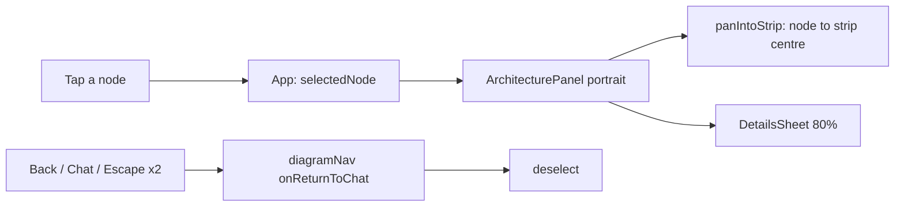
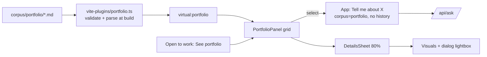

# Portfolio frontend and the shared details sheet: implementation plan

> **For agentic workers:** REQUIRED SUB-SKILL: Use superpowers:subagent-driven-development (recommended) or superpowers:executing-plans to implement this plan task-by-task. Steps use checkbox (`- [ ]`) syntax for tracking.

**Goal:** Ship spec §5, §7 and §8 (PR 3): a third chat topic, **Portfolio**, with a card grid of the projects in `corpus/portfolio/*.md`, a shared pull-up details sheet (portfolio and phone diagram), a visuals gallery with a modal lightbox, a three-way phone view toggle, and the footer popover's "See portfolio →" link (§5.7).

**Architecture:** A small Vite plugin reads `corpus/portfolio/*.md` at build time, validates the frontmatter with a pure TypeScript validator, parses the body into a tiny Markdown subset (paragraphs, lists, links), and exposes a typed `Project[]` as the virtual module `virtual:portfolio` (no runtime fetch, the build fails on an invalid file). The UI reuses the diagram's patterns: one selection per panel, a locked bar, Escape that deselects first, and a history-entry-per-view navigation generalised from `lib/diagramNav.ts` to three views. One `DetailsSheet` component covers 80% of its region for the portfolio (desktop and phones) and the phone diagram; the desktop diagram inspector is unchanged.

**Tech Stack:** Vite 8, React 19, TypeScript 6, Tailwind v4, React Flow 12, `yaml` (new **devDependency**, build time only), Node's built-in test runner (`npm test` = `node --test`; this repo has no vitest and no DOM test environment, so tests cover the pure `lib/` helpers and the build loader, and component behaviour is checked in headless Chrome).

**Spec:** `docs/superpowers/specs/2026-10-02-portfolio-design.md` (§5, §7, §8; §5.7 for the footer link). Read it alongside this plan. Also required before any `frontend/` change: `project/MOBILE_DESIGN.md`.

**Assumed already merged (spec §3):** PR 1 (`frontend/src/components/OpenToWork.tsx`, `frontend/src/lib/contact.ts`, rendered by `StatsBar`) and PR 2 (backend accepts corpus `portfolio`; `corpus/portfolio/_example.md` with `draft: true` exists; `services/glassbox/warm.py` `CORPORA` includes `portfolio`). PR 2 must be **deployed** before the Portfolio part (Tasks 4 to 13) merges, because the topic must answer.

## Recommended delivery: two PRs

The plan is one plan, but it should ship as **two PRs**, split after Task 3:

- **PR 3a, "Phone diagram details in a pull-up sheet" (Tasks 1 to 3).** Extracts `DetailsSheet` and uses it for the phone diagram. It changes existing visitor behaviour on its own (the 40%-capped panel becomes an 80% sheet, the diagram pans the selected node into the strip, Back closes the sheet), does not depend on PR 2, and can be reviewed and judged by the owner on the phone preview without any portfolio content. Its own status report and MOBILE_DESIGN update.
- **PR 3b, "Portfolio topic" (Tasks 4 to 13).** Stacked on 3a (it imports `DetailsSheet`). Depends on PR 2 being deployed.

Task 3 updates spec §3 to record the split. If the coordinator prefers one PR, run all 13 tasks on one branch and fold Task 3's report into Task 12's.

## Global Constraints

- **Hard rules (restate in every dispatch):** never read, open or copy any `terraform.tfstate` or plan file; no `terraform apply`; no live AWS or Kubernetes writes; never `git stash`; no pushes or merges without the coordinator.
- **No live API calls from automated checks.** The phone preview proxies `/api` to the live, rate-limited site. Every automated check runs with `GLASSBOX_API_PROXY=http://127.0.0.1:9` (a dead port) and fakes `/api/*` in the page (Task 13 has the script). Manual owner checks may use the live API.
- **Topics:** `Corpus` is `'basel' | 'system' | 'portfolio'`, sent to the API as `about_me`, `about_system`, `portfolio`. Labels "About Basel", "About This System", "Portfolio"; chip short labels "Basel", "System", "Portfolio".
- **Portfolio suggested questions (exact):** "What can Basel build for me?", "Which project is most like a SaaS app?", "Is Basel available for freelance work?"
- **Selection question (exact):** `Tell me about <title>`, sent on the Portfolio topic **without history**, like component inspect.
- **Copy (exact):** locked bar "Select a project for details"; phone status text "Select a project" (Portfolio view) and "Select a component" (Diagram view, unchanged); empty state "Projects are on their way. Ask the chat in the meantime."; header "Portfolio · N projects" ("1 project" singular).
- **Sheet:** covers about 80% of its region (`top-[20%]`), the strip above subtly dimmed; 260ms slide-up, none with `prefers-reduced-motion`; no dimming scrim with `prefers-reduced-transparency`. Closes on the 44px chevron, Escape, (phones) Back, or a tap on empty space in the strip; closing deselects and focuses the locked bar (Back focuses the view toggle instead, because the locked bar is gone).
- **Sheet typography:** title `clamp(18px, …, 24px)`; body 15px on phones rising to 16px at 1280px; `line-height: 1.6`; `max-width: 70ch`; uppercase section labels.
- **Escape order:** lightbox first, then deselect (component or project), then (phones) back to Chat. Footer tooltips still take an Escape first when showing (`lib/escapeKey.ts`).
- **Grid:** desktop pane 2 columns, 3 from 1280px; phones 2 columns from 390px, single-column rows with a small square thumbnail below 390px. One-liner clamped to 3 lines; stack tags: first three, then "+N".
- **Phone toggle:** **Chat | Diagram | Portfolio**, always shown; text labels from 360px (about 222px wide); icon-only below 360px, each segment 44px wide with the full name as accessible name and tooltip.
- **Chips:** below 440px the "Asking about" label is screen-reader-only; below 360px chip padding tightens; below 320px the chip dots hide. Tailwind v4 `max-[Npx]` means `width < N`, so use exactly `max-[440px]`, `max-[360px]`, `max-[320px]` (the mock's `max-[439px]`/`max-[359px]`/`max-[319px]` were off by one).
- **Visuals:** files in `frontend/public/portfolio/<slug>/`, served same-origin. The CSP (`img-src 'self'`, `font-src 'self'` in `services/glassbox/api/security_headers.py`) is **not** changed. Gallery height `clamp(9rem, 42vw, 15rem)`, width from the declared aspect (`16/10`, `4/3`, `9/19.5`); `loading="lazy"` with explicit `width`/`height`.
- **Lightbox:** a modal dialog with a real focus trap (native `<dialog>` + `showModal()`), ✕, prev/next, arrow keys, closes on ✕, backdrop tap or Escape (Escape closes only the lightbox); focus returns to the thumbnail.
- **Markdown body:** paragraphs, lists and links only. Never raw HTML (React escapes text; there is no `dangerouslySetInnerHTML` anywhere). Links `https:` only, opened with `target="_blank" rel="noopener noreferrer"`.
- **Desktop:** the right pane follows the topic (Portfolio shows the portfolio panel, the other topics the diagram); no tabs; only one `ArchitecturePanel` is ever mounted. The desktop diagram's details inspector is unchanged.
- **Mock URL switches:** none of `?topic`, `?sel`, `?node`, `?lightbox`, `?demo`, `?view` exist in production **or** in dev. Screenshots are produced by driving the UI in headless Chrome. The only URL switch stays the existing dev-only `?phone` (rotate screen).
- **Dependencies:** no new runtime dependency. `yaml` is a devDependency used only by the build plugin.
- **MOBILE_DESIGN rules apply:** `h-dvh`, `min-w-0` on text-holding flex/grid children, `break-words` on user/owner text, nothing under 11px, tap targets at least 44×44px on phones, no horizontal scroll at 280, 320, 360, 375, 393, 768, 1024, 1280; the header stays one row.
- **Content rules:** no RAG evaluation runs and no golden-set portfolio cases (spec §6.3). Don't add real portfolio content; the owner does.
- **Commits:** one commit per task, conventional prefix, ending with `Co-Authored-By: Claude Opus 5.5 <noreply@anthropic.com>`.

## Review Focus

The five conditions the spec implies but no feature test would naturally exercise, most likely to bite first. Each has a test added in the task that owns the code.

1. **The release build does not see `corpus/portfolio/`.** The Dockerfile's `frontend-build` stage copies only `frontend/`, so a naive loader would quietly ship an empty portfolio to production while CI (which checks out the whole repo) passes. Expected: the build fails loudly when the directory is missing, and the Dockerfile copies it. Pinned in Task 5 (`loadPortfolio throws when the corpus directory is missing`, plus the Dockerfile step).
2. **A reload while in the Portfolio view, then Back or the Chat segment.** The mock's nav always assumed Diagram was the view left, so focus would land on the Diagram toggle. Expected: focus returns to the Portfolio segment. Pinned in Task 9 (`a reload inside Portfolio returns focus to the Portfolio toggle`).
3. **Retry after a failed "Tell me about X".** Retry decides whether to send history by matching the question against the component questions only; a project question would be retried with history, which changes the answer and loses cache eligibility. Expected: it is retried without history. Pinned in Task 8 (`selectionQuestions` test).
4. **Leaving the view (Back, Chat segment, rotate, topic change on desktop) while the lightbox is open.** If the dialog unmounts without `close()`, the page can stay inert or lose focus. Expected: the dialog closes with its panel, the page stays usable, focus lands on the view toggle. Pinned in Task 10 (unmount-closes-dialog step) and Task 13's headless check.
5. **Owner-authored content that is hostile to the layout or to safety:** a 40-character unbroken title or stack tag, a project with one visual or none, raw `<script>` in the body, a `javascript:` or `http:` link. Expected: no horizontal scroll at 280px, gallery controls hidden for a single visual, the HTML shown as text, unsafe links rejected at build time. Pinned in Task 4 (validator and Markdown tests), Task 10 (`galleryControlsShown`), and Task 13 (long-title fixture overflow check).

---

## File Structure

**PR 3a**

| File | Responsibility |
|---|---|
| Create `frontend/src/lib/detailsSheet.ts` (+ `.test.ts`) | Sheet geometry: cover fraction, the strip's centre, panning a node into the strip, scrolling a card into the strip. Pure. |
| Create `frontend/src/components/DetailsSheet.tsx` | `DetailsSheet` (region, handle row, chevron, scroll area, scrim), `LockedBar`, `SheetSection`, `ContinueInChat`, `Chevron`, typography constants. |
| Modify `frontend/src/index.css` | `.sheet-up`, `.sheet-scrim` animations; reduced-motion and reduced-transparency rules. |
| Modify `frontend/src/components/ArchitecturePanel.tsx` | Portrait details become a `DetailsSheet`; selected node panned into the strip. Desktop branch untouched. |
| Modify `frontend/src/lib/diagramNav.ts` (+ test) | `onReturnToChat` hook (Back and every other way to Chat closes the sheet). |
| Modify `frontend/src/App.tsx` | Wire `onReturnToChat`. |

**PR 3b**

| File | Responsibility |
|---|---|
| Create `frontend/src/lib/portfolio.ts` (+ test) | `Project` types, frontmatter validation, Markdown subset parser, sorting. Pure, shared by the build plugin and the app. |
| Create `frontend/vite-plugins/portfolio.ts` (+ test) | Node-only loader (reads files, parses YAML, checks images exist, throws on any error) and the `virtual:portfolio` Vite plugin with dev reload. |
| Create `frontend/src/virtual-portfolio.d.ts` | Types for `virtual:portfolio`. |
| Modify `frontend/vite.config.ts`, `tsconfig.node.json`, `package.json`, `package-lock.json` | Register the plugin, type-check and test it, add `yaml`. |
| Modify `Dockerfile` | Copy `corpus/portfolio/` into the frontend build stage. |
| Create `frontend/src/lib/topics.ts` (+ test) | `Corpus`, `CORPORA`, `TOPICS`, `apiCorpus`, `topicLabel`, `idkCorpus`. |
| Modify `frontend/src/lib/conversation.ts` (+ test) | `ApiCorpus` gains `portfolio`. |
| Modify `frontend/src/suggested-questions.json`, `services/tests/test_warm.py`, `services/tests/test_eval_golden.py` | Portfolio suggestions; backend tests accept them (no golden cases yet). |
| Modify `frontend/src/components/Chat.tsx`, `TopicChips.tsx`, `StatsBar.tsx` | Three topics; chips fit at 280px; footer link pass-through. |
| Create `frontend/src/lib/portfolioView.ts` (+ test) | Copy constants, heading, stack preview, placeholder colours, initials, `questionForProject`. |
| Create `frontend/src/lib/selection.ts` (+ test) | The answer shown for a selected component or project; the set of history-free selection questions. |
| Create `frontend/src/components/PortfolioPanel.tsx`, `ProjectCard.tsx`, `ProjectDetails.tsx`, `MarkdownBody.tsx` | Panel (grid, empty state, locked bar, sheet), card, sheet contents, body renderer. |
| Create `frontend/src/lib/gallery.ts` (+ test), `frontend/src/components/PortfolioVisuals.tsx` | Gallery index maths and lightbox keys; the gallery and the `<dialog>` lightbox. |
| Modify `frontend/src/lib/diagramNav.ts` (+ test), `PipelineStrip.tsx`, `App.tsx` | Three views, three-way toggle, pane follows topic, project selection. |
| Modify `frontend/src/components/OpenToWork.tsx` | "See portfolio →". |
| Modify `frontend/src/lib/escapeKey.ts` | The Escape-order comment. |
| Docs | `project/MOBILE_DESIGN.md`, `docs/DESIGN.md` §4, the spec, `project/SNAPSHOT.md`, `project/BACKLOG.md`, `project/status/*`. |

---

## PR 3a: the shared sheet and the phone diagram

### Task 1: `DetailsSheet` component and sheet geometry

**Files:**
- Create: `frontend/src/lib/detailsSheet.ts`
- Test: `frontend/src/lib/detailsSheet.test.ts`
- Create: `frontend/src/components/DetailsSheet.tsx`
- Modify: `frontend/src/index.css` (append at the end)

**Interfaces:**
- Consumes: nothing new.
- Produces:
  - `SHEET_COVER = 0.8`, `HEADER_FADE_PX = 16`, `type Viewport = { x: number; y: number; zoom: number }`
  - `stripCenterY(regionHeight: number): number`
  - `panIntoStrip(fit: Viewport, nodeCenterY: number, regionHeight: number): Viewport`
  - `scrollTopForItem(scrollTop: number, listTop: number, itemTop: number, gap?: number): number`
  - Components: `DetailsSheet({ label, closeLabel, onClose, sheetRef?, scrollRef?, children })`, `LockedBar({ hint, barRef, covered })`, `SheetSection({ heading, children })`, `ContinueInChat({ onClick })`, `Chevron({ direction })`; constants `SHEET_BODY`, `SHEET_TITLE`.

- [ ] **Step 1: Write the failing test**

`frontend/src/lib/detailsSheet.test.ts`:

```ts
import assert from 'node:assert/strict'
import { test } from 'node:test'
import { HEADER_FADE_PX, panIntoStrip, SHEET_COVER, scrollTopForItem, stripCenterY } from './detailsSheet.ts'

test('the sheet covers 80% of its region', () => {
  assert.equal(SHEET_COVER, 0.8)
})

test('the strip centre is the middle of the uncovered 20%, moved down by half the header fade', () => {
  assert.equal(HEADER_FADE_PX, 16)
  assert.equal(stripCenterY(500), 58) // 500 * 0.2 / 2 + 8
  assert.equal(stripCenterY(0), 8)
})

test('panning keeps the fitted zoom and x and puts the node centre in the strip', () => {
  const fit = { x: 10, y: 40, zoom: 0.75 }
  assert.deepEqual(panIntoStrip(fit, 200, 500), { x: 10, y: 58 - 150, zoom: 0.75 })
})

test('a card scrolls to 12px below the top of its list, never above zero', () => {
  assert.equal(scrollTopForItem(100, 50, 400), 438)
  assert.equal(scrollTopForItem(0, 50, 55), 0)
  assert.equal(scrollTopForItem(20, 0, 30, 0), 50)
})
```

- [ ] **Step 2: Run test to verify it fails**

Run: `cd frontend && node --test src/lib/detailsSheet.test.ts`
Expected: FAIL, `Cannot find module '.../detailsSheet.ts'`.

- [ ] **Step 3: Write the geometry helpers**

`frontend/src/lib/detailsSheet.ts`:

```ts
// The shared pull-up details sheet (spec 2026-10-02 §5.5): it covers the
// bottom 80% of its region, so a strip of the grid or diagram stays visible
// above it. These helpers place the selected item in that strip. The sheet's
// `top-[20%]` class in components/DetailsSheet.tsx must match SHEET_COVER.

export const SHEET_COVER = 0.8

/** The phone header's fade band (`.header-fade`) overlaps the region's top 16px. */
export const HEADER_FADE_PX = 16

export type Viewport = { x: number; y: number; zoom: number }

/** Vertical centre, in px from the region's top, of the strip the sheet leaves uncovered. */
export function stripCenterY(regionHeight: number): number {
  return (regionHeight * (1 - SHEET_COVER)) / 2 + HEADER_FADE_PX / 2
}

/**
 * The fitted diagram viewport, panned vertically at the same zoom and x so a
 * node whose centre is at `nodeCenterY` (flow coordinates) sits in the middle
 * of the strip. Deselecting returns to the plain fit.
 */
export function panIntoStrip(fit: Viewport, nodeCenterY: number, regionHeight: number): Viewport {
  return { x: fit.x, y: stripCenterY(regionHeight) - nodeCenterY * fit.zoom, zoom: fit.zoom }
}

/** The list scrollTop that puts an item `gap` px below the list's top edge (never negative). */
export function scrollTopForItem(scrollTop: number, listTop: number, itemTop: number, gap = 12): number {
  return Math.max(0, scrollTop + itemTop - listTop - gap)
}
```

- [ ] **Step 4: Run test to verify it passes**

Run: `cd frontend && node --test src/lib/detailsSheet.test.ts`
Expected: PASS (4 tests).

- [ ] **Step 5: Add the sheet animations**

Append to `frontend/src/index.css`:

```css
/*
 * The shared details sheet (components/DetailsSheet.tsx, spec 2026-10-02
 * §5.5) slides up over its region in 260ms, and the strip left above it is
 * dimmed. No slide with reduced motion; no dimming with reduced transparency
 * (the sheet then ends in a hard edge, like the phone header).
 */
@keyframes sheet-up {
  from { transform: translateY(100%); }
  to { transform: translateY(0); }
}

.sheet-up {
  animation: sheet-up 260ms cubic-bezier(0.2, 0.8, 0.2, 1);
}

@keyframes sheet-scrim {
  from { opacity: 0; }
}

.sheet-scrim {
  animation: sheet-scrim 260ms ease-out;
}

@media (prefers-reduced-motion: reduce) {
  .sheet-up,
  .sheet-scrim {
    animation: none;
  }
}

@media (prefers-reduced-transparency: reduce) {
  .sheet-scrim {
    display: none;
  }
}
```

- [ ] **Step 6: Write the component**

`frontend/src/components/DetailsSheet.tsx`:

```tsx
// The pull-up details sheet shared by the portfolio panel (desktop and
// phones) and the phone diagram (spec 2026-10-02 §5.5). It covers the bottom
// 80% of its region (lib/detailsSheet.ts SHEET_COVER); the region must be
// `relative overflow-hidden`. The desktop diagram inspector does not use it.
import { useId, type ReactNode, type Ref } from 'react'

/** Sheet reading text: 15px on phones rising to 16px at 1280px, 1.6 line-height, at most 70 characters a line. */
export const SHEET_BODY = 'max-w-[70ch] text-[clamp(0.9375rem,0.9116rem+0.1105vw,1rem)] leading-[1.6]'
/** Sheet title: 18px on phones rising to 24px. */
export const SHEET_TITLE = 'min-w-0 break-words text-[clamp(1.125rem,0.95rem+0.75vw,1.5rem)] font-semibold leading-tight tracking-tight text-primary'

export function Chevron({ direction }: { direction: 'up' | 'down' }) {
  return (
    <svg viewBox="0 0 16 16" width="14" height="14" fill="none" stroke="currentColor" strokeWidth="1.5" strokeLinecap="round" strokeLinejoin="round" aria-hidden="true">
      <path d={direction === 'down' ? 'M4 6l4 4 4-4' : 'M4 10l4-4 4 4'} />
    </svg>
  )
}

/** A labelled section inside the sheet (uppercase label). */
export function SheetSection({ heading, children }: { heading: string; children: ReactNode }) {
  const id = useId()
  return (
    <section aria-labelledby={id} className="mt-7">
      <h3 id={id} className="mb-3 text-[11px] font-medium uppercase tracking-[0.12em] text-muted">{heading}</h3>
      {children}
    </section>
  )
}

export function ContinueInChat({ onClick }: { onClick: () => void }) {
  return (
    <button
      type="button"
      onClick={onClick}
      className="-ml-2 mt-2 inline-flex min-h-11 items-center px-2 text-[13px] text-primary underline underline-offset-4 transition-colors hover:text-cyan"
    >
      Continue in chat →
    </button>
  )
}

/**
 * The 44px bar shown while nothing is selected. aria-disabled rather than
 * disabled, so it stays focusable and screen-reader users still hear the
 * hint; focus moves here when a sheet closes. While a sheet covers it, it is
 * inert (it keeps its place, so opening the sheet never resizes the region).
 */
export function LockedBar({ hint, barRef, covered }: { hint: string; barRef: Ref<HTMLButtonElement>; covered: boolean }) {
  return (
    <button
      ref={barRef}
      type="button"
      aria-disabled="true"
      inert={covered}
      className="flex min-h-11 w-full shrink-0 cursor-not-allowed items-center justify-between gap-3 border-t border-hairline px-4 text-left text-xs text-muted md:px-7"
    >
      <span className="min-w-0 truncate">{hint}</span>
      <span className="flex shrink-0 items-center opacity-40">
        <Chevron direction="up" />
      </span>
    </button>
  )
}

type DetailsSheetProps = {
  /** Accessible name of the region, e.g. "Cache details". */
  label: string
  /** Accessible name of the chevron, e.g. "Close Cache details and deselect it". */
  closeLabel: string
  onClose: () => void
  sheetRef?: Ref<HTMLDivElement>
  scrollRef?: Ref<HTMLDivElement>
  children: ReactNode
}

/**
 * Not keyed by the selected item: a tap on another card or node in the strip
 * switches the content straight away, without sliding the sheet in again.
 */
export function DetailsSheet({ label, closeLabel, onClose, sheetRef, scrollRef, children }: DetailsSheetProps) {
  return (
    <>
      {/* Dims the strip above the sheet so it reads as behind. Pass-through:
          a tap there reaches the grid or diagram (another item switches the
          sheet to it; empty space closes it). */}
      <div aria-hidden="true" className="sheet-scrim pointer-events-none absolute inset-0 z-[9] bg-canvas/45" />
      <div
        ref={sheetRef}
        role="region"
        aria-label={label}
        className="sheet-up absolute inset-x-0 bottom-0 top-[20%] z-10 flex flex-col rounded-t-[10px] border-t border-hairline bg-panel shadow-[0_-12px_32px_rgba(0,0,0,0.55)]"
      >
        <div className="relative flex min-h-11 shrink-0 items-center justify-center">
          <span aria-hidden="true" className="h-1 w-10 rounded-full bg-hairline" />
          <button
            type="button"
            aria-label={closeLabel}
            onClick={onClose}
            className="absolute right-1 top-0 flex size-11 items-center justify-center rounded-[3px] text-muted transition-colors hover:text-primary focus-visible:outline-1 focus-visible:outline-cyan md:right-3"
          >
            <Chevron direction="down" />
          </button>
        </div>
        <div ref={scrollRef} className="min-h-0 flex-1 overflow-y-auto overflow-x-hidden px-5 pb-8 md:px-8">
          {children}
        </div>
      </div>
    </>
  )
}
```

- [ ] **Step 7: Type-check, lint and test**

Run: `cd frontend && npx tsc -b && npm run lint && npm test`
Expected: all pass. (`DetailsSheet.tsx` is unused until Task 2; oxlint does not flag unused exports.)

- [ ] **Step 8: Commit**

```bash
git add frontend/src/lib/detailsSheet.ts frontend/src/lib/detailsSheet.test.ts frontend/src/components/DetailsSheet.tsx frontend/src/index.css
git commit -m "feat(frontend): shared pull-up DetailsSheet and sheet geometry

Co-Authored-By: Claude Opus 5.5 <noreply@anthropic.com>"
```

---

### Task 2: Phone diagram details in the sheet

**Files:**
- Modify: `frontend/src/components/ArchitecturePanel.tsx`
- Modify: `frontend/src/lib/diagramNav.ts`
- Test: `frontend/src/lib/diagramNav.test.ts`
- Modify: `frontend/src/App.tsx` (the `createDiagramNav` call)

**Interfaces:**
- Consumes: Task 1's `DetailsSheet`, `LockedBar`, `SheetSection`, `ContinueInChat`, `SHEET_BODY`, `SHEET_TITLE`, `panIntoStrip`.
- Produces: `DiagramNavDeps.onReturnToChat?: () => void`, called once on every route back to Chat (Back/popstate, Escape, the Chat segment, "Continue in chat", or a Chat request with no history entry). Task 9 keeps this contract.

- [ ] **Step 1: Write the failing nav test**

In `frontend/src/lib/diagramNav.test.ts`, give `setup()` a counter and pass the hook. Replace the `createDiagramNav({...})` call and the returned object in `setup()` with:

```ts
  let returns = 0
  const nav = createDiagramNav({
    history,
    setView: (next) => { view = next },
    afterRender: (cb) => frames.push(cb),
    focusDiagramToggle: () => { focused = 'diagram-toggle' },
    onReturnToChat: () => { returns++ },
  })
  return {
    nav, log,
    get view() { return view },
    get focused() { return focused },
    get returns() { return returns },
    focus(id: string) { focused = id },
    flush() { frames.splice(0).forEach((cb) => cb()) },
    // What the browser does for history.back(): move and fire popstate.
    back() { index--; nav.handlePopState(stack[index]) },
  }
```

Append:

```ts
test('every way back to chat closes the details sheet exactly once', () => {
  for (const leave of ['chat-segment', 'escape', 'back'] as const) {
    const t = setup()
    openDiagram(t)
    assert.equal(t.returns, 0)
    if (leave === 'chat-segment') t.nav.showView('chat')
    if (leave === 'escape') t.nav.handleKeyDown({ key: 'Escape', defaultPrevented: false })
    t.back()
    assert.equal(t.view, 'chat')
    assert.equal(t.returns, 1, leave)
  }
  const reloaded = setup()
  reloaded.nav.showView('chat')
  assert.equal(reloaded.returns, 1)
})
```

(For `'back'` the loop only calls `t.back()`; for the other two, `showView('chat')` calls `history.back()`, which the fake does not move, so `t.back()` plays the browser's popstate.)

- [ ] **Step 2: Run test to verify it fails**

Run: `cd frontend && node --test src/lib/diagramNav.test.ts`
Expected: FAIL in the new test, `0 !== 1`.

- [ ] **Step 3: Add the hook**

In `frontend/src/lib/diagramNav.ts`, add to `DiagramNavDeps` (after `focusDiagramToggle`):

```ts
  /**
   * Called once whenever the view returns to Chat, by any route. Leaving the
   * Diagram view closes its details sheet (spec 2026-10-02 §5.5: Back closes
   * the sheet); no extra history entry is used for the sheet.
   */
  onReturnToChat?: () => void
```

Inside `createDiagramNav`, add below `restoreFocus`:

```ts
  function showChat() {
    deps.setView('chat')
    deps.onReturnToChat?.()
  }
```

Replace `deps.setView('chat')` in `showView`'s `else` branch with `showChat()`, and replace `handlePopState` with:

```ts
  function handlePopState(state: unknown) {
    const view = viewFromHistoryState(state)
    if (view === 'chat') {
      restoreFocus()
      showChat()
      return
    }
    deps.setView(view)
  }
```

- [ ] **Step 4: Run the nav tests**

Run: `cd frontend && node --test src/lib/diagramNav.test.ts`
Expected: PASS (all, including the existing nine).

- [ ] **Step 5: Wire the hook in App**

In `frontend/src/App.tsx`, in the `createDiagramNav({ ... })` call, add after `focusDiagramToggle`:

```ts
    // Back, Escape, Chat or "Continue in chat" close the phone details sheet.
    onReturnToChat: () => { setSelectedNode(null); pendingComponentRef.current = null },
```

- [ ] **Step 6: Replace the portrait panel with the sheet**

In `frontend/src/components/ArchitecturePanel.tsx`:

1. Imports: change the React import to `import { useCallback, useEffect, useMemo, useRef, useState, type CSSProperties } from 'react'` (no `useId`), and add:

```ts
import { panIntoStrip } from '../lib/detailsSheet'
import { ContinueInChat, DetailsSheet, LockedBar, SheetSection, SHEET_BODY, SHEET_TITLE } from './DetailsSheet'
```

2. Delete `PORTRAIT_DIAGRAM_MIN_PX`, `portraitPanelStyle` and the local `Chevron` function, and the `const detailsId = useId()` line.

3. Update the `portrait` prop's doc comment to: `Phone layout: the two-column portrait graph, and a pull-up details sheet (80% of the region) open only while a component is selected.`

4. Replace the refit effect (the `useEffect` that creates `createRefitter`) with this block, which adds the strip pan:

```ts
  // Phones: the sheet covers the bottom 80%, so the selected node is panned
  // into the strip left above it (same zoom as the fit); deselecting returns
  // to the plain fit. Desktop always uses the plain fit.
  const selectedRef = useRef(selectedNode)
  useEffect(() => { selectedRef.current = selectedNode })
  const viewportFor = useCallback((width: number, height: number) => {
    const fit = getViewportForBounds(portrait ? portraitBounds : desktopBounds, width, height, fitMinZoom ?? 0.5, 1, portrait ? PORTRAIT_FIT_PADDING : DESKTOP_FIT_PADDING)
    const node = portrait ? portraitNodes.find((candidate) => candidate.id === selectedRef.current) : undefined
    // The flow box starts at the region's top, so its y is the region's y.
    const region = flowBoxRef.current?.parentElement
    if (!node || !region) return fit
    return panIntoStrip(fit, node.position.y + nodeHeight / 2, region.clientHeight)
  }, [portrait, fitMinZoom])
  useEffect(() => {
    const box = flowBoxRef.current
    if (!portrait || !box || !flowRef.current) return
    const reduceMotion = window.matchMedia('(prefers-reduced-motion: reduce)').matches
    void flowRef.current.setViewport(viewportFor(box.clientWidth, box.clientHeight), { duration: reduceMotion ? 0 : 260 })
  }, [portrait, selectedNode, viewportFor])
  useEffect(() => {
    const box = flowBoxRef.current
    if (!box) return
    // Next frame, after React Flow has recorded the new size. Sets the
    // viewport directly: fitView is deferred by React Flow while node data
    // is changing (as it is when a tap starts a request), so it can miss.
    // Trace updates do not resize the box, so they never trigger a refit.
    const refitter = createRefitter(
      () => ({ width: box.clientWidth, height: box.clientHeight }),
      ({ width, height }) => {
        void flowRef.current?.setViewport(viewportFor(width, height))
      },
      { request: (callback) => requestAnimationFrame(callback), cancel: (handle) => cancelAnimationFrame(handle) },
    )
    const observer = new ResizeObserver(refitter.request)
    observer.observe(box)
    return () => {
      observer.disconnect()
      refitter.cancel()
    }
  }, [viewportFor])
```

Keep `flowRef` and `flowBoxRef` declared above this block (move their two `useRef` lines up if needed).

5. Below the existing `details` constant, add the sheet's chunk list:

```tsx
  const chunkList = retrievedChunks.length === 0 ? (
    <p className="text-[13px] text-muted">No query yet.</p>
  ) : (
    <ol className="space-y-3">
      {retrievedChunks.map((chunk) => (
        <li key={chunk.chunk_id} className="min-w-0 text-[13px] leading-[1.5]">
          <p className="break-words text-primary">
            {chunk.url ? (
              <a href={chunk.url} target="_blank" rel="noopener noreferrer" className="underline underline-offset-4 transition-colors hover:text-cyan">{chunk.title}</a>
            ) : chunk.title}
          </p>
          <p className="break-words text-muted">{chunk.source_path} · {chunk.score.toFixed(2)}</p>
        </li>
      ))}
    </ol>
  )
```

6. Section and `onInit`: the `<section>` becomes

```tsx
    <section aria-label="Architecture" className={`flex min-h-0 min-w-0 flex-col bg-panel ${portrait ? 'relative overflow-hidden' : ''}`}>
```

and `onInit` becomes

```tsx
          onInit={(instance) => {
            flowRef.current = instance
            // A component already selected when the diagram mounts (say, after Portfolio -> Diagram).
            const box = flowBoxRef.current
            if (portrait && selectedRef.current && box) void instance.setViewport(viewportFor(box.clientWidth, box.clientHeight))
          }}
```

7. Replace everything from `) : detailsOpen ? (` to the end of the locked-bar branch (the closing `)}` before `</section>`) with:

```tsx
      ) : (
        <>
          <LockedBar hint={PORTRAIT_DETAILS_HINT} barRef={lockedBarRef} covered={detailsOpen} />
          {selectedComponent && (
            <DetailsSheet
              label={`${selectedComponent.data.label} details`}
              closeLabel={`Close ${selectedComponent.data.label} details and deselect it`}
              onClose={() => deselect(true)}
              sheetRef={detailsRef}
              scrollRef={inspectorRef}
            >
              <header>
                <h2 className={SHEET_TITLE}>{selectedComponent.data.label}</h2>
                <p className={`mt-2 ${SHEET_BODY} text-cyan`}>{selectedComponent.data.implementation}</p>
              </header>
              <SheetSection heading="What it does">
                <p className={`${SHEET_BODY} break-words text-primary/90`}>{selectedComponent.data.description}</p>
              </SheetSection>
              <SheetSection heading="About This System answer">
                <div className="max-w-[70ch] rounded-[3px] border border-hairline bg-canvas px-4 py-3">
                  <p aria-live="polite" className={`whitespace-pre-wrap break-words ${SHEET_BODY} text-primary`}>{answerText || 'Working…'}</p>
                </div>
                {onContinueInChat && answerText && <ContinueInChat onClick={onContinueInChat} />}
              </SheetSection>
              <SheetSection heading="Retrieved chunks">{chunkList}</SheetSection>
            </DetailsSheet>
          )}
        </>
      )}
```

The existing `deselect`, `focusLockedBarRef` effect, Escape listener, `onPaneClick` and the `inspectorRef` scroll reset keep working unchanged (`detailsRef` is now the sheet, `inspectorRef` its scroll area). The desktop branch (`!portrait`) is untouched.

- [ ] **Step 7: Type-check, lint, test, build**

Run: `cd frontend && npx tsc -b && npm run lint && npm test && npm run build`
Expected: all pass.

- [ ] **Step 8: Check it on the phone preview (no live API)**

Run (background): `cd frontend && GLASSBOX_API_PROXY=http://127.0.0.1:9 npm run phone`. Open `http://localhost:5230/phone-preview.html`. In the 375×667 frame: Diagram, tap Cache. Expected: the sheet slides up over the bottom 80%, Cache sits in the dimmed strip (about 88px tall), the answer section says the request failed or "Working…" (the API is unreachable by design), the ask box and Chat | Diagram switch stay usable below the sheet. Tap Worker in the strip: the sheet switches without sliding again and the diagram pans to Worker. Tap empty space in the strip: the sheet closes and the diagram returns to its fit. Select again and use the browser Back: Chat view, focus on the Diagram toggle, and reopening Diagram shows nothing selected. Stop the server.

- [ ] **Step 9: Commit**

```bash
git add frontend/src/components/ArchitecturePanel.tsx frontend/src/lib/diagramNav.ts frontend/src/lib/diagramNav.test.ts frontend/src/App.tsx
git commit -m "feat(frontend): phone diagram details in the pull-up sheet

The 40%-capped panel becomes the shared 80% sheet; the selected node is
panned into the strip above it; leaving the Diagram view closes it.

Co-Authored-By: Claude Opus 5.5 <noreply@anthropic.com>"
```

---

### Task 3: PR 3a docs, status report and verification

**Files:**
- Modify: `project/MOBILE_DESIGN.md`, `docs/DESIGN.md` (§4.4), `docs/superpowers/specs/2026-10-02-portfolio-design.md` (§3, §5.5), `project/SNAPSHOT.md`, `project/BACKLOG.md`, `project/status/README.md`
- Create: `project/status/2026-10-02-phone-details-sheet.md`

**Interfaces:**
- Consumes: Tasks 1 and 2.
- Produces: nothing for code; the docs Task 12 builds on.

- [ ] **Step 1: MOBILE_DESIGN.md, layout bullets**

Rewrite the "Diagram details bar is locked…" and "Closing the details deselects…" bullets so they describe the sheet; keep everything about the locked bar, deselect-by-empty-space and streaming. Replace their panel sentences with:

```markdown
- **Phone diagram details are a pull-up sheet (owner, 2026-10-02).** Selecting a component slides the shared `DetailsSheet` (`components/DetailsSheet.tsx`) up over the bottom 80% of the diagram region in 260ms (none with reduced motion), replacing the panel capped at 40%. The strip left above it is dimmed (`bg-canvas/45`, none with reduced transparency) and the diagram pans, at the same zoom, so the selected node sits in the middle of the strip (`panIntoStrip` in `lib/detailsSheet.ts`); deselecting returns to the plain fit. Measured strips: about 68px at 320×568, 88px at 375×667, 125px at 393×852. The sheet stops above the pipeline strip, so the ask box and the Chat | Diagram switch stay usable. Sections: the component name and what runs it, What it does, About This System answer with "Continue in chat →", Retrieved chunks; 15px body text (Typography). A tap on another node in the strip switches the sheet straight to it (and asks about it); a tap on empty diagram space, the chevron, or Escape closes it and focus moves to the locked bar. Back (and Escape with nothing selected, the Chat segment, "Continue in chat") returns to Chat and also closes the sheet, with focus on the Diagram toggle; no extra history entry is used for the sheet. Desktop's inspector is unchanged.
```

- [ ] **Step 2: MOBILE_DESIGN.md, typography and owner decisions**

Add a row to the Typography table, after the "Chat messages" row:

```markdown
| Details sheet body (portfolio and phone diagram sheets) | `text-[clamp(0.9375rem,0.9116rem+0.1105vw,1rem)] leading-[1.6] max-w-[70ch]`: 15px on phones rising to 16px at 1280px | Deliberately larger than the 13px chat reading size (owner, 2026-10-02, spec `docs/superpowers/specs/2026-10-02-portfolio-design.md` §2): sheets are read, not skimmed. Titles `clamp(18px, …, 24px)`, uppercase 11px section labels. `SHEET_BODY`/`SHEET_TITLE` in `components/DetailsSheet.tsx`. |
```

Add to "Owner decisions (index)":

```markdown
- **Phone diagram details in a pull-up sheet (2026-10-02):** the same sheet as the portfolio, about 80% of the region, replacing the panel capped at 40%; the selected node pans into the strip above it; Back closes it with the view. Desktop diagram details unchanged. Spec `docs/superpowers/specs/2026-10-02-portfolio-design.md` §2, §5.5.
- **Text size in sheets (2026-10-02):** 15px body on phones, up to 16px on desktop, line-height 1.6, max 70ch; deliberately larger than the 13px chat text.
```

Update Verification step 3's diagram clause: "a component tap opens the details sheet over 80% of the region with the node in the strip above it; its chevron, a tap on empty space in the strip, and Escape deselect".

- [ ] **Step 3: DESIGN.md §4.4 and the spec**

In `docs/DESIGN.md` §4.4, replace "On mobile, selecting a node keeps the diagram view and shows the answer in the details panel below it; "Continue in chat →" (or Back) reveals the full chat history." with "On mobile, selecting a node keeps the diagram view and slides up a details sheet over the bottom 80% of the diagram (the node is panned into the strip above it) with the answer and the retrieved chunks; "Continue in chat →" or Back returns to the chat and closes the sheet." Also replace "on phones the details panel closes back to the locked bar" with "on phones the details sheet closes back to the locked bar".

In the spec, §3 item 3, append: "Delivered as two PRs: **3a** the shared sheet for the phone diagram (§5.5, no dependency on PR 2), then **3b** the portfolio (needs PR 2 deployed). Plan: `docs/superpowers/plans/2026-10-02-portfolio-frontend.md`." In §5.5 "Closing", append: "On phones, Back returns to Chat and closes the sheet with the view (no history entry for the sheet itself); focus then goes to the view toggle."

- [ ] **Step 4: Status report**

Create `project/status/2026-10-02-phone-details-sheet.md` in the README's shape (TL;DR · What changed for a visitor · How it works · Key design decisions & trade-offs · What review caught · Operational notes & risks · How to see it / verify it · Open items). The "How it works" diagram:



Record: the decision that Back closes the sheet by leaving the view (no sheet history entry), the strip measurements from Step 6, and "What review caught" filled after review. Add it to the top of the `project/status/README.md` index with status "In review".

- [ ] **Step 5: SNAPSHOT and BACKLOG**

`project/SNAPSHOT.md`, Mobile bullet: replace "capped details that are open exactly while a component is selected" with "a pull-up details sheet (80% of the region, the selected node panned into the strip above it) open exactly while a component is selected". `project/BACKLOG.md` RESUME HERE: add "PR 3a (phone diagram details sheet) in review; PR 3b (portfolio) follows once PR 2 is deployed."

- [ ] **Step 6: Verify**

Run: `cd frontend && npm run lint && npx tsc -b && npm test && npm run build`. Expected: all pass.

Then run Task 13's headless script (Step 2 there) for the Diagram rows only, at 280, 320, 360, 375, 393 (portrait, touch) and 768, 1024, 1280 (desktop): sheet closed, sheet open on Cache, sheet open on Worker after a strip tap; Back with the sheet open; Escape twice (deselect, then Chat). Record strip heights (`sheet.getBoundingClientRect().top - region.getBoundingClientRect().top`) in the status report. Expected: no horizontal overflow anywhere, desktop 1280×800 screenshots identical to `main` (the desktop branch is untouched).

- [ ] **Step 7: Commit**

```bash
git add project/MOBILE_DESIGN.md docs/DESIGN.md docs/superpowers/specs/2026-10-02-portfolio-design.md project/SNAPSHOT.md project/BACKLOG.md project/status/README.md project/status/2026-10-02-phone-details-sheet.md
git commit -m "docs: phone diagram details sheet (PR 3a)

Co-Authored-By: Claude Opus 5.5 <noreply@anthropic.com>"
```

**Split point: open PR 3a here.** PR 3b branches from 3a's head.

---

## PR 3b: the portfolio

### Task 4: Portfolio schema, validation and the Markdown subset

**Files:**
- Create: `frontend/src/lib/portfolio.ts`
- Test: `frontend/src/lib/portfolio.test.ts`

**Interfaces:**
- Consumes: nothing.
- Produces (all exported from `frontend/src/lib/portfolio.ts`; it imports nothing, so Node, the Vite plugin and the app can all load it):
  - `type Kind = 'personal' | 'freelance'`, `type Aspect = '16/10' | '4/3' | '9/19.5'`, `ASPECTS: Record<Aspect, number>`, `VISUAL_HEIGHT = 600`, `VISUALS_URL_BASE = '/portfolio/'`
  - `type Inline = { kind: 'text'; text: string } | { kind: 'link'; text: string; href: string }`
  - `type Block = { kind: 'p'; inlines: Inline[] } | { kind: 'ul' | 'ol'; items: Inline[][] }`
  - `type Visual = { src: string; alt: string; caption?: string; aspect: Aspect; width: number; height: number }` (`src` is the served URL, `/portfolio/<path>`)
  - `type Project = { slug; title; oneLiner; kind; year: number; order: number | null; stack: string[]; links: { live?: string; code?: string }; visuals: Visual[]; body: Block[] }`
  - `isDraft(data: unknown): boolean`
  - `validateProject(slug: string, data: unknown, body: string, visualExists: (src: string) => boolean): { project: Project; errors: [] } | { project: null; errors: string[] }`
  - `parseBody(markdown: string, onError?: (message: string) => void): Block[]`
  - `sortProjects(projects: readonly Project[]): Project[]`

- [ ] **Step 1: Write the failing tests**

`frontend/src/lib/portfolio.test.ts`:

```ts
import assert from 'node:assert/strict'
import { test } from 'node:test'
import { isDraft, parseBody, sortProjects, validateProject, type Project } from './portfolio.ts'

const valid = {
  title: 'JobPilot',
  one_liner: 'Job-search copilot that tailors applications.',
  kind: 'personal',
  year: 2026,
  order: 1,
  stack: ['TypeScript', 'React', 'FastAPI', 'Postgres'],
  links: { live: 'https://example.com', code: 'https://github.com/example/jobpilot' },
  visuals: [
    { src: 'jobpilot/board.png', alt: 'Pipeline board', caption: 'From saved to offer.', aspect: '16/10' },
    { src: 'jobpilot/phone.png', alt: 'Phone view', aspect: '9/19.5' },
  ],
}
const exists = () => true

function errorsFor(data: unknown, body = '', visualExists = exists, slug = 'jobpilot') {
  const result = validateProject(slug, data, body, visualExists)
  return result.errors
}

test('a valid file becomes a Project with served image URLs and intrinsic sizes', () => {
  const result = validateProject('jobpilot', valid, 'The problem.\n\nWhat was built.', exists)
  assert.deepEqual(result.errors, [])
  const project = result.project!
  assert.equal(project.slug, 'jobpilot')
  assert.equal(project.oneLiner, valid.one_liner)
  assert.equal(project.order, 1)
  assert.deepEqual(project.links, valid.links)
  assert.deepEqual(project.visuals[0], { src: '/portfolio/jobpilot/board.png', alt: 'Pipeline board', caption: 'From saved to offer.', aspect: '16/10', width: 960, height: 600 })
  assert.equal(project.visuals[1].width, 277) // 600 * 9 / 19.5
  assert.equal(project.body.length, 2)
})

test('optional fields default: no order, links, visuals or body', () => {
  const { order: _order, links: _links, visuals: _visuals, ...minimal } = valid
  const project = validateProject('jobpilot', minimal, '', exists).project!
  assert.equal(project.order, null)
  assert.deepEqual(project.links, {})
  assert.deepEqual(project.visuals, [])
  assert.deepEqual(project.body, [])
})

test('every required field is reported when missing', () => {
  for (const field of ['title', 'one_liner', 'kind', 'year', 'stack'] as const) {
    const { [field]: _dropped, ...rest } = valid
    assert.ok(errorsFor(rest).some((error) => error.includes(`"${field}"`)), field)
  }
})

test('unknown kind, aspect or field, a missing alt, a missing image and a non-https link are rejected', () => {
  assert.ok(errorsFor({ ...valid, kind: 'agency' }).some((e) => e.includes('unknown kind')))
  assert.ok(errorsFor({ ...valid, visuals: [{ ...valid.visuals[0], aspect: '1/1' }] }).some((e) => e.includes('unknown aspect')))
  assert.ok(errorsFor({ ...valid, 'one-liner': 'typo' }).some((e) => e.includes('unknown field "one-liner"')))
  assert.ok(errorsFor({ ...valid, visuals: [{ src: 'jobpilot/a.png', aspect: '4/3' }] }).some((e) => e.includes('missing "alt"')))
  assert.ok(errorsFor(valid, '', () => false).some((e) => e.includes('does not exist')))
  assert.ok(errorsFor({ ...valid, links: { live: 'http://example.com' } }).some((e) => e.includes('https://')))
  assert.ok(errorsFor({ ...valid, links: { demo: 'https://example.com' } }).some((e) => e.includes('unknown link "demo"')))
})

test('image paths cannot leave frontend/public/portfolio or point elsewhere', () => {
  for (const src of ['../secret.png', '/etc/x.png', 'https://cdn.example.com/a.png', 'jobpilot/../../x.png', 'jobpilot/.hidden.png', 'jobpilot/notes.txt']) {
    assert.ok(errorsFor({ ...valid, visuals: [{ src, alt: 'x', aspect: '4/3' }] }).some((e) => e.includes('"src"')), src)
  }
})

test('file names must be lowercase slugs, and errors name the file', () => {
  const errors = errorsFor(valid, '', exists, 'Job Pilot')
  assert.ok(errors[0].startsWith('Job Pilot.md: '))
  assert.ok(errors.some((e) => e.includes('file name')))
})

test('drafts are recognised only by draft: true', () => {
  assert.equal(isDraft({ draft: true }), true)
  assert.equal(isDraft({ draft: 'yes' }), false)
  assert.equal(isDraft(null), false)
})

test('the body keeps paragraphs, lists and https links; HTML stays text; headings become text', () => {
  const blocks = parseBody([
    '## The problem',
    '',
    'Line one',
    'line two with [a link](https://example.com) and <script>alert(1)</script>.',
    '',
    '- first',
    '- second',
    '  continued',
    '',
    '1. one',
    '2. two',
  ].join('\n'))
  assert.deepEqual(blocks, [
    { kind: 'p', inlines: [{ kind: 'text', text: 'The problem' }] },
    { kind: 'p', inlines: [
      { kind: 'text', text: 'Line one line two with ' },
      { kind: 'link', text: 'a link', href: 'https://example.com' },
      { kind: 'text', text: ' and <script>alert(1)</script>.' },
    ] },
    { kind: 'ul', items: [[{ kind: 'text', text: 'first' }], [{ kind: 'text', text: 'second continued' }]] },
    { kind: 'ol', items: [[{ kind: 'text', text: 'one' }], [{ kind: 'text', text: 'two' }]] },
  ])
})

test('body links that are not https are errors and stay as text', () => {
  const errors: string[] = []
  const blocks = parseBody('See [this](javascript:alert(1)) and [that](http://x.com).', (e) => errors.push(e))
  assert.equal(errors.length, 2)
  assert.ok(blocks[0].kind === 'p' && blocks[0].inlines.every((inline) => inline.kind === 'text'))
  assert.ok(errorsFor(valid, '[x](http://x.com)').some((e) => e.includes('body link')))
})

test('projects sort by order, then title; files without an order come last', () => {
  const make = (title: string, order: number | null) => ({ title, order }) as Project
  const sorted = sortProjects([make('Zed', null), make('Beta', 2), make('Alpha', null), make('Gamma', 1)])
  assert.deepEqual(sorted.map((p) => p.title), ['Gamma', 'Beta', 'Alpha', 'Zed'])
})
```

- [ ] **Step 2: Run tests to verify they fail**

Run: `cd frontend && node --test src/lib/portfolio.test.ts`
Expected: FAIL, module not found.

- [ ] **Step 3: Write the implementation**

`frontend/src/lib/portfolio.ts`:

```ts
// Portfolio projects (spec 2026-10-02 §6.1, §7): the frontmatter schema of
// corpus/portfolio/<slug>.md, its validation, and the small Markdown subset
// the details sheet renders (paragraphs, lists and links; raw HTML is only
// ever text). Pure, with no imports: the build plugin
// (vite-plugins/portfolio.ts), the app and the unit tests all load it. The
// rules mirror PR 2's CI schema check; the frontend build fails on any error.

export const KINDS = ['personal', 'freelance'] as const
export type Kind = (typeof KINDS)[number]

export const ASPECTS = { '16/10': 16 / 10, '4/3': 4 / 3, '9/19.5': 9 / 19.5 } as const
export type Aspect = keyof typeof ASPECTS

/** Nominal intrinsic height for the img width/height attributes; only the ratio matters (no layout shift while loading). */
export const VISUAL_HEIGHT = 600
/** frontend/public/portfolio/ is served at /portfolio/ (same origin; the CSP allows only img-src 'self'). */
export const VISUALS_URL_BASE = '/portfolio/'

export type Inline = { kind: 'text'; text: string } | { kind: 'link'; text: string; href: string }
export type Block = { kind: 'p'; inlines: Inline[] } | { kind: 'ul' | 'ol'; items: Inline[][] }
export type Visual = { src: string; alt: string; caption?: string; aspect: Aspect; width: number; height: number }
export type Project = {
  slug: string
  title: string
  oneLiner: string
  kind: Kind
  year: number
  order: number | null
  stack: string[]
  links: { live?: string; code?: string }
  visuals: Visual[]
  body: Block[]
}

const SLUG = /^[a-z0-9][a-z0-9-]*$/
const TOP_KEYS = new Set(['title', 'one_liner', 'kind', 'year', 'order', 'stack', 'links', 'visuals', 'draft'])
const LINK_KEYS = new Set(['live', 'code'])
const VISUAL_KEYS = new Set(['src', 'alt', 'caption', 'aspect'])
const IMAGE = /\.(png|jpe?g|webp|avif|gif)$/i
const SEGMENT = /^[A-Za-z0-9_-][A-Za-z0-9._-]*$/

function nonEmpty(value: unknown): value is string {
  return typeof value === 'string' && value.trim() !== ''
}

function isHttps(value: unknown): value is string {
  if (typeof value !== 'string') return false
  try {
    return new URL(value).protocol === 'https:'
  } catch {
    return false
  }
}

/** A relative path below frontend/public/portfolio/: no leading slash, no scheme, no `..` or hidden segments, an image extension. */
function isSafeSrc(src: string): boolean {
  const segments = src.split('/')
  return segments.length >= 2 && segments.every((segment) => SEGMENT.test(segment)) && IMAGE.test(src)
}

function isMapping(value: unknown): value is Record<string, unknown> {
  return !!value && typeof value === 'object' && !Array.isArray(value)
}

export function isDraft(data: unknown): boolean {
  return isMapping(data) && data.draft === true
}

const LINK = /\[([^\]\n]+)\]\(([^)\s]+)\)/g
const UL = /^\s*[-*]\s+/
const OL = /^\s*\d+[.)]\s+/
const HEADING = /^#{1,6}\s+/

function parseInlines(text: string, onError: (message: string) => void): Inline[] {
  const inlines: Inline[] = []
  let last = 0
  for (const match of text.matchAll(LINK)) {
    const [whole, label, href] = match
    const at = match.index
    if (at > last) inlines.push({ kind: 'text', text: text.slice(last, at) })
    if (isHttps(href)) {
      inlines.push({ kind: 'link', text: label, href })
    } else {
      onError(`body link "${href}" must be an https:// URL`)
      inlines.push({ kind: 'text', text: whole })
    }
    last = at + whole.length
  }
  if (last < text.length) inlines.push({ kind: 'text', text: text.slice(last) })
  // Merge neighbouring text runs (a rejected link sits between two).
  return inlines.reduce<Inline[]>((merged, inline) => {
    const previous = merged.at(-1)
    if (previous?.kind === 'text' && inline.kind === 'text') previous.text += inline.text
    else merged.push({ ...inline })
    return merged
  }, [])
}

/**
 * The "About the project" body: blank-line-separated blocks. A block whose
 * first line starts with "- " or "* " is a bulleted list, "1. " a numbered
 * one (indented lines continue the item); anything else is a paragraph whose
 * lines are joined, with a leading "#" heading marker dropped. Links are
 * [text](https://...). Everything else, raw HTML included, is plain text.
 */
export function parseBody(markdown: string, onError: (message: string) => void = () => {}): Block[] {
  const blocks: Block[] = []
  for (const chunk of markdown.replace(/\r\n?/g, '\n').split(/\n\s*\n/)) {
    const lines = chunk.split('\n').filter((line) => line.trim() !== '')
    if (lines.length === 0) continue
    const listKind = UL.test(lines[0]) ? 'ul' : OL.test(lines[0]) ? 'ol' : null
    if (listKind) {
      const marker = listKind === 'ul' ? UL : OL
      const items: string[] = []
      for (const line of lines) {
        if (marker.test(line)) items.push(line.replace(marker, '').trim())
        else items[items.length - 1] += ` ${line.trim()}`
      }
      blocks.push({ kind: listKind, items: items.map((item) => parseInlines(item, onError)) })
    } else {
      blocks.push({ kind: 'p', inlines: parseInlines(lines.map((line) => line.trim().replace(HEADING, '')).join(' '), onError) })
    }
  }
  return blocks
}

export type ValidationResult = { project: Project; errors: [] } | { project: null; errors: string[] }

/** Validates one non-draft file. `visualExists` checks frontend/public/portfolio/<src>. Every error names the file. */
export function validateProject(slug: string, data: unknown, body: string, visualExists: (src: string) => boolean): ValidationResult {
  const errors: string[] = []
  const fail = (message: string) => { errors.push(`${slug}.md: ${message}`) }
  if (!SLUG.test(slug)) fail('file name must be lowercase letters, digits and dashes')
  if (!isMapping(data)) {
    fail('frontmatter must be a YAML mapping')
    return { project: null, errors }
  }
  for (const key of Object.keys(data)) if (!TOP_KEYS.has(key)) fail(`unknown field "${key}"`)
  if (!nonEmpty(data.title)) fail('missing required field "title"')
  if (!nonEmpty(data.one_liner)) fail('missing required field "one_liner"')
  if (data.kind === undefined) fail('missing required field "kind"')
  else if (!(KINDS as readonly unknown[]).includes(data.kind)) fail(`unknown kind "${String(data.kind)}" (personal | freelance)`)
  if (data.year === undefined) fail('missing required field "year"')
  else if (!Number.isInteger(data.year) || (data.year as number) < 1990 || (data.year as number) > 2100) fail('"year" must be a four-digit year')
  if (data.order !== undefined && !Number.isFinite(data.order)) fail('"order" must be a number')
  if (data.draft !== undefined && typeof data.draft !== 'boolean') fail('"draft" must be true or false')
  if (data.stack === undefined) fail('missing required field "stack"')
  else if (!Array.isArray(data.stack) || !data.stack.every(nonEmpty)) fail('"stack" must be a list of names')

  const links: Project['links'] = {}
  if (data.links !== undefined) {
    if (!isMapping(data.links)) fail('"links" must be a mapping')
    else for (const [key, value] of Object.entries(data.links)) {
      if (!LINK_KEYS.has(key)) fail(`unknown link "${key}" (live | code)`)
      else if (!isHttps(value)) fail(`link "${key}" must be an https:// URL`)
      else links[key as 'live' | 'code'] = value
    }
  }

  const visuals: Visual[] = []
  if (data.visuals !== undefined) {
    if (!Array.isArray(data.visuals)) fail('"visuals" must be a list')
    else data.visuals.forEach((item: unknown, n: number) => {
      const where = `visual ${n + 1}`
      if (!isMapping(item)) {
        fail(`${where} must be a mapping`)
        return
      }
      for (const key of Object.keys(item)) if (!VISUAL_KEYS.has(key)) fail(`${where}: unknown field "${key}"`)
      if (!nonEmpty(item.alt)) fail(`${where}: missing "alt"`)
      if (item.caption !== undefined && typeof item.caption !== 'string') fail(`${where}: "caption" must be text`)
      const aspect = typeof item.aspect === 'string' && item.aspect in ASPECTS ? item.aspect as Aspect : null
      if (!aspect) fail(`${where}: unknown aspect "${String(item.aspect)}" (16/10 | 4/3 | 9/19.5)`)
      const src = typeof item.src === 'string' ? item.src : ''
      const safe = isSafeSrc(src)
      if (!safe) fail(`${where}: "src" must be an image path under frontend/public/portfolio/, like ${slug}/screen.png`)
      else if (!visualExists(src)) fail(`${where}: frontend/public/portfolio/${src} does not exist`)
      if (aspect && safe && nonEmpty(item.alt)) {
        visuals.push({
          src: VISUALS_URL_BASE + src,
          alt: item.alt.trim(),
          ...(nonEmpty(item.caption) ? { caption: item.caption.trim() } : {}),
          aspect,
          width: Math.round(VISUAL_HEIGHT * ASPECTS[aspect]),
          height: VISUAL_HEIGHT,
        })
      }
    })
  }

  const blocks = parseBody(body, fail)
  if (errors.length > 0) return { project: null, errors }
  return {
    project: {
      slug,
      title: (data.title as string).trim(),
      oneLiner: (data.one_liner as string).trim(),
      kind: data.kind as Kind,
      year: data.year as number,
      order: data.order === undefined ? null : data.order as number,
      stack: (data.stack as string[]).map((name) => name.trim()),
      links,
      visuals,
      body: blocks,
    },
    errors: [],
  }
}

/** Grid order: ascending `order`, files without one last, then by title. */
export function sortProjects(projects: readonly Project[]): Project[] {
  return [...projects].sort((a, b) => (a.order ?? Infinity) - (b.order ?? Infinity) || a.title.localeCompare(b.title))
}
```

- [ ] **Step 4: Run tests to verify they pass**

Run: `cd frontend && node --test src/lib/portfolio.test.ts && npx tsc -b`
Expected: PASS (10 tests); no type errors.

- [ ] **Step 5: Commit**

```bash
git add frontend/src/lib/portfolio.ts frontend/src/lib/portfolio.test.ts
git commit -m "feat(frontend): portfolio frontmatter validation and Markdown subset

Co-Authored-By: Claude Opus 5.5 <noreply@anthropic.com>"
```

---

### Task 5: Build-time loader, `virtual:portfolio`, and the Docker build stage

**Files:**
- Create: `frontend/vite-plugins/portfolio.ts`
- Test: `frontend/vite-plugins/portfolio.test.ts`
- Create: `frontend/src/virtual-portfolio.d.ts`
- Modify: `frontend/vite.config.ts`, `frontend/tsconfig.node.json`, `frontend/package.json`, `frontend/package-lock.json`, `Dockerfile`

**Interfaces:**
- Consumes: Task 4's `isDraft`, `validateProject`, `sortProjects`, `Project`.
- Produces:
  - `splitFrontmatter(text: string): { frontmatter: string; body: string } | null`
  - `loadPortfolio(corpusDir: string, publicDir: string): Project[]` (throws one `Error` listing every problem)
  - `portfolioPlugin(options: { corpusDir: string; publicDir: string }): Plugin`
  - The app imports `import projects from 'virtual:portfolio'` (type `Project[]`).

- [ ] **Step 1: Add the dependency and wire tests and type-checking**

Run: `cd frontend && npm install --save-dev yaml@^2.8.0`

In `frontend/package.json`, change the test script to:

```json
    "test": "node --test 'src/**/*.test.ts' 'vite-plugins/**/*.test.ts'",
```

In `frontend/tsconfig.node.json`, change `include` to:

```json
  "include": ["vite.config.ts", "vite.phone.config.ts", "vite-plugins/**/*.ts", "src/**/*.test.ts"]
```

(`src/lib/portfolio.ts` is type-checked here through the plugin's import, under `module: nodenext`, so its own imports, if it ever gains any, need `.ts` extensions like the other `lib/` files tests load.)

- [ ] **Step 2: Write the failing tests**

`frontend/vite-plugins/portfolio.test.ts`:

```ts
import assert from 'node:assert/strict'
import { mkdirSync, mkdtempSync, rmSync, symlinkSync, writeFileSync } from 'node:fs'
import { tmpdir } from 'node:os'
import { join } from 'node:path'
import { test } from 'node:test'
import { loadPortfolio, splitFrontmatter } from './portfolio.ts'

function fixture(files: Record<string, string>, images: string[] = []) {
  const root = mkdtempSync(join(tmpdir(), 'portfolio-'))
  const corpus = join(root, 'corpus')
  const publicDir = join(root, 'public')
  mkdirSync(corpus)
  for (const [name, text] of Object.entries(files)) writeFileSync(join(corpus, name), text)
  for (const image of images) {
    mkdirSync(join(publicDir, 'portfolio', image, '..'), { recursive: true })
    writeFileSync(join(publicDir, 'portfolio', image), 'png')
  }
  return { root, corpus, publicDir, cleanup: () => rmSync(root, { recursive: true, force: true }) }
}

const file = (front: string, body = 'About it.') => `---\n${front}\n---\n${body}\n`
const base = 'one_liner: Does a thing.\nkind: personal\nyear: 2026\nstack: [TypeScript]'

test('frontmatter is split from the body', () => {
  assert.deepEqual(splitFrontmatter('---\na: 1\n---\nBody\n'), { frontmatter: 'a: 1', body: 'Body\n' })
  assert.equal(splitFrontmatter('No frontmatter'), null)
})

test('loads valid files sorted by order, skipping drafts, dotfiles, non-Markdown and symlinks', () => {
  const f = fixture({
    'beta.md': file(`title: Beta\norder: 2\n${base}`),
    'alpha.md': file(`title: Alpha\norder: 1\n${base}\nvisuals:\n  - src: alpha/a.png\n    alt: Screen\n    aspect: 4/3`),
    '_example.md': file('draft: true\ntitle: Example'),
    '.hidden.md': file(`title: Hidden\n${base}`),
    'notes.txt': 'x',
  }, ['alpha/a.png'])
  try {
    symlinkSync(join(f.corpus, 'beta.md'), join(f.corpus, 'link.md'))
    const projects = loadPortfolio(f.corpus, f.publicDir)
    assert.deepEqual(projects.map((p) => p.slug), ['alpha', 'beta'])
    assert.equal(projects[0].visuals[0].src, '/portfolio/alpha/a.png')
  } finally {
    f.cleanup()
  }
})

test('an empty corpus (only the draft example) gives an empty portfolio', () => {
  const f = fixture({ '_example.md': file('draft: true') })
  try {
    assert.deepEqual(loadPortfolio(f.corpus, f.publicDir), [])
  } finally {
    f.cleanup()
  }
})

test('every invalid file is listed in one error, and the build stops', () => {
  const f = fixture({
    'a.md': file(`title: A\n${base}\nvisuals:\n  - src: a/missing.png\n    alt: x\n    aspect: 4/3`),
    'b.md': file('title: B'),
    'c.md': 'no frontmatter at all',
    'd.md': file('title: [unclosed'),
  })
  try {
    assert.throws(() => loadPortfolio(f.corpus, f.publicDir), (error: Error) => {
      assert.match(error.message, /a\.md: visual 1: frontend\/public\/portfolio\/a\/missing\.png does not exist/)
      assert.match(error.message, /b\.md: missing required field "one_liner"/)
      assert.match(error.message, /c\.md: no YAML frontmatter/)
      assert.match(error.message, /d\.md: invalid YAML/)
      return true
    })
  } finally {
    f.cleanup()
  }
})

test('loadPortfolio throws when the corpus directory is missing (a build that cannot see corpus/portfolio must not ship an empty portfolio)', () => {
  assert.throws(() => loadPortfolio(join(tmpdir(), 'no-such-portfolio-dir'), tmpdir()), /corpus\/portfolio is missing/)
})
```

- [ ] **Step 3: Run tests to verify they fail**

Run: `cd frontend && node --test vite-plugins/portfolio.test.ts`
Expected: FAIL, module not found.

- [ ] **Step 4: Write the loader and plugin**

`frontend/vite-plugins/portfolio.ts`:

```ts
// Build-time portfolio data (spec 2026-10-02 §7). Reads corpus/portfolio/*.md,
// parses each file's YAML frontmatter, drops `draft: true` files, validates
// the rest with src/lib/portfolio.ts and exposes the sorted Project[] as the
// virtual module `virtual:portfolio`. Any invalid file stops the build (and
// the dev server's module) with every problem listed. No runtime fetch.
import { existsSync, lstatSync, readdirSync, readFileSync } from 'node:fs'
import { join } from 'node:path'
import type { Plugin } from 'vite'
import { parse } from 'yaml'
import { isDraft, sortProjects, validateProject, type Project } from '../src/lib/portfolio.ts'

export const VIRTUAL_ID = 'virtual:portfolio'
const RESOLVED_ID = `\0${VIRTUAL_ID}`
const FRONTMATTER = /^---\r?\n([\s\S]*?)\r?\n---(?:\r?\n|$)([\s\S]*)$/

export function splitFrontmatter(text: string): { frontmatter: string; body: string } | null {
  const match = FRONTMATTER.exec(text)
  return match ? { frontmatter: match[1], body: match[2] } : null
}

/** A real file, never a symlink (same rule as the ingest scanner). */
function isRegularFile(path: string): boolean {
  try {
    const stat = lstatSync(path)
    return stat.isFile() && !stat.isSymbolicLink()
  } catch {
    return false
  }
}

export function loadPortfolio(corpusDir: string, publicDir: string): Project[] {
  if (!existsSync(corpusDir)) {
    // The Docker frontend stage must copy it (see Dockerfile); an empty
    // portfolio must never ship by accident.
    throw new Error(`portfolio: ${corpusDir} not found (corpus/portfolio is missing from the build context)`)
  }
  const projects: Project[] = []
  const errors: string[] = []
  for (const name of readdirSync(corpusDir).sort()) {
    if (name.startsWith('.') || !name.endsWith('.md')) continue
    const path = join(corpusDir, name)
    if (!isRegularFile(path)) continue
    const parts = splitFrontmatter(readFileSync(path, 'utf8'))
    if (!parts) {
      errors.push(`${name}: no YAML frontmatter (--- ... ---) at the top of the file`)
      continue
    }
    let data: unknown
    try {
      data = parse(parts.frontmatter)
    } catch (error) {
      errors.push(`${name}: invalid YAML: ${(error as Error).message.split('\n')[0]}`)
      continue
    }
    if (isDraft(data)) continue
    const result = validateProject(name.slice(0, -'.md'.length), data, parts.body, (src) => isRegularFile(join(publicDir, 'portfolio', src)))
    if (result.project) projects.push(result.project)
    else errors.push(...result.errors)
  }
  if (errors.length > 0) throw new Error(`Invalid portfolio files (corpus/portfolio):\n- ${errors.join('\n- ')}`)
  return sortProjects(projects)
}

export function portfolioPlugin({ corpusDir, publicDir }: { corpusDir: string; publicDir: string }): Plugin {
  return {
    name: 'glassbox-portfolio',
    resolveId(id) {
      return id === VIRTUAL_ID ? RESOLVED_ID : null
    },
    load(id) {
      if (id !== RESOLVED_ID) return null
      return `export default ${JSON.stringify(loadPortfolio(corpusDir, publicDir))}`
    },
    configureServer(server) {
      // Dev: editing, adding or removing a project file reloads the page with fresh data.
      server.watcher.add(corpusDir)
      const reload = (file: string) => {
        if (!file.startsWith(corpusDir)) return
        const module = server.moduleGraph.getModuleById(RESOLVED_ID)
        if (module) server.moduleGraph.invalidateModule(module)
        server.ws.send({ type: 'full-reload' })
      }
      server.watcher.on('add', reload)
      server.watcher.on('change', reload)
      server.watcher.on('unlink', reload)
    },
  }
}
```

(If Vite 8 marks `server.moduleGraph` deprecated in favour of `server.environments.client.moduleGraph`, use the latter; behaviour is the same.)

`frontend/src/virtual-portfolio.d.ts`:

```ts
// Built by vite-plugins/portfolio.ts from corpus/portfolio/*.md.
declare module 'virtual:portfolio' {
  import type { Project } from './lib/portfolio'
  const projects: Project[]
  export default projects
}
```

`frontend/vite.config.ts`:

```ts
import { resolve } from 'node:path'
import { fileURLToPath } from 'node:url'
import tailwindcss from '@tailwindcss/vite'
import react from '@vitejs/plugin-react'
import { defineConfig } from 'vite'
import { portfolioPlugin } from './vite-plugins/portfolio.ts'

const frontendDir = fileURLToPath(new URL('.', import.meta.url))

// https://vite.dev/config/
export default defineConfig({
  plugins: [
    react(),
    tailwindcss(),
    // corpus/portfolio/*.md -> `virtual:portfolio` (spec 2026-10-02 §7).
    portfolioPlugin({
      corpusDir: resolve(frontendDir, '../corpus/portfolio'),
      publicDir: resolve(frontendDir, 'public'),
    }),
  ],
  server: {
    proxy: {
      // Override for a second local API (e.g. another worktree on :8001):
      // GLASSBOX_API_PROXY=http://localhost:8001 npm run dev -- --port 5174
      '/api': process.env.GLASSBOX_API_PROXY ?? 'http://localhost:8000',
    },
  },
})
```

- [ ] **Step 5: Copy the corpus into the Docker frontend stage**

In `Dockerfile`, between `RUN npm ci` and `COPY frontend/ ./`:

```dockerfile
# The portfolio grid is built from corpus/portfolio/*.md (vite-plugins/portfolio.ts);
# without it the build fails rather than shipping an empty portfolio.
COPY corpus/portfolio/ /app/corpus/portfolio/
```

- [ ] **Step 6: Run the tests and the build**

Run: `cd frontend && npm test && npx tsc -b && npm run lint && npm run build`
Expected: all pass. `npm run build` succeeds with only `_example.md` (draft) present, producing an empty portfolio module (nothing imports it yet).

Then confirm a broken file fails the build: `printf -- '---\ntitle: X\n---\n' > ../corpus/portfolio/zz-broken.md && npm run build; rm ../corpus/portfolio/zz-broken.md`. Expected: the build fails with `zz-broken.md: missing required field "one_liner"` (and the other required fields). Check `git status --porcelain` shows no `zz-broken.md`.

If Docker works on this machine, also run `docker build --target frontend-build -t glassbox-frontend-check .` from the repo root (expected: success). Docker Desktop has been unresponsive on the owner's Mac (`project/AGENT_HANDOFF.md`); if so, say so in the report and rely on the release workflow's build.

- [ ] **Step 7: Commit**

```bash
git add frontend/vite-plugins frontend/src/virtual-portfolio.d.ts frontend/vite.config.ts frontend/tsconfig.node.json frontend/package.json frontend/package-lock.json Dockerfile
git commit -m "feat(frontend): build portfolio data from corpus/portfolio at build time

Co-Authored-By: Claude Opus 5.5 <noreply@anthropic.com>"
```

---

### Task 6: Three topics: types, API mapping, persistence, chips and suggestions

**Files:**
- Create: `frontend/src/lib/topics.ts`
- Test: `frontend/src/lib/topics.test.ts`
- Modify: `frontend/src/lib/conversation.ts`, `frontend/src/lib/conversation.test.ts`
- Modify: `frontend/src/App.tsx`, `frontend/src/components/Chat.tsx`, `frontend/src/components/TopicChips.tsx`
- Modify: `frontend/src/suggested-questions.json`, `services/tests/test_warm.py`, `services/tests/test_eval_golden.py`

**Interfaces:**
- Consumes: nothing from earlier tasks.
- Produces (`frontend/src/lib/topics.ts`): `type Corpus = 'basel' | 'system' | 'portfolio'`, `CORPORA: readonly Corpus[]`, `type Topic = { value: Corpus; label: string; short: string }`, `TOPICS: readonly Topic[]`, `apiCorpus(corpus: Corpus): ApiCorpus`, `topicLabel(corpus: Corpus): string`, `idkCorpus(corpus: Corpus): IdkCorpus`. `ApiCorpus` gains `'portfolio'`. `Chat.tsx` imports `Corpus` from `lib/topics` (App no longer exports it).

- [ ] **Step 1: Write the failing tests**

`frontend/src/lib/topics.test.ts`:

```ts
import assert from 'node:assert/strict'
import { test } from 'node:test'
import { storageKey } from './conversation.ts'
import { apiCorpus, CORPORA, idkCorpus, topicLabel, TOPICS } from './topics.ts'

test('three topics in display order, with full and short labels', () => {
  assert.deepEqual(TOPICS.map((topic) => [topic.value, topic.label, topic.short]), [
    ['basel', 'About Basel', 'Basel'],
    ['system', 'About This System', 'System'],
    ['portfolio', 'Portfolio', 'Portfolio'],
  ])
  assert.deepEqual([...CORPORA], ['basel', 'system', 'portfolio'])
})

test('each topic maps to its API corpus and its own saved conversation', () => {
  assert.deepEqual(CORPORA.map(apiCorpus), ['about_me', 'about_system', 'portfolio'])
  assert.equal(new Set(CORPORA.map((corpus) => storageKey(apiCorpus(corpus)))).size, 3)
  assert.equal(storageKey(apiCorpus('portfolio')), 'glassbox:conv:v1:portfolio')
})

test('labels and the "I don\'t know" pool per topic', () => {
  assert.equal(topicLabel('portfolio'), 'Portfolio')
  assert.equal(idkCorpus('system'), 'system')
  assert.equal(idkCorpus('portfolio'), 'basel')
  assert.equal(idkCorpus('basel'), 'basel')
})
```

Append to `frontend/src/lib/conversation.test.ts`:

```ts
test('the Portfolio conversation is saved and restored like the others', () => {
  const serialized = serializeConversation(messages.slice(0, 2), now)
  assert.ok(serialized)
  withStorage({ 'glassbox:conv:v1:portfolio': serialized }, () => {
    assert.deepEqual(loadConversation('portfolio', now).map((message) => message.id), ['u1', 'a1'])
    assert.deepEqual(loadConversation('about_me', now), [])
  })
})
```

- [ ] **Step 2: Run tests to verify they fail**

Run: `cd frontend && node --test src/lib/topics.test.ts src/lib/conversation.test.ts`
Expected: FAIL (`topics.ts` missing); `npx tsc -b` would also reject `'portfolio'` as an `ApiCorpus`.

- [ ] **Step 3: Implement the topic module and widen `ApiCorpus`**

In `frontend/src/lib/conversation.ts`: `export type ApiCorpus = 'about_me' | 'about_system' | 'portfolio'`.

`frontend/src/lib/topics.ts`:

```ts
// The chat topics (spec 2026-10-02 §5.1). Each keeps its own conversation,
// saved in localStorage under its API corpus (lib/conversation.ts).
import type { ApiCorpus } from './conversation.ts'
import type { IdkCorpus } from './idkReplies.ts'

export type Corpus = 'basel' | 'system' | 'portfolio'

export type Topic = { value: Corpus; label: string; short: string }

export const TOPICS: readonly Topic[] = [
  { value: 'basel', label: 'About Basel', short: 'Basel' },
  { value: 'system', label: 'About This System', short: 'System' },
  { value: 'portfolio', label: 'Portfolio', short: 'Portfolio' },
]

export const CORPORA: readonly Corpus[] = TOPICS.map((topic) => topic.value)

const API_CORPUS: Record<Corpus, ApiCorpus> = { basel: 'about_me', system: 'about_system', portfolio: 'portfolio' }
const LABELS: Record<Corpus, string> = { basel: 'About Basel', system: 'About This System', portfolio: 'Portfolio' }

export function apiCorpus(corpus: Corpus): ApiCorpus {
  return API_CORPUS[corpus]
}

export function topicLabel(corpus: Corpus): string {
  return LABELS[corpus]
}

/** Portfolio abstentions use the About Basel replies (they are about Basel's work). */
export function idkCorpus(corpus: Corpus): IdkCorpus {
  return corpus === 'system' ? 'system' : 'basel'
}
```

- [ ] **Step 4: Run tests to verify they pass**

Run: `cd frontend && node --test src/lib/topics.test.ts src/lib/conversation.test.ts`
Expected: PASS.

- [ ] **Step 5: Suggested questions and the backend tests that read them**

If PR 2 already added a `portfolio` key, check its wording against Global Constraints and skip to the backend test check. Otherwise, `frontend/src/suggested-questions.json` gains:

```json
  "portfolio": [
    "What can Basel build for me?",
    "Which project is most like a SaaS app?",
    "Is Basel available for freelance work?"
  ]
```

`services/tests/test_warm.py`, in `test_suggested_questions_file_is_the_frontend_source`:

```python
    assert {corpus for corpus, _ in pairs} == {"about_me", "about_system", "portfolio"}
    assert 1 <= len(pairs) <= 10  # under the per-client rate limit of 10 per 10 minutes
```

(Seven existing plus three is exactly 10. Any further suggestion needs this limit revisited.)

`services/tests/test_eval_golden.py`, replace `test_suggested_questions_are_covered` with:

```python
# Portfolio suggestions get golden cases only after the owner has added real
# projects: no evaluations until then (spec 2026-10-02 §6.3).
NOT_YET_IN_GOLDEN = {"portfolio"}


def test_suggested_questions_are_covered():
    repo_root = GOLDEN_PATH.parent.parent
    suggested = json.loads((repo_root / "frontend/src/suggested-questions.json").read_text())
    golden = {(case["corpus"], case["question"]) for case in load_golden()}
    for corpus, questions in suggested.items():
        if corpus in NOT_YET_IN_GOLDEN:
            continue
        for question in questions:
            assert (corpus, question) in golden, question
```

Run: `pytest services/tests/test_warm.py services/tests/test_eval_golden.py -q` (pure tests, no MySQL or Redis). Expected: PASS. If PR 2's `warm.CORPORA` lacks `portfolio`, `load_questions` raises "unknown corpora": stop and report, PR 2 is not merged.

- [ ] **Step 6: Use the topics in the app**

`frontend/src/components/Chat.tsx`: `import type { Corpus } from '../lib/topics'` (replacing the `../App` import) and

```ts
const questions: Record<Corpus, string[]> = {
  basel: suggestedQuestions.about_me,
  system: suggestedQuestions.about_system,
  portfolio: suggestedQuestions.portfolio,
}
```

`frontend/src/App.tsx`:

1. Delete `export type Corpus`, `const CORPORA`, `const TOPIC_CHIPS` and `function apiCorpus`, and the `type TopicChip` import from `TopicChips`. Add `import { apiCorpus, CORPORA, idkCorpus, topicLabel, TOPICS, type Corpus } from './lib/topics'`.
2. `conversations` initial state gains `portfolio: loadConversation('portfolio'),`.
3. In `onDone`: `pickIdkReply([lastIdkReplyRef.current, savedIdk], Math.random, idkCorpus(targetCorpus))`.
4. `selectTopic` becomes:

```ts
  // One handler for the desktop nav and the mobile topic chips. Leaving About
  // This System drops the diagram selection (only it belongs to that topic).
  const selectTopic = (next: Corpus) => {
    setCorpus(next)
    if (next !== 'system') { setSelectedNode(null); pendingComponentRef.current = null }
  }
```

5. `topicNav` renders all three:

```tsx
  const topicNav = (
      <nav ref={navRef} aria-label="Question topic" className="order-2 ml-4 flex items-center gap-2 text-xs">
        {TOPICS.map((topic, index) => (
          <span key={topic.value} className="contents">
            {index > 0 && <span aria-hidden="true" className="text-hairline">|</span>}
            <button
              type="button"
              aria-pressed={corpus === topic.value}
              onClick={() => selectTopic(topic.value)}
              className={`inline-flex items-center whitespace-nowrap rounded-[3px] px-3 py-2 transition-colors hover:text-primary ${corpus === topic.value ? 'text-cyan' : 'text-muted'}`}
            >
              {topic.label}
            </button>
          </span>
        ))}
      </nav>
  )
```

6. `<TopicChips value={corpus} options={TOPICS} … />` and StatsBar `topicLabel: topicLabel(corpus),`.

`frontend/src/components/TopicChips.tsx`: `options: readonly TopicChip<T>[]` in the props type, and replace the label/chip classes and the comments:

```tsx
      {/* Three chips and the label need about 400px: below 440px the label is
          screen-reader-only (the radiogroup keeps it as its name); below 360px
          the chips' padding tightens and below 320px their dots hide, so all
          three fit at 280px (spec 2026-10-02 §5.1). */}
      <span id="topic-chips-label" className="mr-1 whitespace-nowrap text-xs text-muted max-[440px]:sr-only">Asking about</span>
```

the chip `<button>` class `"group flex min-h-11 items-center px-1 outline-none max-[360px]:px-0.5"`, the inner span class gains `max-[360px]:px-2` after `px-2.5`, and the dot span class gains `max-[320px]:hidden`. Update the component's doc comment example to "Asking about (● Basel) (○ System) (○ Portfolio)".

- [ ] **Step 7: Type-check, lint, test, build**

Run: `cd frontend && npx tsc -b && npm run lint && npm test && npm run build`
Expected: all pass. (On desktop, Portfolio still shows the diagram until Task 8; this task is not shipped alone.)

- [ ] **Step 8: Commit**

```bash
git add frontend/src/lib/topics.ts frontend/src/lib/topics.test.ts frontend/src/lib/conversation.ts frontend/src/lib/conversation.test.ts frontend/src/App.tsx frontend/src/components/Chat.tsx frontend/src/components/TopicChips.tsx frontend/src/suggested-questions.json services/tests/test_warm.py services/tests/test_eval_golden.py
git commit -m "feat(frontend): Portfolio as a third chat topic

Co-Authored-By: Claude Opus 5.5 <noreply@anthropic.com>"
```

---

### Task 7: Portfolio panel: grid, cards, empty state and the details sheet

**Files:**
- Create: `frontend/src/lib/portfolioView.ts`
- Test: `frontend/src/lib/portfolioView.test.ts`
- Create: `frontend/src/components/PortfolioPanel.tsx`, `ProjectCard.tsx`, `ProjectDetails.tsx`, `MarkdownBody.tsx`

**Interfaces:**
- Consumes: Task 1 (`DetailsSheet`, `LockedBar`, `SheetSection`, `ContinueInChat`, `SHEET_BODY`, `SHEET_TITLE`, `scrollTopForItem`), Task 4 (`Project`, `Block`, `Inline`), `deselectsOnKey` from `lib/detailsPanel.ts`.
- Produces:
  - `lib/portfolioView.ts`: `PORTFOLIO_DETAILS_HINT`, `PORTFOLIO_STATUS_HINT = 'Select a project'`, `PORTFOLIO_EMPTY_TEXT`, `portfolioHeading(count: number): string`, `stackPreview(stack: readonly string[], limit?: number): { shown: string[]; rest: number }`, `placeholderColors(slug: string): { from: string; to: string }`, `initials(title: string): string`, `questionForProject(title: string): string`.
  - `PortfolioPanel` props: `{ projects: readonly Project[]; selectedSlug: string | null; answerText?: string | null; onSelect: (slug: string) => void; onDeselect: () => void; onContinueInChat?: () => void; focusTargetRef?: { current: HTMLElement | null } }`. `answerText` and `onContinueInChat` are passed on phones only.
  - `ProjectDetails` props: `{ project: Project; answerText?: string | null; onContinueInChat?: () => void; visuals?: ReactNode }` (Task 10 passes the gallery as `visuals`).

- [ ] **Step 1: Write the failing tests**

`frontend/src/lib/portfolioView.test.ts`:

```ts
import assert from 'node:assert/strict'
import { test } from 'node:test'
import { initials, placeholderColors, portfolioHeading, PORTFOLIO_DETAILS_HINT, PORTFOLIO_EMPTY_TEXT, PORTFOLIO_STATUS_HINT, questionForProject, stackPreview } from './portfolioView.ts'

test('copy matches the spec', () => {
  assert.equal(PORTFOLIO_DETAILS_HINT, 'Select a project for details')
  assert.equal(PORTFOLIO_STATUS_HINT, 'Select a project')
  assert.equal(PORTFOLIO_EMPTY_TEXT, 'Projects are on their way. Ask the chat in the meantime.')
  assert.equal(questionForProject('JobPilot'), 'Tell me about JobPilot')
})

test('the heading counts projects, singular for one, plain when empty', () => {
  assert.equal(portfolioHeading(0), 'Portfolio')
  assert.equal(portfolioHeading(1), 'Portfolio · 1 project')
  assert.equal(portfolioHeading(4), 'Portfolio · 4 projects')
})

test('cards show the first three stack tags, then +N', () => {
  assert.deepEqual(stackPreview(['A', 'B']), { shown: ['A', 'B'], rest: 0 })
  assert.deepEqual(stackPreview(['A', 'B', 'C', 'D', 'E']), { shown: ['A', 'B', 'C'], rest: 2 })
})

test('placeholder thumbnails are stable per project and differ between projects', () => {
  assert.deepEqual(placeholderColors('jobpilot'), placeholderColors('jobpilot'))
  assert.notDeepEqual(placeholderColors('jobpilot'), placeholderColors('ledger'))
  assert.match(placeholderColors('jobpilot').from, /^hsl\(\d+ 45% 34%\)$/)
})

test('initials: first letters of the first two words, or the first letter', () => {
  assert.equal(initials('Job Pilot'), 'JP')
  assert.equal(initials('ledger-sync tool'), 'LT')
  assert.equal(initials('JobPilot'), 'J')
  assert.equal(initials('  '), '')
})
```

- [ ] **Step 2: Run tests to verify they fail**

Run: `cd frontend && node --test src/lib/portfolioView.test.ts`
Expected: FAIL, module not found.

- [ ] **Step 3: Implement the helpers**

`frontend/src/lib/portfolioView.ts`:

```ts
// Portfolio panel copy and small view helpers (spec 2026-10-02 §5.4).

export const PORTFOLIO_DETAILS_HINT = 'Select a project for details'
/** Phone status text left of the view toggle in Portfolio view. */
export const PORTFOLIO_STATUS_HINT = 'Select a project'
export const PORTFOLIO_EMPTY_TEXT = 'Projects are on their way. Ask the chat in the meantime.'

/** Selecting a project asks this on the Portfolio topic, without history (like component inspect). */
export function questionForProject(title: string): string {
  return `Tell me about ${title}`
}

export function portfolioHeading(count: number): string {
  if (count === 0) return 'Portfolio'
  return `Portfolio · ${count} ${count === 1 ? 'project' : 'projects'}`
}

export function stackPreview(stack: readonly string[], limit = 3): { shown: string[]; rest: number } {
  const shown = stack.slice(0, limit)
  return { shown, rest: stack.length - shown.length }
}

/** A generated thumbnail for a project with no visuals: two hues from its slug. */
export function placeholderColors(slug: string): { from: string; to: string } {
  let hash = 7
  for (const char of slug) hash = (hash * 31 + char.charCodeAt(0)) >>> 0
  const hue = hash % 360
  return { from: `hsl(${hue} 45% 34%)`, to: `hsl(${(hue + 40) % 360} 40% 16%)` }
}

export function initials(title: string): string {
  const words = title.split(/[\s-]+/).filter(Boolean)
  if (words.length === 0) return ''
  if (words.length === 1) return words[0][0].toUpperCase()
  return (words[0][0] + words[1][0]).toUpperCase()
}
```

- [ ] **Step 4: Run tests to verify they pass**

Run: `cd frontend && node --test src/lib/portfolioView.test.ts`
Expected: PASS.

- [ ] **Step 5: Write the body renderer**

`frontend/src/components/MarkdownBody.tsx`:

```tsx
// "About the project": paragraphs, lists and links only (lib/portfolio.ts
// parseBody). Text is rendered as React text, so any HTML in the source is
// shown as text; there is no dangerouslySetInnerHTML.
import { Fragment } from 'react'
import type { Block, Inline } from '../lib/portfolio'
import { SHEET_BODY } from './DetailsSheet'

function Inlines({ inlines }: { inlines: readonly Inline[] }) {
  return (
    <>
      {inlines.map((inline, n) => inline.kind === 'link' ? (
        <a key={n} href={inline.href} target="_blank" rel="noopener noreferrer" className="break-words text-cyan underline underline-offset-4 transition-colors hover:text-primary">
          {inline.text}
        </a>
      ) : (
        <Fragment key={n}>{inline.text}</Fragment>
      ))}
    </>
  )
}

function MarkdownBody({ blocks }: { blocks: readonly Block[] }) {
  return (
    <div className={`space-y-3 break-words text-primary/90 ${SHEET_BODY}`}>
      {blocks.map((block, n) => {
        if (block.kind === 'p') return <p key={n}><Inlines inlines={block.inlines} /></p>
        const items = block.items.map((item, i) => <li key={i}><Inlines inlines={item} /></li>)
        return block.kind === 'ul'
          ? <ul key={n} className="list-disc space-y-1 pl-5">{items}</ul>
          : <ol key={n} className="list-decimal space-y-1 pl-5">{items}</ol>
      })}
    </div>
  )
}

export default MarkdownBody
```

- [ ] **Step 6: Write the card**

`frontend/src/components/ProjectCard.tsx`:

```tsx
import { useId } from 'react'
import type { Project } from '../lib/portfolio'
import { initials, placeholderColors, stackPreview } from '../lib/portfolioView'

/** The project's first visual, or a generated placeholder (decorative: the card's text names it). */
function ProjectThumb({ project, className }: { project: Project; className: string }) {
  const first = project.visuals[0]
  if (first) {
    return 
  }
  const { from, to } = placeholderColors(project.slug)
  return (
    <span
      aria-hidden="true"
      className={`flex items-center justify-center rounded-[2px] border border-hairline text-[clamp(1rem,0.8rem+1vw,1.5rem)] font-semibold tracking-tight text-white/85 ${className}`}
      style={{ backgroundImage: `linear-gradient(135deg, ${from}, ${to} 75%)` }}
    >
      {initials(project.title)}
    </span>
  )
}

type ProjectCardProps = {
  project: Project
  selected: boolean
  onPress: () => void
  /** Set on the first card so "See portfolio →" can focus it. */
  buttonRef?: (element: HTMLButtonElement | null) => void
}

/**
 * A grid card (a toggle button). From 390px it is a column: thumbnail, title
 * and year, the one-liner (3 lines at most), stack tags. Below 390px (one
 * column) it is a row with a 64px square thumbnail on the left.
 */
function ProjectCard({ project, selected, onPress, buttonRef }: ProjectCardProps) {
  const descriptionId = useId()
  const { shown, rest } = stackPreview(project.stack)
  return (
    <button
      ref={buttonRef}
      type="button"
      aria-pressed={selected}
      aria-label={`${project.title}, ${project.year}`}
      aria-describedby={descriptionId}
      onClick={onPress}
      className={`flex h-full w-full min-w-0 flex-row gap-3 rounded-[3px] border p-2 text-left transition-colors focus-visible:outline-1 focus-visible:outline-cyan min-[390px]:flex-col min-[390px]:gap-2 md:p-3 ${selected ? 'border-cyan bg-canvas' : 'border-hairline hover:border-muted'}`}
    >
      <ProjectThumb project={project} className="aspect-square w-16 shrink-0 self-start min-[390px]:aspect-[16/9] min-[390px]:w-full" />
      <span className="flex min-w-0 flex-1 flex-col gap-2">
        <span className="flex min-w-0 items-baseline justify-between gap-2">
          <span className={`min-w-0 break-words text-xs font-medium ${selected ? 'text-cyan' : 'text-primary'}`}>{project.title}</span>
          <span className="shrink-0 text-[11px] text-muted">{project.year}</span>
        </span>
        <span id={descriptionId} className="line-clamp-3 break-words text-xs leading-relaxed text-muted">{project.oneLiner}</span>
        <span className="mt-auto flex min-w-0 flex-wrap gap-1">
          {shown.map((tag) => (
            <span key={tag} className="max-w-full truncate rounded-[2px] bg-canvas px-1.5 text-[11px] leading-[1.6] text-muted">{tag}</span>
          ))}
          {rest > 0 && <span className="px-1 text-[11px] leading-[1.6] text-muted">+{rest}</span>}
        </span>
      </span>
    </button>
  )
}

export default ProjectCard
```

- [ ] **Step 7: Write the sheet contents**

`frontend/src/components/ProjectDetails.tsx`:

```tsx
import type { ReactNode } from 'react'
import type { Kind, Project } from '../lib/portfolio'
import { questionForProject } from '../lib/portfolioView'
import { ContinueInChat, SheetSection, SHEET_BODY, SHEET_TITLE } from './DetailsSheet'
import MarkdownBody from './MarkdownBody'

function KindBadge({ kind }: { kind: Kind }) {
  return (
    <span className={`shrink-0 rounded-[2px] border px-1.5 text-[11px] leading-[1.6] ${kind === 'freelance' ? 'border-hit/50 text-hit' : 'border-hairline text-muted'}`}>
      {kind}
    </span>
  )
}

const LINK_BUTTON = 'inline-flex min-h-11 items-center rounded-[3px] border px-4 text-[13px] transition-colors'

type ProjectDetailsProps = {
  project: Project
  /** Phones only: the streamed answer. Desktop shows it in the chat column, so the section is left out. */
  answerText?: string | null
  onContinueInChat?: () => void
  /** The Visuals section's content (Task 10's gallery); left out when the project has none. */
  visuals?: ReactNode
}

/** The portfolio sheet's sections, in the spec's order (§5.5). */
function ProjectDetails({ project, answerText, onContinueInChat, visuals }: ProjectDetailsProps) {
  const { live, code } = project.links
  return (
    <>
      <header>
        <div className="flex min-w-0 flex-wrap items-center gap-x-3 gap-y-1">
          <h2 className={SHEET_TITLE}>{project.title}</h2>
          <KindBadge kind={project.kind} />
          <span className="text-[13px] text-muted">{project.year}</span>
        </div>
        <p className={`mt-2 break-words text-cyan ${SHEET_BODY}`}>{project.oneLiner}</p>
      </header>

      {visuals && project.visuals.length > 0 && <SheetSection heading="Visuals">{visuals}</SheetSection>}

      <SheetSection heading="Stack & links">
        <ul aria-label="Stack" className="flex min-w-0 flex-wrap gap-1.5">
          {project.stack.map((tag) => (
            <li key={tag} className="max-w-full break-words rounded-[3px] border border-hairline bg-canvas px-2 py-0.5 text-[13px] text-primary">{tag}</li>
          ))}
        </ul>
        {(live || code) && (
          <div className="mt-3 flex flex-wrap gap-2">
            {live && (
              <a href={live} target="_blank" rel="noopener noreferrer" aria-label="Live site, opens in a new tab" className={`${LINK_BUTTON} border-cyan/60 text-cyan hover:bg-cyan/10`}>
                ↗ Live site
              </a>
            )}
            {code && (
              <a href={code} target="_blank" rel="noopener noreferrer" aria-label="Code, opens in a new tab" className={`${LINK_BUTTON} border-hairline text-primary hover:border-cyan hover:text-cyan`}>
                {'</>'} Code
              </a>
            )}
          </div>
        )}
      </SheetSection>

      {project.body.length > 0 && (
        <SheetSection heading="About the project">
          <MarkdownBody blocks={project.body} />
        </SheetSection>
      )}

      {answerText !== undefined && (
        <SheetSection heading="Ask about this">
          <div className="max-w-[70ch] rounded-[3px] border border-hairline bg-canvas px-4 py-3">
            <p className="break-words text-[12px] text-cyan">{questionForProject(project.title)}</p>
            <p aria-live="polite" className={`mt-2 whitespace-pre-wrap break-words text-primary ${SHEET_BODY}`}>{answerText || 'Working…'}</p>
          </div>
          {onContinueInChat && answerText && <ContinueInChat onClick={onContinueInChat} />}
        </SheetSection>
      )}
    </>
  )
}

export default ProjectDetails
```

- [ ] **Step 8: Write the panel**

`frontend/src/components/PortfolioPanel.tsx`:

```tsx
// The Portfolio topic's panel (spec 2026-10-02 §5.4, §5.5): the desktop right
// pane while the topic is Portfolio, and the phone Portfolio view. A card
// grid; selecting a card opens the shared details sheet over 80% of the panel
// with the card scrolled into the strip above it. Mirrors the diagram: a
// locked bar while nothing is selected, Escape deselects first, a tap on
// empty grid space deselects, closing focuses the locked bar.
import { useCallback, useEffect, useRef } from 'react'
import { deselectsOnKey } from '../lib/detailsPanel'
import { scrollTopForItem } from '../lib/detailsSheet'
import type { Project } from '../lib/portfolio'
import { PORTFOLIO_DETAILS_HINT, PORTFOLIO_EMPTY_TEXT, portfolioHeading } from '../lib/portfolioView'
import { DetailsSheet, LockedBar } from './DetailsSheet'
import ProjectCard from './ProjectCard'
import ProjectDetails from './ProjectDetails'

type PortfolioPanelProps = {
  projects: readonly Project[]
  selectedSlug: string | null
  /** Phones only: the selected project's streamed answer ("Ask about this"). */
  answerText?: string | null
  onSelect: (slug: string) => void
  onDeselect: () => void
  /** Phones only: leave the Portfolio view for the conversation. */
  onContinueInChat?: () => void
  /** Receives the first card, or the empty-state text, for "See portfolio →". */
  focusTargetRef?: { current: HTMLElement | null }
}

function PortfolioPanel({ projects, selectedSlug, answerText, onSelect, onDeselect, onContinueInChat, focusTargetRef }: PortfolioPanelProps) {
  const selected = projects.find((project) => project.slug === selectedSlug) ?? null
  const hasSelection = selected !== null
  const sheetRef = useRef<HTMLDivElement>(null)
  const sheetScrollRef = useRef<HTMLDivElement>(null)
  const listRef = useRef<HTMLDivElement>(null)
  const lockedBarRef = useRef<HTMLButtonElement>(null)
  // Closing from inside the sheet (the chevron, or Escape with focus in it)
  // moves focus to the locked bar instead of letting it fall to <body>.
  const focusLockedBarRef = useRef(false)
  const setFocusTarget = useCallback((element: HTMLElement | null) => {
    if (focusTargetRef) focusTargetRef.current = element
  }, [focusTargetRef])

  const deselect = useCallback((fromSheet: boolean) => {
    if (fromSheet || sheetRef.current?.contains(document.activeElement)) focusLockedBarRef.current = true
    onDeselect()
  }, [onDeselect])
  useEffect(() => {
    if (selectedSlug !== null || !focusLockedBarRef.current) return
    focusLockedBarRef.current = false
    lockedBarRef.current?.focus()
  }, [selectedSlug])

  // The selected card moves to the top of the grid, into the strip the sheet
  // leaves uncovered. Scrolls the list only, never the page.
  useEffect(() => {
    if (sheetScrollRef.current) sheetScrollRef.current.scrollTop = 0
    if (selectedSlug === null) return
    const frame = requestAnimationFrame(() => {
      const list = listRef.current
      const card = list?.querySelector<HTMLElement>(`[data-project="${CSS.escape(selectedSlug)}"]`)
      if (!list || !card) return
      const reduceMotion = window.matchMedia('(prefers-reduced-motion: reduce)').matches
      list.scrollTo({ top: scrollTopForItem(list.scrollTop, list.getBoundingClientRect().top, card.getBoundingClientRect().top), behavior: reduceMotion ? 'auto' : 'smooth' })
    })
    return () => cancelAnimationFrame(frame)
  }, [selectedSlug])

  // Escape deselects first (document capture, before the phone view's
  // Escape-returns-to-Chat listener), exactly like the diagram.
  useEffect(() => {
    if (!hasSelection) return
    function handleKeyDown(event: KeyboardEvent) {
      if (!deselectsOnKey(event, true)) return
      event.preventDefault()
      deselect(false)
    }
    document.addEventListener('keydown', handleKeyDown, true)
    return () => document.removeEventListener('keydown', handleKeyDown, true)
  }, [hasSelection, deselect])

  return (
    <section aria-label="Portfolio" className="relative flex min-h-0 min-w-0 flex-col overflow-hidden bg-panel">
      {/* Desktop title bar; on phones the floating header and the toggle already say where you are. */}
      <div className="flex shrink-0 items-center max-md:sr-only md:min-h-14 md:border-b md:border-hairline md:px-7">
        <h2 className="text-xs font-medium text-primary">{portfolioHeading(projects.length)}</h2>
      </div>
      <div
        ref={listRef}
        // Empty grid space (not a card or link) closes the sheet, like empty diagram space.
        onClick={(event) => {
          if (hasSelection && !(event.target as HTMLElement).closest('button, a')) deselect(false)
        }}
        className="min-h-0 flex-1 overflow-y-auto overflow-x-hidden px-4 py-3 md:px-7 md:py-5"
      >
        {projects.length === 0 ? (
          <p ref={setFocusTarget} tabIndex={-1} className="max-w-[65ch] text-[13px] leading-[1.6] text-muted outline-none">{PORTFOLIO_EMPTY_TEXT}</p>
        ) : (
          <ul className="grid grid-cols-1 gap-3 min-[390px]:grid-cols-2 min-[390px]:gap-2 md:gap-4 xl:grid-cols-3">
            {projects.map((project, index) => (
              <li key={project.slug} data-project={project.slug} className="min-w-0">
                <ProjectCard
                  project={project}
                  selected={project.slug === selectedSlug}
                  // A second tap on the selected card closes the sheet (mock round 5); another card switches to it.
                  onPress={() => (project.slug === selectedSlug ? deselect(false) : onSelect(project.slug))}
                  buttonRef={index === 0 ? setFocusTarget : undefined}
                />
              </li>
            ))}
          </ul>
        )}
      </div>
      <LockedBar hint={PORTFOLIO_DETAILS_HINT} barRef={lockedBarRef} covered={hasSelection} />
      {selected && (
        <DetailsSheet
          label={`${selected.title} details`}
          closeLabel={`Close ${selected.title} details and deselect it`}
          onClose={() => deselect(true)}
          sheetRef={sheetRef}
          scrollRef={sheetScrollRef}
        >
          {/* Keyed: a new project starts with fresh section state (gallery position). */}
          <ProjectDetails key={selected.slug} project={selected} answerText={answerText} onContinueInChat={onContinueInChat} />
        </DetailsSheet>
      )}
    </section>
  )
}

export default PortfolioPanel
```

- [ ] **Step 9: Type-check, lint, test, build**

Run: `cd frontend && npx tsc -b && npm run lint && npm test && npm run build`
Expected: all pass (the panel is mounted in Task 8).

- [ ] **Step 10: Commit**

```bash
git add frontend/src/lib/portfolioView.ts frontend/src/lib/portfolioView.test.ts frontend/src/components/PortfolioPanel.tsx frontend/src/components/ProjectCard.tsx frontend/src/components/ProjectDetails.tsx frontend/src/components/MarkdownBody.tsx
git commit -m "feat(frontend): portfolio panel, project cards and details sheet

Co-Authored-By: Claude Opus 5.5 <noreply@anthropic.com>"
```

---

### Task 8: Desktop pane follows the topic; selecting a project asks about it

**Files:**
- Create: `frontend/src/lib/selection.ts`
- Test: `frontend/src/lib/selection.test.ts`
- Modify: `frontend/src/App.tsx`, `frontend/src/lib/escapeKey.ts` (comment)

**Interfaces:**
- Consumes: Task 5 (`virtual:portfolio`), Task 6 (`Corpus`), Task 7 (`PortfolioPanel`, `questionForProject`).
- Produces:
  - `WAITING_FOR_ANSWER = 'Waiting for the current answer…'`
  - `selectionAnswer(messages: readonly ChatMessage[], question: string | null): string | null`
  - `selectionQuestions(projectTitles: readonly string[]): ReadonlySet<string>`
  - In App: `selectedProject: string | null`, `handleSelectProject(slug)`, `handleDeselectProject()`, `pendingSelectionRef: { question: string; corpus: Corpus } | null` (replaces `pendingComponentRef`), `askAboutSelection(question, corpus)`, `portfolioFocusRef`, `portfolioPanel(phone: boolean)`.

- [ ] **Step 1: Write the failing tests**

`frontend/src/lib/selection.test.ts`:

```ts
import assert from 'node:assert/strict'
import { test } from 'node:test'
import { architectureNodes, questionForComponent } from '../architecture.ts'
import type { ChatMessage } from './conversation.ts'
import { selectionAnswer, selectionQuestions, WAITING_FOR_ANSWER } from './selection.ts'

const at = 1_700_000_000_000
const user = (id: string, content: string): ChatMessage => ({ id, role: 'user', content, createdAt: at })
const reply = (id: string, content: string, state: ChatMessage['state']): ChatMessage => ({ id, role: 'assistant', content, state, createdAt: at })
const Q = 'Tell me about JobPilot'

test('nothing selected shows nothing', () => {
  assert.equal(selectionAnswer([], null), null)
})

test('the selection\'s question not asked yet (queued behind another answer) waits', () => {
  assert.equal(selectionAnswer([user('u1', 'Other'), reply('a1', 'x', 'pending')], Q), WAITING_FOR_ANSWER)
})

test('the latest question\'s reply is shown: empty while it starts, then its text', () => {
  assert.equal(selectionAnswer([user('u1', Q), reply('a1', '', 'pending')], Q), '')
  assert.equal(selectionAnswer([user('u1', Q), reply('a1', 'It tailors applications.', 'done')], Q), 'It tailors applications.')
})

test('a newer question since then means the selection waits again', () => {
  const messages = [user('u1', Q), reply('a1', 'Done.', 'done'), user('u2', 'Newer'), reply('a2', '', 'pending')]
  assert.equal(selectionAnswer(messages, Q), WAITING_FOR_ANSWER)
})

test('after a failure the friendly failure reply is shown', () => {
  const messages = [user('u1', Q), reply('a1', 'Partial', 'error'), reply('a2', 'The backend tripped.', 'error')]
  assert.equal(selectionAnswer(messages, Q), 'The backend tripped.')
})

test('selection questions (sent and retried without history) cover components and projects only', () => {
  const set = selectionQuestions(['JobPilot', 'Ledger'])
  assert.ok(set.has(Q))
  assert.ok(set.has('Tell me about Ledger'))
  assert.ok(set.has(questionForComponent(architectureNodes[0].id)))
  assert.equal(set.has('What can Basel build for me?'), false)
})
```

- [ ] **Step 2: Run tests to verify they fail**

Run: `cd frontend && node --test src/lib/selection.test.ts`
Expected: FAIL, module not found.

- [ ] **Step 3: Implement**

`frontend/src/lib/selection.ts`:

```ts
// What a selected diagram component or portfolio project shows, and which
// questions are "selection questions" (asked, and retried, without history so
// they stay answer-cache eligible).
import { architectureNodes, questionForComponent } from '../architecture.ts'
import type { ChatMessage } from './conversation.ts'
import { questionForProject } from './portfolioView.ts'

export const WAITING_FOR_ANSWER = 'Waiting for the current answer…'

/**
 * The reply to the selection's question when that question is the topic's
 * latest one: its text ('' while it starts), or the friendly failure reply
 * that follows any partial text. Otherwise (queued behind another answer, or
 * a newer question since) WAITING_FOR_ANSWER. Null with nothing selected.
 */
export function selectionAnswer(messages: readonly ChatMessage[], question: string | null): string | null {
  if (question === null) return null
  const questionIndex = messages.findLastIndex((message) => message.role === 'user' && message.content === question)
  if (questionIndex === -1 || questionIndex !== messages.findLastIndex((message) => message.role === 'user')) return WAITING_FOR_ANSWER
  const reply = messages.slice(questionIndex + 1).findLast((message) => message.role === 'assistant')
  return reply ? reply.content : WAITING_FOR_ANSWER
}

export function selectionQuestions(projectTitles: readonly string[]): ReadonlySet<string> {
  return new Set([
    ...architectureNodes.map((node) => questionForComponent(node.id)),
    ...projectTitles.map(questionForProject),
  ])
}
```

- [ ] **Step 4: Run tests to verify they pass**

Run: `cd frontend && node --test src/lib/selection.test.ts`
Expected: PASS.

- [ ] **Step 5: Wire App**

In `frontend/src/App.tsx`:

1. Imports: add

```ts
import projects from 'virtual:portfolio'
import PortfolioPanel from './components/PortfolioPanel'
import { questionForProject } from './lib/portfolioView'
import { selectionAnswer, selectionQuestions } from './lib/selection'
```

2. Replace `COMPONENT_QUESTIONS` with:

```ts
// Component and project questions are sent without history (they stay
// answer-cache eligible); Retry recognises them by their exact wording.
const SELECTION_QUESTIONS = selectionQuestions(projects.map((project) => project.title))
```

and in `handleRetry` use `sendHistory: !SELECTION_QUESTIONS.has(plan.question)`.

3. State: below `selectedNode`, add `const [selectedProject, setSelectedProject] = useState<string | null>(null)`. Replace `const pendingComponentRef = useRef<NodeId | null>(null)` with:

```ts
  // A component or project question asked while another answer streams: it
  // is asked (without history) once that answer finishes, unless the visitor
  // moves on first (deselects, types a question, switches topic).
  const pendingSelectionRef = useRef<{ question: string; corpus: Corpus } | null>(null)
```

and rename every other `pendingComponentRef.current = null` to `pendingSelectionRef.current = null` (in `handleSend`, `handleDeselectComponent`, `selectTopic`, and the nav's `onReturnToChat`).

4. `finishRequest`: replace its last three lines with

```ts
    const pending = pendingSelectionRef.current
    pendingSelectionRef.current = null
    if (pending) handleAsk(pending.question, pending.corpus, { sendHistory: false })
```

5. Replace `handleInspectComponent` with:

```ts
  // Asks about a selected component or project, unless its answer is already
  // streaming (no second request) or is the topic's latest finished answer
  // (re-selecting shows it again, with no duplicate turn and no rate-limited
  // request). A failed answer is asked again. Mid-answer, it is queued.
  function askAboutSelection(question: string, target: Corpus) {
    if (requestInFlightRef.current) {
      pendingSelectionRef.current = inFlightQuestionRef.current === question ? null : { question, corpus: target }
    } else if (!latestQuestionAnswered(conversationsRef.current[target], question)) {
      handleAsk(question, target, { sendHistory: false })
    }
  }

  function handleInspectComponent(id: NodeId) {
    setSelectedNode(id)
    setSelectedProject(null)
    setCorpus('system')
    askAboutSelection(questionForComponent(id), 'system')
  }

  // Picking a project switches the topic to Portfolio and asks
  // "Tell me about <title>", like a component tap does for About This System.
  function handleSelectProject(slug: string) {
    const project = projects.find((candidate) => candidate.slug === slug)
    if (!project) return
    setSelectedProject(slug)
    setSelectedNode(null)
    setCorpus('portfolio')
    askAboutSelection(questionForProject(project.title), 'portfolio')
  }

  // The chevron, Escape, empty grid space, or a second tap on the card. An
  // answer still streaming keeps streaming into Chat; only the selection clears.
  const handleDeselectProject = useCallback(() => {
    setSelectedProject(null)
    pendingSelectionRef.current = null
  }, [])
```

6. `handleSend`: after `setSelectedNode(null)` add `setSelectedProject(null)`. `handleNewChat`: after the `system` line add `if (corpus === 'portfolio') setSelectedProject(null)`. `selectTopic`:

```ts
  const selectTopic = (next: Corpus) => {
    setCorpus(next)
    if (next !== 'system') setSelectedNode(null)
    if (next !== 'portfolio') setSelectedProject(null)
    pendingSelectionRef.current = null
  }
```

and the nav's `onReturnToChat`: `() => { setSelectedNode(null); setSelectedProject(null); pendingSelectionRef.current = null }`.

7. Replace the `selectedQuestion` … `selectedAnswer` block with:

```ts
  const selectedAnswer = selectionAnswer(conversations.system, selectedNode ? questionForComponent(selectedNode) : null)
  const selectedProjectData = projects.find((project) => project.slug === selectedProject)
  const projectAnswer = selectionAnswer(conversations.portfolio, selectedProjectData ? questionForProject(selectedProjectData.title) : null)
  // Receives the first card (or the empty-state text) for "See portfolio →".
  const portfolioFocusRef = useRef<HTMLElement | null>(null)
  // Phones show the answer in the sheet ("Ask about this"); desktop shows it
  // in the chat column beside the pane.
  const portfolioPanel = (phone: boolean) => (
    <PortfolioPanel
      projects={projects}
      selectedSlug={selectedProject}
      answerText={phone ? projectAnswer : undefined}
      onSelect={handleSelectProject}
      onDeselect={handleDeselectProject}
      onContinueInChat={phone ? () => showMobileView('chat') : undefined}
      focusTargetRef={portfolioFocusRef}
    />
  )
```

8. The desktop pane follows the topic. Replace the desktop `{isDesktop && <ArchitecturePanel … />}` line with:

```tsx
        {/* The right pane follows the topic (spec 2026-10-02 §5.2): the
            portfolio for Portfolio, the diagram otherwise; no tabs. Only one
            ArchitecturePanel is ever mounted, and it unmounts while the
            portfolio shows (a stress test still runs and shakes; its workers
            show after switching topic). */}
        {isDesktop && (corpus === 'portfolio'
          ? portfolioPanel(false)
          : <ArchitecturePanel fitMinZoom={0.65} activeNode={activeNode} nodeCacheStatus={nodeCacheStatus} retrievedChunks={retrievedChunks} selectedNode={selectedNode} onInspect={handleInspectComponent} onDeselect={handleDeselectComponent} workerPods={shownWorkerPods} backlog={shownBacklog} />)}
```

9. `frontend/src/lib/escapeKey.ts` header comment: replace item 2 with "2. a selected diagram component or portfolio project is deselected (document, capture phase; `deselectsOnKey` in lib/detailsPanel.ts, used by ArchitecturePanel and PortfolioPanel),".

- [ ] **Step 6: Type-check, lint, test, build**

Run: `cd frontend && npx tsc -b && npm run lint && npm test && npm run build`
Expected: all pass.

- [ ] **Step 7: Desktop check with a temporary fixture (no live API)**

Create Task 13 Step 1's fixtures, then `cd frontend && GLASSBOX_API_PROXY=http://127.0.0.1:9 npm run dev -- --port 5243` and open `http://localhost:5243` at 1280×800. Expected: Portfolio in the header nav; choosing it swaps the right pane to "Portfolio · 3 projects" with 3 columns; About Basel / About This System bring the diagram back (React Flow mounts once: one `.react-flow` in the DOM). Click a card: the sheet covers 80% of the pane, the card sits in the strip with a cyan outline, the chat column shows "Tell me about <title>" (failing, since the API is unreachable, with Retry). Escape closes the sheet and focuses the locked bar. Remove the fixtures (Task 13 Step 8) before committing.

- [ ] **Step 8: Commit**

```bash
git add frontend/src/lib/selection.ts frontend/src/lib/selection.test.ts frontend/src/App.tsx frontend/src/lib/escapeKey.ts
git status --porcelain   # expect no fixture files under corpus/portfolio or frontend/public/portfolio
git commit -m "feat(frontend): desktop pane follows the topic; selecting a project asks about it

Co-Authored-By: Claude Opus 5.5 <noreply@anthropic.com>"
```

---

### Task 9: Phone views: Chat | Diagram | Portfolio

**Files:**
- Modify: `frontend/src/lib/diagramNav.ts` (full rewrite below)
- Test: `frontend/src/lib/diagramNav.test.ts`
- Modify: `frontend/src/components/PipelineStrip.tsx`, `frontend/src/App.tsx`

**Interfaces:**
- Consumes: Task 2's `onReturnToChat` contract; Task 8's `portfolioPanel(phone)`.
- Produces: `type MobileView = 'chat' | 'diagram' | 'portfolio'`, `type OtherView`, `ViewNavDeps` (`history` now needs `replaceState`; `focusViewToggle(view: OtherView)`), `createViewNav(deps)` returning `{ showView, revealDiagram, handlePopState, handleKeyDown }`, `viewFromHistoryState(state)`. `PipelineStrip` props: `{ view; onViewChange; activeNode?; toggleRefs?: { diagram: RefObject<HTMLButtonElement | null>; portfolio: RefObject<HTMLButtonElement | null> } }`.

- [ ] **Step 1: Update the test harness and write the failing tests**

In `frontend/src/lib/diagramNav.test.ts`, change the import to `import { createViewNav, type MobileView } from './diagramNav.ts'` and replace `setup()` with one that accepts an initial history state and supports `replaceState` and Forward:

```ts
function setup(initialState: unknown = null) {
  const stack: unknown[] = [initialState]
  let index = 0
  let view: MobileView = 'chat'
  let focused = 'chat-segment'
  let returns = 0
  const frames: Array<() => void> = []
  const log: string[] = []
  const history = {
    get state() { return stack[index] },
    pushState(state: unknown) { stack.splice(index + 1); stack.push(state); index++; log.push('push') },
    replaceState(state: unknown) { stack[index] = state; log.push('replace') },
    back() { log.push('back') },
  }
  const nav = createViewNav({
    history,
    setView: (next) => { view = next },
    afterRender: (cb) => frames.push(cb),
    focusViewToggle: (toggle) => { focused = `${toggle}-toggle` },
    onReturnToChat: () => { returns++ },
  })
  return {
    nav, log,
    get view() { return view },
    get focused() { return focused },
    get returns() { return returns },
    focus(id: string) { focused = id },
    flush() { frames.splice(0).forEach((cb) => cb()) },
    // What the browser does for Back and Forward: move and fire popstate.
    back() { index--; nav.handlePopState(stack[index]) },
    forward() { index++; nav.handlePopState(stack[index]) },
  }
}
```

The existing tests keep passing unchanged (their expected focus is `'diagram-toggle'`). Append:

```ts
test('Chat -> Portfolio pushes one entry; Portfolio <-> Diagram replaces it', () => {
  const t = setup()
  t.nav.showView('portfolio')
  t.nav.showView('diagram')
  t.nav.showView('portfolio')
  assert.equal(t.view, 'portfolio')
  assert.deepEqual(t.log, ['push', 'replace', 'replace'])
})

test('Back always returns to chat and focuses the segment of the view that was left', () => {
  const t = setup()
  t.nav.showView('diagram')
  t.nav.showView('portfolio')
  t.back()
  t.flush()
  assert.equal(t.view, 'chat')
  assert.equal(t.focused, 'portfolio-toggle')
  assert.equal(t.returns, 1)
})

test('Forward reopens the last non-Chat view', () => {
  const t = setup()
  t.nav.showView('diagram')
  t.nav.showView('portfolio')
  t.back()
  t.forward()
  assert.equal(t.view, 'portfolio')
})

test('Escape from Portfolio goes back to chat and focuses the Portfolio toggle', () => {
  const t = setup()
  t.nav.showView('portfolio')
  t.nav.handleKeyDown({ key: 'Escape', defaultPrevented: false })
  t.back()
  t.flush()
  assert.equal(t.view, 'chat')
  assert.equal(t.focused, 'portfolio-toggle')
})

test('a reload inside Portfolio returns focus to the Portfolio toggle', () => {
  // After a reload the Portfolio entry is the first one the app knows about;
  // the browser's Back fires popstate with the Chat entry's (null) state.
  const t = setup({ glassboxView: 'portfolio' })
  t.focus('chat-segment')
  t.nav.showView('chat')
  assert.deepEqual(t.log, ['back'])
  t.nav.handlePopState(null)
  t.flush()
  assert.equal(t.view, 'chat')
  assert.equal(t.focused, 'portfolio-toggle')
})

test('a stress tap from Portfolio opens the Diagram without a second history entry', () => {
  const t = setup()
  t.nav.showView('portfolio')
  t.nav.revealDiagram(false)
  assert.equal(t.view, 'diagram')
  assert.deepEqual(t.log, ['push', 'replace'])
  t.back()
  assert.equal(t.view, 'chat')
})

test('unknown history states read as chat', () => {
  const t = setup({ glassboxView: 'settings' })
  t.nav.showView('chat')
  assert.equal(t.view, 'chat')
  assert.deepEqual(t.log, [])
})
```

- [ ] **Step 2: Run tests to verify they fail**

Run: `cd frontend && node --test src/lib/diagramNav.test.ts`
Expected: FAIL (`createViewNav` is not exported).

- [ ] **Step 3: Rewrite the nav**

`frontend/src/lib/diagramNav.ts`:

```ts
// History and focus for the phone views (spec 2026-10-02 §5.3): Chat |
// Diagram | Portfolio. Each non-Chat view is one history entry above Chat:
// opening one from Chat pushes it, switching between Diagram and Portfolio
// replaces it, so Back always returns to Chat and Forward reopens the last
// non-Chat view. Every way back to Chat (Back/popstate, Escape, the Chat
// segment, "Continue in chat") moves focus to the toggle segment of the view
// that was left, because whatever had focus (including the Chat segment
// itself) is about to be unmounted or is no longer the control that opened
// the view, and closes that view's details sheet (onReturnToChat).

export type MobileView = 'chat' | 'diagram' | 'portfolio'
export type OtherView = Exclude<MobileView, 'chat'>

export interface ViewNavDeps {
  history: Pick<History, 'state' | 'pushState' | 'replaceState' | 'back'>
  setView: (view: MobileView) => void
  /** Runs after the view has re-rendered (e.g. requestAnimationFrame). */
  afterRender: (callback: () => void) => void
  /** Focuses the toggle segment of `view`. */
  focusViewToggle: (view: OtherView) => void
  /** Called once whenever the view returns to Chat, by any route. */
  onReturnToChat?: () => void
}

export function viewFromHistoryState(state: unknown): MobileView {
  const view = (state as { glassboxView?: unknown } | null)?.glassboxView
  return view === 'diagram' || view === 'portfolio' ? view : 'chat'
}

export function createViewNav(deps: ViewNavDeps) {
  const initial = viewFromHistoryState(deps.history.state)
  // The non-Chat view shown last. A reload inside one restores it from history.
  let lastView: OtherView = initial === 'chat' ? 'diagram' : initial

  function returnToChat() {
    const left = lastView
    deps.afterRender(() => deps.focusViewToggle(left))
    deps.setView('chat')
    deps.onReturnToChat?.()
  }

  function showView(view: MobileView) {
    const current = viewFromHistoryState(deps.history.state)
    if (view !== 'chat') {
      lastView = view
      if (current === 'chat') deps.history.pushState({ glassboxView: view }, '')
      else if (current !== view) deps.history.replaceState({ glassboxView: view }, '')
      deps.setView(view)
      return
    }
    // From a view entry, go back; popstate then returns to Chat.
    if (current !== 'chat') deps.history.back()
    else returnToChat()
  }

  /** Every stress-test tap shows the workers: open the Diagram on phones (no
   * extra history entry if a view is already shown); desktop shows it always. */
  function revealDiagram(isDesktop: boolean) {
    if (!isDesktop) showView('diagram')
  }

  function handlePopState(state: unknown) {
    const view = viewFromHistoryState(state)
    if (view === 'chat') {
      returnToChat()
      return
    }
    lastView = view
    deps.setView(view)
  }

  function handleKeyDown(event: { key: string; defaultPrevented: boolean }) {
    if (event.key === 'Escape' && !event.defaultPrevented) showView('chat')
  }

  return { showView, revealDiagram, handlePopState, handleKeyDown }
}
```

Note one behaviour change from Task 2's version: when `showView('chat')` goes through `history.back()`, focus is scheduled on popstate instead of twice; the existing "going back via history.back() does not set the view until popstate fires" test still holds.

- [ ] **Step 4: Run tests to verify they pass**

Run: `cd frontend && node --test src/lib/diagramNav.test.ts`
Expected: PASS (all).

- [ ] **Step 5: Three-way toggle**

`frontend/src/components/PipelineStrip.tsx`:

1. Imports and props:

```tsx
import { useEffect, useRef, type RefObject } from 'react'
import { architectureNodes, type NodeId } from '../architecture'
import type { MobileView, OtherView } from '../lib/diagramNav'
import { PORTFOLIO_STATUS_HINT } from '../lib/portfolioView'
export type { MobileView }

type PipelineStripProps = {
  view: MobileView
  onViewChange: (view: MobileView) => void
  activeNode?: NodeId | null
  /** The Diagram and Portfolio segments; focus returns to the one whose view closes. */
  toggleRefs?: Record<OtherView, RefObject<HTMLButtonElement | null>>
}

const VIEWS = ['chat', 'diagram', 'portfolio'] as const
const LABELS: Record<MobileView, string> = { chat: 'Chat', diagram: 'Diagram', portfolio: 'Portfolio' }

/** Below 360px the segments are icons: a speech bubble, a node graph, a 2x2 grid. */
function ViewIcon({ view }: { view: MobileView }) {
  return (
    <svg viewBox="0 0 16 16" width="16" height="16" fill="none" stroke="currentColor" strokeWidth="1.4" strokeLinecap="round" strokeLinejoin="round" aria-hidden="true">
      {view === 'chat' && <path d="M2.5 3.5h11v7h-6l-3 2.5v-2.5h-2z" />}
      {view === 'diagram' && <><rect x="1.5" y="2" width="5" height="3.5" rx="0.5" /><rect x="9.5" y="2" width="5" height="3.5" rx="0.5" /><rect x="5.5" y="10.5" width="5" height="3.5" rx="0.5" /><path d="M6.5 3.75h3M12 5.5v2.5H8v2.5" /></>}
      {view === 'portfolio' && <><rect x="2" y="2" width="5" height="5" rx="0.5" /><rect x="9" y="2" width="5" height="5" rx="0.5" /><rect x="2" y="9" width="5" height="5" rx="0.5" /><rect x="9" y="9" width="5" height="5" rx="0.5" /></>}
    </svg>
  )
}
```

2. Component signature `function PipelineStrip({ view, onViewChange, activeNode, toggleRefs }: PipelineStripProps)`; update its doc comment to "a Chat | Diagram | Portfolio switch (always shown)".

3. The non-chat status text: replace `<span className="truncate">Select a component</span>` with `<span className="truncate">{view === 'portfolio' ? PORTFOLIO_STATUS_HINT : 'Select a component'}</span>`.

4. Replace the segment group with:

```tsx
      <div role="group" aria-label="View" className="flex shrink-0 rounded-[3px] border border-hairline p-0.5 text-xs">
        {VIEWS.map((option) => (
          <button
            key={option}
            ref={option === 'chat' ? undefined : toggleRefs?.[option]}
            type="button"
            aria-pressed={view === option}
            aria-label={LABELS[option]}
            title={LABELS[option]}
            onClick={() => onViewChange(option)}
            // Visibly 40px tall inside the 2px-padded, bordered group (46px
            // outline). The tap area is 48px tall: the pseudo-element reaches
            // 4px above and below the segment, past the group's border, and
            // sideways to the group's outer edges, so a tap anywhere on the
            // control hits a segment. From 360px the segments are text (the
            // control is about 222px); below 360px they are 44px-wide icons.
            className={`relative inline-flex h-10 items-center justify-center rounded-[2px] px-3 transition-colors after:absolute after:inset-x-0 after:-inset-y-1 after:content-[''] first:after:-left-[3px] last:after:-right-[3px] focus-visible:outline-1 focus-visible:outline-cyan max-[360px]:w-11 max-[360px]:px-0 ${view === option ? 'bg-canvas text-cyan' : 'text-muted hover:text-primary'}`}
          >
            <span className="max-[360px]:hidden">{LABELS[option]}</span>
            <span className="min-[360px]:hidden"><ViewIcon view={option} /></span>
          </button>
        ))}
      </div>
```

- [ ] **Step 6: Wire the views in App**

In `frontend/src/App.tsx`:

1. Import `createViewNav, viewFromHistoryState, type MobileView` from `./lib/diagramNav` (drop `createDiagramNav`).
2. Replace the view flags and the nav creation:

```ts
  const showDiagramView = !isDesktop && mobileView === 'diagram'
  const showPortfolioView = !isDesktop && mobileView === 'portfolio'
  const showOtherView = showDiagramView || showPortfolioView
  const focusMode = !isDesktop && askFocused

  // Each phone view is a history entry, so the browser's Back button (and
  // Escape, "Chat", or "Continue in chat") returns to the conversation.
  const diagramButtonRef = useRef<HTMLButtonElement | null>(null)
  const portfolioButtonRef = useRef<HTMLButtonElement | null>(null)
  const mobileViewRef = useRef(mobileView)
  mobileViewRef.current = mobileView
  const [viewNav] = useState(() => createViewNav({
    history: window.history,
    setView: setMobileView,
    afterRender: (callback) => { requestAnimationFrame(callback) },
    focusViewToggle: (view) => (view === 'portfolio' ? portfolioButtonRef : diagramButtonRef).current?.focus(),
    // Leaving a view closes its details sheet (spec §5.5: Back closes the sheet).
    onReturnToChat: () => { setSelectedNode(null); setSelectedProject(null); pendingSelectionRef.current = null },
  }))
  const showMobileView = viewNav.showView
  isDesktopRef.current = isDesktop
  revealDiagramRef.current = viewNav.revealDiagram
```

and rename `diagramNav` to `viewNav` in the popstate effect; the Escape effect becomes

```ts
  useEffect(() => {
    if (!showOtherView) return
    document.addEventListener('keydown', viewNav.handleKeyDown)
    return () => document.removeEventListener('keydown', viewNav.handleKeyDown)
  }, [showOtherView, viewNav])
```

3. `rescueChipFocus`: the phone target becomes `(mobileViewRef.current === 'portfolio' ? portfolioButtonRef : diagramButtonRef).current` (a ref, because the chips call the rescue from the render before the view changed).
4. In `<Chat>`: `replacement={showOtherView ? (<div …same wrapper…>{showPortfolioView ? portfolioPanel(true) : <ArchitecturePanel portrait … />}</div>) : undefined}`, `inputTopic={isDesktop || showOtherView ? undefined : …}`, and

```tsx
            <PipelineStrip
              view={isDesktop ? 'chat' : mobileView}
              onViewChange={showMobileView}
              activeNode={activeNode}
              toggleRefs={{ diagram: diagramButtonRef, portfolio: portfolioButtonRef }}
            />
```

- [ ] **Step 7: Type-check, lint, test, build**

Run: `cd frontend && npx tsc -b && npm run lint && npm test && npm run build`
Expected: all pass.

- [ ] **Step 8: Phone preview check with fixtures (no live API)**

With Task 13 Step 1's fixtures and `GLASSBOX_API_PROXY=http://127.0.0.1:9 npm run phone`: at 393, 375 and 360 the toggle shows "Chat Diagram Portfolio" (about 222px); at 320 and 280 three 44px icons. Portfolio from Chat → Diagram → Back lands on Chat with focus on the Diagram segment; Forward reopens Diagram. The chips are absent in both views and all three fit at 280 in Chat. A stress tap from Portfolio opens Diagram. Remove fixtures before committing.

- [ ] **Step 9: Commit**

```bash
git add frontend/src/lib/diagramNav.ts frontend/src/lib/diagramNav.test.ts frontend/src/components/PipelineStrip.tsx frontend/src/App.tsx
git status --porcelain
git commit -m "feat(frontend): Chat | Diagram | Portfolio phone views

Co-Authored-By: Claude Opus 5.5 <noreply@anthropic.com>"
```

---

### Task 10: Visuals gallery and the lightbox

**Files:**
- Create: `frontend/src/lib/gallery.ts`
- Test: `frontend/src/lib/gallery.test.ts`
- Create: `frontend/src/components/PortfolioVisuals.tsx`
- Modify: `frontend/src/components/PortfolioPanel.tsx` (pass `visuals`), `frontend/src/lib/escapeKey.ts` (comment)

**Interfaces:**
- Consumes: Task 4 (`Project`, `Visual`), Task 7 (`ProjectDetails` `visuals` prop).
- Produces: `nearestIndex(itemLefts: readonly number[], scrollLeft: number, atEnd: boolean): number`, `lightboxKey(key: string, index: number, count: number): { action: 'close' } | { action: 'show'; index: number } | null`, `galleryControlsShown(count: number): boolean`; component `VisualsGallery({ project })`.

- [ ] **Step 1: Write the failing tests**

`frontend/src/lib/gallery.test.ts`:

```ts
import assert from 'node:assert/strict'
import { test } from 'node:test'
import { galleryControlsShown, lightboxKey, nearestIndex } from './gallery.ts'

test('the current visual is the one nearest the scroller\'s left edge', () => {
  assert.equal(nearestIndex([0, 300, 600], 0, false), 0)
  assert.equal(nearestIndex([0, 300, 600], 280, false), 1)
  assert.equal(nearestIndex([0, 300, 600], 449, false), 1)
  assert.equal(nearestIndex([], 0, false), 0)
})

test('scrolled to the end, the last visual counts as current even if it never reaches the left edge', () => {
  assert.equal(nearestIndex([0, 300, 600], 420, true), 2)
})

test('lightbox keys: Escape closes; arrows move and stop at the ends; other keys are ignored', () => {
  assert.deepEqual(lightboxKey('Escape', 1, 3), { action: 'close' })
  assert.deepEqual(lightboxKey('ArrowRight', 1, 3), { action: 'show', index: 2 })
  assert.deepEqual(lightboxKey('ArrowLeft', 1, 3), { action: 'show', index: 0 })
  assert.equal(lightboxKey('ArrowRight', 2, 3), null)
  assert.equal(lightboxKey('ArrowLeft', 0, 3), null)
  assert.equal(lightboxKey('Enter', 1, 3), null)
})

test('dots, count and arrows are shown only for two or more visuals', () => {
  assert.equal(galleryControlsShown(0), false)
  assert.equal(galleryControlsShown(1), false)
  assert.equal(galleryControlsShown(2), true)
})
```

- [ ] **Step 2: Run tests to verify they fail**

Run: `cd frontend && node --test src/lib/gallery.test.ts`
Expected: FAIL, module not found.

- [ ] **Step 3: Implement the helpers**

`frontend/src/lib/gallery.ts`:

```ts
// The Visuals gallery and lightbox (spec 2026-10-02 §5.6).

/** Index of the item whose left offset is nearest `scrollLeft`; the last one when scrolled to the end. */
export function nearestIndex(itemLefts: readonly number[], scrollLeft: number, atEnd: boolean): number {
  if (itemLefts.length === 0) return 0
  if (atEnd) return itemLefts.length - 1
  let best = 0
  itemLefts.forEach((left, index) => {
    if (Math.abs(left - scrollLeft) < Math.abs(itemLefts[best] - scrollLeft)) best = index
  })
  return best
}

export type LightboxStep = { action: 'close' } | { action: 'show'; index: number }

/** Escape closes only the lightbox; ArrowLeft/ArrowRight move within it and stop at the ends. */
export function lightboxKey(key: string, index: number, count: number): LightboxStep | null {
  if (key === 'Escape') return { action: 'close' }
  if (key === 'ArrowRight' && index < count - 1) return { action: 'show', index: index + 1 }
  if (key === 'ArrowLeft' && index > 0) return { action: 'show', index: index - 1 }
  return null
}

export function galleryControlsShown(count: number): boolean {
  return count > 1
}
```

- [ ] **Step 4: Run tests to verify they pass**

Run: `cd frontend && node --test src/lib/gallery.test.ts`
Expected: PASS.

- [ ] **Step 5: Write the gallery and lightbox**

`frontend/src/components/PortfolioVisuals.tsx`:

```tsx
// The details sheet's Visuals section (spec 2026-10-02 §5.6): a horizontal
// scroll-snap row at a fixed height whose images keep their declared aspect,
// dots and "1 / N", prev/next on desktop, and a full-screen lightbox.
//
// The lightbox is a native <dialog> opened with showModal(): the rest of the
// page becomes inert and Tab stays inside it (a real focus trap). Escape
// closes only the lightbox: its window capture listener runs before the
// panel's deselect (document capture) and the phone view's back-to-Chat
// (document bubble) and stops the event there. lib/escapeKey.ts has the order.
import { useEffect, useRef, useState } from 'react'
import { galleryControlsShown, lightboxKey, nearestIndex } from '../lib/gallery'
import type { Project } from '../lib/portfolio'

function Arrow({ direction }: { direction: 'left' | 'right' }) {
  return (
    <svg viewBox="0 0 16 16" width="16" height="16" fill="none" stroke="currentColor" strokeWidth="1.5" strokeLinecap="round" strokeLinejoin="round" aria-hidden="true">
      <path d={direction === 'left' ? 'M10 4l-4 4 4 4' : 'M6 4l4 4-4 4'} />
    </svg>
  )
}

const NAV_BUTTON = 'flex size-11 shrink-0 items-center justify-center rounded-[3px] border border-hairline bg-panel text-muted transition-colors hover:text-primary disabled:opacity-30 disabled:hover:text-muted focus-visible:outline-1 focus-visible:outline-cyan'

function Lightbox({ project, index, onIndex, onClose }: { project: Project; index: number; onIndex: (index: number) => void; onClose: () => void }) {
  const dialogRef = useRef<HTMLDialogElement>(null)
  const visual = project.visuals[index]
  const count = project.visuals.length

  // Open as a modal; close it however this unmounts (✕, Back leaving the
  // view, a topic switch removing the panel), so the page never stays inert.
  useEffect(() => {
    const dialog = dialogRef.current
    if (!dialog) return
    dialog.showModal()
    return () => {
      if (dialog.open) dialog.close()
    }
  }, [])

  useEffect(() => {
    function handleKeyDown(event: KeyboardEvent) {
      const step = lightboxKey(event.key, index, count)
      if (!step) return
      event.preventDefault()
      event.stopPropagation()
      if (step.action === 'close') onClose()
      else onIndex(step.index)
    }
    window.addEventListener('keydown', handleKeyDown, true)
    return () => window.removeEventListener('keydown', handleKeyDown, true)
  }, [count, index, onClose, onIndex])

  return (
    <dialog
      ref={dialogRef}
      aria-modal="true"
      aria-label={`${project.title} visuals, ${index + 1} of ${count}`}
      // The native cancel (Escape) is handled above; this is a fallback.
      onCancel={(event) => { event.preventDefault(); onClose() }}
      // A tap on the backdrop area (the dialog itself, not its content) closes.
      onClick={(event) => { if (event.target === event.currentTarget) onClose() }}
      className="m-0 h-dvh max-h-none w-screen max-w-none border-0 bg-black/90 p-4 font-mono text-primary backdrop:bg-transparent [@media(prefers-reduced-transparency:reduce)]:bg-black"
    >
      <div className="pointer-events-none flex h-full flex-col items-center justify-center gap-3">
        <button type="button" autoFocus aria-label="Close visuals" onClick={onClose} className="pointer-events-auto absolute right-2 top-2 flex size-11 items-center justify-center rounded-[3px] text-xl text-muted transition-colors hover:text-primary focus-visible:outline-1 focus-visible:outline-cyan">✕</button>
        
        <div className="pointer-events-auto flex max-w-full items-center gap-3 text-[13px] leading-[1.6]">
          {galleryControlsShown(count) && <button type="button" aria-label="Previous visual" disabled={index === 0} onClick={() => onIndex(index - 1)} className={NAV_BUTTON}><Arrow direction="left" /></button>}
          <p className="min-w-0 text-center">
            {galleryControlsShown(count) && <span className="text-muted">{index + 1} / {count}</span>}
            {visual.caption && <span className="block break-words">{visual.caption}</span>}
          </p>
          {galleryControlsShown(count) && <button type="button" aria-label="Next visual" disabled={index === count - 1} onClick={() => onIndex(index + 1)} className={NAV_BUTTON}><Arrow direction="right" /></button>}
        </div>
      </div>
    </dialog>
  )
}

export function VisualsGallery({ project }: { project: Project }) {
  const scrollerRef = useRef<HTMLUListElement>(null)
  const openerRef = useRef<HTMLButtonElement | null>(null)
  const [current, setCurrent] = useState(0)
  const [lightbox, setLightbox] = useState<number | null>(null)
  const count = project.visuals.length

  function handleScroll() {
    const scroller = scrollerRef.current
    if (!scroller) return
    const lefts = [...scroller.children].map((item) => (item as HTMLElement).offsetLeft - scroller.offsetLeft)
    const atEnd = scroller.scrollLeft + scroller.clientWidth >= scroller.scrollWidth - 2
    setCurrent(nearestIndex(lefts, scroller.scrollLeft, atEnd))
  }

  function scrollToIndex(index: number) {
    const scroller = scrollerRef.current
    const item = scroller?.children[index] as HTMLElement | undefined
    if (!scroller || !item) return
    const reduceMotion = window.matchMedia('(prefers-reduced-motion: reduce)').matches
    scroller.scrollTo({ left: item.offsetLeft - scroller.offsetLeft, behavior: reduceMotion ? 'auto' : 'smooth' })
    setCurrent(index)
  }

  function closeLightbox() {
    setLightbox(null)
    // Back to the thumbnail that opened it, after the dialog has gone.
    requestAnimationFrame(() => openerRef.current?.focus())
  }

  return (
    <div>
      <ul ref={scrollerRef} onScroll={handleScroll} aria-label={`${project.title} screenshots`} className="-mx-5 flex snap-x snap-mandatory gap-3 overflow-x-auto scroll-px-5 px-5 pb-2 [scrollbar-width:thin] md:-mx-8 md:scroll-px-8 md:px-8">
        {project.visuals.map((visual, index) => (
          <li key={visual.src} className="shrink-0 snap-start">
            <figure className="m-0 w-min">
              <button
                type="button"
                onClick={(event) => { openerRef.current = event.currentTarget; setLightbox(index) }}
                aria-label={`Open ${visual.alt} full screen`}
                className="block rounded-[3px] transition-opacity hover:opacity-90 focus-visible:outline-2 focus-visible:outline-offset-2 focus-visible:outline-cyan"
              >
                {/* Fixed height, width from the declared aspect: a 9:19.5 phone shot sits beside 16:10 ones, and nothing shifts as images load. */}
                
              </button>
              {visual.caption && <figcaption className="mt-1.5 break-words text-[12px] leading-snug text-muted">{visual.caption}</figcaption>}
            </figure>
          </li>
        ))}
      </ul>
      {galleryControlsShown(count) && (
        <div className="mt-1 flex items-center justify-between gap-3">
          <div className="flex items-center gap-2" aria-hidden="true">
            {project.visuals.map((visual, index) => <span key={visual.src} className={`size-1.5 rounded-full ${index === current ? 'bg-cyan' : 'bg-hairline'}`} />)}
            <span className="ml-1 text-[12px] text-muted">{current + 1} / {count}</span>
          </div>
          {/* Phones swipe; desktop gets buttons. */}
          <div className="hidden gap-2 md:flex">
            <button type="button" aria-label="Previous screenshot" disabled={current === 0} onClick={() => scrollToIndex(current - 1)} className={NAV_BUTTON}><Arrow direction="left" /></button>
            <button type="button" aria-label="Next screenshot" disabled={current === count - 1} onClick={() => scrollToIndex(current + 1)} className={NAV_BUTTON}><Arrow direction="right" /></button>
          </div>
        </div>
      )}
      {lightbox !== null && <Lightbox project={project} index={lightbox} onIndex={setLightbox} onClose={closeLightbox} />}
    </div>
  )
}
```

The `<dialog>` lives in the top layer, so it escapes the sheet's `overflow: hidden` and the shake transform without a portal. Its `figcaption` uses `w-min` on the figure so a caption wraps to the image's width.

- [ ] **Step 6: Show it in the sheet**

In `frontend/src/components/PortfolioPanel.tsx`, import `{ VisualsGallery } from './PortfolioVisuals'` and pass it:

```tsx
          <ProjectDetails key={selected.slug} project={selected} answerText={answerText} onContinueInChat={onContinueInChat} visuals={<VisualsGallery project={selected} />} />
```

In `frontend/src/lib/escapeKey.ts`, the header comment's list becomes:

```ts
//   1. a showing footer tooltip closes (window, capture phase; this file),
//   2. an open portfolio lightbox closes, and nothing else (window, capture
//      phase, registered while it is open; components/PortfolioVisuals.tsx),
//   3. a selected diagram component or portfolio project is deselected
//      (document, capture phase; `deselectsOnKey` in lib/detailsPanel.ts),
//   4. the phone Diagram or Portfolio view returns to Chat (document, bubble; diagramNav).
```

- [ ] **Step 7: Type-check, lint, test, build**

Run: `cd frontend && npx tsc -b && npm run lint && npm test && npm run build`
Expected: all pass.

- [ ] **Step 8: Lightbox behaviour check (fixtures, no live API)**

With the fixtures, on the dev server at 1280×800 and in the phone preview at 375: open a project with three visuals. Expected: the 16:10, 4:3 and 9:19.5 images sit in one row at the same height; "1 / 3" updates while scrolling; desktop prev/next scroll the row. Tap the 9:19.5 image: the lightbox fills the screen, Tab cycles only between ✕ / prev / next (check `document.activeElement` stays inside the dialog after 6 Tabs), arrows move, Escape closes only the lightbox (the sheet stays open), focus returns to that thumbnail. Open the lightbox again and press browser Back (phones): Chat view, no inert page (`document.querySelector('dialog[open]') === null`, the ask box takes focus on click). The single-visual fixture shows no dots, count or arrows. Remove fixtures before committing.

- [ ] **Step 9: Commit**

```bash
git add frontend/src/lib/gallery.ts frontend/src/lib/gallery.test.ts frontend/src/components/PortfolioVisuals.tsx frontend/src/components/PortfolioPanel.tsx frontend/src/lib/escapeKey.ts
git status --porcelain
git commit -m "feat(frontend): portfolio visuals gallery and modal lightbox

Co-Authored-By: Claude Opus 5.5 <noreply@anthropic.com>"
```

---

### Task 11: "See portfolio →" in the footer popover

**Files:**
- Modify: `frontend/src/components/OpenToWork.tsx`, `frontend/src/components/StatsBar.tsx`, `frontend/src/App.tsx`

**Interfaces:**
- Consumes: PR 1's `OpenToWork` (rendered by `StatsBar`, with internal `open` state and a close path that returns focus to the trigger); Task 8's `selectTopic`, `portfolioFocusRef`; Task 9's `showMobileView`.
- Produces: `OpenToWork` prop `onSeePortfolio?: () => void`; `StatsBar` prop `onSeePortfolio?: () => void`.

Read the merged `OpenToWork.tsx` first. The code below assumes its popover state is `const [open, setOpen] = useState(false)` and its Copy email button is the popover's last child; adapt names to the real file, keeping the behaviour.

- [ ] **Step 1: Add the link to the popover**

In `OpenToWork.tsx`, add `onSeePortfolio?: () => void` to the props (doc comment: "Selects the Portfolio topic and, on phones, opens the Portfolio view (spec §5.7). Omitted, the link is not shown.") and, directly after the Copy email button inside the popover:

```tsx
          {onSeePortfolio && (
            <button
              type="button"
              onClick={() => {
                // Close without returning focus to the trigger: focus moves to the portfolio instead.
                setOpen(false)
                onSeePortfolio()
              }}
              className="mt-2 inline-flex min-h-11 items-center text-[13px] text-primary underline underline-offset-4 transition-colors hover:text-cyan"
            >
              See portfolio →
            </button>
          )}
```

If PR 1 closes the popover through a helper that refocuses the trigger, call the state setter directly here, as above.

- [ ] **Step 2: Pass it through StatsBar**

`StatsBar.tsx`: add to `StatsBarProps`

```ts
  /** The Open to work popover's "See portfolio →". */
  onSeePortfolio?: () => void
```

destructure it, and render `<OpenToWork … onSeePortfolio={onSeePortfolio} />`.

- [ ] **Step 3: Handle it in App**

```ts
  // Footer popover "See portfolio →" (spec §5.7): the Portfolio topic and, on
  // phones, the Portfolio view; focus moves to the first card (or the empty
  // state) once the panel has rendered.
  function handleSeePortfolio() {
    selectTopic('portfolio')
    if (!isDesktopRef.current) showMobileView('portfolio')
    requestAnimationFrame(() => portfolioFocusRef.current?.focus())
  }
```

placed after `selectTopic` (which it calls), and pass `onSeePortfolio={handleSeePortfolio}` to `<StatsBar>` (both layouts; it goes outside the `isDesktop` spread).

- [ ] **Step 4: Type-check, lint, test, build**

Run: `cd frontend && npx tsc -b && npm run lint && npm test && npm run build`
Expected: all pass.

- [ ] **Step 5: Check it (fixtures, no live API)**

At 1280: footer "Open to work" → "See portfolio →": the header nav shows Portfolio pressed, the pane shows the grid, focus is on the first card, the popover is closed. At 375 in the phone preview: the same opens the Portfolio view (one history entry; Back returns to Chat). At 280 the footer item is left out (PR 1), so there is nothing to check there. With no projects (fixtures removed), focus lands on the empty-state text. The popover stays on screen at 320 with the extra line.

- [ ] **Step 6: Commit**

```bash
git add frontend/src/components/OpenToWork.tsx frontend/src/components/StatsBar.tsx frontend/src/App.tsx
git commit -m "feat(frontend): See portfolio link in the Open to work popover

Co-Authored-By: Claude Opus 5.5 <noreply@anthropic.com>"
```

---

### Task 12: Docs, MOBILE_DESIGN owner decisions, status report

**Files:**
- Modify: `project/MOBILE_DESIGN.md`, `docs/DESIGN.md` (§4.1–4.4), `docs/superpowers/specs/2026-10-02-portfolio-design.md` (status line), `project/SNAPSHOT.md`, `project/BACKLOG.md`, `project/status/README.md`
- Create: `project/status/2026-10-02-portfolio-frontend.md`

**Interfaces:**
- Consumes: Tasks 4 to 11.
- Produces: docs only.

- [ ] **Step 1: MOBILE_DESIGN.md, layout**

- Rewrite the topic-chips bullet for three chips: "Asking about (● Basel) (○ System) (○ Portfolio)"; below 440px the label is screen-reader-only, below 360px the chip padding tightens, below 320px the dots hide; all three fit at 280px. Chips stay in Chat view only and unmount in Diagram and Portfolio views; a chip with focus when the view changes moves focus to that view's segment.
- Replace "Chat | Diagram switch" wording throughout with "Chat | Diagram | Portfolio" and add a bullet:

```markdown
- **Three phone views (owner, 2026-10-02):** the segmented control is **Chat | Diagram | Portfolio**, always shown, whatever the topic. From 360px it shows text (about 222px); below 360px three 44px icon segments (speech bubble, node graph, 2×2 grid) with the full names as accessible names and tooltips. Opening Diagram or Portfolio from Chat pushes one history entry; switching between them replaces it; Back always returns to Chat (closing any sheet) and Forward reopens the last non-Chat view; returning to Chat focuses the segment of the view that was left (`createViewNav` in `lib/diagramNav.ts`). The status text reads "Select a component" (Diagram) or "Select a project" (Portfolio). Picking a project switches the topic to Portfolio; tapping a component switches it to About This System; a stress tap opens Diagram.
- **Portfolio panel (owner, 2026-10-02):** a card grid (variant A; the compact list B was rejected): thumbnail (first visual or a generated placeholder), title, year, the one-liner clamped to 3 lines, the first three stack tags then "+N". Phones: 2 columns from 390px, single-column rows with a 64px square thumbnail below. Desktop pane: 2 columns, 3 from 1280px. "Portfolio · N projects" is visible on desktop and screen-reader-only on phones. With nothing selected the bottom is the locked bar "Select a project for details". Selecting a card opens the shared sheet (80%) with the card scrolled into the strip above it and a cyan outline, and asks "Tell me about <title>" on the Portfolio topic without history; on phones the sheet's "Ask about this" shows the streamed answer and "Continue in chat →", on desktop the answer is in the chat column. Data comes from `corpus/portfolio/*.md` at build time (`vite-plugins/portfolio.ts`). With no projects: "Projects are on their way. Ask the chat in the meantime."
- **Visuals and lightbox (2026-10-02):** a scroll-snap row at `clamp(9rem, 42vw, 15rem)` tall, widths from each image's declared aspect; dots and "1 / N"; prev/next on desktop only. A tap opens a native modal `<dialog>` (real focus trap, inert page) with ✕, prev/next and arrow keys; ✕, a backdrop tap or Escape close it (Escape closes only the lightbox), and focus returns to the thumbnail. Images are same-origin under `frontend/public/portfolio/<slug>/` (CSP `img-src 'self'`), `loading="lazy"` with explicit width and height.
```

- [ ] **Step 2: MOBILE_DESIGN.md, owner decisions for every spec §2 row**

Add to "Owner decisions (index)" (the two sheet lines already exist from Task 3; if PR 1 added the Open to work line, extend it rather than duplicating):

```markdown
- **Portfolio content (2026-10-02):** public, in this repo, one file per project: `corpus/portfolio/<slug>.md` (frontmatter for the card and sheet, body for "About the project" and the chatbot). Images in `frontend/public/portfolio/<slug>/`.
- **Portfolio is a third chat topic (2026-10-02):** **Portfolio**, beside About Basel and About This System (header nav on desktop, a third chip on phones), with its own saved conversation and suggested questions.
- **Desktop right pane follows the topic (2026-10-02):** Portfolio shows the portfolio; the other topics show the diagram. No tabs. A stress test on Portfolio still runs and shakes; the workers show after switching topic.
- **Phone views (2026-10-02):** a three-way toggle **Chat | Diagram | Portfolio**, always shown, whatever the topic.
- **Portfolio layout (2026-10-02):** a card grid (mock variant A); the compact list (variant B) was rejected.
- **Project details (2026-10-02):** a pull-up sheet covering about 80% of the region so the grid shows behind it; sections title, one-liner, Visuals, Stack & links, About the project, and (phones only) Ask about this.
- **Open to work callout (2026-10-02):** footer "● Open to work" with a popover "Open to full-time work and freelancing" and Copy email; it gained "See portfolio →" with the portfolio (selects the topic; on phones opens the Portfolio view).
```

Also update "Verification" step 3 with the portfolio checks (grid at each width, sheet, lightbox, the three-way toggle at 280–393) and step 2's widths to include 280 and 320.

- [ ] **Step 3: DESIGN.md**

§4.1 (desktop): the right pane follows the topic (portfolio or diagram). §4.2 (mobile): the switch is Chat | Diagram | Portfolio; a Portfolio view bullet (one sentence pointing to MOBILE_DESIGN). §4.3: the three topics and the Portfolio suggested questions verbatim. Keep each change to the sentences that are now wrong; no new sections.

- [ ] **Step 4: Spec status line**

In the spec's header, change "Next: implementation plan." to "Plan: `docs/superpowers/plans/2026-10-02-portfolio-frontend.md` (PR 3a, 3b)."

- [ ] **Step 5: Status report**

Create `project/status/2026-10-02-portfolio-frontend.md` per `project/status/README.md`. Diagram for "How it works":



Design decisions to record: build-time data instead of a runtime fetch, and why the Dockerfile copies `corpus/portfolio`; native `<dialog>` for the focus trap; Back closes the sheet by leaving the view; drafts are skipped without validation; unknown frontmatter fields are rejected (typo protection); no URL switches kept; the empty-portfolio state and the open decision whether to hide the topic until there is content (spec §7, §10). Operational risks: the warm-up now includes three Portfolio suggestions; with no content, retrieval returns no chunks and `ask.py` abstains before reserving an LLM budget slot (the `if not chunks` branch), so they cost no LLM call; they are not cached, so they re-run each warm-up until content lands. The warm-up asks 10 questions, exactly the per-IP limit of 10 per 10 minutes, so it has no headroom left. Bundle size: bodies are in the JS bundle. Measurements from Task 13. Add it to the README index ("In review").

- [ ] **Step 6: SNAPSHOT and BACKLOG**

`project/SNAPSHOT.md` Frontend: desktop header nav has three topics and the pane follows the topic; mobile has the three-way toggle and the Portfolio view; the portfolio data pipeline (`corpus/portfolio` → `vite-plugins/portfolio.ts` → `virtual:portfolio`, build fails on invalid files, Dockerfile copies the corpus); `npm test` also runs `vite-plugins/**/*.test.ts`.

`project/BACKLOG.md`: RESUME HERE gains "PR 3b (portfolio frontend) in review"; Open decisions gains "Hide the Portfolio topic until there is content? (spec §7; decide at PR 3b review)" and "Add real portfolio projects (owner)"; Ideas gains anything deferred in review (for example keyboard Tab order reaching cards under the sheet).

- [ ] **Step 7: Template lesson**

Outside this repo (no commit here): add to the matching guide in `~/Coding/template` the generalizable lesson "content read by the frontend build at build time must be copied into the Docker build stage, and the loader must fail when the directory is missing, otherwise CI (full checkout) passes while the release ships empty data".

- [ ] **Step 8: Commit**

```bash
git add project/MOBILE_DESIGN.md docs/DESIGN.md docs/superpowers/specs/2026-10-02-portfolio-design.md project/SNAPSHOT.md project/BACKLOG.md project/status/README.md project/status/2026-10-02-portfolio-frontend.md
git commit -m "docs: portfolio frontend (PR 3b), MOBILE_DESIGN owner decisions

Co-Authored-By: Claude Opus 5.5 <noreply@anthropic.com>"
```

---

### Task 13: Verification

**Files:**
- Temporary, never committed: `corpus/portfolio/zz-verify-*.md`, `frontend/public/portfolio/zz-verify-*/`
- Scratch, outside the repo: `<scratchpad>/cdp-check.mjs`, screenshots
- Modify: `project/status/2026-10-02-portfolio-frontend.md` (measurements)

**Interfaces:**
- Consumes: everything.
- Produces: the evidence in the status report.

- [ ] **Step 1: Create the fixtures**

From the repo root:

```bash
for s in zz-verify-alpha zz-verify-beta zz-verify-gamma; do mkdir -p frontend/public/portfolio/$s; done
sips -z 1000 1600 .github/readme/desktop-chat.png --out frontend/public/portfolio/zz-verify-alpha/desk.png
sips -z 1200 1600 .github/readme/desktop-architecture.png --out frontend/public/portfolio/zz-verify-alpha/chart.png
sips -z 1950 900 .github/readme/phone-chat.png --out frontend/public/portfolio/zz-verify-alpha/phone.png
sips -z 1000 1600 .github/readme/desktop-chat.png --out frontend/public/portfolio/zz-verify-beta/one.png
cat > corpus/portfolio/zz-verify-alpha.md <<'EOF'
---
title: Verify Alpha
one_liner: A fixture with three visuals of different shapes and a long one-liner that should be clamped to three lines on every card so the grid stays even.
kind: freelance
year: 2025
order: 1
stack: [TypeScript, React, FastAPI, Postgres, Redis]
links:
  live: https://example.com
  code: https://github.com/example/alpha
visuals:
  - src: zz-verify-alpha/desk.png
    alt: Desktop screen
    caption: A 16:10 desktop screenshot.
    aspect: 16/10
  - src: zz-verify-alpha/chart.png
    alt: Chart window
    aspect: 4/3
  - src: zz-verify-alpha/phone.png
    alt: Phone screen
    caption: A 9:19.5 phone screenshot.
    aspect: 9/19.5
---

## The problem

A paragraph with [a link](https://example.com) and <b>raw HTML that must show as text</b>.

- One
- Two
EOF
cat > corpus/portfolio/zz-verify-beta.md <<'EOF'
---
title: Supercalifragilisticexpialidociousproject
one_liner: One visual, an unbroken forty-character title, and an unbroken stack tag.
kind: personal
year: 2024
order: 2
stack: [Averyveryverylongunbrokenframeworkname]
visuals:
  - src: zz-verify-beta/one.png
    alt: Only screen
    aspect: 16/10
---

Short body.
EOF
cat > corpus/portfolio/zz-verify-gamma.md <<'EOF'
---
title: Verify Gamma
one_liner: No visuals, so the card shows a generated placeholder.
kind: personal
year: 2023
stack: [Go]
---

Body.
EOF
```

- [ ] **Step 2: Static checks**

Run: `cd frontend && npm run lint && npx tsc -b && npm test && npm run build`
Expected: all pass; the build log shows no portfolio error; `grep -c "Verify Alpha" dist/assets/*.js` is at least 1 (the fixtures are in this local build only).

Also: `pytest services/tests/test_warm.py services/tests/test_eval_golden.py -q` → pass.

- [ ] **Step 3: Start the servers with the live API unreachable**

```bash
cd frontend && GLASSBOX_API_PROXY=http://127.0.0.1:9 npx vite --config vite.phone.config.ts --port 5242 --strictPort
"/Applications/Google Chrome.app/Contents/MacOS/Google Chrome" --headless=new --remote-debugging-port=9333 --user-data-dir="$SCRATCH/chrome-profile" about:blank
```

(Both in the background; `$SCRATCH` is the session scratchpad.) The dead proxy guarantees no request reaches the live, rate-limited API even if a fake is missed.

- [ ] **Step 4: The headless driver**

`$SCRATCH/cdp-check.mjs` (Node 22+ has `fetch` and `WebSocket` built in; same approach as `project/status/2026-10-01-diagram-deselect.md`):

```js
// node cdp-check.mjs <width> <height> <phone:0|1> <outDir>
import { mkdirSync, writeFileSync } from 'node:fs'
const [width, height, phone, outDir] = [Number(process.argv[2]), Number(process.argv[3]), process.argv[4] === '1', process.argv[5]]
mkdirSync(outDir, { recursive: true })
const target = await (await fetch('http://127.0.0.1:9333/json/new?about:blank', { method: 'PUT' })).json()
const ws = new WebSocket(target.webSocketDebuggerUrl)
await new Promise((resolve) => ws.addEventListener('open', resolve, { once: true }))
let nextId = 0
const pending = new Map()
const listeners = []
ws.addEventListener('message', ({ data }) => {
  const message = JSON.parse(data)
  if (message.id) { pending.get(message.id)?.(message); pending.delete(message.id) } else listeners.forEach((listener) => listener(message))
})
const send = (method, params = {}) => new Promise((resolve, reject) => {
  const id = ++nextId
  pending.set(id, (m) => (m.error ? reject(new Error(`${method}: ${m.error.message}`)) : resolve(m.result)))
  ws.send(JSON.stringify({ id, method, params }))
})
const sleep = (ms) => new Promise((resolve) => setTimeout(resolve, ms))
const evaluate = async (expression) => (await send('Runtime.evaluate', { expression, returnByValue: true, awaitPromise: true })).result.value

// Fake every /api call; nothing is forwarded.
const SSE = [
  ['retrieval', { chunks: [{ n: 1, chunk_id: 1, source_path: 'corpus/portfolio/zz-verify-alpha.md', title: 'Verify Alpha', score: 0.81 }] }],
  ['token', { text: 'A canned answer for the verification run. ' }],
  ['token', { text: 'It never reached the live API.' }],
  ['done', { total_ms: 120, mode: 'full', answer_cache: 'miss', abstained: false }],
].map(([event, data]) => `event: ${event}\ndata: ${JSON.stringify(data)}\n\n`).join('')
let askCount = 0
listeners.push(async (message) => {
  if (message.method !== 'Fetch.requestPaused') return
  const { requestId, request } = message.params
  const path = new URL(request.url).pathname
  const reply = (status, type, body) => send('Fetch.fulfillRequest', { requestId, responseCode: status, responseHeaders: [{ name: 'Content-Type', value: type }], body: Buffer.from(body).toString('base64') })
  if (path === '/api/ask') { askCount++; return reply(200, 'text/event-stream', SSE) }
  return reply(503, 'application/json', '{"detail":"verification run"}')
})
await send('Fetch.enable', { patterns: [{ urlPattern: '*/api/*' }] })
await send('Runtime.enable')
await send('Emulation.setDeviceMetricsOverride', { width, height, deviceScaleFactor: 2, mobile: phone })
if (phone) await send('Emulation.setTouchEmulationEnabled', { enabled: true, maxTouchPoints: 5 })
await send('Page.enable')
await send('Page.navigate', { url: 'http://localhost:5242/' })
await sleep(1500)

const results = []
async function shot(name) {
  const overflow = await evaluate('Math.max(document.documentElement.scrollWidth, document.body.scrollWidth) - innerWidth')
  const { data } = await send('Page.captureScreenshot', { format: 'png' })
  writeFileSync(`${outDir}/${width}x${height}-${name}.png`, Buffer.from(data, 'base64'))
  results.push({ name, overflow, focused: await evaluate('document.activeElement?.getAttribute("aria-label") ?? document.activeElement?.textContent?.slice(0, 40) ?? null') })
}
async function click(selector) {
  const outcome = await evaluate(`(() => { const el = document.querySelector(${JSON.stringify(selector)}); if (!el) return 'missing'; el.click(); return 'ok' })()`)
  if (outcome === 'missing') results.push({ name: `MISSING ${selector}`, overflow: 0, focused: null })
}
async function key(name) {
  const code = { Escape: 27, Tab: 9, ArrowRight: 39, ArrowLeft: 37 }[name]
  await send('Input.dispatchKeyEvent', { type: 'keyDown', key: name, code: name, windowsVirtualKeyCode: code })
  await send('Input.dispatchKeyEvent', { type: 'keyUp', key: name, code: name, windowsVirtualKeyCode: code })
  await sleep(350)
}
const back = async () => { await evaluate('history.back()'); await sleep(400) }
const forward = async () => { await evaluate('history.forward()'); await sleep(400) }

if (phone) {
  await shot('chat')
  await click('[role=radio][aria-label="Portfolio"]'); await sleep(200); await shot('chat-portfolio-topic')
  await click('button[aria-label="Portfolio"][aria-pressed]'); await sleep(400); await shot('portfolio')
  await click('[data-project="zz-verify-alpha"] button'); await sleep(700); await shot('portfolio-sheet')
  await click('button[aria-label^="Open Desktop screen"]'); await sleep(400); await shot('lightbox')
  await key('ArrowRight'); await shot('lightbox-next')
  await key('Escape'); await shot('lightbox-closed-sheet-open')
  await key('Escape'); await shot('sheet-closed') // focus: the locked bar
  await key('Escape'); await shot('back-to-chat') // focus: the Portfolio segment
  await forward(); await shot('forward-portfolio')
  await click('button[aria-label="Diagram"][aria-pressed]'); await sleep(500); await shot('diagram')
  await click('button[aria-label^="Explore Cache"]'); await sleep(700); await shot('diagram-sheet')
  await back(); await shot('back-from-diagram-sheet') // Chat, sheet closed, focus: the Diagram segment
  await forward(); await shot('forward-diagram-nothing-selected')
  await click('button[aria-label="Portfolio"][aria-pressed]'); await sleep(400)
  await click('[data-project="zz-verify-alpha"] button'); await sleep(700)
  await click('button[aria-label^="Open Desktop screen"]'); await sleep(400)
  await back(); await shot('back-with-lightbox-open')
  results.push({ name: 'dialog-open-after-back', overflow: 0, focused: await evaluate('Boolean(document.querySelector("dialog[open]"))') })
} else {
  await shot('basel')
  await evaluate(`[...document.querySelectorAll('nav[aria-label="Question topic"] button')].find((b) => b.textContent === 'Portfolio').click()`); await sleep(500); await shot('portfolio-pane')
  await click('[data-project="zz-verify-beta"] button'); await sleep(700); await shot('portfolio-sheet-long-title')
  await click('[data-project="zz-verify-alpha"] button'); await sleep(700); await shot('portfolio-sheet-switch')
  await click('button[aria-label^="Open Phone screen"]'); await sleep(400); await shot('lightbox')
  for (let n = 0; n < 6; n++) await key('Tab')
  results.push({ name: 'focus-inside-dialog-after-6-tabs', overflow: 0, focused: await evaluate('Boolean(document.activeElement?.closest("dialog"))') })
  await key('Escape'); await key('Escape'); await shot('sheet-closed')
  await evaluate(`[...document.querySelectorAll('nav[aria-label="Question topic"] button')].find((b) => b.textContent === 'About This System').click()`); await sleep(500); await shot('diagram-pane')
  results.push({ name: 'react-flow-instances', overflow: 0, focused: await evaluate('document.querySelectorAll(".react-flow").length') })
}
results.push({ name: 'ask-requests-faked', overflow: 0, focused: askCount })
writeFileSync(`${outDir}/${width}x${height}-results.json`, JSON.stringify(results, null, 2))
console.log(JSON.stringify(results))
ws.close()
```

Selectors depend on the final markup (for example the card's button and the segment labels); fix any that report `missing` and re-run.

- [ ] **Step 5: Run it at every width**

```bash
for size in 280x653 320x568 360x780 375x667 393x852; do node "$SCRATCH/cdp-check.mjs" ${size%x*} ${size#*x} 1 "$SCRATCH/shots"; done
for size in 768x1024 1024x768 1280x800; do node "$SCRATCH/cdp-check.mjs" ${size%x*} ${size#*x} 0 "$SCRATCH/shots"; done
```

Expected in every results file: no `MISSING …` entries (fix the selector and re-run if there are); `overflow` is 0 for every state; phones: `sheet-closed` focus is "Select a project for details", `back-to-chat` focus is "Portfolio", `back-from-diagram-sheet` focus is "Diagram", `dialog-open-after-back` is `false`; desktop: `focus-inside-dialog-after-6-tabs` is `true`, `react-flow-instances` is 1; `ask-requests-faked` is at least 1 and every request was fulfilled by the fake (the dead proxy would have failed any other).

Also check, by looking at the screenshots: header one row at every width (768 included, where the name may shorten to "Basel A-R"); toggle text at 360+, icons at 280/320; three chips fit at 280 with no label; the grid is 1 column (rows) at 280–375, 2 at 393, 2 in the 768/1024 pane, 3 at 1280; the sheet's strip shows the selected card; the long title wraps inside the card and sheet; beta shows no gallery dots; gamma shows a placeholder thumbnail; the HTML in alpha's body shows as text.

- [ ] **Step 6: Rotate screen and reduced motion/transparency**

Load `http://localhost:5242/phone-preview.html` (with the dead proxy) and check the four landscape frames show the rotate screen. In one portrait frame, open Portfolio with a sheet, then load `/?phone` at 667×375 via the driver (`width=667 height=375 phone=1`, navigate to `/?phone`): rotate screen shown; back at 375×667 the sheet and selection are still there. With `Emulation.setEmulatedMedia` features `prefers-reduced-motion: reduce` and `prefers-reduced-transparency: reduce`: the sheet appears without sliding and without the dimming scrim.

- [ ] **Step 7: Record measurements**

Strip heights (sheet top minus region top) at 320×568, 375×667, 393×852 for both sheets and at 1280×800 for the portfolio pane; compare with spec §5.5 (about 68, 88, 125, 134px). Toggle width at 360. Put them, the screenshot list and the result JSON summary in `project/status/2026-10-02-portfolio-frontend.md` under "How to see it / verify it".

- [ ] **Step 8: Remove the fixtures and stop the servers**

```bash
rm -f corpus/portfolio/zz-verify-*.md
rm -rf frontend/public/portfolio/zz-verify-*
rmdir frontend/public/portfolio 2>/dev/null || true
git status --porcelain
```

Expected: only the status report change is listed (no `zz-verify` paths). Stop the Vite server and Chrome. Rebuild once (`npm run build`) so `dist/` no longer holds fixture data.

- [ ] **Step 9: Commit the measurements**

```bash
git add project/status/2026-10-02-portfolio-frontend.md
git commit -m "docs: portfolio frontend verification results

Co-Authored-By: Claude Opus 5.5 <noreply@anthropic.com>"
```

Then hand off for the review gate (`project/orchestration/reviewer-brief.md`), including the width checklist and this plan's Review Focus list.

---

## Self-review notes

**Spec coverage.** §5.1 → Task 6 (types, mapping, nav, chips, saved conversation, suggestions). §5.2 → Task 8 (pane follows topic, one ArchitecturePanel, stress test trade-off in the comment). §5.3 → Task 9 (toggle, history, focus, chips, topic switches, stress tap) and Task 2 (Back closes the sheet). §5.4 → Tasks 7 and 8 (header, grid, cards, selection, strip scroll, locked bar). §5.5 → Tasks 1, 2, 7 (height, opening, closing, ask box above, typography, sections, strip behaviour). §5.6 → Task 10. §5.7 → Task 11. §7 → Tasks 4 and 5 (build-time glob replaced by a plugin; drafts dropped; sorted; build fails on invalid; empty state in Task 7). §8 → Tasks 7, 9, 10 and the Task 13 checks. §9 unit tests → Tasks 4, 6, 8, 9, 10; screenshots → Task 13.

**Spec ambiguities resolved here:**
- **"Browser Back" closes the sheet (§5.5) vs. "Back always returns to Chat" (§5.3):** no history entry for the sheet; Back returns to Chat and closes the sheet with the view (focus to the view toggle). This also changes today's phone diagram, where the selection survived Back (Task 2, recorded in MOBILE_DESIGN and the spec).
- **Build-time import (§7):** a Vite plugin with a virtual module rather than `import.meta.glob`, so YAML parsing and validation run in Node (no YAML parser in the bundle) and the build fails on invalid files. The Dockerfile copies `corpus/portfolio/`.
- **Drafts:** skipped before validation (the `_example.md` placeholder may reference images that do not exist); still must be parseable YAML.
- **Unknown frontmatter fields are errors** (typo protection), body links must be `https:`, and headings in the body render as plain paragraphs.
- **Second tap on the selected card closes the sheet** (as in the owner-approved mock); a tap on a different card switches.
- **Which PR adds the Portfolio suggested questions:** Task 6 adds them if PR 2 did not, and changes the two backend tests that read the file (the golden-set coverage test skips `portfolio` per §6.3).
- **Mock URL switches:** none kept, not even dev-only; screenshots are driven through the UI.
- **Tests:** the repo uses Node's test runner, not vitest, and has no DOM environment; component behaviour is verified in headless Chrome (Task 13).
