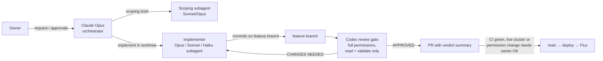

# Orchestration change: Claude orchestrates and implements, Codex is the review gate (2026-09-30 13:15 PT)

**PRs:** [#39](https://github.com/hacka-tron/basel.engineering/pull/39) (merged 2026-09-30) · [#42](https://github.com/hacka-tron/basel.engineering/pull/42) (follow-up, in review)
**Status:** #39 is merged and in effect. It governed #40, #41 and the typography pass. #42 (merged) is a small docs follow-up (scoping via subagents, keep a pipeline moving) that is waiting on merge. Docs only: no code, infra or cluster changes.

## TL;DR

- The roles flipped after you moved Claude to a Max plan. **Claude (Opus) now plans and implements**, choosing Opus, Sonnet or Haiku subagents per task and running independent work in parallel git worktrees. **Codex (`gpt-6-sol`) is now the review-and-validation gate** every change passes before check-in. Gemini is the fallback reviewer.
- Added `project/MOBILE_DESIGN.md`: concrete responsive and typography rules plus a required 5-width screenshot checklist, because mobile had drifted session to session.
- #42 adds two working-style rules: delegate scoping/research to subagents (keeps the orchestrator's context short), and start scoping the next backlog item while current work waits on review or on you.

## What changed for a visitor

Nothing directly. This changes *how* work gets built and checked. Its effect is visible in the reports for #40 and #41: each went through 3–5 Codex rounds that caught real production bugs before merge.

## How it works

- **Dispatch template:** `project/orchestration/codex-reviewer.md`. It gives the requirements, the diff and the judgment calls to assess "not rubber-stamp", and asks for a fixed verdict format (APPROVED / CHANGES NEEDED, requirements met/not met with file:line, validation performed, Critical/Important/Minor issues).
- **Codex's permissions:** it runs with `--dangerously-bypass-approvals-and-sandbox` so it can actually *validate*: run tests, bring up `docker compose` and dev servers on assigned ports, and drive a headless browser. It is instructed never to edit, commit, push, or touch live AWS or Kubernetes. Its output is a verdict, not changes.
- **Checked in** means: committed on a branch → Codex APPROVED → real end-to-end verification → PR with the verdict summarized → merge after CI. Anything that changes the live cluster or grants permissions (RBAC, IAM) also needs your explicit go-ahead.
- **Fix loop:** fix every Critical/Important finding, then re-review. Two rounds is the normal ceiling. A third means stop and bring the disagreement to you. (#40 went to five rounds because you requested new behavior mid-review. The later rounds reviewed new work.)

## Key design decisions & trade-offs

- **A different model reviews than implements.** An independent reviewer that re-runs things itself catches what the implementer is blind to. Examples: the stress-test capacity gate failing open, and the rolling-deploy budget overspend in chat.
- **Full permissions, but validate-only.** A sandboxed reviewer can only read. Letting Codex run services found integration bugs that reading wouldn't (browser measurements for typography, a reproduced mixed-version budget race). The instruction boundary (no edits, commits or live access) keeps it safe. That boundary is enforced by instruction, not by sandbox, which is a deliberate trust trade-off.
- **Parallel worktrees with distinct ports**, so several features progress at once without stepping on a shared dev stack.
- **Mobile rules as a checked-in doc** rather than per-session judgment. Examples: `h-dvh` not `h-screen`; 16 px inputs (iOS zooms below that); an 11 px floor; `clamp()` headings; a fixed-px exception for the 124×42 React Flow nodes, which need fixed geometry or arrows vanish.

## What review caught (Codex reviewing its own new role, #39)

| Round | Finding | Resolution |
|---|---|---|
| R1 | The workflow said "commit, then review" in a way that allowed check-in without a verdict; the fixed-px ban would break the diagram nodes; wrong skill path; inaccurate breakpoint claim | Defined "checked in" precisely; added the React Flow exception (`83739a6`) |
| R2 | `SNAPSHOT.md` still described the old Codex-led roles; skill path still wrong (skills are gitignored, installed from `skills-lock.json`); input-size table said 14 px while the rule said 16 px | Fixed; grep-verified no stale role references remain (`7edf5c4`) |

#42 is owner-requested wording on top of this and had no separate Codex review.

## Operational notes & risks

- **Stale guidance:** several docs describe roles (`AGENTS.md`, `CODEX.md`, `CLAUDE.md`, `SNAPSHOT.md`, `AGENT_HANDOFF.md`). R2 showed how easily one drifts, so any future role change has to touch all of them.
- **Reviewer on the shared machine:** Codex has real network and docker access. In one chat round it ran tests that touched the shared local Redis on port 6379 (test keys only, cleaned up) and disclosed it. Review briefs now spell out ports and shared resources.
- **Cost:** Codex rounds take wall-clock time. The "two rounds, then escalate" ceiling bounds this.

## How to see it / verify it

- Read `project/orchestration/README.md` and `codex-reviewer.md`. Each PR description (#40, #41) summarizes its Codex rounds.

## Open items / next steps

- Merge #42.
- Status reports (this folder) are now part of "checked in". See `project/orchestration/README.md`.
