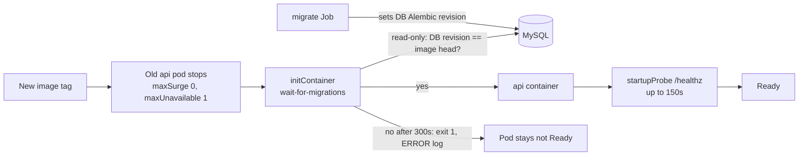

# Deploy safety: probes, no-surge rollouts, graceful shutdown, migrate-before-API (2026-09-30 15:53 PT)

**PR:** [#47](https://github.com/hacka-tron/basel.engineering/pull/47) · **Branch:** `fix/deploy-safety` · **Spec:** `docs/DESIGN.md` §9.2, §12, `k8s/README.md`
**Status:** Merged to `main` 2026-09-30 (Codex: changes needed in round 1, approved in round 2). Not verified on the live cluster by the author, since development had no cluster access.

## TL;DR

- Production is k3s on a 2 GiB `t4g.small` already using about 440 to 510 MB of swap. Rollouts were slow, the API logged probe timeouts under swap pressure, and nothing held the new API/worker back until the `migrate` Job finished.
- This PR makes releases safer on that node: patient probes, stop-old-pod-first rollouts, graceful shutdown, and a gate that waits for the DB migration.
- **The price is deliberate:** each release now has a few seconds of downtime (longer if a migration runs). The owner chose that over running old and new pods at once, which the memory cannot afford.

## What changed for a visitor

- During a release, the site is briefly unavailable (seconds, longer if a migration runs). Before, it stayed up but could run out of memory mid-rollout.
- Fewer spurious API restarts from slow probe responses under swap pressure.
- In-flight requests get up to 25 seconds to finish on shutdown rather than being cut off.

## How it works

1. **Probes (api):** readiness and liveness `timeoutSeconds: 5`, liveness `failureThreshold: 6`, and a new `startupProbe` on `/healthz` (every 5 s, 30 failures, so up to 150 s to boot). The worker has no probes, so nothing changed there.
2. **Rollout:** `api` and `retrieval-worker` use `RollingUpdate` with `maxSurge: 0` and `maxUnavailable: 1`. The old pod stops before the new one starts.
3. **Graceful shutdown:** uvicorn `--timeout-graceful-shutdown 25` in both Dockerfiles' `CMD`, plus `terminationGracePeriodSeconds: 30` on the api.
4. **Migration gate:** `services/glassbox/db/wait_for_migrations.py` runs as a `wait-for-migrations` initContainer on api and worker, using the same image and env. It reads the DB's Alembic revision without migrating and blocks until it equals the image's head. After 300 s it exits 1 with an `ERROR ... timed out ... check job/migrate` line. Resources: 10m/64Mi request, 128Mi limit (measured peak RSS about 57 MiB; a pod's effective request is the larger of init and main, so the node's request total does not rise).
5. The `migrate` Job and its `force: enabled` annotation are unchanged. Ingest ordering is handled in the [follow-up report](2026-09-30-1553-ingest-after-app.md).

## Key design decisions & trade-offs

- **Memory over zero downtime (owner decision).** Surge-first rollouts would briefly run two API pods (and two workers) on a node already in swap. Seconds of downtime per release is cheaper than an OOM.
- **Because the old pod stops first, downtime includes the migration wait.** The initContainer runs after the old pod is gone, so a slow migration lengthens the outage.
- **Read-only gate, not a lock.** The waiter only observes the DB revision, so it cannot interfere with `migrate`.
- **A newer DB blocks an older image (intentional).** Rolling back to an image older than the DB schema stays blocked in the initContainer because the revisions differ. This is documented in `k8s/README.md`.
- **Same image for the gate.** The image's own migrations define "head", so there is nothing extra to keep in sync, and Flux's `images:` transformer retags the initContainers with the app (verified with a temporary `build-999` overlay: 6 image refs rewritten).

## What review caught

| Round | Finding | Resolution |
|---|---|---|
| R1 | **Important:** the five-minute bound was not guaranteed. The deadline was checked only after `get_current()` returned, and PyMySQL had no read timeout, so a MySQL that accepted a connection but stalled under swap pressure could hold the initContainer past 5 minutes or forever. (A delayed-read test returned success after 301 s with a 300 s timeout.) | A dedicated engine with 5 s connect/read/write timeouts; the deadline is checked before every attempt, and each attempt is capped at `min(attempt_timeout, remaining)` in a daemon thread (`2dd8cef`). New tests use a fake clock and a real hung read. |
| R1 | **Minor:** the worker comment overstated the no-overlap guarantee. `maxSurge: 0` prevents an extra pod, but above one worker replica old and new workers can coexist while replicas are replaced one at a time. | Comment, `k8s/README.md`, DESIGN §12 and BACKLOG wording corrected. |
| R2 | **Approved.** 184 tests pass, ruff clean, prod overlay renders the same 30 resources as `main` with only the two Deployments changed. | — |

Risk area this shows again: behavior under memory pressure (timeouts that do not exist by default) that unit tests do not reveal.

## Operational notes & risks

- **Downtime per release** is expected now. Schedule anything sensitive accordingly.
- **Stuck gate:** if `migrate` fails, the new api/worker pods sit in init. The `ERROR` log line names the expected revision and points at `job/migrate`. The old pod is already gone, so the site is down until the migration is fixed or the release is reverted to an image compatible with the DB.
- **Worker overlap** is possible only when scaled above one replica (KEDA).
- **Abandoned reads** may briefly leave daemon threads and connections in the short-lived initContainer; they do not stop it from exiting (Codex verified).
- **Permissions and cost:** no new IAM and no new resources. The MySQL NetworkPolicy already admits the pod labels the gate uses.
- **Not verified live.**

## How to see it / verify it

- After the next release: `kubectl get pods -n app` should show the init step completing, then Ready. Logs from the `wait-for-migrations` container say `database is at head <revision>`.
- `kubectl describe deploy api -n app` shows `maxSurge 0`, `maxUnavailable 1`, the `startupProbe` and the 30 s grace period.
- `k8s/README.md` has a new section on what a release does, including the downtime.

## Open items

- Confirm live behavior on the first release: the init wait time, the downtime length, and no probe-timeout restarts.
- Ingest ordering: see [ingest after app](2026-09-30-1553-ingest-after-app.md).
- Backlog: further Flux hardening (annotated in `project/BACKLOG.md`).
