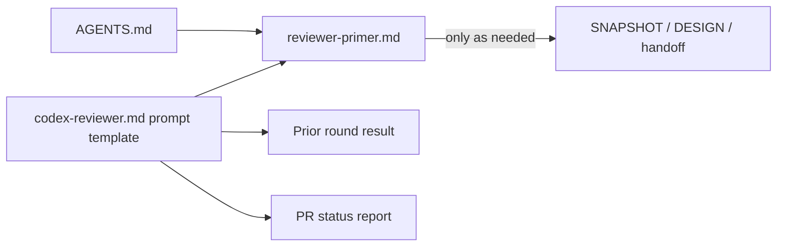

# Reviewer primer for the Codex gate (2026-09-30 18:17 PT)

**PR:** opened from branch `docs/reviewer-primer` (docs only) · **Primer:** `project/orchestration/reviewer-primer.md`
**Status:** In review, not merged.

## TL;DR

- Every Codex review used to start cold and re-derive the system from SNAPSHOT, handoff and design docs. A one-file primer now carries the system map, the hard rules and the traps earlier review rounds found.
- It is distilled from 33 past Codex results, the handoff lessons (immutable OIDC subject, the Flux `force` string enum, the `build-` image tag prefix, "status output is not proof", immutable Jobs and StatefulSets) and the current docs.
- The review prompt template now points at the primer and gains two slots: prior rounds and the PR's status report. The command gains `< /dev/null`.

## What changed for a visitor

Nothing. Documentation only; no code, manifests or infrastructure.

## How it works

The primer has seven sections: system in one screen, hard rules, known traps by area (frontend, backend/RAG, k8s/Flux, Terraform/IAM, workflows), per-area checklist with commands, where to read more, machine constraints. `AGENTS.md` tells Codex to read it first and go deeper only when the change requires.

## Key design decisions & trade-offs

- **Traps, not a spec.** Each trap is one line with its why, so a reviewer checks the right things without the primer duplicating design docs.
- **Recurring themes first.** The cross-cutting findings that kept returning lead the traps: failure and rollback paths not exercised, IAM broader than claimed, runbook order versus Terraform behaviour, focus and history paths untested, tests that pass while the bug exists.
- **Never touch tfstate** is now an explicit reviewer rule, in addition to the no-live-AWS rule.
- **`< /dev/null`:** a backgrounded `codex exec` waits on stdin and hangs without it.
- **Trade-off:** the primer can go stale. It says so at the top and asks that it be fixed in the same PR as any change it contradicts.

## What review caught

Not yet reviewed. This report is written at PR open.

## Operational notes & risks

- No runtime effect. The risk is a wrong or stale line misleading a reviewer; the primer tells reviewers the code wins.
- Contains no account IDs, IPs or tokens.

## How to see it / verify it

Read `project/orchestration/reviewer-primer.md`. Dispatch the next review with the updated template and check that the review opens by citing it.

## Open items

- Refresh the primer when KEDA is resumed, when bootstrap moves to S3 state and `bootstrap.yml`, and after each review round that finds a new class of issue.
