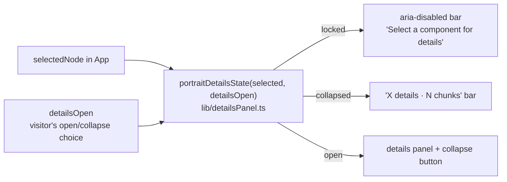

# Mobile diagram: details bar locked until a component is selected (2026-09-30 22:53 PT)

**Status:** In review, PR [#90](https://github.com/hacka-tron/basel.engineering/pull/90). Not merged.

## TL;DR

On phones, the bar under the Diagram view ("Details / N chunks") could be opened before any component was tapped, and it then showed the latest chat answer and its chunks, which looked unrelated to the diagram. Now, until a component is selected, the bar reads "Select a component for details", stays closed and does nothing when tapped. After a tap on a component it works exactly as before. Desktop is unchanged.

## What changed for a visitor

- Phone, Diagram view, nothing selected: a dimmed 44px bar, "Select a component for details", with a faint chevron and no chunk count. Tapping it does nothing.
- Tap a component: the panel opens with that component and its streamed answer, as before. Collapsed, the bar shows "Worker details" on the left and "8 chunks" on the right.
- If the selection is cleared (a question typed in Diagram view, or New chat), the panel closes back to the locked bar.
- The "Latest answer" block that used to appear in the open panel with nothing selected is gone.

## How it works

`ArchitecturePanel` (portrait only) derives one of three states from whether a component is selected and the visitor's last open/collapse choice. The choice is kept, but only takes effect while something is selected. `App.tsx` no longer computes or passes `latestAnswer`.

## Key design decisions

- **Locked, not hidden.** The bar keeps its 44px height so the diagram doesn't jump when a component is first tapped, and the hint tells the visitor what to do.
- **`aria-disabled`, focusable.** It is a `<button aria-disabled="true" aria-expanded="false">` without the `disabled` attribute, so keyboard and screen-reader users still land on it and hear the hint. Click is a no-op; no hover colour; `cursor-default`.
- **Hint wording.** "Select a component for details" instead of the bare "Select a component", because the status text beside the Chat/Diagram switch already says "Select a component" and the two would read as a duplicate.
- **Desktop untouched.** Desktop's inspector never showed the latest answer; its "Retrieved chunks" list is the intended glass-box readout of the chat answer shown beside it, so it is not the same bug.

## What review caught

Opus review, round 1: APPROVED, nothing Critical or Important. Minors fixed before merge: the locked bar no longer claims `aria-expanded` (it can't expand), its cursor matches the other `aria-disabled` control (footer New chat), and the docs no longer show a "·" the UI doesn't render. One Minor went to the backlog (below).

## Operational notes and risks

Frontend only; no API or infra change. Low risk. One edge: if the panel's collapse button has keyboard focus at the moment the selection is cleared, focus falls to the page body. In practice the selection is only cleared from the ask box or the footer "+", which hold focus themselves.

## How to verify

- `cd frontend && npm test && npm run lint && npm run build` (new unit test `src/lib/detailsPanel.test.ts`).
- `npm run phone`, open `/phone-preview.html`: ask a question in Chat, switch to Diagram, check the bar is locked and a tap does nothing; tap a component and check the panel opens; collapse it and check it shows "<Component> details" and "N chunks".
- Checked at 393x852 and 320x568 with headless Chrome: the bar is 44px, the hint fits at 320px, no horizontal scroll, the panel opens on a component tap.

## Open items

- **Answers to questions typed in Diagram view are now read in Chat only.** The removed "Latest answer" block was the only place Diagram view showed them, so a sighted visitor sees the nodes light up and then nothing apart from the footer count (screen readers still hear the answer through Chat's live region). Backlog item: a small "Answer ready · View in chat" cue. Owner's call.
