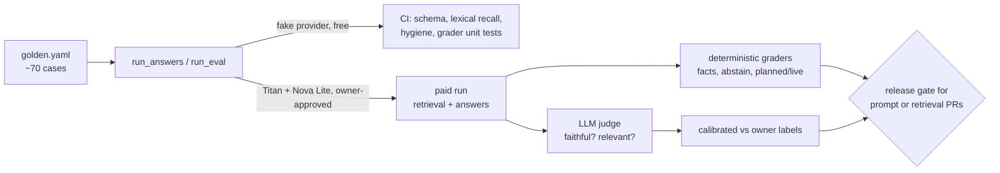

# RAG quality: research, design and plan (2026-09-30 22:54 PT)

**Status:** in review, PR [#92](https://github.com/hacka-tron/basel.engineering/pull/92) (docs only, nothing built). Design: `docs/DESIGN-005-rag-quality.md`. Plan: `docs/superpowers/plans/2026-10-01-rag-quality.md`.

## TL;DR

- **Answer thinness is caused by the prompt.** The answer prompt tells Nova Lite to "Use two or three concise sentences" and "Do not list every detail unless the question asks for a list" (`services/glassbox/api/ask.py:275`, `:291`). The stress-test facts (512 MiB, 5-minute cooldown) sit in one retrieved chunk, and the model drops them as instructed.
- **About This System retrieval is diluted by test code.** 307 of 761 About This System chunks are from `services/tests/`. In the Titan baseline, the rate-limit and budget questions retrieve only test files. Six historical plan files add stale statements. Deleted or renamed files are never removed from the index.
- **Nothing measures answers.** Today's eval is retrieval-only, document-level, at k=5 (production uses 8), manual, with a stale baseline.
- **Plan:** build a cheap validation harness first (deterministic fact, abstention and planned/live checks, plus one calibrated LLM judge for faithfulness). Then, measured one at a time: prompt v14, corpus hygiene, section-sized chunks with heading breadcrumbs, and hybrid BM25 plus vector with RRF. Skip a paid reranker, LLM-written chunk context and a Redis upgrade for now.
- **Cost:** a full paid eval run is about $0.03 (about $0.50 with an LLM judge). Re-embedding the whole cleaned corpus is under $0.01.

## What changes for a visitor

Nothing yet: this PR is documents only. When phase 5 ships, answers keep the concrete numbers and conditions (for example, "a real burst needs 512 MiB free and has a 5-minute cooldown shared by all visitors"). Later phases make About This System answers cite the design docs and code rather than test files.

## How it works (target)

Retrieval target: two Redis queries (KNN 20 and BM25 20), fused by reciprocal rank, with at most 3 chunks per file and the top 8 sent to the prompt. Chunks carry a `path > title > heading` header.

## Key design decisions and trade-offs

- **Harness before changes.** Every later phase is judged against the phase 3 baseline. That's why the prompt fix is phase 5, not phase 1.
- **Deterministic graders over an LLM judge where possible.** Most failures seen so far (dropped numbers, "planned" confusion, wrong refusals) are regex-checkable, free and exact. The judge is only for faithfulness and relevance, and it's not trusted until it agrees with the owner's labels (≥ 0.85 on both classes).
- **Hybrid instead of a reranker.** Cohere Rerank 3.5 is the only Bedrock reranker in us-east-1, at about $2 per 1,000 queries, roughly 7× the cost of a Nova Lite answer. BM25 on a Redis TEXT field is free and fixes the identifier lookups this corpus is full of.
- **Breadcrumb headers instead of LLM-written context.** Anthropic's contextual retrieval works, but it adds an LLM call per changed chunk at deploy. Our docs have descriptive headings, so a deterministic header gets most of the gain.
- **About Basel needs no retrieval work.** It has 6 chunks and the worker sends 8, so every About Basel answer already sees the whole corpus.
- **Eval runs outside the live budget**, in process (not through `/api/ask`), so it doesn't touch rate limits, the daily cap or the answer cache.

## What review caught

Round 1 (Opus reviewer), all fixed in the PR:
- **Planned marker, both directions.** The current-state Prompt row quoted the literal marker text, so that live chunk would have been marked planned. Sections 3, 7, 8 and 9 described unbuilt work under headings without a signal word, so they would not have been marked. The row is reworded, the headings now say "not built yet", and `test_planned_labels.py` pins DESIGN-005 and plan cases in both directions (marked and unmarked).
- **Phase 5 would have broken every live answer.** `BedrockLLMProvider.generate` rejects `max_tokens` above 400, so raising it to 500 passes on the fake provider and fails live. The guard, its test and DESIGN.md §6.7 are now part of phase 5, and its acceptance checks them.
- **Judge calibration was statistically weak.** Thirty natural labels give only a handful of failures, and reusing disagreements as few-shot examples on the same labels inflates agreement. The design now oversamples failures (at least 15 per class), splits dev and held-out test sets, and reports agreement on the held-out set only.
- **Minor:** the chunk total (761), the paid-run cost (about $0.03), the phase 8 lexical query (OR-joined escaped terms, or BM25 matches nothing), approval flags (phase 7 migration, phase 6 paid eval and production deletions), `ensure_index` only checking `model`, and the about 22 chunks these docs add (761 to 783).

## Operational notes and risks

- The prompt bump (phase 5) empties the 24h answer cache; `warm-answers` refills the suggested questions within its 10 calls/day.
- Phases 6 to 8 re-ingest on the next deploy and bump corpus versions (all caches invalidated). Avoid stacking them with KEDA bring-back or other node work.
- DESIGN-005 and the plan are ingested into About This System. Their target-state headings carry "planned", so the planned-work marker labels them. Spot-check one live answer about hybrid search after merge.

## How to verify

Read DESIGN-005 §2 (current-state map with file:line pointers) and §9 (decisions). The chunk counts come from running the real scanner and chunkers locally, with no network: tests 307, services 201, docs 90, infra 78, k8s 50, plans 35, about_me 6.

## Open items (owner decisions; full list in DESIGN-005 §9)

1. Approve paid eval runs (about $0.03 each, about $0.50 with a judge).
2. Pick the judge model: Nova Pro, Claude Haiku (needs your first-time-use form), or offline-only.
3. Label about 50 answers per judge for calibration (about 1 to 1.5 hours; failures oversampled).
4. Corpus scope: drop `services/tests/` and the plan files (recommended)? Add `frontend/src/`?
5. Re-ingestion for phases 6 to 8.
6. Log answer text in `queries` for online review.
7. Optional CI paid-eval workflow (new OIDC role via Bootstrap).
8. Confirm the answer style: a direct first sentence plus specifics, with a short list when needed.
9. Review the About Basel `must_include` facts.
