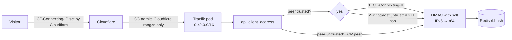

# Security pass: secrets, error leaks, client IP, preview credentials (2026-09-30 23:06 PT)

**PR:** [#96](https://github.com/hacka-tron/basel.engineering/pull/96) · **Branch:** `security/code-audit` · **Docs:** `docs/architecture/deep-dive.md` ("Per-IP rate limit"), `project/BACKLOG.md` "Security"
**Status:** Review round 1 approved; follow-ups pushed. Code-level audit only: no production access was used (no AWS, SSM, kubectl, Terraform plan/apply, workflow runs or GitHub settings changes). One live check: plain GETs of the public page and its JS bundle.

## TL;DR

- **No live secret found** in git history (gitleaks over all 359 commits, plus a custom scan for account IDs, IPs, tokens and private keys). All 83 gitleaks hits are false positives: detect-secrets baseline hashes and the secret-scanner's own test fixtures. Nothing to rotate.
- **Fixed (Medium): worker exception text reached visitors.** A failed retrieval job published `str(exc)` (SQL, MySQL hostname, AWS error detail) into the SSE stream. The worker now publishes a fixed message and the API maps worker errors to fixed text, so older workers during a rolling deploy can't leak either.
- **Fixed (Medium): the rate limit keyed on a spoofable or shared address.** The API believed the *leftmost* `X-Forwarded-For` entry, which the client controls whenever a proxy appends instead of replacing. With k3s's default Traefik, it most likely keys on a proxy's address instead, so visitors share buckets. It now uses Cloudflare's `CF-Connecting-IP` from trusted proxies, then the rightmost untrusted hop; IPv6 is keyed by `/64`.
- **Fixed (Low): the salt failed open.** A missing `GLASSBOX_IP_HASH_SALT` fell back to a random per-process salt (private, not a fixed default, but per-pod buckets). Production now sets `GLASSBOX_REQUIRE_IP_HASH_SALT=true` and the API refuses to start without a 32+ character salt.
- **Open (High if anyone else gets write access): Terraform preview credentials.** Any account that can push a branch to this repo can, with no approval, run its own code in the `terraform-plan` job and read the plan Cloudflare token, the production Terraform state and every `/glassbox/*` SSM secret. Today that is only the owner. Nothing changed; decision recorded below.

## What changed for a visitor

- A retrieval failure now says "The request could not be completed" in the stream instead of a raw exception. The chat already showed a friendly reply, so the visible text is unchanged; the leak was in the SSE payload (devtools).
- Each visitor should now get their own 10-per-10-minutes bucket. If production was keying on a proxy address (likely, see below), one heavy visitor could previously exhaust the limit for everyone sharing it.

## How it works

- `services/glassbox/limits.py`: `client_address()` reads forwarding headers only when the TCP peer is in `GLASSBOX_TRUSTED_PROXY_CIDRS` (the pod network, i.e. Traefik). It prefers `GLASSBOX_CLIENT_IP_HEADER` (production: `cf-connecting-ip`), then walks `X-Forwarded-For` from the right, skipping trusted hops and stopping at garbage. `validate_ip_hash_salt()` runs in the API's startup hook.
- `services/glassbox/worker/main.py` publishes `RETRIEVAL_FAILED_MESSAGE`; `services/glassbox/api/ask.py` `_public_worker_error()` rewrites any worker error to fixed text per code. The full exception stays in the worker log.
- `k8s/base/configmap-app.yaml` sets the two new variables. Nothing else in production changes.

## Findings

| # | Severity | Finding | Status |
|---|---|---|---|
| 1 | High (conditional) | **`terraform-plan` runs PR code with secrets, no approval.** `terraform.yml` runs `plan` on any same-repo PR (`pull_request`, so the PR's own workflow file and Terraform run). The `terraform-plan` environment has no reviewer and no branch policy (by design, `infra/CI.md`). A writer can edit the workflow, or add a `data "external"`/`data "http"` that runs during plan, to print or send `CLOUDFLARE_API_TOKEN` and use `glassbox-ci-plan`, which can read `envs/prod/terraform.tfstate` (holds the generated MySQL password and IP-hash salt) and decrypt `/glassbox/*` SSM parameters. The fork guard (`head.repo.full_name == github.repository`) works: fork PRs get nothing. | Open: owner decision (backlog) |
| 2 | Low | **`bootstrap-plan`: same pattern.** Same-repo PRs and `workflow_dispatch` from any branch get `glassbox-bootstrap-plan`: IAM read, bucket config read, and the bootstrap state (CI roles and bucket; no app secrets expected). | Open: backlog |
| 3 | Low | **`ops-read`** is limited to `main` by its environment branch policy (per `infra/CI.md`; the in-workflow ref check alone could be edited away on a branch). Its role can only run the `glassbox-ops-diagnose` document. The role also trusts the plain `ref:refs/heads/main` subject, so any future `main` job with `id-token: write` could run diagnose. | Owner confirms setting |
| 4 | Medium | Worker exception text relayed to visitors in the SSE `error` event (`worker/main.py`, relayed by `api/ask.py`). | **Fixed**, with tests |
| 5 | Medium | Rate-limit identity from the leftmost `X-Forwarded-For` (spoofable), and probably a shared proxy address in production (k3s Traefik has no `forwardedHeaders` config, so it replaces XFF with its own peer: a Cloudflare edge or the ServiceLB's masqueraded pod address). | **Fixed** in code; owner confirms in prod |
| 6 | Low | Missing salt fell back to a random per-process salt (not a fixed default). | **Fixed**: fail closed in prod |
| 7 | Low | Origin Elastic IP, legacy DNS IP and instance ID were in `project/AGENT_HANDOFF.md`. The security group admits only Cloudflare, so direct access is blocked, but traffic routed through another Cloudflare account can still reach the origin (the open "origin protection" decision). | Redacted from the current file; still in history |
| 8 | Low | AWS account ID, state bucket name and Cloudflare zone ID are throughout the repo (role ARNs, ECR image refs, backend config). These are identifiers, not credentials; removing them would mean repo variables for every workflow and manifest. | Accepted; noted |
| 9 | Low | Third-party actions pinned by tag, not commit SHA, in jobs that hold OIDC tokens or secrets (`actions/checkout@v4`, `hashicorp/setup-terraform@v4`, `aws-actions/configure-aws-credentials@v6.3.0`, `aws-actions/amazon-ecr-login@v2`, `docker/*`). A moved tag would run in those jobs. | Open: backlog |
| 10 | Low | Public Actions logs show the instance ID (`ops-run.sh`) and role ARNs. Diagnose output is structured and redacted; the known multiline `redact()` gap stays in the backlog. | Accepted |
| 11 | Medium (availability) | `/api/cluster/stream` is unauthenticated and opens a Kubernetes watch plus a Redis connection per SSE client, with no per-client cap. Many open tabs or a script could tie up the API server on the 2 GiB node. | Open: backlog |
| 12 | Low | No security headers on live responses (HSTS, `X-Content-Type-Options`, `frame-ancestors`/CSP). | Open: backlog |
| 13 | Info | FastAPI `/docs` and `/openapi.json` are public. The repo is public too, so this reveals nothing new. | Accepted |
| 14 | Info | Frontend bundle: the live bundle is byte-identical to a local build of `main`. No keys, account IDs, internal hostnames or source maps; the IP-like strings are SVG path numbers. | Clean |
| 15 | Info | History: the 2026-09-29 incident (a bootstrap tfstate baked into an image on a public registry) is closed. That package was later deleted, and no state or tfvars file was ever committed to git. | Closed |

## Key design decisions & trade-offs

- **`CF-Connecting-IP` over configuring Traefik's `forwardedHeaders.trustedIPs`.** Cloudflare overwrites that header on every request it proxies, and the node only accepts Cloudflare. Trusting Cloudflare ranges in Traefik would need a k3s HelmChartConfig change on the node and a list to keep in sync. The fallback is the rightmost untrusted XFF hop, so a future Traefik change can't reintroduce spoofing.
- **Fail closed only where it is configured.** Local dev and tests keep the random fallback. Only the production configmap sets `GLASSBOX_REQUIRE_IP_HASH_SALT`. The secret is non-optional in the Deployment and Terraform generates a 64-character value, so the risk of a crash loop on merge is very low. If it did happen, the old pod has already stopped (`maxSurge: 0`), and reverting the configmap line recovers.
- **Fixed text in both the worker and the API.** The API-side mapping also covers old workers during a rolling deploy.
- **A diagnose check for the salt and proxy setup was not added.** It would read a production secret's length on the node, and the agent permission system blocked writing it. Left as an owner decision in the backlog.

## What review caught

Round 1 (Opus reviewer, same brief as Codex): **APPROVED, safe to deploy.** Two small follow-ups were made in the same PR:
- **The shared-bucket fallback is now visible in the logs.** If `CF-Connecting-IP` is missing or invalid on a proxied request (one that has `X-Forwarded-For`) and the key falls back to the trusted proxy, i.e. one bucket shared by everyone, the API logs a warning with no addresses, at most once a minute per process. This would surface Cloudflare's "Remove visitor IP headers" transform if it were ever switched on. The in-cluster warmer sends no forwarding headers, so it doesn't trigger the warning.
- **IPv4-mapped IPv6 is normalized:** `::ffff:1.2.3.4` and `1.2.3.4` now share one rate-limit key.
- Minors moved to open items: the origin IP is still in git history, and there is no app-level test for a short salt (the short-salt case is covered at function level).

## Owner must confirm in prod

Each item is a click or a look, not a command.

1. **After this PR deploys: Actions → Ops · Diagnose.** In "pods", `api` should be Running and ready with no new restarts. A missing or short salt would crash-loop it (salt check).
2. **Rate limit per visitor:** on the site, ask 11 questions from your laptop; the 11th should say to try again soon. Then ask from your phone on mobile data (Wi-Fi off). It should answer. If the phone is also refused, everyone is sharing one bucket: report back.
3. **GitHub → Settings → Collaborators and teams:** only you have write access. While that holds, finding 1 is not reachable.
4. **GitHub → Settings → Environments** (view only): `terraform-prod`, `bootstrap` and `ops` have you as required reviewer and are limited to `main`; `ops-read` and `release` are limited to `main`; `terraform-plan` and `bootstrap-plan` have no rules (known, finding 1).
5. **Cloudflare → My Profile → API Tokens:** the token stored in `terraform-plan` is the read-only one (Zone Read, DNS Read, Cache Rules Read), not the edit token.

## Open items (in `project/BACKLOG.md` "Security")

- Decide on finding 1 before adding any collaborator: restore a required reviewer on `terraform-plan` (one approval click per infra PR), or have plans run only after a maintainer approves.
- Pin actions to commit SHAs and add Dependabot for workflow updates.
- Cap or share `/api/cluster/stream` watches.
- Security headers via a Cloudflare transform rule or middleware.
- Optional diagnose section for salt length and proxy settings (owner decision: it reads a secret's length on the node).
- The origin IP stays in git history (history is not rewritten). The mitigation is the origin-protection decision, e.g. Cloudflare Authenticated Origin Pulls, so only this zone's requests reach the origin.
- No app-level startup test for a short salt: `test_api_refuses_to_start_without_required_salt` covers a missing salt, and the short case is tested only on `validate_ip_hash_salt()` directly.
