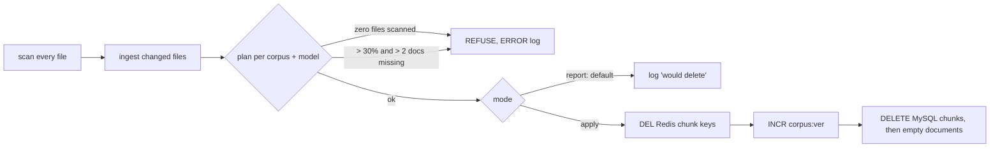

# Stale-document sweep and `--clear` (RAG plan phase 6, part 1) (2026-09-30 23:42 PT)

**Status:** PR [#101](https://github.com/hacka-tron/basel.engineering/pull/101) open, not merged. Branch `feature/rag-p6-stale-sweep`. Written 2026-10-01 while the owner was asleep; every decision below was made without the owner and can be reversed.

## TL;DR

Ingestion never removed documents whose files had been deleted or renamed, so their chunks stayed searchable forever. Ingestion now finds them after every complete scan. **On this release it only logs them** ("would delete ..."); deleting is one line in the ingest Job (`GLASSBOX_INGEST_SWEEP: apply`), which the owner turns on after reading one release's log. There is also an operator `--clear` command that wipes one corpus and embedding model for a clean re-ingest (closes the BACKLOG item "Ability to clear chunks"). The corpus-scope part of phase 6 (dropping `services/tests/` and plan files, the `kind` tag) is not in this PR; it waits on DESIGN-005 §9 item 4.

## What changed for a visitor

Nothing at merge. Once the owner flips the switch, answers stop citing files that no longer exist (an estimate from Git history: `k8s/base/ingest-job.yaml`, `k8s/overlays/prod/scaledobject-retrieval-worker.yaml`, `services/tests/test_ci_gate_smoke.py`).

## How it works

- New module `services/glassbox/ingest/sweep.py`: pure decision logic (`plan_sweep`, `scope_documents`), the delete path and `clear_scope`.
- `ingest/run.py`: records every path the scanner yields (quarantined and failed files count as present), runs the sweep only after the whole scan finished without raising, and has an argparse CLI: `--sweep`, `--no-sweep`, `--force-sweep`, `--dry-run`, `--clear --corpus X [--model M] [--yes]`.
- Scope: a document is in scope for model M when it has chunks for M or no chunks at all. A document with chunks for another model is never touched; its row is kept while any other model's chunks remain.

## Key design decisions and trade-offs

- **Report by default, apply behind a flag.** The plan says the deploy that ships this deletes production rows and keys. Deleting from the live index while the owner is asleep isn't something to do on a merge, so the code default and the Job both say `report`. The Job sets `GLASSBOX_INGEST_SWEEP: report` explicitly, so the switch is visible where it gets flipped.
- **Fail closed.** Zero files scanned for a corpus means no sweep, even with `--force-sweep` (that's what `--clear` is for). A source directory with indexed documents that produced no files means no sweep unless forced. More than 30% of a corpus's documents missing means no sweep unless forced (`GLASSBOX_INGEST_SWEEP_MAX_FRACTION`). Up to 2 deletions are always allowed, so renaming two of the five About Basel files still works. An unknown mode value is an error, not "off". A refusal logs at ERROR but doesn't fail the Job, because a non-zero exit would retry ingestion (backoffLimit 2) and skip the warm-up for no gain.
- **Delete order: Redis, version bump, MySQL.** The worker raises when a KNN match has no MySQL row, so the opposite order could break answers if the second step failed. With this order, a failure leaves MySQL rows with no vectors. Retrieval can't see them, and the next sweep removes them. The version bump comes before the MySQL delete, so retrieval-cache entries naming those chunk ids stop being read first. No MySQL transaction is open during Redis I/O, unlike the per-document write path (that BACKLOG item stays open and is annotated).
- **`--dry-run` is read-only.** It scans paths and reads MySQL. It embeds nothing, writes nothing and doesn't touch Redis. The plan called it `--dry-run-sweep`; `--dry-run` also covers `--clear`.
- **`--clear` confirmation:** without `--yes` it needs an interactive terminal and the corpus name typed back. With no terminal it refuses with exit code 2.

## What review caught

Round 1 approved merging in report mode, and every finding is fixed in this PR.

- **Important:** a whole missing source directory could be swept silently. The scanner skips a directory that isn't there, and `infra/` (24% of about_system), `k8s/` (27%) and `docs/` (9%) are each under the 30% limit. An image that stopped copying `docs/` would therefore, in apply mode, delete every docs document with only WARNING lines. Fix: the sweep now refuses when any source directory with indexed documents (`infra`, `k8s`, `services`, `docs`, `corpus/about-me`) produced zero scanned files. A new test checks that the Dockerfile copies every scanned directory plus `corpus/`.
- **Minor:**
  - Refusals now print a `!!! STALE SWEEP REFUSED ... !!!` banner to stdout and stderr. `ingestion_runs` has no column for it; that's noted in BACKLOG.
  - A failed `--clear` can't repair itself, because ingest skips unchanged files. The CLI error and the module docstring now say to re-run `--clear`.
  - `--clear` deletes exactly the list it showed for confirmation.
  - Flags that would be silently ignored now exit 2: `--force-sweep` with `--clear`, `--sweep`/`--no-sweep` with `--dry-run`, `--yes` without `--clear`, and `--model` without `--clear`/`--dry-run`.
  - The 2-document allowance (2 of 5 About Basel files, 40%) is documented in DESIGN-003 §1.1.
  - CI prints skip reasons (`pytest -rs`).

## Operational notes and risks

- **At merge:** the next ingest Job logs `stale sweep [...] would delete <path>` lines (WARNING) and a `sweep <corpus>: would delete N of M` summary. No rows or keys change. The extra cost is two small MySQL reads per run.
- **When the owner flips to `apply`:** that release deletes the listed documents and bumps `corpus:ver` for the affected corpora, which empties their answer and retrieval caches (the warm-up at the end of the Job refills the suggested questions, within its 10 LLM calls a day).
- **Integration test isolation:** the new integration test runs against whatever MySQL/Redis is on localhost, so it limits the sweep and clear to its own fixture paths and can't delete anything else. It skipped locally (the Docker daemon wasn't responding) and runs in CI.
- `--clear` finds Redis keys through MySQL chunk ids. A `chunk:*` hash with no MySQL row isn't found (BACKLOG minor).

## How to see it / verify it

- Unit tests: `services/tests/test_ingest_sweep.py` (39 tests: thresholds, the directory guard, zero-file guard, model scoping, report/apply/off, delete order, Redis failure leaves MySQL untouched, CLI).
- Integration test: `test_stale_sweep_dry_run_apply_and_clear_against_real_stores` in `services/tests/test_ingest_run.py`. It ingests two files, deletes one, then checks: the dry run and report mode delete nothing; apply removes that file's rows and keys and keeps the other file; the version goes up once; `--clear` dry run lists and the real run wipes.
- After merge: in the ingest Job log, look for `sweep about_system: would delete N of M` and the per-path lines.

## Open items

- **Before flipping to apply:** (1) this PR, with the directory guard, is merged and released; (2) the owner has read one release's ingest log, the `would delete` lines and any `STALE SWEEP REFUSED` banner.

- Owner: read one release's ingest log, then set `GLASSBOX_INGEST_SWEEP: apply` (BACKLOG "Decide: turn the stale sweep on").
- Owner: corpus-scope decision (DESIGN-005 §9 item 4) unblocks the rest of phase 6: scanner exclusions, the `kind` tag, `ensure_index` restructure, and the paid retrieval eval.
