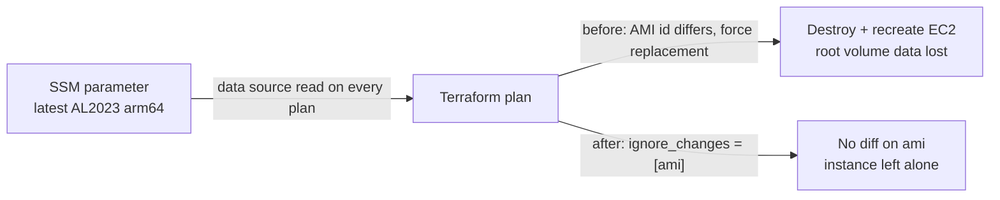

# EC2 instance pinned against AMI replacement

**PR:** [#44](https://github.com/hacka-tron/basel.engineering/pull/44) · **Branch:** `fix/pin-instance-ami` · **Spec:** `docs/DESIGN.md` §10.4
**Status:** Merged to `main` 2026-09-30 and applied. The apply was a no-op: the Terraform plan reported no changes both before and after the merge commit was added.

## TL;DR

- One line of Terraform (`lifecycle { ignore_changes = [ami] }` on `aws_instance.glassbox`) stops a new Amazon Linux release from force-replacing the production node.
- Why it mattered: the instance picks its image from the SSM "latest" AL2023 arm64 parameter. When AWS published a newer image, the next `terraform apply` would have destroyed and recreated the instance. k3s, MySQL and Redis data live on the root volume, so all of it would have been wiped.
- Nothing changes for visitors. This is a guardrail against a future outage and data loss.

## What changed for a visitor

Nothing. The running node was not touched, and no pod restarted.

## How it works

1. The compute module looks up the newest image id from the SSM parameter every time Terraform plans.
2. The instance had no `lifecycle` block, so any change in that id was a "forces replacement" diff.
3. The new `ignore_changes = [ami]` makes Terraform use the configured AMI when it creates or deliberately replaces the instance, and ignore later drift on updates.
4. `docs/DESIGN.md` §10.4 now documents how to roll the image on purpose: back up first, get owner approval, then `terraform apply -replace=module.compute.aws_instance.glassbox`.

## Key design decisions & trade-offs

- **Ignore only `ami`, not `user_data`.** On the AWS provider version in use (6.66.0), a `user_data` change updates in place with a stop/start unless `user_data_replace_on_change` is set, and it is not. So `user_data` needs no protection.
- **Trade-off: an AMI config change is now invisible to a normal plan.** Because `ami` is ignored, someone who deliberately changes the AMI setting will see no diff. That is why the deliberate path is an explicit `-replace` with a backup, written into the design doc.
- **Fix the cause, not the symptom.** Backing up before every apply would not help, because the replacement is automatic. Pinning is cheap and removes the failure mode.

## What review caught

Codex approved with no issues. It confirmed the block sits on the right resource and ignores only `ami`, that the `-replace` address in the docs matches the prod module layout, and that `terraform fmt`, `validate` and `git diff --check` pass. It also listed the replacement paths that remain, which are worth knowing:

- changing the subnet
- changing root-volume encryption
- changing `instance_type` to one with no shared CPU architecture

Root-volume size and type, metadata options and CPU credits update in place. Codex did not run a live plan; CI did.

## Operational notes & risks

- **Applied as a no-op.** CI's plan comment said "no changes" on both runs. No resource changed.
- **The node will drift from the latest AMI.** Patching is now done by the normal OS updates on the box or a deliberate, backed-up replacement, not by Terraform.
- **Remaining replacement triggers** (above) still destroy data. Any plan showing "must be replaced" on the instance deserves a stop and a backup.
- **Permissions and cost:** none. No new IAM, no new resources.

## How to see it / verify it

- `infra/modules/compute/main.tf`: the `lifecycle` block on `aws_instance.glassbox`.
- The PR's CI plan comments: "Terraform plan: no changes".
- `docs/DESIGN.md` §10.4 for the deliberate-replacement procedure.

## Open items

- None for this change. Consider a backup/snapshot routine for the root volume, since the data still lives there.
