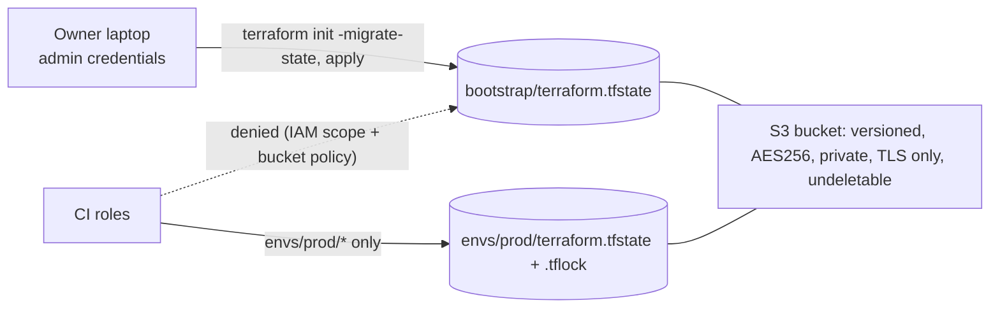

# Bootstrap state moves to S3

**PR:** PRNUM · **Branch:** `infra/bootstrap-remote-state` · **Spec:** `infra/bootstrap/README.md`
**Status:** In review. Nothing is migrated or applied yet; both steps are owner-run.

## TL;DR

- The bootstrap root (state bucket, GitHub OIDC provider, CI roles) kept its Terraform state only in a gitignored file on the owner's laptop. This PR prepares moving it into the existing S3 state bucket at `bootstrap/terraform.tfstate`.
- Bootstrap stays human-applied. CI roles cannot read or write the new key, so CI cannot tamper with the state that defines its own permissions.
- The bucket gets guardrails against accidental loss: `prevent_destroy`, a bucket policy (TLS only, no DeleteBucket). Versioning, encryption and public-access block were already on.

## What changed for a visitor

Nothing.

## How it works

1. `versions.tf` gains `backend "s3"` with the same bucket, region, `encrypt = true` and `use_lockfile = true` as prod, key `bootstrap/terraform.tfstate`. The bucket name is literal because backend blocks cannot use variables (prod does the same).
2. The `glassbox-ci` apply role previously had Get/Put/DeleteObject on the whole bucket (`/*`). It is now limited to `envs/prod/*`. `glassbox-ci-plan` was already scoped to the prod state key and lockfile; `glassbox-ci-release` has no S3 access.
3. A new bucket policy denies non-TLS requests, denies `s3:DeleteBucket` to everyone, and explicitly denies the three CI roles any access to `bootstrap/*`.

## Key design decisions & trade-offs

- **Same bucket, separate key** rather than a new bucket: reuses the versioned, encrypted bucket; separation is enforced by IAM and bucket policy.
- **Two layers against CI access**: narrowing the IAM allow and an explicit bucket-policy deny, so a future over-broad IAM edit cannot reopen it.
- **DenyDeleteBucket applies to the owner too.** Deleting the bucket requires removing the policy first (and `prevent_destroy`): deliberate friction.
- **Existing protections kept as is**: no new SSE type, no KMS; AES256 matches prod.

## Operational notes & risks

- The IAM narrowing and the bucket policy are applied by the owner's bootstrap apply, not by CI. Until then CI roles still have the old bucket-wide access.
- Expected next `terraform plan` (not run here: that needs the owner's state): create `aws_s3_bucket_policy.state`; update `aws_iam_role_policy.ci` in place. If PR #55 is unapplied its IAM changes show too. Nothing else; any destroy or replace means stop.
- `prevent_destroy` will make any future plan that would replace the bucket or `random_id` fail loudly.
- Losing the local file before migration still means re-importing; the runbook lists every import command.

## How to see it / verify it

- `terraform fmt -check -recursive infra` and `terraform init -backend=false && terraform validate` in `infra/bootstrap` pass.
- After the owner's migration: `aws s3 ls s3://glassbox-tfstate-404379474987-ab88985b66efc96f/bootstrap/`.

## Open items

- Owner runs the migration (runbook in `infra/bootstrap/README.md`), ideally after applying #55's change.
- Then update this report to "migrated".
