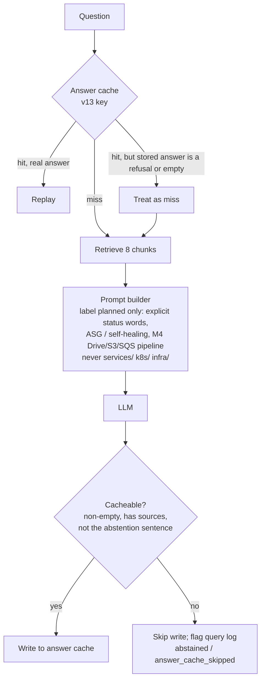

# Cached refusals and the planned-design label

**PR:** [#53](https://github.com/hacka-tron/basel.engineering/pull/53) · **Branch:** `fix/cached-refusals` (from `main` at `3555323`)
**Status:** In review, not merged. No Codex review round yet.

## TL;DR

- The live Queue question was getting **"I don't know from what I have."** from the answer cache, even though retrieval had found eight relevant chunks. One refusal from the model had been cached and was being replayed to everyone for 24 hours.
- **Refusals and empty answers are never cached now.** Older cached refusals read as a miss.
- **The prompt no longer marks live infrastructure as "planned".** KEDA, k3s, Terraform, Flux, GitOps and CI/CD were all labeled "not implemented yet" in the prompt, which pushed the model toward refusing or answering "No".
- The prompt version moves from v12 to v13, so every existing cache entry (including stored refusals) is unreachable. Nothing had to be flushed.

## What changed for a visitor

- Asking about a live component (Queue, KEDA, Flux, Terraform…) should give a real answer about how it works, not a refusal or "No, that is planned".
- If the model does refuse, the next visitor asking the same thing gets a fresh attempt, not a replay of the refusal.
- Right after deploy, the first ask of each question is a cache miss (v13) and costs one LLM call. Repeats hit the cache as before.

## How it works

- **Recognizing a refusal.** Both prompts now ask the model to reply with *exactly* "I don't know from what I have." and nothing else, and only when the sources don't answer the question at all. The API matches that sentence regardless of case, punctuation, apostrophe style or "do not"/"don't". It counts whether the sentence is the whole answer or just its opening words, so a hedged "I don't know from what I have, but…" also counts.
- **Planned label.** It now fires only on text that says planned, deferred, not built/started/implemented, stretch ideas or future milestones/work, or that names genuinely unbuilt work: the self-healing Auto Scaling Group and launch template (Milestone 3), and the Milestone 4 content pipeline (Drive connector, S3 raw zone, SQS). Code, Kubernetes manifests and Terraform are never labeled. The special label for `docs/DESIGN-003-ingestion.md` is unchanged.
- **Grounding rule softened.** "Design prose alone is not evidence" is gone. A component described in the design docs that also appears in code or manifests counts as current. A bracketed planned label still overrides present-tense prose.

## Key design decisions & trade-offs

- **Match the sentence, don't classify the meaning.** Asking for one exact sentence and matching it normalized is cheap and deterministic. Other ways of refusing ("The sources don't say…") are not detected and could still be cached, but they are also far less likely now the prompt names the exact sentence.
- **We err toward "abstention".** Any answer that starts with the sentence is treated as one. A false positive only costs one extra LLM call.
- **No citation-count check.** The answer prompt forbids `[n]` markers because sources are shown separately, so "no citations" says nothing about quality.
- **Version bump, no flush.** Bumping the version is the existing invalidation mechanism, and the old entries just age out within 24h. A flush would have meant a live Redis write.
- **Logging without a migration.** The flags go into the existing `stage_timings_ms` JSON column (`abstained: 1`, `answer_cache_skipped: 1`). A proper column is a follow-up if we want dashboards on it.
- **Merge with PR #48.** The ask.py changes are kept away from the lines #48 edits. A trial merge conflicts only on `.secrets.baseline` line numbers, which the pre-commit hook regenerates.

## What review caught

No Codex round yet. While building this, the draft planned list included a bare "Google Drive". That would have labeled the grounding section of the new `docs/architecture/deep-dive.md` (PR #51) as planned, because it *describes* the DESIGN-003 label. It was narrowed to "Drive connector", and a test pins it.

## Operational notes & risks

- **Cost blip after deploy:** each distinct question misses the cache once under v13, bounded by the daily LLM cap.
- **Keyword list goes stale again.** When the ASG or the M4 pipeline ships, remove its terms (a comment next to `_PLANNED_SOURCE_SIGNAL` says so). Doc-level status metadata would be the durable fix.
- **Deep-dive doc wording.** The "Grounding" section of `docs/architecture/deep-dive.md` (PR #51) still quotes the old rule ("a design document describes intended behavior rather than proof…"). It should be updated to match once both land.
- **Not changed:** the 0.95 similarity threshold for the answer cache, and there's no retrieval fingerprint in the cache entry. Adding one (so a cached answer is only replayed when retrieval still returns similar chunks) is optional hardening.

## How to see it / verify it

- Locally, run the fake provider and ask any question containing `[fake-abstain]` twice. Both are `answer_cache: miss`, no `ans:*` key is written, and the query rows show `abstained: 1, answer_cache_skipped: 1`. Ask the same question without the marker twice and you get miss, then hit. This was done on port 8050 against a private Redis on port 6396.
- **Live (after deploy, one small paid call):** ask "How does the Queue component (Redis Streams) work in the current Glassbox system?" on basel.engineering. Expect `answer_cache: miss` and an answer about the `retrieval:jobs` stream and the worker consumer group. Ask it again and expect a hit. If it still refuses, its `queries` row will show `abstained: 1` and it won't be cached.

## Open items

- Codex review gate.
- Live re-ask after deploy (above).
- Follow-ups: a real `abstained` column if we want to report on it; optional retrieval fingerprint in the answer cache; update the deep-dive grounding paragraph.
