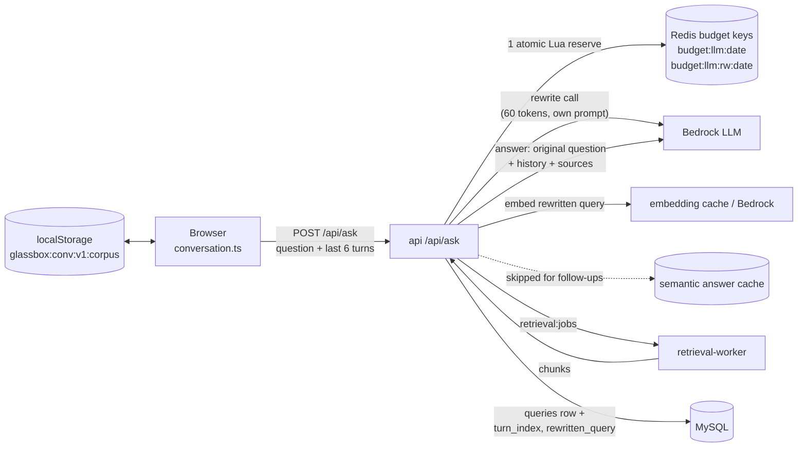

# Conversational chat: follow-ups with history, separate chats per tab

**PR:** [#41](https://github.com/hacka-tron/basel.engineering/pull/41) · **Branch:** `feature/chat-context` (was stacked on #40; retargeted to `main` and merged) · **Spec:** `docs/DESIGN-002-followups.md` §5, §9.3–9.4
**Status:** Merged to `main` 2026-09-30 (Codex approved in round 3). Includes a DB migration (`0003`), run by the `migrate` Job on deploy; live rollout being verified.

## TL;DR

- The chat now handles follow-ups like "tell me more about that". The browser sends recent turns as `history`, and the API rewrites the follow-up into a standalone search query before retrieval.
- **About Basel** and **About This System** each keep their own conversation, saved in the browser for 7 days.
- The server stays stateless, first questions behave exactly as before, and the live answer cache and budget stay valid through a rolling deploy.
- Blocking: #40 has to merge first (stacked PR). Real-model rewrite quality is untested, because tests used the fake provider only.

## What changed for a visitor

- Follow-up questions work in context. A live follow-up shows **"Searched for: …"**, the rewritten query, and the diagram lights up a new **Rewrite** stage.
- Switching tabs switches conversations. An answer that's still streaming stays in the tab it started in.
- Sources appear under each answer. A **New chat** button clears the tab's conversation, with a privacy note that chats are stored in this browser. Suggested-question chips appear only on an empty conversation.
- Conversations survive a reload for 7 days. They sync across open browser tabs, and blocked or full storage falls back to memory.

## How it works

1. **Browser owns the conversation** (`frontend/src/lib/conversation.ts`). There is one conversation per corpus, stored under `glassbox:conv:v1:<corpus>`. Only settled messages are saved, capped at 50. Loaded data is validated, and entries older than 7 days (or dated more than 5 minutes in the future) are discarded. Each question sends that tab's last 6 settled turns as `history`. It omits them on a first question.
2. **API bounds and distrusts history** (`services/glassbox/api/ask.py`). It accepts ≤ 50 messages of ≤ 4000 chars each (`user`/`assistant` roles only, else 422), then keeps the newest 6 within 4000 chars total. The follow-up system prompt says prior assistant replies may be wrong and retrieved sources win.
3. **Rewrite** runs only when history is present and the budget allows. A small call (60 output tokens, its own system prompt) turns the follow-up into a standalone query. That query drives the embedding and retrieval. The answer prompt gets the *original* question plus history. If the rewrite fails, comes back blank or is over budget, the original question is used.
4. **Answer cache**: follow-ups never read, lock or write it. First questions use it exactly as before.
5. **Query log**: migration `0003_query_turn_columns` adds `turn_index` (0 = first question) and `rewritten_query` (NULL when no rewrite was used).

## Key design decisions & trade-offs

- **Stateless server, history from the browser.** No server session store, no new Redis/MySQL state per visitor, and nothing to expire server-side. The cost is that the client is untrusted, so history is bounded, role-checked and explicitly ranked below sources in the prompt.
- **Rewrite for retrieval, original for the answer.** Vector search needs a self-contained query ("that" matches nothing). The answer model does better with the real wording plus the conversation. Keeping them separate also means a bad rewrite can only hurt retrieval, not the answer's phrasing.
- **Follow-ups skip the answer cache both ways.** A follow-up's right answer depends on the conversation, not just its words. Reading the cache could replay an unrelated answer. Writing it could poison first-question hits for everyone.
- **First-question prompts and cache keys unchanged**, so the live answer cache stays valid across the deploy. There is no cold-cache cost.
- **Answers stay in the original budget key.** Old API pods only check `budget:llm:{date} ≤ cap`. If new pods counted answers somewhere else, old pods couldn't see them during a rolling deploy and the daily cap could be exceeded. So answers still count one each in the original key, and rewrites count in quarter-units in a new `budget:llm:rw:{date}`. One Lua script checks `4×answers + rewrites + new ≤ 4×cap` atomically. The accepted residual is that during the brief overlap an old pod can't see rewrite usage.
- **Query logging is stats-only.** If the insert fails (e.g. a new API pod serves before the migration finishes), it logs a warning and the answer still completes. This was needed because nothing yet orders `migrate` before `api`.
- **Architecture-node questions** (clicking a diagram node) go into the System conversation but are sent without history, so they stay cacheable.

## What review caught

| Round | Finding | Resolution |
|---|---|---|
| R1 | New budget key reset usage on deploy day (up to 2× cap); §9.3 query columns deferred; future-dated chats never expired | Legacy key counted (`1802c2f`); migration 0003 + logging (`01333da`); 5-minute future skew limit (`6eb4036`) |
| R2 | Old and new pods could jointly overspend during a rolling deploy; a new API before its migration would error mid-answer; DB tests would silently *skip* in CI on a broken migration | Budget key redesign (`e5609f9`); tolerant query logging (`0430930`); CI fails instead of skipping (`29180bc`) |
| R3 | **Approved.** Migration verified upgrade/downgrade/upgrade on a private MySQL; the mixed-version budget scenario reproduced and confirmed closed | — |

Risk areas this shows: **rolling-deploy compatibility** (old and new code sharing Redis/MySQL at the same time) and **migration ordering**. Both are invisible in single-version unit tests.

## Operational notes & risks

- **Deploy:** Flux runs the `migrate` Job and rolls the API. Brief overlap is tolerated by design, both for the budget and for the query log.
- **Cost:** a follow-up costs a quarter of an answer for the rewrite plus a full answer, and never gets a cache hit. With the default cap of 100 answers/day, heavy follow-up use reaches the cap slightly sooner. When the budget is exhausted, the existing "retrieval only" mode applies.
- **Prompt injection:** history is user-controlled. The rewrite and answer prompts both treat it as untrusted, but **only the fake provider was tested**. How the real model (Nova Lite) behaves on a hostile rewrite is unverified.
- **Privacy:** conversations live only in the visitor's browser. The server logs the question, `turn_index` and the rewritten query, not the history.
- **Rollback:** revert the PR. Migration 0003 has a tested downgrade, and old code ignores the `budget:llm:rw:*` keys (2-day TTL).

## How to see it / verify it

- **Locally (fake provider):** ask a question, then "tell me more about that". You should see a Rewrite stage on the diagram and "Searched for" under the reply, and no `answer_cache` stage on the follow-up. Switch tabs and back, and reload: each tab keeps its own chat.
- **After deploy:** try a few real follow-ups on both tabs and check that the rewritten queries are sensible. In MySQL, `SELECT turn_index, rewritten_query FROM queries ORDER BY id DESC LIMIT 10`.

## Open items / next steps

- Merge after #40, then retarget to `main`.
- Check real-model rewrite quality and injection resistance after deploy.
- Backlog: an explicit migrate-before-api ordering in Flux (would retire the tolerant-logging workaround's main reason to exist).
