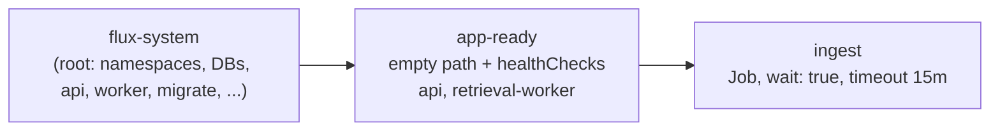

# Ingest runs after the app is healthy

**PR:** [#49](https://github.com/hacka-tron/basel.engineering/pull/49) · **Branch:** `fix/ingest-after-app` · **Spec:** `docs/DESIGN.md` §12, `k8s/README.md`
**Status:** Merged to `main` 2026-09-30 (Codex approved in round 1). Live behavior is unverified; the checks below are the first things to run after a release.

## TL;DR

- The `ingest` Job used to run in the same Flux pass as the api/worker rollout, adding to the memory peak on the 2 GiB node. It now runs only once the new `api` and `retrieval-worker` Deployments are Ready.
- It still runs on every release (owner decision). Only its ordering changed, and nothing else moved.
- Follows [deploy safety](2026-09-30-deploy-safety.md), which dealt with the api/worker side of the same memory problem.

## What changed for a visitor

Nothing directly. Releases are a little gentler on the node, since the heavy ingest (Bedrock embeddings, MySQL and Redis writes) no longer overlaps the api/worker restart. New content appears in answers after the ingest finishes, just after the app is healthy.

## How it works

1. `k8s/base/ingest-job.yaml` moved to `k8s/overlays/prod/ingest/ingest-job.yaml`. The spec is unchanged and `force: enabled` is kept. It has its own `kustomization.yaml` and its own `images:` block with the same `$imagepolicy` marker.
2. `k8s/overlays/prod/flux/kustomization-ingest.yaml` (listed in the root overlay beside the KEDA one) defines two Flux Kustomizations:
   - `app-ready`: `dependsOn: flux-system`, empty path, `healthChecks` on `app/api` and `app/retrieval-worker`, timeout 10 m.
   - `ingest`: `dependsOn: app-ready`, `wait: true`, `timeout: 15m`, `retryInterval: 2m`, `prune: true`.
3. ImageUpdateAutomation (`update.path: ./k8s/overlays/prod`) already covers the subdirectory, so Flux bumps both image tags in one commit. The root overlay's `images:` block is untouched.
4. Docs updated: `k8s/README.md` release section and disaster-recovery steps, DESIGN §12 (Flux order) and §16 tree, `project/BACKLOG.md`.

## Key design decisions & trade-offs

- **`app-ready` depends on `flux-system`, and this is the subtle part.** Every child Kustomization is notified of a new GitRepository revision at the same moment as the root. Health checks alone could inspect the old Deployments before the root applied the new spec and pass immediately. For a dependency on the same source, Flux requires it to be Ready at the current revision, so the root must have applied this revision (and pruned the old Job) before `app-ready` checks anything. kstatus then reports a Deployment Current only once its rollout is complete.
- **Health checks live on `app-ready`, not `ingest`.** Health checks run after a Kustomization applies, which would be too late for `ingest`.
- **A separate Kustomization, not an initContainer or hook.** Flux already gives ordering, timeouts and retries, and the KEDA split uses the same pattern.
- **Still every release.** Ingest is incremental by content hash and embedding model, so a no-change run is cheap.
- **Nothing else moved.** The rendered prod overlay went from 30 objects to 31: `Job app/ingest` removed, `Kustomization app-ready` and `ingest` added. The other 29 are byte-identical.

## What review caught

Codex approved in round 1 with one **Minor** docs issue: `k8s/README.md` said `release.yml` bumps the manifest tag, but that workflow only builds and pushes the image, and Flux ImageUpdateAutomation makes the tag commit. That could send an operator to the wrong place during a stalled release. Fixed in a follow-up commit ("k8s README: Flux, not release.yml, commits the image tag").

Codex also verified against Flux 1.9.5 source that a same-source dependency must be Ready at the current revision and that an empty build is accepted. It also confirmed that the root manifest on `deploy` has neither `wait` nor health checks, so there is no dependency cycle. The move deletes no data: only the Job is pruned and recreated, and StatefulSets and PVCs stay under the root.

## Operational notes & risks

- **Deadlock if the root waits on its children.** If the cluster's `flux-system` Kustomization has `wait: true` or health checks covering these objects, it would wait on `ingest`, which waits on it. The `flux bootstrap` default has neither. Check with `kubectl -n flux-system get kustomization flux-system -o yaml`.
- **Ownership handoff.** On the first reconcile the root prunes its `Job app/ingest` and `ingest` recreates it, ordered by `dependsOn`. Expect one extra, cheap incremental ingest run.
- **Initial tag.** `main` carries `newTag: latest` in the new file, so the first apply may use `:latest` until Flux's automation commits the `build-N` tag to `deploy`, which triggers one more incremental recreate.
- **Empty-path Kustomization.** Confirm `app-ready` reaches Ready with no resources. Locally it only rendered empty; the `flux` CLI was not installed so `flux build kustomization` was not run.
- **If the app never becomes Ready**, ingest never runs (10 m timeout on `app-ready`). That is intended, but it means content updates stall along with a failed release.
- Cost and permissions: no new IAM, no new resources. Ingest still calls Bedrock for changed chunks only.

## How to see it / verify it

- `kubectl -n flux-system get kustomization flux-system -o yaml` (no `wait`, no health checks).
- After a release: `flux get kustomizations` should show `flux-system`, `app-ready` and `ingest` Ready at the same revision.
- Check that the `job/ingest` start time is after the new api pod's Ready time, that the Job carries the new `build-N` image, and that the automation commit on `deploy` touched both `kustomization.yaml` files.

## Open items

- Run the live checks above on the next release and record the results here.
- Watch for the one-time extra ingest run from the handoff and the `:latest` first apply.
