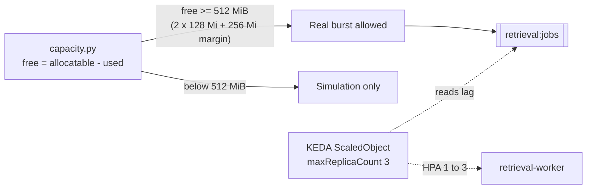

# KEDA capped at 3 workers for the 2 GiB node

**PR:** [#45](https://github.com/hacka-tron/basel.engineering/pull/45) · **Branch:** `feature/keda-max-3` · **Spec:** `docs/DESIGN.md` §4.5, §9.3, §9.4, §9.7
**Status:** Merged to `main` 2026-09-30 (Codex: changes needed in round 1 on the memory table, fixed, then merged). Follow-up to the [stress test report](2026-09-30-stress-test-keda.md).

## TL;DR

- The stress test now scales `retrieval-worker` from 1 to **3** pods instead of 5, because the production node is a 2 GiB `t4g.small` and the owner is keeping it.
- The free-memory gate that allows a real burst dropped from 768 MiB to **512 MiB** (two extra workers at 128 Mi each, plus a 256 MiB margin).
- The §9.7 memory budget was corrected to match arithmetic and live measurements.
- Owner decision: stay on `t4g.small` for now (see Capacity context).

## What changed for a visitor

- The tooltip now says workers scale "1 up to 3".
- The simulated animation peaks at 3 pods (same 10 frames and duration).
- A real burst is allowed a little more often, since the gate needs 512 MiB free rather than 768.
- Everything else (tiger/rabbit, 5-minute shared cooldown) is unchanged.

## How it works

1. `ScaledObject` `maxReplicaCount` goes 5 to 3. Minimum 1, the trigger and the HPA scale-down behavior are unchanged.
2. `capacity.py` sets `MAX_WORKERS = 3`, so the extra-worker budget is 2 x 128 Mi and the required free memory is 512 MiB.
3. Frontend: the `StatsBar` tooltip and the `App.tsx` simulated pod animation use 3.
4. Docs updated: DESIGN §4.5, §9.3, §9.4, §9.7, `k8s/README.md`, `SNAPSHOT.md`, DESIGN-004.

## Key design decisions & trade-offs

- **Size the demo to the hardware we are keeping.** Five workers at their limit do not fit comfortably beside k3s, Flux, MySQL and KEDA. Three still shows scaling visibly, which is what the demo is for.
- **Keep the gate live-memory based.** Only the constant changed. The fail-closed behavior from the original PR is untouched.
- **Less peak parallelism.** A 300-job burst drains more slowly with 3 workers. That is acceptable for a demo, and the backlog counter makes it visible.

## What review caught

| Round | Finding | Resolution |
|---|---|---|
| R1 | Codex confirmed the cap, tooltip, animation, gate tests (511 denies, 512/513 allow) and all commands pass (173 tests, ruff, kustomize renders, frontend lint and build). One **Important** issue: the §9.7 memory rows summed to 1,550 to 1,840 MiB (1.51 to 1.80 GiB), not the stated 1.7 to 1.9 GiB, and the 270 MiB worker figure was an unmeasured estimate. | Worker row and total relabelled as projections (270 to 384 Mi; about 1.5 to 1.9 Gi), and live RSS measurements added (`16c971c`). |

## Capacity context

Measured on the live node on 2026-09-30 during a rollout (process RSS, not pod requests):

| Item | Measured |
|---|---|
| k3s server | ~606 MB |
| Flux controllers | ~195 MB |
| MySQL | ~129 MB resident (more in swap) |
| KEDA | ~90 MB |
| API + worker | ~115 MB |
| Swap in use | ~440 to 510 MB |
| Memory-pressure stalls | ~25 to 29% |

The node was already over physical memory before any burst, which is why the cap and gate exist.

**The alternative:** `t4g.medium` (4 GiB) costs about **$24.53/mo vs about $12.26/mo** for `t4g.small`. It is **not** eligible for the free plan. The AWS account is on the Free plan with about **$199.84 in credits expiring 2027-03-28**.

**Owner decision:** stay on `t4g.small` for now. The 3-worker cap is the consequence. The upgrade path stays documented in DESIGN §9.7 if pressure gets worse. Any Terraform change to the instance should be planned first; see the [AMI pin report](2026-09-30-ami-pin.md) for what still forces replacement.

## Operational notes & risks

- Reduces peak memory by two workers (up to 256 MiB at limits). On a node already swapping, this matters.
- Flux applies the lower `maxReplicaCount` on its next reconcile. No restart is needed, and an in-flight burst with more than 3 pods would scale down.
- Cost: no change. Synthetic jobs make no Bedrock calls.
- The 512 MiB gate may still rarely pass on a busy node. That is the gate working.

## How to see it / verify it

- Hover the stress-test icon: the tooltip says 1 up to 3.
- `kubectl get scaledobject -n app` shows max 3.
- On a real burst, pods should peak at 3 and return to 1 about a minute after the backlog drains.

## Open items

- Revisit `t4g.medium` if memory-pressure stalls stay in the 25 to 29% range or the gate almost never allows a real burst. The credits run to 2027-03-28.
- Record the first live 1 to 3 to 1 timings.
