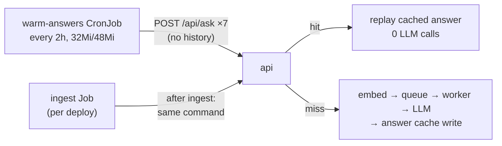

# Latency quick wins

**PR:** [#54](https://github.com/hacka-tron/basel.engineering/pull/54) · **Branch:** `feature/latency-quick-wins` (targets `main`; #48 has merged) · **Spec:** `docs/DESIGN.md` §6.1, §7.3, §9.2, §9.6, `k8s/README.md`
**Status:** In review, Codex round 1 fixes done. Not merged, not live. Nothing was changed on the live cluster.

## TL;DR

- **Honest footer.** It now reads `first token 612ms`, adds `· cached` on an answer-cache hit, and no longer passes the whole-request time off as a first-token time. If no token arrived (budget reached or LLM off) it shows `total 812ms`.
- **Suggested questions stay cached.** A new `python -m services.glassbox.warm` asks the 7 suggested questions through the real `/api/ask`, so their answers are in the semantic cache before a visitor clicks one. On the live site that should take a first click from ~0.7–1.4 s to the cache-hit range (~140–250 ms client TTFT). It runs every 2 hours from a CronJob and once after each deploy, at the end of the ingest Job. All runs together may spend at most 10 LLM answers a day (a shared Redis counter), so visitors always keep at least 90 of the 100.
- **Follow-up overlap: nothing worth doing, so no change.** The only work that doesn't depend on the rewritten query costs about 0.4 ms, next to a ~390 ms rewrite call. No separate rewrite model is configured, so that is also left alone. Both are explained below.

## What changed for a visitor

- The footer's number is labelled for what it is, and cache hits are visible. Below `sm` (360–375 px), "· cached" wraps to a second line so the row still fits with a four-digit time. This was checked in headless Chrome at 360, 375 and 1440 px, with no horizontal overflow.
- Clicking a suggested question normally gets a cache hit and starts answering right away.

## How it works

1. **Single list of questions.** The chips moved from `Chat.tsx` into `frontend/src/suggested-questions.json`. The frontend imports it, and the Dockerfile copies it into the runtime image for the warm command.
2. **`services/glassbox/warm.py`** uses the standard library for HTTP, plus the redis client for its daily counter. For each question it POSTs `{question, corpus}` and reads the SSE stream until `done`, because the API writes the answer cache just before `done`. Each question comes out as `cached` (a hit, free), `warmed` (one LLM answer), `no_sources`, or `failed`.
3. **Cost guards.** The warm-up goes through the same per-IP rate limiter (10 per 10 min) and daily budget (100 answers) as visitors. Any ask that may have reached generation counts, not just successful ones: the stream showed the `llm` stage start, or the connection broke after the response opened. Only a hit, a no-sources answer, or an error before generation is free. The caps are:
   - **Per run:** at most `--max-llm-calls`, 7 by default.
   - **Per UTC day, shared by every run** (the CronJob and each deploy's run): at most `GLASSBOX_WARM_DAILY_LLM_CAP`, 10 by default, set in the ConfigMap. Enforced with an atomic Redis `INCR` on `warm:budget:{date}` (48h TTL). A slot is reserved before each ask. If that pushes the count past the cap, it is undone and the run stops. The slot is handed back when the ask provably made no LLM call.

   The run also stops at the first `rate_limited`/`budget_exhausted` error, HTTP 429/503, or `retrieval_only` answer, which is what the API sends when the budget is spent or the kill switch is on. A stop for limits exits 0. A failed request exits 1, so the Job shows it.
4. **Kubernetes.** `k8s/base/warm-cronjob.yaml`: `concurrencyPolicy: Forbid`, `backoffLimit: 0`, 10-minute deadline, no service-account token, requests 10m CPU and 32Mi, limit 48Mi, and the ConfigMap via `envFrom` (for `REDIS_URL` and the cap). The ingest Job's command is now `ingest.run && { warm || echo ignored; }`, so a warm-up failure can never fail or retry ingestion. A new NetworkPolicy, `api-from-answer-warmer`, admits pods labelled `glassbox/answer-warmer: "true"` from the `app` namespace to the api on port 8000 only. Both pods carry that label. The data-namespace `redis-from-app` policy now also admits `app: warm-answers`, only so it can reach the daily counter (no MySQL access). The ingest pod already had Redis access.

## Key design decisions & trade-offs

- **Every 2 hours, not daily (a change from the brief).** Answers expire 24 hours after they are written, and a hit does not extend that. The warm-up skips anything still cached. A daily run lands about 24 hours after the previous one, so it races expiry. When it finds an entry seconds before it expires, it skips it, and that answer then stays cold until the next day. Running every 2 hours limits the cold gap to about 2 hours. Runs where everything is cached make no Bedrock calls: they use 7 cheap API requests and a ~21 MiB pod for about a second. To go back to daily, edit one line (`schedule`). A daily schedule would also work if cache hits refreshed the TTL (a sliding TTL), but that changes cache semantics, so I didn't do it.
- **Through the API, not straight into Redis.** The caches fill exactly as they would for a visitor. The warm pod touches Redis only for its own daily counter.
- **Daily cap in Redis rather than in `ask.py`.** Counting in the warm command keeps `ask.py` untouched (#53 edits it). An atomic INCR-then-undo means concurrent runs, such as a deploy that lands during a CronJob run, can never go over the cap together. If `REDIS_URL` is missing, the command fails rather than running without the cap.
- **After-deploy warm-up at the ingest Job's tail.** Ingest is what bumps `corpus:ver:*` and invalidates answers, so warming right after it is the only correct point. This needed no Flux restructuring. The existing `ingest` Kustomization already waits for the api to be Ready.
- **Follow-up overlap (item 3): measured, not built.** After the rewrite, the follow-up path is: embed-cache lookup and embed of the rewritten query, then corpus-version GET, then (answer cache skipped) subscribe and enqueue. Only the corpus-version GET (median 0.16 ms locally) and the pub/sub subscribe (0.28 ms) could run during the rewrite. Everything else needs the rewritten text. Guessing an embedding of the original question would be wasted, because retrieval uses the rewrite. So `ask.py` is unchanged, which also avoids conflicts with #53.
- **Faster rewrite model: not cleanly supported.** The provider factory has one `BEDROCK_LLM_MODEL_ID`, shared by rewrite and answer. A rewrite-only model (e.g. Nova Micro) would need a new env var, a second provider in `ask.py`, and a budget-unit decision. It's worth a separate small change once the rewrite's share of follow-up latency has been measured live.

## Measured (local, fake provider, private Redis :6398 / MySQL :3398, API :8060)

| | Result |
|---|---|
| Suggested question, cold (fake LLM, so no Bedrock latency) | client TTFT 9–49 ms, `answer_cache=miss` |
| Same question after `warm` | client TTFT ~3 ms (first 14 ms), `answer_cache=hit` for all 7 |
| Warm run, all cached | 7 asked, 0 LLM calls, 0.1 s |
| Warm run after a corpus change (ingest tail in the image) | about_system re-ingested → 4 warmed, 3 cached → 4 LLM calls |
| Budget spent (`budget:llm:<today>`=100) | stopped at first question (`retrieval_only`), exit 0, 0 LLM calls |
| Rate bucket drained | stopped at first question (`rate_limited`), exit 0 |
| Warm container memory (docker, arm64 image) | before the daily cap: cgroup peak ~15 MiB, max RSS 24 MiB. With the redis client: cgroup peak ~21 MiB, max RSS ~31 MiB, runs fine under the 48 MiB limit |
| Daily-cap refunds against real Redis (API unreachable → 7 failures before any response) | counter back to 0 |

The live numbers in the TL;DR come from the pre-work measurements on the live site. The local fake provider can't show the Bedrock part of the gain.

**Cost.** Per run: 0 LLM calls when everything is cached (the usual case). At most 7 when every answer is cold. About 4 after a deploy that changes repo docs, since only `about_system`'s version bumps. Per day: at most **10 answer calls for all warm-ups together**, 10% of the 100-answer budget, however many deploys or CronJob runs happen. No rewrite calls, since the warm-up never sends history. The unavoidable daily cost is about 7 calls, because each answer expires after 24h and is regenerated once. That leaves room for about one deploy's refresh a day. After that, `about_system` answers stay cold until the next UTC day, and visitors refill them as usual.

## What review caught

Codex round 1 (changes needed, all fixed):
- **Important:** the per-run cap counted only successful warms, so an ask that errored after generation started didn't count. Now every ask that may have reached generation counts.
- **Important:** warm-ups could eat the visitors' shared daily budget: 12 CronJob runs × 7, plus uncapped per-deploy runs. Added the shared daily cap of 10 LLM calls in Redis.
- **Minor:** the mobile footer showed `cached` without the dot. It now shows `· cached` on the second line.

Codex also checked, with no issues found: the rendered manifests, the NetworkPolicy selectors, the ingest ordering, and that leaving `ask.py` unchanged is reasonable.

## Operational notes & risks

- **Budget share is bounded.** Warm-ups take at most 10 of the 100 daily answers. The trade-off: on a busy deploy day the cap is reached early, and some suggested answers stay cold until the next UTC day. To change the share, edit `GLASSBOX_WARM_DAILY_LLM_CAP` in the ConfigMap.
- **Wider Redis access.** The warm-answers pod can now reach Redis, and in principle any key. It holds no secrets and runs only this command.
- **Query log.** Warm-up requests are logged in `queries` like any request: about 84 hit rows a day from the CronJob. They aren't marked as warm-ups.
- **Abstentions.** Once #53 lands, "I don't know" answers aren't cached, so such a suggested question would cost one LLM call on every run. None do today, but the logs would show it as a recurring `warmed`.
- **Pod churn.** 12 short Jobs a day on the 2 GiB node, each ~21 MiB for about a second. `ttlSecondsAfterFinished: 3600` plus history limits of 1 keep old ones cleared out.

## How to see it / verify it (live, after merge)

- `kubectl -n app get cronjob warm-answers` and, after the next `:17` of an even hour, `kubectl -n app logs job/<latest warm-answers job>`. Expect `warm-up: 7/7 asked … LLM answer calls (incl. failed) N`. To see today's warm-up spend, run `redis-cli GET warm:budget:$(date -u +%F)` in the redis pod (at most 10).
- After a release: `kubectl -n app logs job/ingest | tail -9` should end with the warm-up summary.
- **NetworkPolicy:** a warm run with `failed 7` and `URLError`/timeouts means the policy or label isn't matching. This hasn't been exercised on k3s's network policy controller yet.
- In a fresh browser, click a suggested question: the footer should read `first token …ms · cached`.

## Open items

- Live verification of the NetworkPolicy, the CronJob schedule/timeZone on k3s, and real TTFT before/after.
- Optional: a rewrite-only model id (see above), and marking warm-up rows in the query log.
