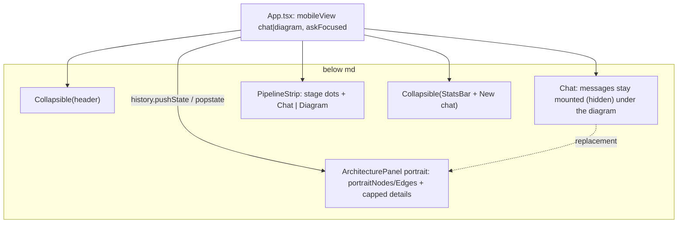

# Mobile layout A: diagram in place, focus mode

**Status:** In review, PR (see index) on branch `feature/mobile-layout-a`. Not merged. Frontend only.

## TL;DR
The owner picked option A (with focus mode) from the mobile layout prototypes. Below 768px the diagram now replaces the chat in place instead of opening a bottom sheet, the header and footer slide away while the ask box has focus, and New chat moves into the footer. At 375×667 the message area grows from 340px to 407px at rest and from 80px to 294px with the keyboard up. The diagram shows all 11 components without panning. Desktop (≥768px) is unchanged: screenshot diffs against `main` at 768/1024/1440 reach 0 changed pixels.

## What changed for a visitor (phones, < 768px)
- **Chat | Diagram switch** in the row above the ask box. In Chat view the row also shows the live stage dots, with no "Pipeline" heading.
- **Diagram view** replaces the messages with a two-column portrait graph (fixed 124×42 nodes; at 375×667 the zoom is 0.92 and all 11 nodes fit). The ask box stays usable, so you can ask and watch the request move through the diagram. Tapping a component asks about it and opens a details panel under the diagram with its implementation, the answer, and "Continue in chat →". The panel takes at most 40% of the region and the diagram always keeps at least 280px. Its collapse button works while a component stays selected. Tapping any component reopens it; re-tapping the selected one while it is collapsed only reopens it, with no new request. Browser Back, Escape, the Chat segment, or "Continue in chat" return to the conversation.
- **Focus mode:** while the ask box has focus, the header and footer slide away (200ms, none with reduced motion) and come back on blur.
- **Footer:** a bordered "New chat" button right after the stats, which always stay on one line. When there is no room it becomes a square "+" (`aria-label="New chat"`, same tooltip: "clears the <topic> conversation only. Chats are saved in this browser."). The old note under the ask box is gone on phones; a line under the suggested questions keeps the privacy point.
- **Header:** the name on the left, then Contact me directly left of the GitHub icon, the same pair as on desktop. "Copied!" no longer shifts anything.
- **Everywhere:** tapping a suggested question asks it immediately. Taps are ignored (and the chips disabled) while an answer streams. On desktop this is a behaviour change only, with no visual change.

## How it works

- `architecture.ts` adds `portraitNodes`/`portraitEdges`: same nodes, edges and handles, new positions (2 columns × 6 rows). Unit tests check that every component is placed once, the graph fits at the 0.75 zoom floor, and every edge leaves right/bottom and enters left/top.
- `ArchitecturePanel` `portrait` mode sets the viewport directly with `getViewportForBounds` whenever its box resizes (panel open/close, focus mode). React Flow's `fitView` was skipped while node data changed during a tap. It also uses an 8px step offset so the Vector Search → MySQL arrow doesn't loop back on itself.
- `Collapsible` animates `grid-template-rows` 1fr↔0fr and is `display: contents` at md+, so desktop markup and layout are untouched. Content is clipped only while closed or moving, so footer tooltips still open upward. The collapsed chrome is `inert`.
- Chat keeps the list pinned to the latest message through any resize (ResizeObserver), which removes the jump when chrome or the keyboard changes the height. `main` loses its scroll position on that resize.
- A blur caused by a tap waits for the pointer to lift before the chrome comes back, so the tapped control (Diagram, Send) does not slide out from under the finger.
- `lib/footerFit.ts` decides between the label, "+", or "tight" from measured widths: the footer content width, the full-length stats, the stress control, and the label. The stats are never wrapped or shrunk. "Tight" handles the narrowest case: when even "+" does not fit beside the full stats, the timing drops its "first token" prefix (kept for screen readers and as a tooltip). Unit-tested.
- `index.html` viewport adds `interactive-widget=resizes-content`, so Android Chrome shrinks the `h-dvh` shell to the space above the keyboard instead of covering it. Desktop is unaffected.
- Removed: the mobile bottom sheet (`role=dialog`, its close buttons and focus code) and the "View architecture" trigger. The desktop panel is unchanged.

## Key decisions and trade-offs
- **Diagram in place, not a sheet.** This is the owner's pick. It needs no modal or focus trap, the input stays live, and the stress-test button sits beside the Worker node it animates.
- **Re-tap reopens without re-asking** when the panel is collapsed, so the visitor doesn't spend a query to read the same answer. With the panel open, a re-tap asks again (same as desktop).
- **"Tight" footer tier** (my call, flagged for the owner): at 360px a cached answer with a two-digit query count (`first token 412ms · cached | 24 queries`) leaves no room even for "+". Rather than overlap the stress icon or push it off-screen, the label becomes `412ms · cached | 24 queries [+]`. At 375px only unusually long values trigger it, and at 414px nothing realistic does.
- **Suggested questions ask immediately at every width.** This keeps one behaviour across widths, and the chips are hidden whenever a conversation exists, so desktop pixels don't change.
- **Contact width reservation at every width.** At rest it renders identically (verified by pixel diff). On desktop "Copied!" now no longer shifts the pair either.

## Measurements (headless Chrome, DPR 2)
| | main | this branch |
|---|---|---|
| Message area 360×640 rest / focused / keyboard (−260px) | 313 / 313 / 53 | 380 / 527 / 267 |
| Message area 375×667 rest / focused / keyboard (−260px) | 340 / 340 / 80 | 407 / 554 / 294 |
| Message area 414×896 rest / focused / keyboard (−336px) | 586 / 586 / 250 | 636 / 783 / 447 |
| Diagram 375×667 | sheet: 309px, zoom 0.75, 6/11 nodes, pan | 363px, zoom 0.92, 11/11 |
| Diagram 375×667 details open | – | 280px, zoom 0.75, 11/11, panel 127px (31%) |
| Diagram 414×896 details open | – | 382px, zoom 0.97, 11/11, panel 254px (40%) |
| Footer New chat | – | label with empty stats from 340px and typical stats (`first token 312ms \| 3 queries`) from 360px; "+" for longer stats; tight only when "+" can't fit |

Every width (360/375/414) has no horizontal scroll, no text under 11px, and no tap target under 44px. The input is 16px. The details text stops 8px left of the 44px collapse button (56px right padding). Contact's left edge and the icon stay put on "Copied!".

## What review caught
Pending (Codex gate). During verification: React Flow's `fitView` didn't refit when a node tap opened the panel, so the viewport is now set directly. The portrait VS → MySQL edge looped back on itself, fixed with the 8px step offset.

## Operational notes and risks
- Frontend only. No API, infra or data changes.
- The history entry for the diagram view survives a reload (the view restores). Back from the diagram never leaves the site.
- Real-device keyboard behaviour (iOS Safari visual viewport, Android with the new `interactive-widget` hint) was approximated by shrinking the viewport, not tested on hardware.

## How to verify
`cd frontend && npm run lint && npm test && npm run build`, then `npm run dev` and use a phone-width window: switch to Diagram, tap a component, collapse and re-tap it, press Back; focus the ask box and watch the header and footer slide away; check the footer at 360/375/414.

## Open items
- Owner call on the "tight" footer tier copy (dropping "first token" on the narrowest phones).
- "1 queries" pluralisation in the footer predates this change.
- On-device check (iPhone SE, a Pixel) before merge if possible.
