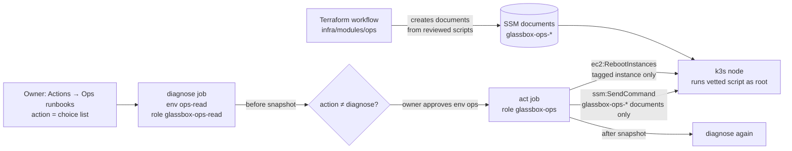

# Push-button ops runbooks and bootstrap pipeline

**PR:** [#62](https://github.com/hacka-tron/basel.engineering/pull/62) · **Branch:** `feature/ops-runbooks` · **Docs:** `infra/CI.md` ("Runbooks", "Bootstrap via pipeline", "One-time owner setup"), `k8s/README.md` ("Incidents")
**Status:** In review. Nothing applied. It depends on PR #55 (zram, plus the CI role's SSM document permissions) and PR #59 (bootstrap state in S3). Merge those first.

## TL;DR

- Tonight's hand-typed operations are now buttons in GitHub Actions: EC2 reboot, `flux suspend`/`resume`, `kubectl scale`, the cronjob suspend patch, diagnostics, the zram script, and the bootstrap `terraform apply`.
- **Ops runbooks** (`ops.yml`): pick an action from a fixed list. `diagnose` runs immediately and is read-only. Every other action waits for the owner's approval, then prints the node's state before and after.
- **Bootstrap** (`bootstrap.yml`): plans `infra/bootstrap` on PRs, and applies it from `main` after approval, only if the plan still matches the one you reviewed.
- Nothing on the node can run unless it was reviewed in this repo. The workflow can only invoke Terraform-managed SSM documents with enum inputs, never `AWS-RunShellScript`.
- **The owner applies bootstrap by hand one last time**, to create the four new roles, and creates four GitHub environments. That is one copy-paste block in `infra/CI.md`. After that, every operation is a button.

## What changed for a visitor

Nothing directly. Incidents should be shorter: fixing a 521 is now "run diagnose, click reboot-node, approve" instead of an SSM session.

## How it works

- **`infra/modules/ops`** (new, wired into `infra/envs/prod`) has nine SSM Command documents: `boot-id` (read-only; the reboot check compares boot IDs), `diagnose`, `restart-deployment`, `flux-suspend`, `flux-resume`, `flux-reconcile`, `scale-keda`, `cronjob-suspend` and `cronjob-resume`. Each one is `scripts/lib.sh` plus one action script, piped into `bash -s`, the same pattern as the zram document. Inputs are SSM parameters with `allowedValues`, and the scripts re-check them. Terraform preconditions reject scripts that would break SSM's `{{ }}` interpolation or the heredoc.
- **`reboot-node`** is a plain EC2 API call, not an SSM document. It works even when the node is too sick to run commands. **`apply-zram`** runs PR #55's `glassbox-zram-swap` document, after checking that the applied document matches the script at the workflow's commit.
- **`.github/scripts/ops-run.sh`** finds the instance by tag, sends the command, and polls up to 20 minutes. SSM keeps retrying delivery for 10 minutes. It prints the output into collapsed log groups and the run summary.
- **`bootstrap.yml`**: the plan job uses a read-only role. The apply job (owner approval, `main` only) re-plans and compares a SHA-256 fingerprint of the change set with the reviewed one, then applies that saved plan or nothing. It fails fast if the backend isn't S3, or if the S3 state is empty because it was never migrated.

## Key design decisions & trade-offs

- **Per-action documents, not one "run this" document.** IAM can then give the read-only role the diagnose document and nothing else. A new action needs a reviewed Terraform change, which is the point.
- **The before-diagnose runs before approval**, with the read-only role, so the approver sees the node's state when deciding. The act job runs even if that diagnose failed, because a hung node is exactly when you need reboot-node.
- **Fingerprint match instead of uploading the plan file.** This repository is public, so its artifacts are effectively public, and the existing Terraform workflow already refuses to upload plans. Re-planning after approval and requiring an identical change set is just as strict: if anything drifted, nothing is applied.
- **`glassbox-bootstrap` is effectively admin over CI's IAM.** It can rewrite any `glassbox-*` role, including itself. That is unavoidable for whatever applies the root that defines those roles. The approval gate is the guardrail; the policy only keeps the blast radius to `glassbox-*` IAM, the OIDC provider and the state bucket. It has no EC2, SSM or ECR access, and no users.
- **Suspends use a dedicated field manager (`glassbox-ops`).** The Git manifests don't set `spec.suspend`, so Flux doesn't own that field and leaves it alone.
- **Diagnose is written for public logs.** It counts k3s "Slow SQL" lines but never prints them, because kine logs SQL arguments, which can include stored object values. It never prints Secrets or environment variables.

## What review caught

Not reviewed yet (Codex gate pending). Self-checks are listed under "How to see it".

## Operational notes & risks

- **Order matters.** Merge #55 → #59 → this PR, then do the one-time setup, then approve the pending `terraform-prod` apply. If that apply runs before the bootstrap apply, creating the documents fails with AccessDenied; just re-run it afterwards.
- **This PR's own Bootstrap check fails** until #59 is merged (by design: "still uses local state"). Even after that, it fails to assume `glassbox-bootstrap-plan` until the one-time apply creates the role.
- **SSM output is capped at 24,000 characters.** Diagnose is sized to fit, and the workflow warns if it hits the cap.
- **The instance tag condition uses `ssm:resourceTag/...`**, the key AWS documents for SendCommand. IAM simulation passes, but real enforcement is only proven on the first live run. If AWS evaluates it differently, the command is denied (fails closed), not over-permitted.
- **`scale-keda 0`** makes the external-metrics APIService unavailable. Some `kubectl` calls then print discovery warnings, and the worker stays at its current replica count until KEDA is back.
- **Pre-existing:** `glassbox-ci` (the prod apply role, behind `terraform-prod` approval) already has IAM write on every `glassbox-*` role. It can therefore change the new roles too. Same trust tier as before; not widened here.
- **`glassbox-ops-read` also trusts plain `main`-branch jobs**, as requested. Any workflow on `main` without an environment could run diagnose and read command output. Both are read-only.

## How to see it / verify it

- Locally: `terraform fmt -check -recursive infra`, and `init -backend=false` plus `validate` for both roots, all pass. `actionlint` is clean on all workflows. `shellcheck` is clean on every document (lib + action, as concatenated) and on the helper scripts. The rendered documents were run against a `kubectl` stub for every action, including rejecting an out-of-list value. A read-only, offline bootstrap plan shows **8 to add, 0 to change, 0 to destroy** on top of `main`. The plan fingerprint is stable across two plans.
- IAM: 71 `simulate-custom-policy` cases across the four roles, 0 mismatches (tables are in the PR). Bucket-policy cases confirm the bootstrap roles can use `bootstrap/*`, the CI roles cannot, and nobody can delete the bucket.
- Live, after setup: run **Ops runbooks → diagnose**, then **Bootstrap → Run workflow** (it should report "no changes").

## Open items

- Codex review.
- First live run of each action, especially `reboot-node`'s wait loop and the SSM tag condition.
- Optional: add the ops roles to #59's bucket-policy deny list as defense in depth. They have no S3 grants today.
