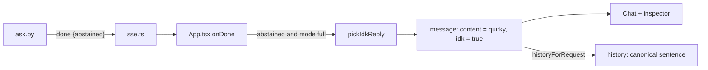

# Quirky "I don't know" replies

**PR:** [#58](https://github.com/hacka-tron/basel.engineering/pull/58) · **Branch:** `feature/quirky-idk` (from `main` at `75bfbf6`)
**Status:** In review, not merged.

## TL;DR

- When the sources don't cover a question, the chat now answers with one of 20 light-hearted lines (several playfully blame Basel) instead of the flat "I don't know from what I have."
- The server tells the browser when that happened: the SSE `done` event gains `abstained: true|false`. Caching and logging are unchanged.
- Conversation history still carries the plain sentence, so follow-up rewriting never sees a joke.

## What changed for a visitor

- A question the corpus can't answer gets a reply like "Basel forgot to write that part down. Classic Basel." or "My sources are silent on that one. Want to try a different question?". Never the same one twice in a row, in a session or against the last one saved in that chat.
- The mobile architecture inspector shows the same reply.
- Reloading shows the same quirky text; old saved chats load as before.

## How it works

- **Server.** `abstained` is true on the model-abstention path and the no-sources path (the same condition that already sets `timings["abstained"]`); false on cache hits, retrieval-only and normal answers.
- **Client.** The canonical sentence streams in as usual (it is short), then at `done` the text is swapped. `lib/idkReplies.ts` mirrors `errorReplies.ts` (20 replies, `pickIdkReply(avoid)`).

## Key design decisions & trade-offs

- **History carries the canonical sentence, not the joke and not nothing.** DESIGN-002 §5.1 treats prior assistant turns as untrusted context for rewriting. Omitting the turn would leave two user turns in a row; sending the quip would give the rewriter noise. The canonical text is what the server actually said.
- **Storage shape.** Optional `idk: true` on a stored message; `version` stays 1, old saves have no flag and load unchanged. A save made before this change that holds the plain sentence just shows the plain sentence.
- **One shared reply list**, not per corpus. They are written to fit both corpora.
- **Tone guard.** A test blocks visitor-blaming and insulting words; Basel jokes stay fond and about him "forgetting to write it down", never about his skills.

## Operational notes & risks

- No infra, cache or schema change; no prompt change, so no cache invalidation.
- If the model abstains in a wording `is_abstention()` doesn't recognise, the visitor sees that wording unchanged (safe fallback).
- `done.abstained` is optional in the client type, so an older API behind a newer frontend simply shows the plain sentence.

## How to see it

Ask the fake-provider API a question containing `[fake-abstain]`, or ask something the corpus doesn't cover. Tests: `services/tests/test_answer_cacheability.py`, `frontend/src/lib/idkReplies.test.ts`, `frontend/src/lib/conversation.test.ts`.

## Open items

- Optional: per-corpus reply variants; skipping the typewriter for the canonical sentence.
