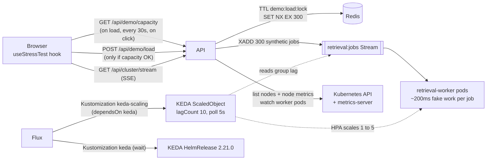

# Stress test with KEDA autoscaling + live capacity gate

**PR:** [#40](https://github.com/hacka-tron/basel.engineering/pull/40) · **Branch:** `feature/stress-test-keda` · **Spec:** `docs/DESIGN.md` §4.5, §9.2–9.7
**Status:** Merged to `main` 2026-09-30 with the owner's go-ahead (Codex approved after 5 rounds). Merging makes Flux install KEDA and the new RBAC on the live cluster; the release build succeeded, live rollout is being verified.

## TL;DR

- The footer tiger/rabbit icon (tap to run) puts 300 synthetic, no-LLM jobs on the retrieval queue. KEDA then scales the `retrieval-worker` Deployment from 1 to 5 pods, and visitors watch it live as pod dots and a backlog counter on the diagram's Worker node.
- The node is a 2 GiB machine, so a real burst is **allowed only if the node has enough live free memory**. Otherwise the click plays a convincing simulation with nothing queued.
- This is the demo that justifies the queue + KEDA architecture (DESIGN §5.3: "the thing that makes the stress test real").
- Blocking: your approval to install KEDA live. Live scaling is unverified until then, because development has no cluster access.

## What changed for a visitor

- The footer's small muted animal icon is the stress-test button (tap/click runs it; press-and-hold on touch, hover or keyboard focus shows the tooltip):
  - **Tiger**: a real burst is available. The tooltip says a click queues 300 jobs and KEDA scales workers 1→5.
  - **Rabbit**: not enough capacity, or a real burst ran recently. The click plays the same animation with nothing queued, and the tooltip explains why and how many minutes of cooldown remain.
- On click: a brief screen-shake, then pod dots appear on the Worker node (cyan = ready) with a live backlog count. When the queue drains, the dots shrink back to one pod about a minute later.
- After anyone's real burst, **every** visitor sees the rabbit for the 5-minute cooldown. An open page rechecks every 30s and when you return to the tab.

## How it works

1. **Capacity check** (`services/glassbox/api/capacity.py`, `GET /api/demo/capacity`):
   - If `demo:load:lock` has time left, the answer is "cooling down" with `retry_after_s`.
   - If Redis can't be read, the answer is "denied".
   - Otherwise, it asks the Kubernetes API for the node and its live memory usage from metrics-server. The burst is allowed only if **allocatable − used ≥ 768 MiB** (4 extra workers × 128 Mi limit + 256 Mi margin) and `MemoryPressure` is explicitly `False`.
2. **Burst** (`demo.py`, `POST /api/demo/load`): rechecks capacity, takes the global Redis lock `SET demo:load:lock NX EX 300`, then enqueues 300 jobs flagged `synthetic=1`. The worker's synthetic branch sleeps ~200 ms per job. It makes no embedding, LLM or MySQL call and publishes no trace.
3. **Scaling:** KEDA's `redis-streams` trigger watches consumer-group lag on `retrieval:jobs` (target 10 per replica, polled every 5 s) and drives an HPA from 1 to 5 replicas. The worker Deployment no longer pins `replicas`, so the HPA owns that field.
4. **Live view** (`GET /api/cluster/stream`): SSE of worker pod events plus the backlog count. Only pod name, phase and ready leave the cluster. With no cluster access (local dev) it sends `cluster_unavailable`, and the UI animates locally instead.
5. **Permissions:** the API ServiceAccount gets `get/list/watch` on pods in the `app` namespace only, plus a ClusterRole with only `list` on `nodes` and on `metrics.k8s.io` `nodes`. The Redis NetworkPolicy now also admits the `keda` namespace.

## Key design decisions & trade-offs

- **Live free memory, not allocatable.** The first version compared a static estimate to the node's *total* allocatable memory. A busy node would still say yes, and a 2 GiB node could never pass. Using live usage from metrics-server measures actual headroom. The check and the enqueue aren't atomic, and the 256 MiB margin absorbs drift during a short burst.
- **Fail closed on anything unknown.** Missing metrics, a missing or unknown MemoryPressure condition, more than one node, or no Redis all deny. The failure mode is "visitor sees a simulation", never "node OOMs".
- **Ordered Flux Kustomizations.** A ScaledObject applied in the same pass as the KEDA HelmRelease fails server-side dry-run (the CRD doesn't exist yet). That would block the *whole* root Kustomization, app workloads included. The fix is two child Kustomizations: `keda` (`wait: true`, Ready only once the chart is installed) and then `keda-scaling` (`dependsOn: keda`). A KEDA failure is isolated from the app.
- **KEDA via Flux HelmRelease, not Terraform's helm provider.** Flux already owns all live cluster config, and a second install path would invite drift.
- **Custom HPA scale-down (45 s window, 100%/15 s).** KEDA's `cooldownPeriod` only applies to scaling to *zero*. With a minimum of 1, the HPA's default 300 s window would keep 5 pods up for ~5 minutes. The spec wants them gone in about a minute.
- **KEDA memory capped to 128 Mi requested** (operator, metrics server *and* admission webhooks) to fit the §9.7 budget of 150 Mi. The chart's webhook defaults alone were 100 Mi request / 1000 Mi limit.
- **A shared cooldown shown to everyone.** The capacity endpoint reports the lock, so no visitor sees a tiger promising 300 jobs that a click can't deliver.
- **Simulation as the default experience.** The demo always *works* for the visitor. Only its realness depends on capacity.

## What review caught

| Round | Finding | Resolution |
|---|---|---|
| R1 | Capacity compared an estimate to total allocatable (unsafe on a busy node, impossible on 2 GiB); a missing MemoryPressure condition failed **open** | Live free memory from metrics-server; every unknown denies (`2b197e1`); owner-approved node-metrics read (`31716d5`) |
| R2 | Scale-down 5→1 would take ~5 min (cooldownPeriod doesn't apply); KEDA webhooks uncapped, blowing the memory budget | HPA behavior + webhook limits (`a156db9`) |
| R3 | **Approved** | — |
| R4 (after your cooldown request) | Countdown drifted in throttled background tabs; tiger shown while another visitor's burst held the lock; §9.4 doc stale | Deadline-based countdown; capacity endpoint reports the lock (`61d0818`) |
| R5 | An already-open page never refreshed; a Redis read failure fell through to "sufficient" | Poll every 30s + on tab return; Redis failure denies (`e6e754b`) |

Risk areas this shows: **fail-open defaults** and **what Kubernetes actually does compared with what the config appears to say**. The cooldownPeriod and webhook defaults are both examples. Neither shows up in a unit test.

## Operational notes & risks

- **On merge:** Flux installs KEDA (new namespace, CRDs, three Deployments) and applies the new RBAC on the live node. KEDA uses about 128 Mi of the tight 2 GiB budget.
- **Memory:** the 5-worker peak plus KEDA is right at the §9.7 estimate (~1.9–2.0 Gi). The gate should keep real bursts off a busy node. If it rarely allows one, that is the gate working, and the upgrade path is `t4g.medium`.
- **Cost:** synthetic jobs make no Bedrock calls, so a burst costs nothing beyond CPU.
- **Abuse:** one real burst per 5 minutes globally (Redis lock). Everything else is client-side animation.
- **What to watch after deploy:** `kubectl get kustomization -n flux-system keda keda-scaling` both Ready, `kubectl get scaledobject -n app`, and node memory during the first real burst.
- **Rollback:** remove `flux/kustomization-keda.yaml` from the prod overlay. Flux prunes KEDA. The HPA won't restore replicas by itself, so scale the worker Deployment back to 1 manually (documented in `k8s/README.md`).

## How to see it / verify it

- **Locally:** run the API with the fake provider. Capacity reports "unavailable" (no cluster), so the button shows the rabbit and plays the simulation. The PR's browser check at 1440 px and 375 px showed a real click → one POST → pods 1→5→4 with backlog 300→90.
- **After deploy:** hover the icon (tiger expected on an idle node), click, and watch the dots reach 5 within ~10–20 s and drop back to 1 about a minute after the backlog hits 0. Then confirm every browser shows the rabbit for 5 minutes.

## Open items / next steps

- Your go-ahead to merge (live KEDA install + RBAC).
- First real live burst: confirm the scale-up and scale-down timings and record them (these become the Phase 7 load-test numbers).
- Backlog: explicit migrate-before-api ordering and other Flux hardening items (not specific to this PR).
