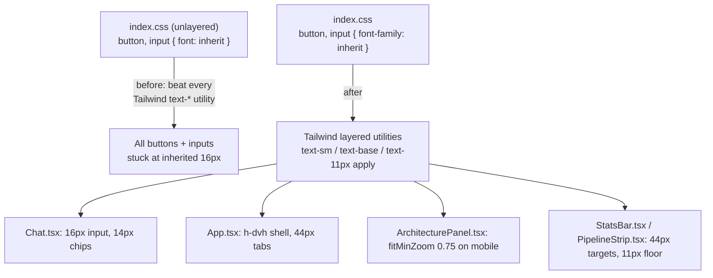

# Typography + mobile layout pass

**PR:** none yet · **Branch:** `feature/typography-mobile` (stacked on `feature/chat-context` → #41 → #40) · **Rules:** `project/MOBILE_DESIGN.md`
**Status:** Merged to `main` 2026-09-30 as PR #46 after three Codex rounds (round 3 approved; two accepted minors: a ~4px handle strip inside enlarged diagram-node tap targets, and focus loss when resizing across 768px).

## TL;DR

- Fixes a one-line CSS bug that had **silently forced every button and input on the site to 16px**, overriding the sizes the components asked for. This is why chat controls looked inconsistent.
- Brings the phone layout in line with the new mobile rules: the page fits the real visible viewport, tap targets are ≥ 44 px, no text is under 11 px, the ask input is 16 px (so iOS doesn't zoom on focus), and the mobile diagram is readable and pannable.
- Blocking: the review found that the 44 px and readability rules are not yet met in three places (details below), so it isn't ready for a PR.

## What changed for a visitor

- **Phones:** the page height follows the visible viewport (`h-dvh`), so browser toolbars no longer cut off the input. Suggested-question chips wrap and are fully readable instead of scrolling sideways in one row. Tabs, Send, "View architecture", the Stress test button and the sheet's close button all get 44 px hit areas. The architecture sheet opens at a readable zoom (0.75) and you pan around instead of seeing a shrunken whole. Footer and sheet respect the iPhone home-indicator safe area.
- **All widths:** Contact and the chips are 14 px, the ask input is 16 px, small captions ("Searched for", cache labels, backlog count) go from 9–10 px up to 11 px, and the name heading scales fluidly (`clamp()`).
- **Desktop:** meant to be unchanged apart from the corrected control sizes. See the review regression below.

## How it works

No new components or data flow. This is styling within the existing frontend (see the README's *System at a glance*: served by the `api` pod through Traefik).

Files touched: `frontend/src/index.css`, `App.tsx`, `components/{Chat,ArchitecturePanel,ContactReveal,PipelineStrip,StatsBar}.tsx`.

## Key design decisions & trade-offs

- **Why the font-shorthand bug mattered.** Tailwind v4 puts its utilities in a CSS cascade layer. *Unlayered* rules always beat layered ones, whatever their specificity. `font: inherit` is a shorthand that also sets `font-size`, so every `text-xs`/`text-sm` on a button or input was silently ignored. Changing it to `font-family: inherit` keeps the inherited mono font and lets size utilities work again. The side effect: every control now renders at the size its code *declares*, which exposed sizes nobody had seen (see the review's desktop-diagram finding).
- **Bigger hit areas via padding, not bigger text.** Controls reach 44 px with `min-h-11` or negative-margin padding, and those rules turn off at `md` and above, so the desktop layout doesn't grow.
- **Mobile diagram: same diagram, minimum zoom, pan.** This was your decision over a separate mobile diagram. React Flow nodes stay 124×42 in flow coordinates with the same handles, which keeps the arrow-flicker fixes from #35/#37 intact.
- **Chips wrap instead of scrolling sideways.** This was also your decision. Every question is fully visible, at the cost of vertical space on short phones.
- **Accepted trade-off:** the mobile header grows from ~96 to ~140 px because of the 44 px tab targets.

## What review caught (round 1, CHANGES NEEDED)

| Severity | Finding | Status |
|---|---|---|
| Important | Mobile diagram node buttons render ~92×30 px at 0.75 zoom, and the tiger/rabbit status icon is 24×24 px. Both are below the 44 px tap rule | Open |
| Important | On a short phone (375×667) the grown header plus wrapped chips leave only **48 px** for messages, and less once Contact is revealed | Open |
| Important | Desktop regression: with the CSS fix, diagram node labels drop from the (accidental) 16 px to their declared 12 px, and at the 768 px breakpoint's 0.5 zoom they render at ~6 px | Open |
| Minor | At 375 px after revealing Contact, the GitHub link's hit area spills 5 px below the header | Open |

The review confirmed the rest: 16 px input at all five widths, 14 px Contact and chips, the 11 px floor outside React Flow, `h-dvh`, chips ≥ 44 px, the footer fitting at exactly 375 px after a stress-test click, the sheet panning to Edge and MySQL, and Escape returning focus.

Risk area this shows: **fixing a global CSS rule changes things far from where you're looking.** Desktop diagram readability is the case here. Only measuring in a real browser at several widths caught it.

## Operational notes & risks

- Frontend-only. It ships as part of the normal image and has no server, data or permission impact.
- Main risk is visual regression on layouts we don't routinely look at (768 px tablets, short phones). The screenshot checklist in `MOBILE_DESIGN.md` exists for this.
- Rollback: revert the commits. The CSS change is the only global one.

## How to see it / verify it

- `npm run dev` in `frontend/`, then in Chrome device mode check 375×667, 414, 768, 1024 and 1440. Tap the chips and tabs, open "View architecture" and pan, and trigger a stress test to see the footer cooldown label at 375 px.
- Quick check of the root-cause fix: inspect a chip or the ask input. Its computed `font-size` should match its Tailwind class (14 px / 16 px), not 16 px everywhere.

## Open items / next steps

- Fix the three Important findings (mobile node and status-icon tap areas, short-phone message space, desktop diagram label size at `md`), then re-run Codex.
- Open the PR once #40 and #41 merge (or stack it on #41).
