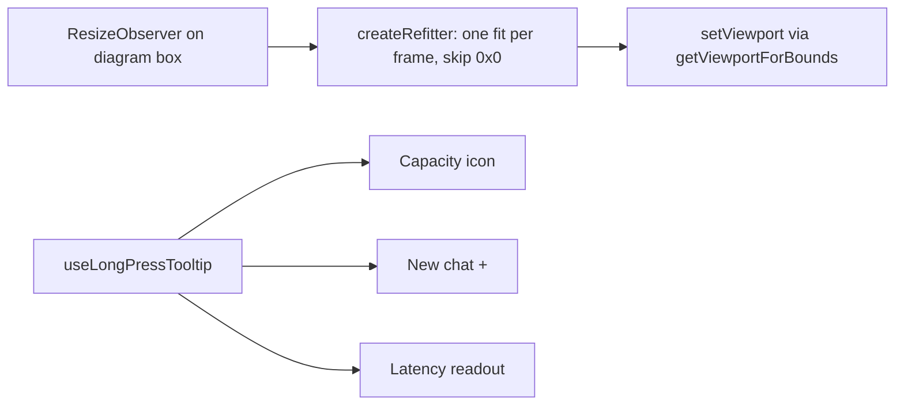

# UI tweaks: footer readout, Contact, diagram refit, mobile footer controls

Status: in review (PR opened; see the status index).

## TL;DR

Five small frontend changes. The footer latency is just the number. "Contact me" confirms with "Email copied". The architecture diagram now refits whenever its container resizes (the "stays small after widening" bug). On phones, New chat is a 44px "+" icon with the capacity icon's tap/long-press behaviour, and the latency readout explains itself on hover, focus or long press.

## What changed for a visitor

- Footer shows `312ms` or `312ms · cached` (no "first token" text). Hover, keyboard focus, or a long press on touch opens a short tooltip: time to first token, plus "served from the answer cache" or the whole-answer time. A tap does nothing. Screen readers get "Time to first token: 312ms".
- Contact me: after copying, the button reads "Email copied". Its width is reserved for the longer label, so the GitHub icon does not move (checked at 360, 375, 414 and 1440). If both clipboard paths fail it shows the address instead and never claims success.
- Diagram: widening the window after shrinking it now refits the diagram.
- Phones: New chat is an icon-only "+" (no border, muted, brightens on hover/press like the bunny). Tap starts a new chat; press-and-hold shows a "New chat" tooltip and does not start one.

## How it works

## Diagram bug: root cause

React Flow's `fitView` prop only runs once, when nodes first measure. The panel's own `ResizeObserver` refit existed only for the portrait layout. Crossing the md breakpoint remounts the desktop panel; if that happens while the window is still narrow (e.g. 768px, where the diagram box is 461px wide and zoom clamps to 0.65), the fit is computed then and never again. Widening to 1440 left zoom at 0.65 instead of 0.915, and any desktop resize (1440 to 1000 and back) never refit either.

Fix: the observer now runs in both layouts (`lib/diagramFit.ts`), recomputing the viewport from the real box size, coalesced to one fit per frame and skipped while the box is 0x0. It reacts only to container size, so trace updates never refit and nodes keep their fixed 124x42 size and handles.

Measured React Flow viewport zoom (headless Chrome, device metrics emulation):

| Sequence | Before | After |
|---|---|---|
| 1440 > 375 > 1440 | 0.915 > hidden > 0.915 | 0.915 > hidden > 0.915 |
| 1440 > 700 > 1440 | 0.915 > hidden > 0.915 | 0.915 > hidden > 0.915 |
| 1440 > 375 > 768 > 1440 | 0.65 at 768, **0.65 at 1440** | 0.65 at 768, **0.915 at 1440** |
| 1440 > 1000 > 1440 | **stuck at 0.65 at 1440** | 0.65 at 1000 (min zoom clamp), **0.915 at 1440** |

Portrait refit still works (375/414/360 stay fitted).

## Design decisions

- One shared hook, `useLongPressTooltip`, owns the long-press state machine (tap vs hold, multi-touch cancel, slop, auto-hide, outside press, Escape). The bunny was moved onto it instead of copying the logic a third time.
- `footerFit.ts` and its tests are deleted: with the icon-only "+" there is no label-vs-icon decision left.
- When no token arrived, the readout stays "total 812ms" because calling that a first-token time would be false.

## Operational notes and risks

- Frontend only. No API or infra change.
- Refit resets a user's manual pan on resize (panning is already rare; the diagram is fit-to-view).
- New chat tooltip is left-anchored at the button, so it fits at 360 to 414 but a viewport under about 340px would clip it.

## How to verify

`npm run lint && npm test && npm run build` in `frontend/`; in a browser resize 1440 > 768 > 1440 and watch the diagram zoom; at 375px long-press the "+" and the latency number.

## Open items

None.
