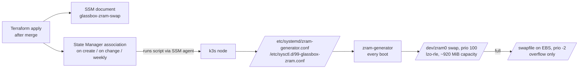

# Compressed zram swap on the node

**PR:** [#55](https://github.com/hacka-tron/basel.engineering/pull/55) · **Branch:** `fix/zram-swap` · **Spec:** `docs/DESIGN.md` §9.7 (memory budget), §10.4
**Status:** In review (Codex round 2 fixes done; awaiting re-review). **Manual `infra/bootstrap` apply is needed before merge** (see Operational notes). CI plan: 2 to add, 0 to change, 0 to destroy. The EC2 instance is not touched.

## TL;DR

- The 2 GiB node was thrashing on its disk-backed swap file. About 500 MB was swapped. IO pressure had tasks fully stalled 65–75% of the time, and k3s's SQLite datastore on the same disk was timing out: "Slow SQL", apiserver handler timeouts, and a failed KEDA Helm upgrade.
- This PR puts swap in **compressed RAM first** (`/dev/zram0`, priority 100). The old `/swapfile` is kept as overflow (priority -2), and the VM settings suit RAM-backed swap. Swapping should mostly stop hitting EBS.
- Delivery goes through a **Terraform-managed SSM State Manager association**, not user data. It runs once on creation, again whenever the script changes, and weekly to repair drift. No instance stop/start.

## What changed for a visitor

Nothing visible directly. The expected effect is fewer stalls: faster API responses under load, steadier rollouts, and fewer probe timeouts and k3s API timeouts when memory is tight.

## How it works



1. AL2023 already ships `zram-generator`, but its packaged config disables zram on any machine with more than 800 MiB RAM. The script writes an `/etc` config that overrides this, so zram0 is created on every boot.
2. The script starts zram0 now if it isn't running. **Only after zram0 shows as active swap** does it write and apply the sysctls: `swappiness=150`, `page-cluster=0`, and watermark tuning. An exit trap covers every failure path, including `set -e` aborts and a failed `/swapfile` re-enable. If zram0 isn't active at exit, the run fails, and any sysctls an earlier run left are removed and AL2023's defaults restored. High swappiness with only disk swap would make thrashing worse.
3. The kernel swaps to the highest-priority device first, so zram fills before `/swapfile` gets any new pages.
4. The script is idempotent. On a re-run it reports "unchanged" and "already active" and changes nothing. It never turns swap off.

## Key design decisions & trade-offs

- **SSM association, not user data.** User data only runs on first boot, and changing it on this instance forces a stop/start. An association is the Terraform-native way to converge host config on a running box. It also becomes the home for any future host tweak.
- **Use AL2023's own zram-generator instead of a custom systemd unit.** It was already installed (checked read-only on the node), it handles module loading, device sizing and swapon at boot, and it is the distro-supported path. The only thing needed was overriding the packaged `host-memory-limit=800`.
- **Compressor is lzo-rle, not zstd.** Read-only checks showed the 6.18 AL2023 kernel builds only zram's LZO backend. zstd would compress better but isn't available. The script picks the best available compressor at run time, so a future kernel with zstd gets it without a code change.
- **Size is half of RAM, capped at 1 GiB** (uncompressed capacity). Only the compressed pages use RAM, so storing ~600 MB of swapped pages costs roughly 200–300 MB. That RAM was being lost to IO stalls anyway.
- **`swappiness=150`, not higher.** With zram, swapping anonymous memory is cheaper than evicting file cache (binaries, SQLite pages) and re-reading it from EBS. 150 is a middle value in the commonly recommended 100–180 range. It is not pushed to 180 because `/swapfile` is still disk-backed and takes overflow.
- **Resizing a live zram device is deferred to reboot.** Changing size or compressor while zram0 is in use would need `swapoff`. That is risky under memory pressure, so the script logs a note instead.
- **No new paid resources.** Run output stays in SSM's association history, with no S3 bucket and no CloudWatch log group.

## What review caught

Codex round 1 asked for changes, and all of them are addressed:
- **Sysctl ordering (Important).** The script used to persist and apply `swappiness=150` before confirming zram started. If setup had failed, the node would have been left favoring swap, with only EBS behind it. The sysctls are now applied only after zram0 is confirmed active. On failure, the run exits non-zero and removes any sysctls a previous run left. This is tested with stubs: a first-run failure leaves no sysctl file; success, then an idempotent re-run; a later failure removes the file and restores defaults.
- **Association IAM too broad (Important).** The instance ARN is dropped from the association permissions, because IAM never checks it for `Targets`-based associations. `ModifyDocumentPermission` is removed, so the document can't be shared. Create and update of associations are allowed only for `glassbox-*` documents: simulation shows `AWS-RunShellScript` and other documents denied. **Residual risk, stated plainly:** IAM can't limit an association's target instances, so `glassbox-ci` could run a `glassbox-*` document it wrote on another instance in the account. Association access is tag-scoped since round 2, but the role's pre-existing region-wide `ssm:AddTagsToResource` (granted for parameters) could tag a foreign association into scope. Both are accepted: the account has a single instance and no other associations, and the role already has `ec2:*`, which is a stronger power.
- **Partial-apply wording (Minor).** Clarified under Operational notes.

Codex round 2 asked for changes, and both are addressed:
- **Rollback could be skipped (Important).** If re-enabling `/swapfile` failed under `set -e`, the script exited before the rollback ran. An `EXIT` trap now handles every exit path: if zram0 isn't active swap, the run fails and the stale sysctls are removed and defaults restored. A `systemctl` error with zram actually up is treated as success.
  - Stub-tested in AL2023 for: zram plus swapfile failing on the first run and after a success, a `set -e` abort with a stale file, "error but up", a swapfile-only failure (exit 1, zram sysctls kept), success plus re-run, and dry-run.
- **Association scope (Important).** SSM does support tag conditions on associations, per the AWS Service Authorization Reference for Systems Manager: `aws:RequestTag`/`aws:TagKeys` on `CreateAssociation`, and `aws:ResourceTag` on Describe/Update/DeleteAssociation. The CI role now needs `project=glassbox` to create, read, update or delete an association. The plan role needs it to read one. The document and association carry that tag explicitly, not only through `default_tags`. IAM simulation shows tagged requests allowed and untagged or other-tagged ones denied.

Earlier self-checks:
- The first draft piped the script into `bash -s`. Any command in it that read stdin could have swallowed the rest of the script. The body is now wrapped in `main()`, so bash parses all of it before running any of it.
- shellcheck flagged one `local x=$(...)` return-value mask, which is fixed.

## Operational notes & risks

- **Manual bootstrap apply needed first.** The CI apply role has no SSM document or association permissions today. The owner must `terraform plan` and then `apply` `infra/bootstrap` locally (see `infra/bootstrap/README.md`) before merging. If that step is skipped, the post-merge apply can **partially apply**. With today's live policy, `CreateDocument` is denied, so most likely nothing gets created. But if the grant is partial or stale, the document can be created and then the association fails with AccessDenied. Recovery: apply `infra/bootstrap`, then re-run the Terraform workflow on `main` (re-run the failed job, or push any `infra/**` change). Terraform keeps whatever was created in state and creates only what is missing. Nothing on the node changes until the association exists. A local read-only plan shows exactly 2 in-place policy updates (`glassbox-ci`, `glassbox-ci-plan`), 0 adds and 0 destroys. IAM simulation shows:
- The CI role can manage `glassbox-*` documents (no sharing) and their associations, including tags. Associations need the `project=glassbox` tag.
- `SendCommand` is denied, and so is associating any other document.
- The plan role can only read.
- **The first run happens at apply time.** Creating the association runs the script right away. It only adds swap and changes sysctls, so no pods restart. Expect some CPU for compression, which spends t4g burst credits, instead of disk IO.
- **Pods can use zram too.** The kubelet runs with `fail-swap-on=false`, and pod cgroups have `memory.swap.max=max`.
- **If zram fills and `/swapfile` usage climbs again,** the working set really does exceed 2 GiB. The next step is the documented `t4g.medium` upgrade, not more swap.
- **Rollback** is manual and documented in DESIGN §9.7. Remove the association first so the weekly run doesn't redo the setup, then run `swapoff /dev/zram0` while there's room, remove the two config files, run `daemon-reload`, and restore the sysctls.

## How to see it / verify it

After the apply, run these checks read-only via SSM Run Command:

```sh
swapon --show          # expect /dev/zram0 prio 100 above /swapfile prio -2
zramctl                # ALGORITHM lzo-rle, DATA vs COMPR ratio
cat /proc/pressure/memory /proc/pressure/io
vmstat 5 3             # si/so and bi columns
sysctl vm.swappiness vm.page-cluster
```

Also run `aws ssm describe-association-executions` for the `glassbox-zram-swap` association and expect `Success`.

**Baseline to compare against (2026-09-30):**

| Signal | Baseline |
|---|---|
| `/swapfile` used | ~500–590 MB |
| Swap-in / swap-out | ~8.5 / ~6 MB/s |
| Disk reads | ~1,580/s |
| Memory PSI `full` | ~37–40% |
| IO PSI `full` | ~65–75% |

**Target:**
- IO PSI `full` far below that baseline.
- Disk reads and `/swapfile` swap-in near zero.
- Most swapped data sitting in zram at a 2–3× compression ratio.

## Open items

- Owner: apply `infra/bootstrap`, then merge and approve the `terraform-prod` apply.
- After the apply: collect the before/after numbers above and update this report.
- If k3s "Slow SQL" warnings persist even with low IO PSI, look at the datastore separately. One example: moving k3s to its own volume.
