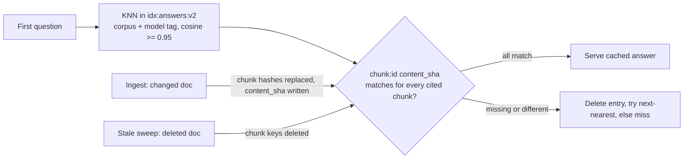

# Answer cache survives unrelated re-ingests (2026-10-01 15:48 PT)

**Status:** PR [#117](https://github.com/hacka-tron/basel.engineering/pull/117) open; review round 1 fixes pushed. Not merged, not deployed.

## TL;DR

Every changed document bumped the corpus-wide version `corpus:ver:{corpus}`, and the semantic answer cache was keyed by it. So any docs edit, anywhere, emptied every cached answer for that corpus. About 20 releases re-ingested the corpus, and the 100-answers/day LLM budget ran out. Now a cached answer stays valid across re-ingests unless a document it was built from changed or was deleted.

## What changed for a visitor

Nothing visible, except more answers come back instantly from the cache after a deploy, and the daily answer budget lasts longer.

## How it works

- The answer key is corpus + model identity (embedding model, LLM model, prompt version) + question vector. The corpus version is gone from it, and from the miss lock.
- Each entry stores `sources`: `{chunk id: content_sha}`, the SHA-256 hex of each chunk text the answer was built from. Ingest writes the same `content_sha` field on every `chunk:{id}` hash.
- Each read compares the two in one pipelined round trip. A missing key, a missing field or a different hash means a source document changed or was deleted, so the entry is deleted and read as a miss. The 3 nearest entries are checked, so a stale entry never hides a fresh one.
- The write is skipped if a source's text no longer matches by the time the answer is generated. That replaces the old "corpus version unchanged since the read" check.
- Chunk hashes written before `content_sha` existed get it from #122's reconcile, which runs at the end of every ingest and rewrites any key whose fields differ from MySQL. Round 1 had its own one-time backfill; it was dropped when #122 merged, leaving one mechanism. The model-tag backfill sets its field only on keys that exist (Lua `EXISTS`-then-`HSET`), so it can't recreate a deleted key.

## Key design decisions and trade-offs

- **Per-chunk content hashes, checked in Redis.** There is no MySQL on the hit path. The hash is computed from the text the answer actually saw, so an answer generated from old text can't be stamped with a new hash.
- **Content, not just existence (review round 1).** The first version only checked that each `chunk:{id}` key existed. Review found the hole: InnoDB never reuses an auto-increment id in normal operation, but `TRUNCATE`, a recreated table, or a MySQL wipe or restore while Redis keeps its data (separate volumes) restarts the ids. A new `chunk:5` would then pass for an answer built from the old `chunk:5`. Comparing `content_sha` closes that. A parallel PR's MySQL→Redis reconcile writes the same field, with the same definition.
- **Retrieval cache keeps the corpus-version key.** Any new or edited document can change which chunks rank highest, and recomputing costs a KNN query, not LLM budget. Correctness wins there. The chunk text cache is keyed by chunk id, so it needed no change. The ingest and sweep version bumps stay for the retrieval cache.
- **Accepted lag:** a new document that would improve an answer it wasn't built from is picked up only when that answer's 24h TTL ends. The warm-up regenerates the suggested questions then.
- **Old entries are never read.** New index `idx:answers:v2` over `ans2:` keys. The old `idx:answers`/`ans:` entries are invisible and expire within 24h. An entry whose payload names no chunk ids can never validate either.
- Refusals and empty answers are still never cached, and are still rejected on read.

## Tests

Fake providers only. No live calls, no RAG eval.

- In-memory Redis Search stand-in (always runs): a hit survives a re-ingest of an unrelated document (version bumped); a miss after the source document changes (and the entry is deleted); a miss after a source document is deleted (sweep order); a stale nearest entry doesn't hide a valid one; the write is skipped when a source vanished; the key and fields carry no corpus version; legacy `ans:` entries and source-less entries are ignored; the lock key has no version; and the warm-up runs `warmed`, then `cached` after an unrelated re-ingest, then `warmed` again after its own source changes.
- Existing lock tests (one LLM call for simultaneous misses, bounded wait) pass with the new signature.
- Real Redis Stack and MySQL (skipped locally, they run in CI): the answer cache against Redis Stack (scoping, missing chunk, legacy entry invisible), the existing repeat-request test, and an end-to-end ingest test. That test edits an unrelated doc (hit), edits the source doc (miss), then deletes a doc with `sweep=apply` (miss).
- Round 1 added in-memory tests for a reused id holding different text (miss), a hash without `content_sha` (miss), and unverifiable payloads not written. It added a Redis Stack check of the `content_sha` mismatch, and a real-Redis test that the model-tag backfill never recreates a deleted key. The ingest test now also asserts that `content_sha` is written.
- After merging #122: `pytest services/tests` locally 661 passed, 25 skipped (DB/Redis-backed); in CI 684 passed, 2 skipped (only the two "Phase 1a about_me chunks" fixtures), so the Redis/MySQL integration tests ran. `ruff check services eval` is clean.

## Operational notes and risks

- **One-time cold answer cache at deploy.** The new index starts empty. The ingest Job's warm-up then regenerates the suggested questions, which uses up to 7 of the warm-up's 10/day LLM cap. Visitors' other questions regenerate on first ask.
- Until the first ingest after deploy (its reconcile) back-fills `content_sha`, every answer misses and no answer is written. The ingest Job runs right after the app is healthy, so this lasts minutes.
- The old `idx:answers` index lingers, empty after 24h. Dropping it is in the backlog.
- Every writer of `chunk:{id}` hashes must set `content_sha` from the stored text, or answers built from those chunks never cache. This fails safe (cold), never stale, and it's in the reviewer primer.
- The production sweep runs in `report` mode, so a deleted file's chunks stay indexed and its answers stay cached. That is consistent with retrieval, which also still serves them.

## What review caught (round 1)

- **Critical:** a golden-set gold snippet quoted the old DESIGN §7.3 sentence, so CI collection aborted; it now quotes the new text. Also, the deep-dive caching section grew past 500 tokens and split into two chunks; it is condensed back to one (34 chunks, as the test pins).
- **Important:** id reuse after a MySQL wipe or restore could pass an existence-only check. Fixed with `content_sha`, as above.
- **Minor:** the model-tag backfill could recreate a deleted key; it now uses Lua. The docs name the id-reuse exceptions. BACKLOG now has the `FT.DROPINDEX` item and the embedding-model rollback note.

## How to verify after deploy

- After a docs-only merge, the next warm-answers run logs mostly `cached` instead of `warmed`.
- `queries.cache_status = 'answer_hit'` share stays steady across releases.

## Open items

- Drop `idx:answers` (v1) once the deploy is live.
- Optional: shorten the lag for new documents (see BACKLOG "Answer cache follow-ups").
