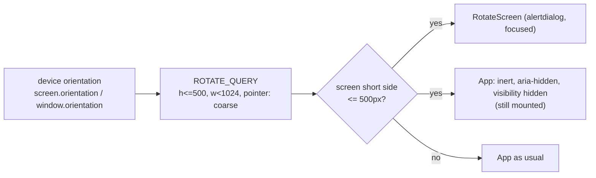

# Phones are portrait only: "turn your phone upright" (2026-10-01 15:53 PT)

**Status:** PR [#119](https://github.com/hacka-tron/basel.engineering/pull/119) open, awaiting review.

## TL;DR

Owner: "the horizontal layout is basically unusable on phones, is there any way to lock it to vertical only?" A web page cannot lock the orientation in a browser tab (Screen Orientation `lock()` needs fullscreen or an installed PWA; iOS does not support it). So a phone held sideways now shows a full-screen "Turn your phone upright to use basel.engineering" message instead of the app. Tablets and desktop are unaffected. The landscape phone layout from #100/#113 was removed, which cuts about 120 lines of layout code and tests.

## What changed for a visitor

- Phone sideways (568x320 up to 932x430): a dark screen with a cyan phone icon turning upright (still with reduced motion), the message, and "Basel Abdel-Rahman · Source on GitHub" as a link.
- Turning the phone upright brings the app back exactly as it was: a streaming answer keeps streaming, the conversation, the Chat/Diagram view and the selected component are kept.
- Portrait phones, tablets (either orientation) and desktop look the same as before.

## How it works

- `lib/layout.ts`: `ROTATE_QUERY`, `isDeviceLandscape`, `isPhoneScreen`, `showsRotateScreen`; `hooks/useRotateScreen.ts` combines them; `components/RotateScreen.tsx` is the screen.
- `md` keeps its #100 height clause, so a phone held sideways stays in the phone layout underneath and turning back never remounts the diagram.

## Key design decisions

- **Sideways means the device, not the viewport.** `screen.orientation.type` (fallback `window.orientation` = ±90 on iOS before 16.4), re-read on orientation change and resize. Review round 1 caught that `(orientation: landscape)` breaks typing on Android: the keyboard shrinks an upright phone's viewport to about 360x280, so the rotate screen flashed on every tap of the ask box, blurred it and closed the keyboard. The viewport query is now only a size guard. The screen also never takes focus from a text field.
- **`pointer: coarse` plus the screen size, not the viewport alone.** `pointer: coarse` keeps a short desktop window (900x450 with a mouse) usable. The screen size (at most 500 CSS px on the short side) keeps tablets usable when Android's on-screen keyboard shrinks a landscape viewport to under 500px; the screen does not shrink, so they never get the rotate screen mid-typing.
- **JS only, no CSS copy.** The screen size cannot be checked in CSS without deprecated `device-*` features, so React shows the screen. `lib/layout.test.ts` checks that the rotate query is `max-md`'s landscape clause plus `pointer: coarse` (so the phone layout is always underneath) and that no CSS copy exists.
- **Hide, don't unmount.** `inert` + `aria-hidden` + `visibility: hidden` on the app root keep React state and in-flight requests. `visibility` (not `display: none`) keeps the layout, so the diagram's ResizeObserver refit works on the way back. Escape is stopped before the app's listeners so it cannot deselect or leave the Diagram view behind the screen.
- **Removed:** the `phone-landscape:` variant and its classes (header, chips beside the ask box, compact footer, details beside the diagram), the three-row landscape graph (`landscapeNodes`/`landscapeEdges` and 3 tests), `squeezedMinZoom` (#113, and its test), and the header hiding in landscape Diagram view. The removed code is now unreachable on phones, and keeping it only for short desktop windows was not worth the upkeep; those windows (768 to 1023px wide, at most 500px tall) get the portrait phone layout.
- **No manifest change:** the site has no web manifest, so no `orientation: "portrait"` was added.
- **Phone preview:** the landscape frames load `/?phone`, which the dev server (only) treats as a phone, since a desktop browser has no touch screen or phone-sized screen.

## What review caught

- Round 1 (CHANGES NEEDED): **critical**, Android keyboard on an upright phone made the viewport landscape-shaped and the rotate screen blocked typing; fixed by reading the device orientation. Also: merge conflict with main (CI had not run), a stale `squeezedMinZoom` mention in BACKLOG, re-reading the screen size on orientation change (foldables), and documenting that live-region announcements are silent under the screen.

## Verification

Headless Chrome against the phone preview on port 5246, `/api/ask` faked in the page (0 live questions), screenshots in the session scratchpad `rotate/`:

- 667x375, 568x320, 896x414, 740x360 with touch and a phone screen: the rotate screen shows, has focus, labelled "Turn your phone upright to use basel.engineering"; the app is `inert`, `aria-hidden`, hidden.
- Turned sideways mid-answer and back: the answer kept streaming and finished, 1 request in total. In Diagram view with Worker selected: sideways, Escape, upright: Worker still selected, details open, diagram refitted with all 11 nodes.
- No rotate screen: 1024x768 and 768x1024 tablets, a 900x450 desktop window (fine pointer), and a 900x450 touch viewport on a 1280x800 screen (tablet with the keyboard open).
- Reduced motion: the icon's animation is `none`.
- Before/after at 393x852, 320x568 (chat, answered, diagram, selected) and 1280x800: pixel diffs are at the same level as two runs of the unchanged code (sub-pixel antialiasing on node edges and text); visually identical.
- Upright phone with the keyboard open (360x640 screen, portrait-primary, 360x280 viewport that CSS calls landscape): no rotate screen, the ask box keeps focus. The same short viewport with the device landscape: rotate screen, focus not moved into it.
- Chat announcements are silent while the screen shows (the app is `aria-hidden`).
- `npm test` (118), `npm run lint`, `npm run build` pass.

## Open items

- Check on a real iPhone and Android phone after deploy (rotation, focus return, the rotating icon).
