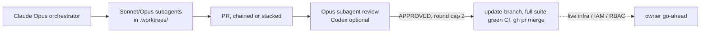

# Process docs match how we work now (2026-10-01 21:05 PT)

**Status:** Merged 2026-10-02 (PR [#127](https://github.com/hacka-tron/basel.engineering/pull/127)). Docs only.
**Date:** 2026-10-02

## TL;DR

The working-process docs still described Codex as the review gate and Gemini as the fallback, and `AGENT_HANDOFF.md` had grown to 350 lines of checkpoints. They now say what we actually do: Claude orchestrates parallel worktree subagents, an Opus subagent is the default reviewer (Codex optional, Gemini legacy), round cap 2, reviews recorded in the PR body via REST, chained/stacked PRs with trial merges, and agents merge without asking after APPROVED + green CI (except live infra, IAM and RBAC).

## What changed

- `project/orchestration/README.md`: rewritten around current roles, dispatch hard rules (tfstate, no apply, no live writes, never `git stash`), stacking and trial merges, the "checked in" gate and the merge sequence (`gh api -X PATCH` body, `gh pr update-branch`, full suite on the merged tree, `gh pr checks --watch`, `gh pr merge --merge`).
- `codex-reviewer.md` renamed `reviewer-brief.md` and made reviewer-neutral (Opus subagent default, Codex command kept as optional).
- `project/CLAUDE.md` "Working style": shorter, current, plus the owner's content rules (no RAG evals until more docs, `corpus/about-me/` mirrors the resume, private About Basel repo in #126).
- `project/AGENT_HANDOFF.md`: a short current handoff (state, open PRs, owner clicks, parked work, where to look). The old checkpoints moved verbatim to `project/archive/AGENT_HANDOFF-2026-09-29-to-10-01.md`.
- `project/CODEX.md` and `orchestration/gemini-reviewer.md` moved to `project/archive/` with legacy banners. `AGENTS.md` updated.
- `project/BACKLOG.md` "> RESUME HERE" brought to today; merged PRs marked merged in BACKLOG and in this index.

## Design decisions

- **Archive, don't delete:** handoff history and the Codex/Gemini guides are still useful context (Flux lessons, Codex worktree lessons), just not every session.
- **Ingested files untouched:** `docs/` and `k8s/` mention `AGENT_HANDOFF.md` and the old Gemini template; those references are historical and editing them would churn the chatbot corpus, so they stay.

## Verification

- `services/glassbox/ingest/scanner.py` ingests only `infra`, `k8s`, `services`, `docs` and `corpus/about-me`; every edited file is under `project/` or the repo root.
- No dangling references to the moved files outside `project/status/`, `project/archive/` and one historical plan in `docs/`.

## Open items

- None.
