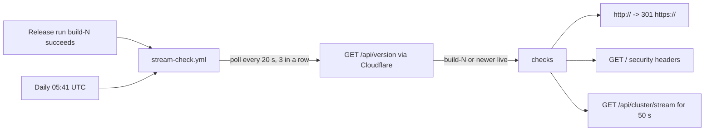

# Post-deploy streaming check through Cloudflare (2026-10-01 22:39 PT)

**Status:** Merged 2026-10-02 (PR [#143](https://github.com/hacka-tron/basel.engineering/pull/143)); Opus review round 1 APPROVED, minors fixed. Live: the first post-release run passed every check on build-104, and again on build-105.
**Design:** `docs/DESIGN-002-followups.md` §7.5 and §7.8; DESIGN-004 §7 item 2.

## TL;DR

After every release, a GitHub Actions workflow waits until the new build is actually serving, then streams from the live site through Cloudflare and fails if streaming is broken. It also runs once a day to catch a Cloudflare setting changed by hand. It costs nothing: it never asks a real question, so it never spends the daily LLM budget. A failure is a failed (emailed) workflow run and never blocks or rolls back a deploy.

## What changed for a visitor

Nothing visible. There is one new public read-only endpoint, `GET /api/version`, which returns `{"build": "build-N"}`.

## How it works

- **Knowing the build is live.** The image didn't know its own tag, so `release.yml` now passes `GLASSBOX_BUILD=build-N` as a Docker build argument (declared at the end of the Dockerfile, so it doesn't bust cached layers) and the API reports it at `/api/version`. The check polls that until it sees the Release run's number, or a newer one, on 3 reads in a row (a rolling update can briefly answer from the old pod). Up to 30 minutes; after that the run fails with "not live", which also catches a stuck Flux rollout or migration.
- **Streaming checks** on `/api/cluster/stream`: 200, `text/event-stream`, no compression even though the request offers gzip/br/zstd, `no-cache`, Cloudflare `cf-cache-status` `DYNAMIC`/`BYPASS`, security headers present. Then it reads for 50 s and timestamps every arrival: the pod snapshot must arrive within 5 s, a `: ping` heartbeat must arrive whenever no event came for 15 s, and no gap may exceed 20 s (15 s heartbeat + 5 s). A buffering layer would hold the snapshot and pings and deliver them in a late burst, failing both the first-event and the gap check. The arrival table is in the run's job summary.
- **Edge checks:** `http://basel.engineering/` answers 301 to `https://`; the page has all eight security headers.

Proof run against production on 2026-10-02 with the default 50 s window (before this PR's endpoint existed, so without the build wait): snapshot at 0.13–0.23 s, pings at 15.24, 30.23 and 45.30 s, longest gap 15.07 s, no Content-Encoding, `cf-cache-status: DYNAMIC`, 301 to HTTPS, all headers present: all checks passed. An earlier run landed in #142's rollout and saw the page answer 503 while the single api pod was replaced; that is why a page 5xx is now retried twice, 30 s apart.

## Key design decisions

- **Cluster stream, not `/api/ask`.** Every real question can spend a slot of the daily LLM budget and an embedding call. Even a warmed suggested question is free only while both its embedding and its answer stay cached; any miss falls through to a real, paid answer, so it can't be proven free, and it would also add query-log rows. The cluster stream goes through the same Cloudflare `/api/*` cache rule, the same Traefik route and the same `with_heartbeat` SSE wrapper, and is free per viewer (one shared Kubernetes watch). What this does not prove: token-by-token spacing of a real answer. The browser's TTFT readout and `queries.ttft_ms` cover that.
- **A version endpoint over reading the `deploy` branch.** Flux committing a tag bump doesn't mean the pods run it; `/api/version` through Cloudflare proves the new code is serving.
- **Never a gate.** It runs after the deploy, from `workflow_run`, with `contents: read`, no secrets and no AWS. A newer release cancels a check still waiting on an older one; the daily run has its own concurrency group.
- **Python standard library, not bash + curl.** Per-line arrival timing and a fake SSE server for offline tests are much simpler that way; the runner's `python3` needs no setup step.

## Operational notes and risks

- The first release after merge is the first image with `/api/version`, so that run's wait succeeds once that release is live; nothing older can satisfy it.
- `X-Accel-Buffering: no` isn't checked at the edge, because Cloudflare doesn't forward it.
- The per-IP stream cap is 5; the check holds one stream for 50 s, and a 429/503 is waited out (up to two retries).
- Like the uptime probe, GitHub emails failures to whoever last changed the cron line and disables the daily schedule after 60 days without repository activity.

## How to verify

- After merge: Actions → Stream check should start when that merge's Release run finishes and pass a few minutes later; its summary shows the arrival table.
- Locally, read-only: `python3 .github/scripts/stream-check.py` (add `--expect-build build-N` to wait for a release).
- Tests: `pytest services/tests/test_stream_check.py services/tests/test_health.py`.

## What review caught

Round 1 (Opus subagent): APPROVED. Minors fixed: concurrency moved to the job level (a skipped run for a failed Release can no longer cancel a running check); no pings is fine when events never left a 15 s quiet gap; a multi-digit build comparison test (build-10 vs build-9).

## Open items

- None blocking. Possible follow-up: a manual, owner-run variant that asks one real question to time tokens through Cloudflare (spends one budget slot).
