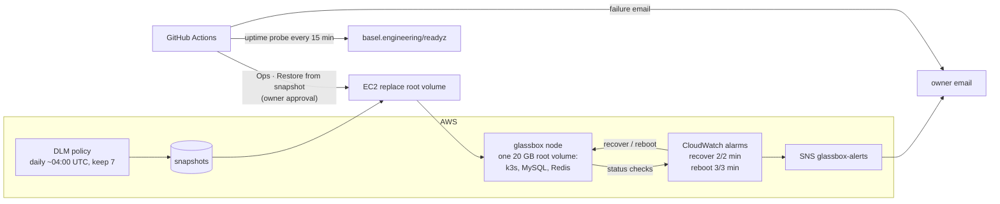

# Alarms, uptime probe, daily snapshots and a one-click restore

**Status:** PR open ([#124](https://github.com/hacka-tron/basel.engineering/pull/124), branch `infra/alarms-snapshots`). Nothing is live until the owner runs Bootstrap, approves the Terraform apply and confirms the SNS email (steps under "How to see it"). The uptime probe starts running at merge.
**Date:** 2026-10-01

## TL;DR

On 2026-10-01 you chose "alarms + daily drive snapshots" instead of phases 2 to 4 of the self-healing plan (MySQL dumps to S3, boot script, Auto Scaling group cutover). This PR builds that choice:

- **Two CloudWatch alarms** on the node's EC2 status checks. A host-side failure triggers an automatic **recover**, which moves the instance to healthy hardware with the same ID, IP and disk. A guest-side failure (hung kernel, out of memory) triggers an automatic **reboot**. Both email you.
- **An uptime probe**: a free GitHub Actions workflow GETs `https://basel.engineering/readyz` every 15 minutes, and GitHub emails you when it fails.
- **Daily snapshots** of the node's only disk (k3s, MySQL and Redis all live on it), kept for 7 days.
- **"Ops · Restore from snapshot"**: one approval click puts the disk back to a chosen day. It uses EC2 "replace root volume", so the node keeps its instance ID and Elastic IP. **"Ops · List snapshots"** (and every Diagnose) shows the snapshot IDs and dates.

Cost: about **$0.40 to $0.80 a month**, almost all of it snapshot storage.

## What changed for a visitor

Nothing visible. The site gets back up faster after a host or kernel failure, without anyone pressing a button. A bad disk state can be rolled back in one click, at the cost of up to a day of data.

## How it works

- **Alarms** (`infra/modules/compute/alarms.tf`): `glassbox-node-recover` watches `StatusCheckFailed_System` (2 of 2 one-minute periods) and `glassbox-node-reboot` watches `StatusCheckFailed_Instance` (3 of 3). They use different windows so the two actions can't race. Missing data never triggers an action. Both notify `glassbox-alerts` when they fire and when they clear. The address is a plain Terraform value, since it is already public on the site.
- **Snapshots** (`infra/modules/compute/snapshots.tf`): a Data Lifecycle Manager policy runs as the new `glassbox-dlm` role and targets the instance by its `Name` tag, not the volume. A restore gives the instance a new root volume, and an instance-targeted policy keeps snapshotting it. Each snapshot is tagged `project=glassbox`, `glassbox-backup=daily-root` and with the instance ID.
- **Restore** (`.github/scripts/ops-run.sh`, `restore_snapshot`): it validates `snapshot` (`latest` or a well-formed `snap-` ID) and `old_volume` (`keep`/`delete`) before making any AWS call. It then requires the instance to be `running`, refuses if a restore is already in flight, and accepts only a completed daily snapshot of this instance. Only after all of that does it call `CreateReplaceRootVolumeTask`. It polls the task, waits for the SSM agent, and the usual diagnose runs before and after.
- **Listing** (`aws_overview`): alarm states, snapshots and restore tasks come from the AWS API on the runner, so they print even when the node is down. Each part fails soft with a note, for example before the Bootstrap run.

## Key design decisions and trade-offs

- **Whole-disk snapshots, not a MySQL dump.** One snapshot captures k3s, MySQL and Redis at the same instant, so they can't disagree after a restore (for example, the answer cache can't point at chunks that don't exist). It costs up to 24 hours of data and a reboot, which you accepted.
- **Crash-consistent, with no pre-snapshot script.** A snapshot is the disk as after a power cut. InnoDB (redo log) and SQLite (WAL) recover from that by design. A DLM pre-script that runs `sync` needs a second role with SSM permissions and an SSM document, and it only shortens the window of unflushed writes. It doesn't make anything more consistent, so it is documented and left out.
- **Replace root volume, not a new instance.** It is in place: same instance ID, Elastic IP, Cloudflare record, alarms and zram association. Nothing in Terraform has to change. EC2 accepts only snapshots of this instance's current or previous root volumes, which is exactly what the policy takes.
- **The old volume is kept by default.** `old_volume=keep` leaves the pre-restore disk detached as evidence and as a way back. It costs about $1.60 a month until deleted, and the ops roles can't delete volumes, so a cleanup path is a backlog item. `delete` makes EC2 remove it once the restore succeeds.
- **IAM scoping** (separate commit, needs Bootstrap first):
  - `glassbox-ops` may replace the root volume only of the tagged instance, and when a snapshot is named, only one carrying the DLM tags. IAM can't force a snapshot to be named, so a launch-state or `--volume-id` replacement is stopped only by the reviewed script and your `ops` approval (details in "Operational notes"). It may use the EBS KMS key only through EC2, and pause and resume only the reboot alarm's actions. It has no snapshot or volume deletion.
  - `glassbox-ops-read` gains read-only listing of snapshots, restore tasks and alarms.
  - `glassbox-ci` gains alarm writes on `glassbox-*`, `sns:*` on `glassbox-*` topics, DLM policy management in the region, the CloudWatch Events service-linked role, and `iam:PassRole` for `glassbox-dlm` to DLM only.
  - `glassbox-ci-plan` gains the matching reads.
- **The probe needs no secrets.** With `permissions: {}`, there is nothing to leak in a public repository.

## What review caught

During implementation, the offline test caught a fail-open: an unreadable restore-task list was treated as "no restore in flight". It now refuses. Mutation checks confirmed the test fails if the "completed only" or "in flight" guards are removed.

Review round 1 (Opus reviewer) judged the change safe to apply: the prod plan is 7 to add, 1 to change, 0 to destroy, with no instance replacement. It asked for these fixes, all made:

- **Important: "only from a daily snapshot" was not enforced by IAM.** The snapshot tag condition applies only when a snapshot is named. A launch-state replacement, or one from an existing detached volume, would likely pass. No valid condition key separates those modes (`ec2:SnapshotID` exists only on the snapshot resource), so no Deny was added. The comments and `infra/CI.md` now state the residual risk: those modes are blocked by the reviewed script plus your approval.
- **Timing.** The task poll went from 30 to 20 minutes and the SSM wait from 15 to 10, so the restore plus the after-diagnose fit the 60-minute job and the one-hour credentials.
- **Reboot alarm during a restore.** Its actions are now paused just before the replacement and re-enabled on every exit path. A failed re-enable fails the run, and the listing shows whether alarm actions are enabled.
- **Trust and KMS conditions.** The `glassbox-dlm` trust gained `aws:SourceAccount` and `aws:SourceArn` (as the EBS guide recommends), and `kms:CreateGrant` gained `GrantIsForAWSResource`.
- **Kept volumes.** List snapshots and Diagnose now list detached volumes with a monthly cost estimate.
- The offline test grew to 104 checks, and a mutation check covers the alarm re-enable trap.

## Operational notes and risks

- **Apply order matters:** Bootstrap first, or the Terraform apply fails with AccessDenied, and nothing is half-created.
- **SNS confirmation:** you must click the AWS email, or no alarm email is delivered. Terraform can't delete a subscription that is still pending; it expires after about 3 days.
- **Alarm tests:** don't force an alarm state. The action would really reboot or recover the node.
- **A restore loses everything since the snapshot:** questions asked, cache entries, budget counters (the day's LLM budget may be spent again), and Flux's progress. Flux re-applies `deploy` after the boot.
- **The reboot alarm during a restore:** the runbook pauses the reboot alarm's actions for the restore and re-enables them on every exit path. Only a hard-killed runner could leave them paused, and the listing then shows `False` for that alarm.
- **IAM doesn't force "from a daily snapshot".** The `ops` role could, in principle, also do a launch-state replacement or one from an existing volume. Only the reviewed script and your approval stop that.
- **Untested live paths:** the IAM tag conditions for `CreateReplaceRootVolumeTask` (snapshot tags) can only be proven on a real call. If AWS evaluates them differently, the restore fails with AccessDenied before anything changes (fail closed). A first restore is only possible on the live node, so it waits for your go-ahead or a real incident.
- **Terraform after a restore:** the next plan may show an in-place tag update on the new root volume. It is harmless.
- **Uptime probe:** GitHub disables scheduled workflows after 60 days without repository activity, and schedules can start late. Failure emails go to whoever last changed the cron line, and this repository's commits use a local author email, so confirm the first failure email actually arrives.
- **What this does not cover:** the instance being terminated, or its Availability Zone failing. The snapshots survive that, but building a new node from one is a manual job. That is what the deferred phases would solve.

## How to see it / verify it

1. Merge.
2. **Actions → Bootstrap → Run workflow** on `main`, then approve. The plan should show only in-place updates to four role policies (`glassbox-ci`, `glassbox-ci-plan`, `glassbox-ops-read`, `glassbox-ops`).
3. Approve the pending **Terraform** run on `main`. It adds the topic, subscription, two alarms, the `glassbox-dlm` role and policy attachment, and the DLM policy. That is 7 to add, and the instance shows no change. The plan's 1 in-place change is `module.ops.aws_ssm_document.ops["diagnose"]`, from the earlier merged Diagnose changes (#116, #121); that is expected.
4. Click the **AWS Notification - Subscription Confirmation** email.
5. Run **Ops · List snapshots** (both alarms `OK`, "no snapshots yet"), then **Ops · Diagnose**.
6. The next day, **Ops · List snapshots** shows the first snapshot.

**Actions → Uptime probe** shows a green run every 15 minutes.

## Open items

- A way to delete root volumes kept by a restore (`old_volume=keep`) without the console. They now show up, with a cost estimate, in List snapshots and Diagnose.
- A restore rehearsal, on your go-ahead.
- Deferred: the self-healing plan's phases 2 to 4 (`docs/superpowers/plans/2026-10-01-self-healing-node.md`).
