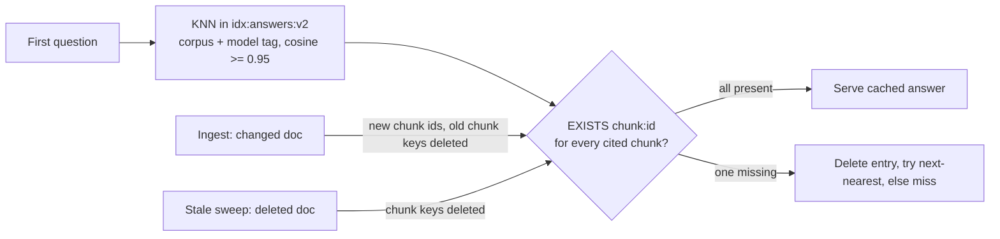

# Answer cache survives unrelated re-ingests

**Status:** PR [#117](https://github.com/hacka-tron/basel.engineering/pull/117) open, awaiting review. Not merged, not deployed.

## TL;DR

Every changed document bumped the corpus-wide version `corpus:ver:{corpus}`, and the semantic answer cache was keyed by it. So any docs edit, anywhere, emptied every cached answer for that corpus. About 20 releases re-ingested the corpus, and the 100-answers/day LLM budget ran out. Now a cached answer stays valid across re-ingests unless a document it was built from changed or was deleted.

## What changed for a visitor

Nothing visible, except more answers come back instantly from the cache after a deploy, and the daily answer budget lasts longer.

## How it works

- The answer key is corpus + model identity (embedding model, LLM model, prompt version) + question vector. The corpus version is gone from it, and from the miss lock.
- Each read checks, with one Redis `EXISTS chunk:{id} ...` call, that every chunk the answer cites is still indexed. Ingest gives every chunk of a changed document a new id (old `chunk:{id}` keys deleted, new ones written), and the #101 sweep deletes a removed document's keys. A missing key therefore means "a source document changed or was deleted": the entry is deleted and read as a miss. The 3 nearest entries are checked, so a stale entry never hides a fresh one.
- The write is skipped if a source chunk vanished during generation. That replaces the old "corpus version unchanged since the read" check.

## Key design decisions and trade-offs

- **Chunk ids instead of document content hashes.** The brief suggested storing source path + content hash and checking MySQL or a Redis hash map. Chunk ids give the same document-level answer (ingest replaces all of a document's chunks whenever its content hash or embedding model changes), with no new data structure, no MySQL on the hit path, and no race: the ids are captured at retrieval time, so an answer generated from old text can't be stamped with the new hash. They rely on MySQL 8 never reusing auto-increment ids, which InnoDB guarantees (the counter is persisted).
- **Retrieval cache keeps the corpus-version key.** Any new or edited document can change which chunks rank highest, and recomputing costs a KNN query, not LLM budget. Correctness wins there. The chunk text cache is keyed by chunk id, so it needed no change. The ingest and sweep version bumps stay for the retrieval cache.
- **Accepted lag:** a new document that would improve an answer it wasn't built from is picked up only when that answer's 24h TTL ends. The warm-up regenerates the suggested questions then.
- **Old entries are never read.** New index `idx:answers:v2` over `ans2:` keys. The old `idx:answers`/`ans:` entries are invisible and expire within 24h. An entry whose payload names no chunk ids can never validate either.
- Refusals and empty answers are still never cached, and are still rejected on read.

## Tests

Fake providers only. No live calls, no RAG eval.

- In-memory Redis Search stand-in (always runs): a hit survives a re-ingest of an unrelated document (version bumped); a miss after the source document changes (and the entry is deleted); a miss after a source document is deleted (sweep order); a stale nearest entry doesn't hide a valid one; the write is skipped when a source vanished; the key and fields carry no corpus version; legacy `ans:` entries and source-less entries are ignored; the lock key has no version; and the warm-up runs `warmed`, then `cached` after an unrelated re-ingest, then `warmed` again after its own source changes.
- Existing lock tests (one LLM call for simultaneous misses, bounded wait) pass with the new signature.
- Real Redis Stack and MySQL (skipped locally, they run in CI): the answer cache against Redis Stack (scoping, missing chunk, legacy entry invisible), the existing repeat-request test, and an end-to-end ingest test. That test edits an unrelated doc (hit), edits the source doc (miss), then deletes a doc with `sweep=apply` (miss).
- `pytest services/tests`: 530 passed, 25 skipped (DB/Redis-backed). `ruff check services eval` is clean.

## Operational notes and risks

- **One-time cold answer cache at deploy.** The new index starts empty. The ingest Job's warm-up then regenerates the suggested questions, which uses up to 7 of the warm-up's 10/day LLM cap. Visitors' other questions regenerate on first ask.
- The old `idx:answers` index lingers, empty after 24h. Dropping it is in the backlog.
- If a future change to ingest, sweep or `--clear` ever kept chunk ids across a content change, stale answers would be served. This is in the reviewer primer.
- The production sweep runs in `report` mode, so a deleted file's chunks stay indexed and its answers stay cached. That is consistent with retrieval, which also still serves them.

## How to verify after deploy

- After a docs-only merge, the next warm-answers run logs mostly `cached` instead of `warmed`.
- `queries.cache_status = 'answer_hit'` share stays steady across releases.

## Open items

- Drop `idx:answers` (v1) once the deploy is live.
- Optional: shorten the lag for new documents (see BACKLOG "Answer cache follow-ups").
