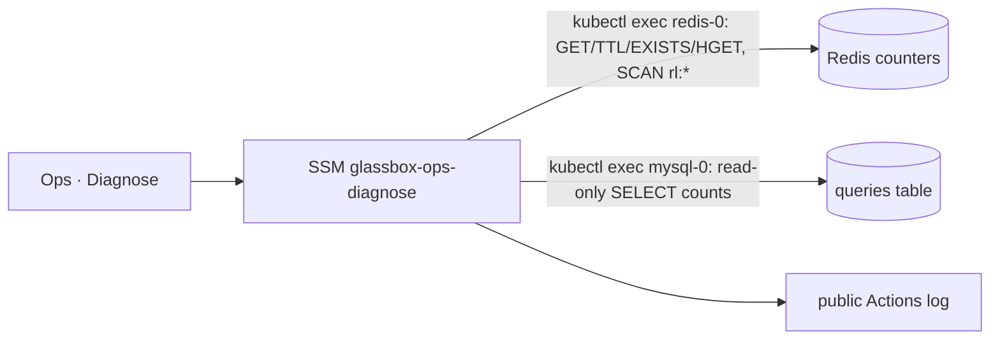

# Answers stopped: budget audit and an LLM budget section in Ops · Diagnose

**Status:** PR [#116](https://github.com/hacka-tron/basel.engineering/pull/116) open. Needs the owner's Terraform apply after merge (it changes the `glassbox-ops-diagnose` SSM document).

## TL;DR

On 2026-10-01 the live site stopped writing answers: every question came back with sources only (`mode: retrieval_only`, 0 tokens). The api does that only when the Redis kill switch is set or the daily LLM budget (100 answers per UTC day) is spent. The known spend that day was about 25 to 35 answers, so something else had to account for the rest.

A code audit of the PRs merged that day found **no path that calls `/api/ask` without a user action**, and no way for the warm-up job to go past its 10-a-day cap. What the audit did find is that the day's ~20 releases kept invalidating cached answers, so ordinary testing cost far more than usual. Nobody can see the counters today without cluster access, so this PR adds them to **Ops · Diagnose**: today's and yesterday's budget use against the cap, the kill switch, the warm-up counters, the corpus versions, the busiest rate-limit buckets, and today's query-log counts by mode and by hour.

## Audit (what could spend the budget without a click)

| Candidate | Verdict | Evidence |
|---|---|---|
| Queued-ask effect re-firing every render | Ruled out | `frontend/src/App.tsx` queued-ask effect clears `queuedAskRef` before it calls `handleAsk`, and `handleAsk` returns at once while `requestInFlightRef` is set. It asks once per Send. |
| StrictMode double effects | Ruled out | No effect asks on mount. The cluster-stream effect only opens an EventSource. The queued-ask effect does nothing without a queued question. |
| Retry | Ruled out | `handleRetry` returns while a request is in flight. `planRetry` refuses the budget-exhausted reply. The rate-limit countdown only enables the button, and `retrieval_only` is not an error state, so Retry never shows for it. |
| Re-select / deselect (#114) | Ruled out | `handleInspectComponent` runs only from a node's `onClick`. It skips the ask when that component's answer is already the latest one, and it doesn't queue a second copy of the question in flight. `finishRequest` sends at most one pending component question. |
| Cluster stream (#99) | Ruled out | `lib/clusterStream.ts` only opens `GET /api/cluster/stream`. |
| Stress test | Ruled out | It calls `/api/demo/capacity` and `/api/demo/load`. Synthetic worker jobs never call an LLM (`worker/main.py`). |
| Warm-up job (CronJob every 2 h, plus one run after each ingest) | Ruled out as a leak, bounded at 10 | `warm.py` `DailyCap.reserve` uses an atomic `INCR` on `warm:budget:{date}` (48 h TTL) that every run shares, and it takes a slot before each ask. The warm-up never sends history, so it never pays for a rewrite. The api's `llm` stage starts only after the budget reservation (`api/ask.py`), and the warm-up refunds a slot only when no `llm` stage was seen. Worst case is 10 answers (40 of 400 units) a day. |
| Rate-limit identity (#96) | Ruled out as a loosening | `limits.py` reads `CF-Connecting-IP` only from trusted peers and keys IPv6 on the /64, so keys can only get coarser. A missing header falls back to one shared bucket, which is stricter. The limit was always 10 asks per 10 minutes per client, so one steady client can still use the whole day's budget in about 2.5 hours. That is by design, not a regression. |
| Eval tooling (#95, #97) | Ruled out | `eval/run_answers.py` answers in-process and never touches the live budget. |

**Amplifiers that day (not bugs):**

- Each release re-ingests. Every changed document bumps `corpus:ver:{corpus}`, and the answer cache is keyed by that version. With about 20 releases, About This System's cached answers kept going cold.
- The warm-up refills at most 10 answers a day. Once those were used, every suggested question and diagram component asked after a release was a fresh LLM call.
- Follow-ups never use the answer cache and cost 1.25 answers each (answer plus rewrite).
- The phone preview (`npm run phone`) sends `/api` to the live site, so UI checks there spend real budget.

## How the new section works

- Redis commands go through `redis_read`, which refuses anything other than GET, TTL, EXISTS or HGET. Values are printed only after a check that they are numbers.
- MySQL runs one session after `SET SESSION TRANSACTION READ ONLY` with a 10 s statement limit. The password comes from the mysql container's own environment (`MYSQL_PWD`), so it never appears on a command line, in the script or in the log. The output still goes through `redact()`.
- Nothing prints question text, IPs or full hashes. The `queries` table stores no IP hash, so "distinct clients" comes from the Redis rate-limit buckets: the count active in the last 10 minutes, and the three busiest by an 8-character prefix of their salted HMAC.
- No Secret object is read.

## Verify

1. Merge the PR, then approve the **Terraform** run on `main` (the `terraform-prod` apply). The plan should show only the `glassbox-ops-diagnose` document (and its description) changing.
2. Run **Ops · Diagnose** and read the section "LLM budget, kill switch, warm-up cap, query log (counts only)".

Offline test: `bash infra/modules/ops/tests/diagnose-budget-test.sh` (stubbed kubectl). CI runs it.

## Open items

- If the counters show the budget was spent by many generated answers spread across releases, consider re-warming after every ingest without the daily cap (or with a bigger one), or keying the answer cache on the content of the chunks it used rather than the corpus version.
- If one rate-limit bucket dominates, consider a per-client daily cap on generated answers.
