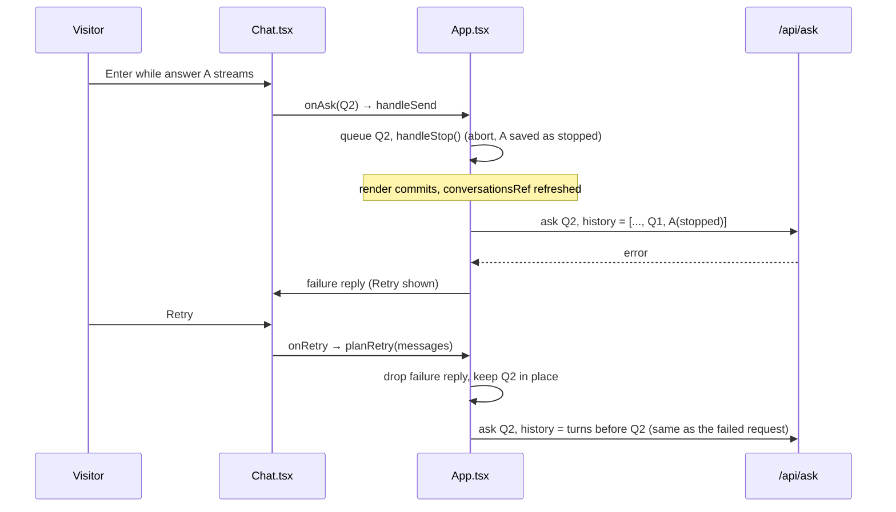

# Chat UX leftovers: type while streaming, Up-arrow recall, Retry

**PR:** [#93](https://github.com/hacka-tron/basel.engineering/pull/93) · **Branch:** `feature/chat-ux-leftovers` · **Spec:** `docs/DESIGN-002-followups.md` §6.1 (`error`), §6.4 (implementation notes there)
**Status:** In review (not yet reviewed). Frontend only; no API, schema or infra change.

## TL;DR

- You can type the next question while an answer is still streaming. Sending it stops the current answer (same Stop as #48) and asks the new one.
- Up arrow in an empty ask box brings back the last question you asked in that topic.
- A failure reply gets a **Retry** button. Retry swaps the failure reply for a fresh answer to the same question, and the conversation memory sent to the API stays clean.

## What changed for a visitor

- The ask box never greys out. While an answer streams the button next to it says **Stop** if the box is empty, and turns back into the send arrow once you type something. Sending keeps the partial answer (marked "Stopped") and starts the new question.
- **Up arrow** in the empty box fills in your last question for the current topic (About Basel and About This System each remember their own). It leaves the box alone if you've typed anything, hold a modifier, or are mid-composition with an IME (Japanese, Chinese, etc.).
- Under the latest failure reply there is a small **↻ Retry** button (44px tall on phones). Pressing it removes the failure reply and answers the question again in the same spot. After a rate limit it reads "Retry in 12s" and stays disabled until the server's wait is over. The "daily limit reached, check back tomorrow" reply has no Retry. Older failures (once you've moved on) don't get one either.

## How it works

- `lib/askInput.ts`: `shouldRecallQuestion`, `lastSentQuestion`, `askButtonMode` (send / stop / stop-and-send).
- `lib/chatRetry.ts`: `planRetry` (only the latest failure, never the budget reply), `withoutFailedAttempt`, `retryWaitSeconds`.
- Both are plain TypeScript with `node --test` tests (15 new tests, 73 total).

## Key design decisions & trade-offs

- **Retry replaces, it doesn't append.** Appending would leave "Q2 → error → Q2 → answer" in the saved chat and, worse, put Q2 into the history twice (failure replies are already excluded from history, so the failed Q2 would show up as a dangling user turn). Replacing makes the retry send exactly what the failed request sent. A failed first question therefore retries with no history and can still hit the answer cache.
- **Only the latest failure is retryable.** Retrying an old one would splice an answer into the middle of a conversation that has moved on.
- **Send-while-streaming waits one render.** The stop updates state asynchronously, and history is read from a ref refreshed after render. Asking immediately would have sent the stopped answer as still pending (so it would be missing from history). The new question is queued and sent by an effect once the stop has committed. Verified in the browser: the history sent matched the saved conversation exactly.
- **Button flips between Stop and Send** depending on whether the box has text, so stop-and-send is one tap on phones (no Enter key needed). The existing 400ms guard still stops a double-click on Send from stopping its own answer.
- **Rate limits and budget:** Retry is hidden while any request is in flight, a double-click sends one request, a rate-limited reply disables Retry until `retry_after_s` passes, and the budget reply has none. The countdown isn't saved, so after a reload Retry is enabled again; the server's rate limit still applies.
- **A queued component question is dropped** when the visitor sends a new question mid-answer: the newer, typed question wins.
- **Focus:** on desktop, focus moves to the ask box after Retry (the button disappears). On phones it doesn't, because that would pop up the keyboard.

## What review caught

Not reviewed yet (Opus reviewer per the standing process while Codex is out of usage).

## Operational notes & risks

- Frontend only. No change to the API contract, caching, logging or budget. A stop-and-send costs the same as pressing Stop and then asking.
- Retry can make more requests than before, but at most one per click, never while one is in flight, and never before a rate limit's retry-after.

## How to see it / verify it

- `cd frontend && npm test && npm run lint && npm run build`.
- In the browser: ask something, type a second question while it streams, press Enter. The first answer shows "Stopped" and the second starts. Clear the box and press Up: the second question comes back.
- Retry: make `/api/ask` fail (stop the local API, or mock it), then press Retry. The failure reply is replaced by the new answer.
- Done for this PR (vite on :5234 with `/api/ask` mocked in the page, no live questions): stop-and-send history matched storage; Up-arrow recall worked and was correctly skipped with text, Shift and `isComposing`; a Retry double-click sent one request with history excluding the failed question; the rate-limit countdown blocked clicks; 1440px and a 375px frame: Retry 44px tall on mobile, no horizontal scroll.

## Open items

- Not checked on a real phone (IME composition on iOS/Android keyboards, on-screen keyboard "Go" sends while streaming).
- Up-arrow recalls only the last question; walking further back through history was not built.
