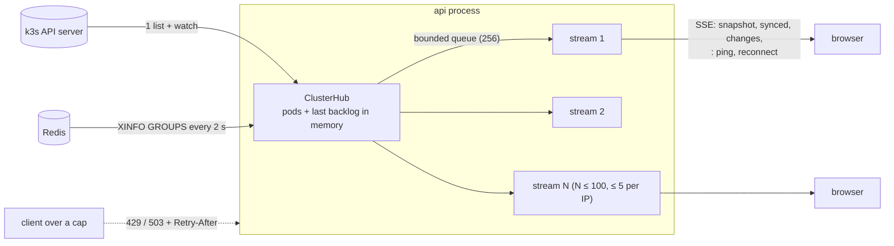

# Cluster stream: one shared watch, capped clients, bounded lifetime

**PR:** [#99](https://github.com/hacka-tron/basel.engineering/pull/99) · **Branch:** `fix/cluster-stream-cap` · **Spec:** `docs/DESIGN.md` §8 (cluster stream contract) and §9.5 "Bounded cost" · **Origin:** security pass finding 11 (PR [#96](https://github.com/hacka-tron/basel.engineering/pull/96), `project/status/2026-10-01-security-pass.md`)
**Status:** In review. Needs the owner's go-ahead to merge (adds ConfigMap keys; see "Live effect").

## TL;DR

- `/api/cluster/stream` is public and unauthenticated. Before this change, every open tab got its own Kubernetes watch, its own Kubernetes HTTP client and its own Redis connection, with no limit. A few hundred idle connections could have exhausted the api pod (256 Mi limit on a 2 GiB node) or loaded the k3s API server, which already struggled during the 2026-09-30 incident.
- Now each api process runs **one** shared watch and **one** Redis poller and fans their events out to every client through a small in-process queue. 1 tab or 100 tabs cost the API server and Redis the same.
- **Caps:** 100 concurrent streams per api process (the api runs one replica and one worker, so this is the site-wide cap) and 5 per client IP. Over a cap: `503` or `429` with `Retry-After: 30`, and nothing is opened.
- **Lifetime and heartbeat:** a connection lasts at most 10 minutes (cut at a random 8 to 10), then gets a `reconnect` event. A `: ping` goes out after 15 s of silence, and the server checks for disconnects every 5 s, so dead clients are reaped.
- **Browser:** reconnects on its own with backoff (5 s, doubling up to 2 minutes, with jitter) and keeps the last pod dots on screen while disconnected.
- Design: **full fan-out**, not caps-only.

## What changed for a visitor

Usually nothing visible. The worker node's pod dots and backlog counter behave as before. Differences:

- If the site is at its stream cap, the diagram keeps showing the last known pods (or the plain worker node if it never connected) and tries again later, with growing gaps. Chat is not affected; it uses a different endpoint.
- Every 8 to 10 minutes the stream reconnects in the background, in 0.5 to 3 s. The dots don't flicker: the new connection's snapshot replaces the pod set in one update.
- Pods that went away while a tab was disconnected now disappear on reconnect. Before, they could linger until a reload.

## How it works

- **`ClusterHub`** (`services/glassbox/api/cluster.py`) is started by the first subscriber and stopped 30 s after the last one leaves, so lifetime reconnects and reloads reuse the running watch. It keeps the current pods and the last backlog reading, so a new subscriber gets a snapshot from memory (`pod` ADDED events, `backlog`, then `synced`) without another list call.
- **Watch upkeep:** when the API server ends a watch (normal, every half hour or so), the hub lists again after 1 s and sends `DELETED` for pods that disappeared in between. If a list or watch fails, it retries with backoff (2 s, doubling, up to 30 s) and keeps the streams open. Before, any watch failure sent `cluster_unavailable`, which turned the view off for that tab until reload. `cluster_unavailable` is now sent only when there is no in-cluster ServiceAccount at all (local dev). A watch `ERROR` event (for example 410 Gone) triggers a re-list instead of being forwarded as a pod.
- **Backlog** is broadcast only when it changes; heartbeats keep the connection alive in between.
- **Caps** are checked and recorded synchronously on the event loop (no await between check and update), so concurrent connects cannot race past them. The per-IP key is `client_ip_hash()` from `services/glassbox/limits.py`, the same salted hash the ask rate limit uses, called rather than reimplemented so #96's spoof-resistant client IP applies automatically.
- **Slow clients:** a subscriber 256 events behind is dropped (its stream ends; it reconnects to a fresh snapshot) instead of buffering without bound.
- **Slot release** is idempotent and happens in three places: the stream generator's `finally`, a Starlette background task (covers a client that leaves before the body starts), and the hub itself when it drops a client.
- **Heartbeat and disconnect** reuse `with_heartbeat` from `api/sse.py`, the same helper `/api/ask` uses.
- **Browser** (`frontend/src/lib/clusterStream.ts`): EventSource's own retry is not used, because EventSource cannot read a 429/503 status and would otherwise either stop for good or retry at a fixed interval. The client closes on any error and reconnects with exponential backoff; a completed snapshot (`synced`) resets it. On `reconnect` it returns after a short random pause. A tab still running the old bundle during the rollout ignores `synced`/`reconnect` and falls back to EventSource's retry, guided by the `retry: 5000` hint.

## Key design decisions & trade-offs

- **Fan-out, not just caps.** Caps alone would still leave 100 Kubernetes watches and 100 Redis connections open at the cap. The refactor was contained (one module, one new event type) and fully testable with fakes, so it went in now.
- **Limits** (all ConfigMap keys, same defaults in code; a missing, non-numeric or non-positive value falls back to the default):

  | Key | Default | Why |
  |---|---|---|
  | `GLASSBOX_CLUSTER_STREAM_MAX_CLIENTS` | 100 | Each stream now costs tens of KB (connection, a few coroutines, a small queue), so 100 is a few MB inside the api's 256 Mi limit and about 7 heartbeat writes a second. Far above real traffic. |
  | `GLASSBOX_CLUSTER_STREAM_MAX_PER_IP` | 5 | A visitor with a few tabs is fine; one IP can't take the whole pool. Shared NATs above 5 tabs just see the last snapshot. |
  | `GLASSBOX_CLUSTER_STREAM_MAX_LIFETIME_S` | 600 | Reaps half-open connections the heartbeat doesn't catch; reconnects are cheap (snapshot from memory). |
  | `GLASSBOX_CLUSTER_STREAM_HEARTBEAT_S` | 15 | Same as `/api/ask`; well inside Cloudflare's 100 s idle timeout. |
  | `GLASSBOX_CLUSTER_STREAM_RETRY_AFTER_S` | 30 | Sent with 429/503. Browsers can't read it through EventSource, so the client's own first retry after a refusal comes after 2.5 to 5 s and then backs off to 2 minutes. |

- **429 vs 503:** 429 is about this client (per-IP), 503 about the server (global). Both carry `Retry-After`.
- **Watch failures retry silently** rather than ending streams, because one API server hiccup would otherwise turn off the view in every open tab at once now that they share one watch.
- **Not authenticated:** the data is harmless (pod name, phase, readiness, a backlog number); the problem was cost, which is now bounded.

## What review caught

Not reviewed yet (Opus reviewer with the primer brief, since Codex is out of usage).

## Live effect (owner go-ahead needed)

Merging changes production:

1. A new image (`build-N`) rolls the api pod (`maxSurge: 0`, so a few seconds of downtime, as with every release). The capped, shared stream is live from then on.
2. `k8s/base/configmap-app.yaml` gains five `GLASSBOX_CLUSTER_STREAM_*` keys. Their values equal the code defaults, so the ConfigMap change alone changes no behaviour; it documents the knobs and lets the owner tune them later with a one-line PR.
3. Docs in the About This System corpus changed (`docs/DESIGN.md`, `docs/architecture/deep-dive.md` and others), so the post-deploy `ingest` Job re-embeds the changed files (a few Titan embedding calls, cents at most).

No Terraform, no RBAC change, no new Kubernetes objects.

## Operational notes & risks

- **Per-IP cap before #96:** until #96 merges, `client_ip_hash` trusts the leftmost `X-Forwarded-For` from Traefik, so a script could forge it and get fresh per-IP buckets. The global cap of 100 still holds. After #96 the per-IP key is the real client.
- **A script can still occupy the 100 slots** (from 20+ IPs, or one IP before #96). The effect is that new visitors see the last snapshot or the plain worker node instead of live dots; chat and the rest of the site are unaffected. The api pod and the k3s API server stay safe, which was the point.
- **Rollout shutdown:** uvicorn waits up to 25 s for open connections on SIGTERM. This was already true with the old unbounded streams. A follow-up could send `reconnect` to every stream on shutdown.
- **Logs:** a dropped slow client logs one warning; a failing watch logs each retry with its attempt number (at most one every 30 s once backed off).

## How to see it / verify it

- Tests: `pytest services/tests/test_cluster_stream.py` (18 tests: unavailable path, snapshot/changes/`synced`/`reconnect` over HTTP, 503/429 with `Retry-After`, nothing opened when refused, slot reuse, env fallbacks, 25 clients → 1 list + 1 watch + 1 Redis client, late subscriber snapshot without a new list, re-list sends `DELETED`, watch failure retries without ending streams, slow subscriber dropped, upstream stops after linger and is reused within it, heartbeats and lifetime, disconnect and cancellation release the slot). Frontend: `npm test` (`lib/clusterStream.test.ts`: backoff curve and cap, snapshot replace, no timer stacking, reset on `synced`, planned reconnect, `cluster_unavailable` stops, disconnect cancels).
- Live, after deploy: open the site, then DevTools → Network → `stream`: the response starts with `retry: 5000`, then `pod` events and `synced`, `: ping` every 15 s when quiet, and `reconnect` after 8 to 10 minutes followed by a new request. With 6 tabs from one browser, the sixth `stream` request gets 429.

## Open items

- Close the stream while the tab is hidden (frees slots held by background tabs).
- Send `reconnect` to all streams on SIGTERM to shorten rollouts.
- Remove the BACKLOG line once this is merged and live; update this report's status then.
