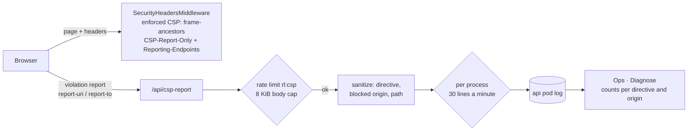

# Content-Security-Policy, Report-Only, with a report endpoint

**PR:** _pending_ · **Branch:** `security/csp-report-only` · **Docs:** `docs/DESIGN.md` §11, `docs/architecture/deep-dive.md` (one sentence), `infra/CI.md` (diagnose row), `project/MOBILE_DESIGN.md` (where the iOS zoom fix lives)
**Status:** PR open, not reviewed yet. No production access was used (no AWS, kubectl, Terraform plan or apply, or workflow runs). No live `/api/ask` calls; the audit faked `/api/ask` on a local server.

## TL;DR

- **The site now sends a strict `Content-Security-Policy-Report-Only` header.** Browsers block nothing because of it. They report anything an enforced policy would block. Step 1 of the CSP follow-up from #112. Live on the release after merge.
- **The policy is fully same-origin, with no `'unsafe-inline'` and no `data:`.** A headless Chrome audit of the production build (desktop and an emulated iPhone) found **zero violations**, so nothing had to be loosened.
- **The one inline script moved out.** The iOS-only zoom fix in `index.html` is now `frontend/public/ios-zoom.js`, loaded the same way and at the same point, before first paint.
- **New `POST /api/csp-report`.** It is rate-limited per visitor, caps bodies at 8 KiB, writes nothing to the database, and logs only three sanitized fields per violation: directive, blocked origin, page path.
- **Ops · Diagnose gets a "CSP Report-Only violations" section** that counts those log lines for the last 24 hours. It takes effect after the Terraform apply of the `ops` module (owner approval click in the Terraform workflow).
- **Next step (backlog):** enforce the policy after a week of clean reports.

## What changed for a visitor

Nothing visible. The page makes one extra small request (`/ios-zoom.js`, cached after the first visit). On iPhone and iPad the ask box still doesn't zoom the page on focus, and pinch-zoom still works.

## How it works



The policy:

```
default-src 'self'; script-src 'self'; style-src 'self'; img-src 'self'; font-src 'self';
connect-src 'self'; object-src 'none'; base-uri 'self'; form-action 'self';
report-uri /api/csp-report; report-to csp
Reporting-Endpoints: csp="/api/csp-report"
```

- `services/glassbox/api/security_headers.py` adds both headers to every response (page, assets, API JSON, SSE, 404s), next to the existing enforced `Content-Security-Policy: frame-ancestors 'none'`.
- `services/glassbox/api/csp_report.py` is the endpoint. Order of checks: content type (415), declared length (413), per-visitor rate limit (429), body read with a running 8 KiB cap (413), JSON shape (400), then log and answer 204.
- `services/glassbox/limits.py`: `RedisRateLimiter` takes a `key_prefix`. `/api/ask` keeps `rl:<hash>`, so live buckets survive the deploy. Reports use `rl:csp:<hash>` and never spend a visitor's question budget.
- `infra/modules/ops/scripts/diagnose.sh` greps the api pod's last 24 hours of log for the fixed `csp-report-only violation` prefix. It prints the line count, the log-cap summary count, and the top 15 `directive blocked-origin` pairs, through `redact`.

## The audit: violations found and fixed

How it was run: `npm run build`, then the real app under uvicorn on port 8011 serving `frontend/dist`. `/api/ask` was replaced in-process by a canned SSE stream, and the report limiter by an in-memory one, so there were no provider, Redis or MySQL calls and 0 live questions. Headless Chrome was driven over the DevTools protocol, desktop at 1440px and an emulated iPhone at 390px. Each run asked a question, hovered and clicked a diagram node, switched to the Diagram view, opened the capacity details, ran the (simulated) stress test and used Contact. Violations were collected three ways: a `securitypolicyviolation` listener, console/log entries and DevTools issues.

| Candidate source | Result |
|---|---|
| Inline iOS zoom `<script>` in `index.html` | Would violate `script-src 'self'`. **Fixed:** moved to `frontend/public/ios-zoom.js`. |
| React Flow / React inline styles | 75 elements carry a `style` attribute, all set through the `style` property (CSSOM), which CSP does not govern. **No violation**, so no `'unsafe-inline'`. |
| `<style>` elements (React Flow, Tailwind, Vite) | None at runtime. Tailwind and React Flow's CSS are in the built `/assets/*.css`. |
| Fonts (`@fontsource/jetbrains-mono`) | Bundled into `/assets/*.woff2`, same origin. No violation. |
| `data:` images | None in the bundle or at runtime, so `img-src 'self'` without `data:`. |
| `/api/ask` (fetch SSE), `/api/cluster/stream` (EventSource), `/api/demo/*` | Same origin. No violation. |
| GitHub and other links | Navigations, not restricted by CSP. |
| `frame-ancestors` | Left out of the Report-Only header (browsers ignore it there and warn). It stays in the enforced header. |

**Final result: 0 violations** on both viewports. A positive control injected an inline script, a `style="…"` attribute, a `data:` image and a cross-origin `fetch` with a query string. Each produced a violation, and the server logged exactly:

```
csp-report-only violation directive=style-src-attr blocked=inline path=/
csp-report-only violation directive=script-src-elem blocked=inline path=/
csp-report-only violation directive=connect-src blocked=https://example.invalid path=/
csp-report-only violation directive=img-src blocked=data path=/
```

The query string was dropped. That run used `report-uri` only. With `report-to` present, Chrome queued the same four reports and attempted delivery, but never delivered them to the plain-HTTP localhost server within 75 seconds. The `report-to` body format is covered by unit tests, and checking it on the live HTTPS site is in the backlog item.

iOS behaviour: under the iPhone emulation the viewport became `width=device-width, initial-scale=1.0, interactive-widget=resizes-content, maximum-scale=1`. On desktop it was unchanged. The script is a classic, parser-blocking `<script src>` placed right after the viewport `<meta>` (no `async`, `defer` or `type="module"`), so it runs at the same point as the inline version: before the body is parsed and before first paint.

## Key design decisions & trade-offs

- **Strict `style-src 'self'` instead of `'unsafe-inline'`.** The audit showed it isn't needed: React and React Flow set styles through CSSOM. Report-Only means a wrong guess costs nothing today. If reports show `style-src-attr` from our own code, the fallback is `style-src-attr 'unsafe-inline'` with `style-src-elem 'self'`, not a looser `style-src`.
- **A static file instead of a build-time hash.** No Vite plugin, nothing to keep in sync, and the policy stays hash-free. The cost is one tiny cached request.
- **Both `report-uri` and `report-to`.** Firefox and Safari use `report-uri`. Chromium uses `report-to` when it's present.
- **Log-only endpoint, no storage.** A table of reports would be a free write path for anyone on the internet. The log lines have a fixed, sanitized shape, so Diagnose can safely count them in the public Actions log.
- **Three layers against log spam:** a per-visitor token bucket (30 per 10 minutes), at most 5 reports read per request, and a per-process cap of 30 lines a minute with one summary line. The last layer is what bounds many-address floods.
- **Sanitizing.** The directive must match `[a-z-]{1,40}`. The blocked value is reduced to a keyword (`inline`, `eval`, `data`, …), a scheme (`data:`, `blob:`, `chrome-extension:`; extension IDs are dropped) or `scheme://host[:port]`, with IP-literal hosts shown as `ip-literal`. The document path must match `/[A-Za-z0-9/._~-]{0,63}`. Anything else becomes `other`, so newlines and other injected text never reach the log. No IPs or IP hashes are logged.
- **Fail closed if Redis is down.** The report is dropped (204) rather than logged without a rate limit. The "limiter unavailable" line shares the per-process cap.

## Tests

- `services/tests/test_csp_report.py` (50 cases): both report formats are accepted and logged sanitized; a sensitive-content sweep (query strings, fragments, samples, user agent, referrer, XFF IP, IP hash, original policy); sanitizer edge cases (userinfo, IPv4/IPv6 literals, extensions, newline injection, odd paths); oversize by declared length and by a chunked body; invalid JSON/shapes (400); wrong content type (415); the per-visitor limit and its own `rl:csp` key; the per-process log cap and its summary line; the per-request report cap; Redis down; no DB access; the default `rl:` prefix unchanged.
- `services/tests/test_security_headers.py`: the Report-Only header and `Reporting-Endpoints` are on HTML, assets, API JSON, 404/422, `/api/ask` SSE and `/api/cluster/stream` SSE. The exact directive set is pinned, with no `unsafe-*`, `data:` or wildcards. `index.html` has no inline script or style, and `ios-zoom.js` has the same logic.
- Full suite: 573 passed, 24 skipped (Redis/MySQL-backed skips). `ruff check` and `ruff format --check` are clean. Frontend `npm ci`, `npm test` (119 passed), `npm run lint` and `npm run build` pass. `bash -n` on `diagnose.sh`, the ops `redact-test.sh` and `ops-run-test.sh` pass, and `terraform fmt -check` passes for the ops module.

## What review caught

_Pending._

## Operational notes & risks

- **App changes:** on the next release after merge. Report-Only can't break the page. The only behaviour change is one extra request for `/ios-zoom.js`. Cloudflare may cache it at the edge like any `.js`; it is not content-hashed, so a future edit to it could serve stale for a while. It's a stable 5-line script.
- **Diagnose section:** `infra/modules/ops` is applied by the Terraform workflow. After merge the plan shows an in-place update of the `glassbox-ops-diagnose` SSM document (script content and description). The owner approves the apply as usual. Until then the section just isn't there.
- **Log volume:** worst case 30 lines a minute per api process, plus one summary line a minute.
- **Coverage gap:** Diagnose reads only the running api pod's log, which resets on restart or deploy. The backlog item says to run it on several days.

## How to see it / verify it

1. After the release: `curl -sI https://basel.engineering/` shows `content-security-policy-report-only: default-src 'self'; …` and `reporting-endpoints: csp="/api/csp-report"`, alongside the #112 headers.
2. Open the site in desktop Chrome, Safari and Firefox and on an iPhone. The devtools console should have no "[Report Only]" messages. On iPhone, tapping the ask box should not zoom the page.
3. Chrome devtools → Application → Reporting API should list the `csp` endpoint (and no queued reports).
4. After the Terraform apply: **Actions → Ops · Diagnose** has the section "CSP Report-Only violations, api log last 24 hours", with `violation lines 0` on a clean day.

## Open items

- **Enforce after a week of clean reports** (`project/BACKLOG.md`, with the exact Diagnose check and the criteria for "clean").
- Confirm `report-to` delivery on the live HTTPS site (Chrome devtools Reporting API panel).
