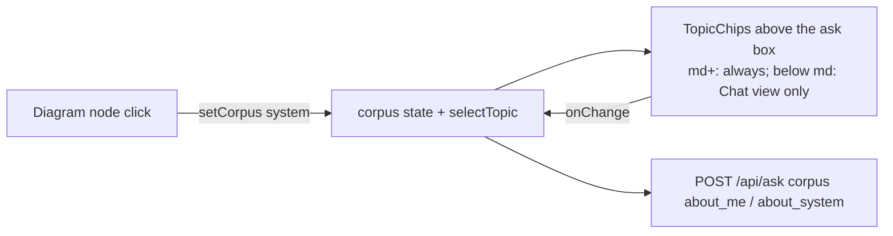

# Desktop topic chips and a latency readout that lights up

Status: in review (PR opened; see the status index).

## TL;DR

Two owner requests. The "Asking about (Basel) (System)" chips that phones got in #78 now sit above the desktop ask box too, and the desktop header loses its "About Basel | About This System" nav, so the chips are the only topic control at every width. The footer latency readout (`312ms`) now brightens on hover, keyboard focus and press, the same way the bunny/tiger capacity icon does.

## What changed for a visitor

- **Desktop (md+, 768px and up):** a compact "Asking about (● Basel) (○ System)" row directly above the ask box, always visible (the diagram is beside the chat, so there is no Chat/Diagram view to hide it in). Pills are 12px text, 25px tall, 12px above the ask box; on phones they stay 14px with 44px tap rows.
- **Desktop header:** name on the left, envelope (Copy email) and GitHub on the right, still 72px tall. The name and the icons share a vertical centre (name 21-50px, icons 24-48px) and the 32px side padding is symmetric, so the row is balanced without the nav.
- **Diagram node click:** still switches to About This System, and the System chip becomes checked.
- **Latency readout:** muted at rest (`rgb(124,132,148)`), primary text colour (`rgb(230,233,238)`) on hover, keyboard focus and press, with the same 150ms colour transition as the capacity icon. The tooltip is unchanged.
- **Phones:** unchanged (one-row 61px header; chips in Chat view only).

## How it works

- `App.tsx` passes `<TopicChips>` to `Chat`'s `inputTopic` at every width except the phone Diagram view. Because it is one element at one tree position, React keeps the same instance across a resize over md.
- `TopicChips.tsx` dropped `md:hidden` and gained `md:` sizing. Semantics are unchanged: `role="radiogroup"` / `role="radio"` with `aria-checked`, roving tabindex, arrows/Home/End move and select, accessible names "About Basel" / "About This System".
- The header nav, `navRef` and the `order-*` classes are gone. `useFullNameFits` now takes the single Contact/GitHub ref instead of a list (the list only existed for the nav).
- `StatsBar.tsx`: the latency button gets `transition-colors hover:text-primary focus-visible:text-primary active:text-primary`, the same colours and states as the capacity icon's `group-hover/focus-visible/active`.

## Key decisions

- **Short labels on desktop too** ("Basel", "System"), matching phones as the owner asked; the full names stay the accessible names.
- **12px pills on desktop**, the desktop size for secondary UI (the old nav was 12px too); 14px stays on phones.
- **Backlog edge case resolved by structure:** a chip that has focus while the window crosses md keeps focus, because the same DOM node persists. The one remaining unmount (narrowing into a phone Diagram view) already moves focus to the Diagram toggle.

## Verification

Headless Chrome via CDP with `/api/*` intercepted (mocked SSE answer; request bodies inspected):

| Check | 1024x768 | 1440x900 |
|---|---|---|
| Header | 72px; name, envelope, GitHub; no `nav` | same |
| Chips row | y 570, 29px tall, 12px above the input | y 702, same |
| Click System, ask | body `corpus: about_system` | same |
| Click Basel, ask | body `corpus: about_me` | same |
| Click the Edge node | System checked; component question sent as `about_system` | same |
| Keyboard | Shift+Tab from the input lands on the checked chip; ArrowLeft/End/Home move and select; 2px cyan focus ring; Tab returns to the input | same |
| Latency colour | rest 124,132,148 > hover 230,233,238 (tooltip shown) > focus 230,233,238 (tooltip shown) | same |
| Capacity icon | rest 124,132,148 > hover 230,233,238 (unchanged) | same |

- **375x667:** header 61px, one row; chips row 44px with 14px pills; Diagram view has 0 chips; latency 124,132,148 at rest, 230,233,238 while pressed.
- **414 and 768:** no horizontal scroll; the full name shows.
- **Cross-md focus:** chip focused at 375 (Chat) > 1024 > 375 keeps focus on the same node. From a phone Diagram view: widen to 1024 (chips appear), focus a chip, narrow to 375, and focus moves to the Diagram toggle (never `body`).
- `npm run lint`, `tsc -b`, `npm test` (58 pass) and `npm run build` pass; `services/tests/test_ingest_run.py` passes (14 passed, 3 skipped) with the deep-dive edit.

## Operational notes and risks

Frontend only; no API or infra change. The desktop message area is 41px shorter (the chips row plus its gap).

## Docs

`docs/DESIGN.md` (desktop wireframe, §4.2 header and footer, §4.3 topic control), `docs/architecture/deep-dive.md` (live diagram section; mobile section points at the same chips), `project/MOBILE_DESIGN.md` (layout rules and owner decisions index), `project/BACKLOG.md` (the two #78 minors removed).

## Open items

None.
