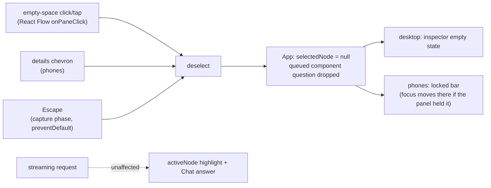

# Diagram: deselect by empty space, the details chevron, or Escape

**Status:** In review, PR [#114](https://github.com/hacka-tron/basel.engineering/pull/114). Not merged.

## TL;DR

Clicking or tapping empty space in the diagram now deselects the selected component, on desktop and on phones. On phones, the chevron on the open details panel (the "dropdown from the description") now deselects too, instead of collapsing the panel while the component stays selected. Escape also deselects; in the phone Diagram view the first Escape deselects and the next one returns to Chat. An answer that is still streaming is never stopped: it keeps streaming into Chat and its stages keep lighting up.

Owner's request (2026-10-01): "can you make it when i click on an empty space in the diagram section, it unselects my component. on mobile, I want it so that if i click the dropdown from the description, it also follows that same behavior".

## What changed for a visitor

- **Desktop:** select a node, click empty diagram space: the node's border goes away and the inspector below shows "Hover or focus a component to see what runs it." Dragging the diagram to pan keeps the selection. Escape deselects too.
- **Phone (portrait and landscape):** tap a node and the details panel opens, as before. Tap empty space, or the chevron in the panel's top-right corner, and the panel goes back to the locked "Select a component for details" bar. Panning the diagram with a finger keeps the selection.
- **Gone:** the collapsed "Worker details · 8 chunks" bar. The panel is now open exactly while a component is selected.

## How it works

- `ArchitecturePanel` gets an `onDeselect` prop. React Flow's `onPaneClick` only fires when the pane itself is the click target (nodes and arrows are excluded), and React Flow suppresses the click after a mouse drag; on touch, a pan is not a tap, so no click is generated.
- The phone panel's state is now just "selected or not". The `detailsOpen` state, the expand/collapse toggle, the collapsed bar and `portraitDetailsState` are removed; `lib/detailsPanel.ts` keeps the hint text and gains `deselectsOnKey` (tested).
- Escape is handled by a document listener in the capture phase that marks the event handled; the phone Diagram view's Escape-to-Chat listener already skips handled events, so the order is fixed without touching it.

## Key design decisions and trade-offs

- **Streaming answers keep going.** Deselecting clears only the selection. The cyan "running" tile follows the request (`activeNode`), not the selection, so stage highlighting is unaffected. A component question queued behind another answer is dropped, because the visitor just let go of it.
- **No duplicate question on re-select.** Tapping the same component again while its answer still streams (likely after a deselect) shows that answer again instead of queueing the same question a second time (new `inFlightQuestionRef` in `App.tsx`).
- **Escape order:** first Escape deselects, the next returns to Chat (phones). This works from the ask box too. On desktop, Escape anywhere deselects (there was no other Escape meaning there).
- **Focus:** the chevron, or an Escape while focus is inside the panel, moves focus to the locked bar, never to `<body>`. A tap on empty space leaves focus where the tap put it, as any click on a non-focusable area does.
- **Chevron semantics:** it now reads "Close <Component> details and deselect it" and has no `aria-expanded`, since nothing can reopen the panel except selecting a component. It keeps its 44px target. Node buttons' `aria-pressed` follows the selection as before.
- **Desktop hover preview** is cleared on deselect, so a node that still had keyboard focus doesn't keep filling the inspector.

## What review caught

Pending.

## Operational notes and risks

Frontend only; no API or infra change. Low risk. The behaviour change is intentional: the collapse-while-selected state from #90 no longer exists.

## How to see it / verify it

- `cd frontend && npm test && npm run lint && npm run build` (102 tests; `src/lib/detailsPanel.test.ts` covers `deselectsOnKey`).
- Headless Chrome against the phone preview server (`npx vite --config vite.phone.config.ts --port 5242`), with `/api/ask` faked in the page (a slow canned stream; 0 live questions), real CDP mouse and touch input:
  - 1280x800: select Queue, click empty pane: deselected, inspector empty state, the answer keeps streaming (chat text grew, LLM tile still cyan). Re-select while streaming: no second request. Drag the pane (the viewport moved): still selected. Escape: deselected.
  - 393x852 and 667x375: tap Queue: panel open. Tap empty space: locked bar. Finger pan (viewport moved): still selected, panel open. Chevron (44x44): deselected, locked bar (44px tall) has focus. Select MySQL, focus the chevron, Escape: deselected, still in Diagram view, focus on the locked bar; second Escape: back to Chat with focus on the Diagram toggle. No horizontal scroll.

## Open items

- Real-device touch check on iOS Safari (the touch path was verified with Chrome's touch emulation only).
