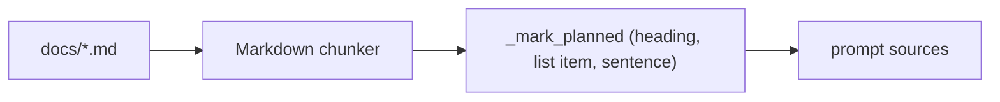

# Docs drift pass: planned markers and design docs brought up to date

**Status:** PR [#120](https://github.com/hacka-tron/basel.engineering/pull/120) open (docs and tests only). No code, prompt or infra change; takes effect on the next release's ingest Job.

## TL;DR

The design docs and the deep dive are ingested into About This System, so stale or unmarked text there turns into wrong answers ("Retry is not built", "KEDA autoscales the workers today", "the image goes to GHCR"). This pass compares every section of DESIGN.md, DESIGN-002 to 005 and the deep dive against SNAPSHOT and the code, rewrites what drifted, and marks every unbuilt part with words the grounding marker (`_PLANNED_SOURCE_SIGNAL`) recognizes, at the place where each real chunk will carry it.

## What changed for a visitor

Nothing visible. After the next release re-ingests the docs, answers about the system should stop calling shipped features planned (stop-and-send, Up-arrow, Retry, landscape phones, the stale sweep) and stop calling unbuilt ones live (`/api/stats`, `/metrics`, citation deep links, the rerank, the nightly ingest CronJob, the S3 gateway endpoint, `tflint`).

## How it works

The marker works per heading (covering its section), per list item, or per sentence. A long section split into several chunks loses its heading in the later windows, and a mixed list item is marked whole. So the edits:

- put "(planned)" / "(not built yet)" on headings where a whole section is unbuilt (all of DESIGN-003 except §1.1, which describes the running ingest Job);
- split list items and table rows that mixed live and unbuilt facts into separate items or sentences, with "Not built yet: ..." on the unbuilt one;
- reworded false hits on live text (the cluster stream's "planned end of this connection", a `live` eval row that said "planned").

Verification: the real chunker plus `_mark_planned` over each doc. DESIGN.md 33 chunks, DESIGN-002 18, DESIGN-003 13 (12 marked; the unmarked one is §1.1), DESIGN-004 5, DESIGN-005 15, deep dive 34 (unchanged; only the planned section is marked).

## Key decisions

- Drift fixed in place rather than flagged: KEDA installed but suspended, zram on and how to check it (Ops · Diagnose, no hand-run commands), ECR with `build-N` tags and the `deploy` branch, release provenance and the `main`-only release trust, Actions pinned by SHA, Terraform concurrency split, bootstrap pipeline, ops runbooks, Nova Lite instead of Haiku, in-cluster MySQL instead of RDS (also in DD2's self-healing and DD4's cost table), the queries schema after Alembic `0003`/`0004`, eval v2 and the golden set, the report-only stale sweep.
- DESIGN.md §4.2, §11 and `MOBILE_DESIGN.md` were not touched (concurrent work); their drift is listed in the PR and BACKLOG.
- Two `eval/golden.yaml` gold snippets quoted deep-dive sentences this pass changed; they now quote the new text. That changes the question-set fingerprint, but no v2 baseline is stored yet. No eval was run.

## Risks

- The marker is still keyword-based: a future edit that adds "planned" to a live sentence, or drops it from an unbuilt one, regresses silently unless a test pins it. About 60 new cases in `test_planned_labels.py` pin this pass, plus two whole-document checks (every DESIGN-003 chunk but §1.1 is marked; the deep dive marks only its planned section).
- The deep-dive chunk count stays 34; the conversational-chat section is at 497 of the chunker's 500 words, so the next addition there splits it.

## Open items

See BACKLOG "Docs drift follow-ups".
