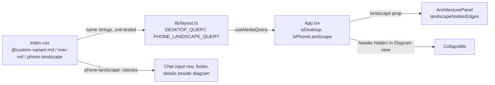

# Landscape phones keep a usable phone layout

**Status:** PR [#100](https://github.com/hacka-tron/basel.engineering/pull/100) open, not merged (decisions proposed, pending the owner's review). Branch `feature/landscape-phone`.

## TL;DR

A phone held sideways had almost no room: 55px of messages at 568x320, 95 to 110px on common phones, a diagram showing 4 of 11 components (none at 568x320), and an iPhone 11/XR sideways (896x414) fell into the two-pane desktop layout with a 108px diagram. Landscape phones now keep the phone layout with compact chrome, a three-row landscape graph and the details beside the diagram. Portrait phones and desktop are byte-for-byte unchanged in screenshots.

## What changed for a visitor

| Size (sideways) | Messages before → after | Diagram before → after |
|---|---|---|
| 568x320 (smallest) | 55 → 120px | 0 of 11 nodes fully visible → all 11 |
| 667x375 (iPhone SE/8) | 110 → 175px | 4 → 11 |
| 740x360 (Android) | 95 → 160px | 4 → 11 |
| 896x414 (iPhone 11/XR) | desktop two-pane, 168px → phone layout, 214px | 108px diagram, 0 nodes → 11 |

- Header: one 44px row with no extra padding (61 → 45px). Footer: 58 → 45px, phone footer at every landscape width (the capacity icon is the stress-test button).
- Topic chips sit beside the ask box instead of above it (one row instead of two).
- Diagram view: the header slides away (the footer stays), the graph is three rows wide (Edge → API → Answer Cache → Queue / Rewrite, Worker, LLM / Embed Cache → Embed → Vector Search → MySQL), and a selected component's details open beside the diagram at full height.
- The phone preview (`npm run phone`) has four landscape frames under the portrait ones.

## How it works

- `md` is redefined in `index.css`: 768px wide **and** more than 500px tall, or 1024px wide. Every existing `md:` class therefore keeps phones-held-sideways on the phone layout without touching those classes. `max-md` is redefined as its exact opposite.
- A new `phone-landscape:` variant (`(orientation: landscape) and (height <= 500px) and (width < 1024px)`) carries the compact styling. The JS copy of both queries lives in `lib/layout.ts`; `lib/layout.test.ts` fails if CSS and JS drift.
- JS is used only where it must be: choosing which graph React Flow mounts, and hiding the header (the Collapsible sets `inert`, so hidden controls are not focusable).

## Key design decisions and trade-offs (all proposed)

- **896x414 gets the phone layout, not a squeezed desktop.** Two panes at 414px tall cannot show the diagram. Side effect: a desktop browser window 768 to 1023px wide and at most 500px tall also gets the phone layout, which suits that height.
- **Header hidden in Diagram view, footer kept.** The footer holds the capacity icon; a stress-test tap switches to the diagram, and the cooldown should stay visible. Neither the Diagram toggle nor the capacity icon moves when the header slides away.
- **Zoom floor 0.65 in landscape** (desktop's floor) instead of 0.75, so all 11 nodes fit at 568x320.
- **Details beside the diagram (40vw).** At 568x320 the graph pans slightly while details are open; from 667px it fits.
- **Smallest diff in files other PRs touch.** `App.tsx`, `ArchitecturePanel.tsx` and `StatsBar.tsx` changes are a few added classes and props, no reformatting.

## What review caught

Not reviewed yet (Opus/Codex gate pending).

## Operational notes and risks

- Frontend only; no API or infra change. Uses CSS Media Queries Level 4 range syntax, which Tailwind v4 already requires (Safari 16.4+).
- Not verified: the real on-screen keyboard in landscape (headless has none). Focus mode still hides header and footer while typing; if it is too tight on a phone, hiding the pipeline strip while typing is the next step (BACKLOG).

## How to verify

- `cd frontend && npm run phone`, open http://localhost:5230/phone-preview.html: the landscape frames are under the portrait ones.
- Before/after compare page: `compare.html` in the agent's scratchpad (`.../scratchpad/landscape/compare.html`) with Chat, Chat focused, Diagram, Diagram with Worker selected and the empty chat at each landscape size. Screenshots were taken with `/api` replayed from two recorded live answers, so both runs saw the same data.
- Unchanged proof: at 393x852, 320x568 and 1280x800 all 15 states are byte-identical before and after. One state (desktop chat) varies between runs of the same code by 20 to 40 pixels of mid-animation diagram edges, and a rerun of the new code matched the old one exactly.
- `npm test` (64 tests, including the landscape graph and the CSS/JS query sync), `npm run lint`, `npm run build` pass.

## Open items

- Owner review of the proposed decisions (MOBILE_DESIGN.md "Landscape phones").
- Real-phone check of the landscape keyboard and of iOS safe areas sideways.
