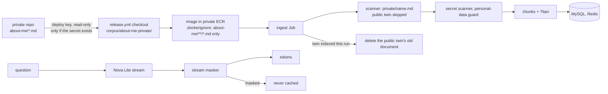

# About Basel from a private repo, with a personal-data guard

**Status:** PR [#126](https://github.com/hacka-tron/basel.engineering/pull/126) merged 2026-10-02; the first release (run 36963576115) checked out the private repo and a live About Basel answer cited `private/...` sources. The public copies were then deleted (see Update 2026-10-02 below). Written 2026-10-01.

## TL;DR

About Basel content moves to the owner's private GitHub repo, `hacka-tron/basel.engineering-docs` (Markdown under `about-me/`). Each release checks it out with a read-only deploy key, bakes it into the image (private ECR) and the ingest Job indexes it as About Basel. Without the key a release skips that step and carries no About Basel files (the public `corpus/about-me/` copies were deleted on 2026-10-02). Google Drive, the first plan, was dropped the same day; none of it ships.

The owner's rule, "don't leak my phone number or any of those details from my resume", is enforced in two layers by one detector, `services/glassbox/privacy.py`:

1. **At ingest**, every About Basel document (public and private) has phone numbers, personal emails, street addresses, dates of birth and SSN-like IDs replaced with `[redacted]` before chunking. They are never stored, embedded or shown as a citation snippet. A document holding an SSN-like ID is skipped whole in production (`GLASSBOX_PII_QUARANTINE=gov_id`).
2. **At answer time**, phone numbers and SSNs are masked before a token leaves the server, even when a number is split across tokens. A masked answer is never cached.

**The existing corpus passes:** zero findings in the five `corpus/about-me/` files (phone 0, email 0 (the public address is allowed), address 0, date of birth 0, government ID 0). They were not edited.

## What changed for a visitor

From the first release after the merge, About Basel answers come from the private repo's files, and a citation shows a `private/<file>` path. Edits in the private repo go live on the next release.

## How it works

## Key design decisions and trade-offs

- **Release-time checkout, not a cluster sync.** The content rides in the image like the public corpus, so no Google or GitHub credential ever reaches the cluster, and nothing new runs on the 2 GiB node.
- **A deploy key, not a fine-grained token.** A deploy key is an SSH key that can read one repo and nothing else, and belongs to no person. A fine-grained personal token is tied to the owner's account, expires, and its reach is set per token. The key is a `release` environment secret, so only release runs on `main` can use it.
- **Nothing private in public places.**
  - `.gitignore` keeps `corpus/about-me-private/` out of this public repo.
  - `.dockerignore` lets only `about-me/**/*.md` into the image: never the private repo's `.git`, README or LICENSE.
  - `persist-credentials: false` drops the key after the checkout, and no step lists or prints files.
  - **The cache-leak fix:** the public build exports its layer cache to the GitHub Actions cache, and other workflow runs in this public repo (fork pull requests included) can restore entries from `main`. With the private corpus in the build context that cache would hold the layer with the private files. `release.yml` therefore has two build steps with mutually exclusive conditions: the cached one without the checkout, and one with no cache settings at all (no import, no export), no build record artifact and no job summary when the checkout is present. The build record (a downloadable run artifact) is off in both. The cost is slower private builds; a cache in private ECR is a backlog idea.
- **A key that is set but fails, fails the release.** Shipping an image without the private corpus would be a silent regression. Removing the secret is how to build without it.
- **No duplicates during the switch.** While both copies exist, the public file with a private twin of the same name is not ingested, and its old indexed document is deleted only after the twin was indexed without an error in the same run. At every moment the text is served from one of the two, never twice. The next step, deleting the public copies, then changes nothing in the index.
- **The sweep can't wipe the private corpus.** A release without the checkout (secret removed) scans zero private files, which looks like every private file was deleted. The sweep refuses to delete `private/` documents then, and `--force-sweep` doesn't override it.
- **Personal-data detector biased toward catching.** A false positive costs a `[redacted]`; a false negative leaks a number. Dates (`2026-10-01`, `01-10-2026`), versions (`v1.2.3`), percentages, years, year ranges, IP ranges and build tags are tested negatives. The streaming mask holds back only a trailing run of digits and `+()-.` characters until the next word, so prose streams with at most one token of delay; a test checks streaming equals whole-answer masking for every cut point and 200 random splits.

## What review caught

Two permission prompts during the work (the private checkout in `release.yml`, and the scanner's private source) were approved by the owner before they were made.

Round 1 (changes needed), all fixed:

- **Critical, a real leak:** the first version disabled the cache with `cache-to: ${{ configured == 'true' && '' || 'type=gha,mode=max' }}`. In GitHub expressions an empty string is falsy, so that always evaluated to `type=gha,mode=max`: a private build would have exported the private layer to the Actions cache. The test only compared the string, so it passed while the bug existed. Fixed with the two mutually exclusive build steps above; the test now parses the workflow and evaluates both cases (exactly one build runs; the private one has no cache settings, no record, no summary). `DOCKER_BUILD_SUMMARY=false` added for private builds.
- **Important:** a merge conflict with `main` kept CI from running (now merged); the docs said "planned" although the key is already set (now live from the first release after the merge).
- **Minor:** phone numbers with en/em dashes, minus signs, slashes or fullwidth digits are now caught (text is NFKC-folded and dashes unified before matching, keeping offsets), and "(+49) 30 1234567" is redacted including its "("; a DD3 note to name private files neutrally; the degraded mode without the checkout is recorded in BACKLOG.

## Operational notes and risks

- **Live effect at merge:** the merge triggers a release; with the key set it checks out the private repo and builds without the Actions cache (slower). Its ingest indexes the private files, removes the public twins' old documents, and re-embeds anything whose guard hash changed. About Basel answers then come from the private files, and the About Basel answer cache refills.
- **Removing private content quickly:** deleting a file in the private repo removes it from answers only when the stale sweep runs in `apply` mode (production is `report`). Until then the next release keeps serving its last indexed version. For something urgent, ask for `--clear --corpus about_me` (followed by the ingest) or for the sweep to be switched to `apply`.
- **Citation paths** show private file names (`private/bio.md`). Name the files with that in mind.
- **The detector is not a classifier.** Names aren't detected, and addresses outside US/UK formats are best effort. It is a backstop, not permission to put private details in the repo.
- **Not exercised:** a real release with the key (the first one is the release after the merge), the `.dockerignore` patterns against a real Docker build (the local Docker daemon wasn't responding), and the MySQL/Redis integration tests (the local stack refused connections; they run in CI).

## Owner setup (done: the key was added on 2026-10-01; kept for reference)

1. **The repo:** `hacka-tron/basel.engineering-docs` already exists with `about-me/*.md`. Keep real Markdown headings (`#`, `##`); every `.md` under `about-me/` is ingested, nothing else.
2. **Generate a key pair** on your machine: `ssh-keygen -t ed25519 -C "glassbox release read-only" -f about-me-deploy -N ""`. This makes `about-me-deploy` (private) and `about-me-deploy.pub` (public).
3. **Deploy key:** in `basel.engineering-docs`, Settings, Deploy keys, **Add deploy key**: title "glassbox release", paste `about-me-deploy.pub`, leave **Allow write access unticked**.
4. **Secret:** in **this** repo, Settings, Environments, `release`, **Add environment secret**: name `ABOUT_ME_DEPLOY_KEY`, value = the whole contents of `about-me-deploy` (including the BEGIN/END lines). Then delete both key files locally.
5. **Run Release:** Actions, Release, **Run workflow** on `main`. The build checks out the private repo; the ingest Job then indexes it and removes the public twins' old documents (its log shows `replaced by its private twin: corpus/about-me/...` lines, and `personal data redacted in ...` lines if anything was redacted).
6. **Afterwards:** ask for the follow-up PR that deletes the public `corpus/about-me/*.md` copies. After each edit in the private repo, run Release again.

## How to see it / verify it

- `services/tests/test_privacy.py` (120 tests): every phone format asked for (`+1 (614) 555-0100`, `614.555.0100`, `call me at 614 555 0100`, international and trunk-0 numbers), the negatives, SSNs and look-alikes, emails and the allowlist, addresses, dates of birth, the repo corpus passing unchanged, redaction in stored chunks with value-free logs, quarantine, and the stream masker across every token split.
- `services/tests/test_answer_guard.py`: the real `/api/ask` path with a phone number split across LLM tokens (no SSE frame carries a digit; not cached), an SSN, ordinary numbers still cached, a cached answer masked on the way out, the cacheability backstop.
- `services/tests/test_private_corpus.py`: only `about-me/**/*.md` is read (README, LICENSE, other folders, hidden paths and symlinks ignored), private files pass the secret scanner and the guard, shadowing skips the public twin, the public document is deleted only after the twin is indexed (not when the twin failed, not without the checkout), the sweep refuses to delete private documents from a release without the checkout even with force, and checks on `.gitignore`, `.dockerignore` and the `release.yml` step (conditional, `persist-credentials: false`, no cache export, no build record, no file-listing commands).

## Update 2026-10-02: public copies deleted

- **Verified:** the Release run of 2026-10-02 04:13 UTC had `ABOUT_ME_CONFIGURED: true` and its "Check out the private About Basel repo" step synced `hacka-tron/basel.engineering-docs` over SSH (deploy key, `persist-credentials: false`) into `corpus/about-me-private`; the run succeeded. The ingest Job log is in-cluster and was not read. One live question ("Where has Basel worked?", About Basel) returned a `retrieval` event whose sources were `private/google.md`, `private/microsoft.md`, `private/bio.md`, `private/projects.md` and `private/skills.md`, so the private ingest happened and the answer is served from it.
- **Deleted:** the five `corpus/about-me/*.md` files. The index does not change (shadowing had already removed the public documents).
- **Eval data:** `eval/golden.yaml` and `eval/questions.yaml` expected sources are now `private/<file>.md`. `eval/schema.py` accepts them and checks gold snippets only when a local checkout exists at `corpus/about-me-private/` (CI has none, so those snippets are unchecked there). The committed retrieval baselines still name the old paths; they are stale until the first eval run after the owner adds documents (evals are parked).
- **Degraded mode, now stricter:** a release without the checkout has no About Basel files at all. The scanner skips a missing `corpus/about-me/` and the private directory, so the about_me scan finds zero files; `plan_sweep` then refuses ("scan found zero files"), and even a partial scan could not delete `private/` documents (the private-root guard, not overridable by `--force-sweep`). The last indexed documents keep serving; new private edits do not go live until a release with the checkout. No duplicates can appear any more, because there are no public twins to re-ingest.

## Open items

- Owner: nothing; setup is done.
- Done 2026-10-02: the public `corpus/about-me/*.md` copies were deleted (see Update 2026-10-02).
- Tidy-up: the twin-shadowing code in the scanner and ingest is dead now; remove it with its tests.
- Ideas: `repository_dispatch` from the private repo (needs a token); an ECR build cache for private builds.
