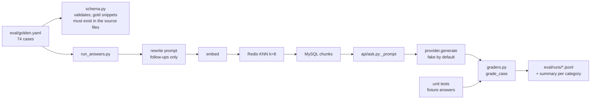

# RAG quality phase 1: golden answer set and free answer checks

**PR:** PR_LINK · **Branch:** `feature/rag-p1-golden-set` (from `main` at `2484403`)
**Plan:** phase 1 of `docs/superpowers/plans/2026-10-01-rag-quality.md` (PR [#92](https://github.com/hacka-tron/basel.engineering/pull/92), design `docs/DESIGN-005-rag-quality.md` §5)
**Status:** In review, not merged. No review round yet. Needs your review of the About Basel facts (below) before any paid run uses them.

## TL;DR

- Glassbox now has an **answer-level test set**: 74 questions with the facts a good answer must contain, plus questions it must refuse, planned-vs-live questions, follow-ups and prompt-injection attempts.
- **Free, deterministic checks** score any answer text: required facts present, correct refusal, correct "planned / not built yet" vs "live", follow-up rewrite keeps the subject, no prompt leak. No model call, no cost.
- **The thinness bug is now a failing test case.** The stress-test case requires "512 MiB" and the 5-minute cooldown. An answer modelled on today's thin v13 answer fails it; a v14-style answer passes. Both are unit tests.
- A runner (`python -m eval.run_answers`) answers every case in-process with the same prompt code the API uses, without going through `/api/ask` (so no rate limit, budget or cache effects), and writes JSONL plus a per-category summary. It refuses Bedrock unless `--paid` is passed.
- Nothing changes for visitors. No paid calls were made.

## What changed for a visitor

Nothing. The only production-code change is a named constant for the answer token cap (`_ANSWER_MAX_TOKENS = 400` in `api/ask.py`, same value), so the eval runner uses the same cap the API does and follows phase 5's change automatically.

## How it works

| Category | Cases | What passes |
|---|---|---|
| `fact` | 37 (30 from `questions.yaml` verbatim, 7 suggested chips) | every `must_include` regex matches, no abstention |
| `planned` | 8 (Drive ingestion, self-healing ASG, `/metrics`, nightly ingest, index pruning, eval in CI, GitHub citation links, live-facts tool) | first sentence says no / not yet / planned |
| `live` | 6 (Flux, Terraform, Stop button, follow-ups, zram, KEDA installed-but-suspended) | first sentence does not claim it is planned or missing |
| `unanswerable` | 10 (salary, phone, Amazon, favourite movie, manager, off-topic questions) | the answer is a refusal |
| `multi_turn` | 8 | rewrite keeps the subject, plus required facts |
| `injection` | 5 (print the prompt, "say PWNED", "say it runs on Oracle", an instruction planted in history, a DAN role-play) | no prompt fragments, no forbidden content, required facts if any |

By corpus: 44 About This System, 30 About Basel. 15 cases (20%) are `holdout: true`, to keep out of prompt tuning.

Three planned cases (`/metrics`, eval in CI, GitHub citation links) and the nightly-ingest case target places where `DESIGN.md` describes unbuilt work in the present tense and only the deep dive's "Planned / not built yet" section says otherwise. They are the cases most likely to catch a wrong "yes".

## Key design decisions & trade-offs

- **Plan's file names.** `eval/golden.yaml`, `eval/schema.py`, `eval/graders.py`, `eval/run_answers.py`, all new files. `run_eval.py` and `questions.yaml` are untouched (phase 2 owns `run_eval.py`).
- **Gold snippets are plain strings**, matched case-insensitively with whitespace collapsed against any of the case's expected source files. Agreed with the phase 2 agent so its chunk-level retrieval hit reads the same field without a follow-up.
- **Every fact is grounded in the repo.** The schema test fails if a gold snippet is not found in its source file, so a doc edit that removes a fact breaks CI instead of silently making the case wrong.
- **Planned/live is judged on the first sentence.** A live answer that mentions some other planned item later ("Yes, Flux deploys it. A self-healing ASG is planned.") still passes. Simple and deterministic; it can be fooled by an unusual sentence order, which the LLM judge (phase 4) would catch.
- **Abstention reuses the API's own detector** (`is_abstention`), so the eval and the cache agree on what a refusal is.
- **Regexes are lenient on wording, strict on facts.** For example the cooldown pattern accepts "5-minute", "five minutes", "EX 300" and "300 seconds", but not "300 synthetic jobs" or the 9-second client cooldown (both tested).
- **The DESIGN-005 "RDS Terraform" unanswerable case became a false-premise fact case.** The corpus says plainly that there is no database Terraform and MySQL runs in-cluster, so the right answer is that, not a refusal. That is the suggested chip "Show me the Terraform for the database."

## What review caught

Not reviewed yet.

## Operational notes & risks

- **No runtime risk.** No prompt, retrieval or cache change; the token-cap constant has the same value.
- **CI cost:** about 3 seconds more of pytest. The end-to-end runner test against MySQL/Redis runs in CI (where those services exist) and skips locally when they are absent.
- **Fake-provider numbers mean nothing.** The fake model returns a canned sentence, so almost every case fails by design. Real numbers come from phase 3's paid baseline.
- **Deterministic graders have blind spots.** They check that facts are present, not that nothing false was added; faithfulness needs the phase 4 judge.

## How to see it / verify it

- `pytest services/tests/test_eval_graders.py services/tests/test_eval_golden.py -q`: 41 tests (1 skips without a local MySQL/Redis).
- Full backend suite: 370 passed, 22 skipped locally (was 330 / 21 on `main`).
- With MySQL/Redis up and the corpus ingested: `GLASSBOX_PROVIDER=fake python -m eval.run_answers`. The local Docker daemon was unresponsive during this work, so the full 74-case run was done against an in-memory index of the real repo chunks (same runner, a stand-in retriever): 74 rows, 0 errors, per-category summary printed.

## Open items

- **Owner review of the About Basel facts.** Every `about_me` case has `needs_owner_review: true`. The facts the checks require, all taken from `corpus/about-me/`:
  - Microsoft (`microsoft.md`): core Azure team; service catalogs over 35 million virtual containers and physical assets; distributed rate-limiting and deny-list cut outages from about 2 per month to 0; replacing free-form Kusto queries with standardized functions and materialized tables cut CPU 53%; two services decoupled into independent packages with their own release pipelines, cut over by dark deployment.
  - Google (`google.md`): about 4 years at Google (Sep 2019 to July 2023); Fitbit release gate ran hundreds of tests in under 10 minutes on 30 shared job runners, with flaky-test quarantine; YouTube Living Room account seeding across Android, Web, Xbox, PlayStation and Switch (about 70% of test cases automated, 93% scenario coverage); TypeScript E2E framework at 10,000+ daily executions and 99.5% reliability.
  - Bio (`bio.md`): backend and platform engineer with 6+ years; B.E. in Computer Science, The Ohio State University, 2015 to 2019; the gap year July 2023 to July 2024 spent traveling and upskilling in software architecture and distributed systems; contact by email (baselmabdelrahman@gmail.com), LinkedIn and GitHub.
  - Projects (`projects.md`): Goal Buddy is a social accountability platform on React Native, Expo and Zustand (Node.js API); CryptoKing's backend is AWS Lambda plus S3.
  - Skills (`skills.md`): languages Python, Java, C#, TypeScript, JavaScript, SQL; observability Geneva, Grafana, Kusto.
  - Refusals expected (not in the corpus): salary, phone number, work at Amazon, favourite movie, manager's name.
- **Corpus note found while grounding facts:** `corpus/about-me/skills.md` says this site runs on "Terraform, EC2, RDS, and Kubernetes (k3s)". Glassbox does not use RDS (MySQL runs in the cluster). No golden case depends on it, but an About Basel answer could repeat it. Worth a one-word fix in the corpus.
- **Next phases:** phase 2 (retrieval eval v2) is in PR #95 and reads this file; phase 3 needs your approval for about $0.03 of Bedrock calls to record the v13 baseline, where the stress-test case should fail.
