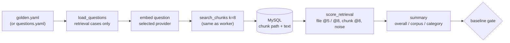

# Retrieval eval v2: k=8, chunk-level hits, noise@8

**PR:** PR_LINK · **Branch:** `feature/rag-p2-retrieval-eval` (from `main` at `2484403`)
**Plan:** phase 2 of the RAG quality plan (`docs/superpowers/plans/2026-10-01-rag-quality.md`, PR [#92](https://github.com/hacka-tron/basel.engineering/pull/92)); design in `docs/DESIGN-005-rag-quality.md` §5.2.
**Status:** In review, not merged.

## TL;DR

- The retrieval eval now measures what production does: it searches at **k=8** (the worker's value) instead of 5, and keeps recall@5/MRR so old numbers still compare.
- New **chunk-level** score: a hit only counts if a retrieved chunk actually contains the case's gold text snippet, not just any chunk of the right file. This stops `docs/DESIGN.md` (about 40 chunks) from counting as a hit whatever section comes back.
- New **noise@8**: the share of retrieved chunks that come from test code or implementation plans. The stale Titan baseline's misses were mostly that kind of noise; it gets a number now, and phase 6 aims for 0.
- The regression gate also checks chunk-level recall@8 and noise@8, once a baseline has them. The two stored baselines are still v1 and parse unchanged.
- No paid calls, no infra, no change to the live request path.

## What changed for a visitor

Nothing. This is offline measurement tooling. It is the "before" yardstick for the answer-quality work (prompt v14, corpus hygiene, better chunks, hybrid search).

## How it works

- `eval/run_eval.py` loads chunk paths **and text** from MySQL, so it can check gold snippets. Snippet matching ignores case and whitespace runs, so a chunker that re-wraps lines doesn't break it.
- Scoring is a set of pure functions (`score_case`, `score_chunks`, `contains_snippet`, `is_noise`, `score_retrieval`, `summarize`, `regression_reason`). They are what the unit tests exercise, with synthetic retrieval results and no Redis.
- The result records a `question_set_fingerprint`. A baseline written from a different question set is refused instead of compared, because recall over 30 questions and over 70 aren't the same number.

## Key design decisions & trade-offs

- **Reads `golden.yaml` when it exists, otherwise `questions.yaml`.** Phase 1 (the golden dataset) is being built in parallel. The loader accepts either a `cases:` or a `questions:` list and treats `gold_snippets` and `category` as optional, so this merges before or after phase 1 with no edit. The only shared format assumption: a case has `id`, `corpus`, `question`, `expected_sources`, and optionally `category`, `gold_snippets` and `history`.
- **Which golden cases are scored.** Cases without `expected_sources` (unanswerable, injection) have no retrieval target. Multi-turn cases retrieve with a paid LLM rewrite in production, so embedding the raw follow-up would measure something production never does. Both are skipped here; the answer eval (phase 1) covers them.
- **Chunk hit = any snippet in any of the top 8.** This is the plan's definition taken literally. "Must contain all snippets" was the alternative; it would punish cases whose facts are spread over two chunks, and the answer eval already checks completeness.
- **noise@8 is a micro average**, noisy chunks over all retrieved chunks, so every retrieved chunk weighs the same. Prefixes: `services/tests/` and `docs/superpowers/plans/`, as the plan says.
- **One search at k=8, top 5 sliced from it**, instead of a second KNN at k=5. HNSW is approximate, so in rare cases this can differ from the old separate k=5 query. It halves Redis calls and keeps @5 and @8 consistent with each other.
- **Gate tolerance is 5 points for all three gates**, the same as the existing recall@5 rule. The plan says to gate noise@8 but doesn't give a tolerance. DESIGN-005's CI gate wants noise@8 = 0 later, but today's corpus still contains tests and plans (phase 6 removes them), so a zero rule would fail every run now.
- **Baselines not rewritten.** Both stored baselines have stale corpus fingerprints, so no fresh fake run could pass against them anyway. The fake one would also go stale again when `golden.yaml` lands. They stay in the v1 format and are gated on recall@5 only, and a test proves they still parse and gate. The next intentional `--write-baseline` adds the v2 fields; the Titan one is phase 3 (paid).
- **`unreachable_gold_snippets`.** The runner lists cases whose snippet no indexed chunk contains, such as a snippet that straddles a chunk boundary. Otherwise a bad snippet would look like a retrieval miss.

## What review caught

Pending review.

## Operational notes & risks

- None for production: only `eval/`, tests and docs changed.
- **No local end-to-end run was possible.** Docker Desktop's daemon on the dev machine stopped answering (even `/_ping` timed out), and restarting it would have stopped the shared compose stack. I didn't restart it, and no native MySQL/Redis was installed. Instead, `services/tests/test_eval_retrieval_e2e.py` does a fake-provider ingest of a two-file fixture (a doc and a `services/tests/` file) into the CI MySQL/Redis services. It then runs `evaluate()` and asserts rank-1 file and chunk hits, the noise count, an unreachable snippet and the per-category summary. That test runs in CI on this PR and is the end-to-end proof. It skips locally when the stack isn't there.
- When `golden.yaml` lands, the default dataset changes, so the next run needs a reviewed `--write-baseline`. The question-set check enforces that.

## How to see it / verify it

- `pytest services/tests/test_eval.py services/tests/test_eval_retrieval_e2e.py -q` (the second needs the CI-style MySQL/Redis on 3306/6379).
- Locally with a stack: `GLASSBOX_PROVIDER=fake python -m services.glassbox.ingest.run && GLASSBOX_PROVIDER=fake python -m eval.run_eval`. It prints the summary and the miss/noise lists, then fails on the stale baseline fingerprint, as intended. Add `--write-baseline` to record a v2 fake baseline locally.

## Open items

- Phase 1's `golden.yaml` supplies the gold snippets. Until then chunk metrics are `null` (`chunk_count` 0) because `questions.yaml` has no snippets.
- Phase 3 (paid, owner approval): refresh the Titan baseline in v2 format.
- Phase 9: a lexical-only variant in CI against a committed baseline, with noise@8 = 0 once phase 6 removes tests and plans from the corpus.
- Remove `eval/questions.yaml` and its legacy test once `golden.yaml` has merged.
