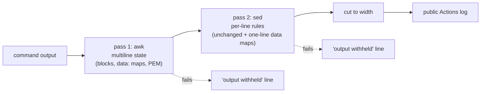

# Ops log redaction: multiline secrets

**Status:** PR open, not merged. Review pending.

## TL;DR

`redact()`, the filter every free-text line passes through before it reaches the public Ops workflow logs, worked one line at a time. A secret whose value sat on the line after its key (YAML `password:` then `  hunter2`, `kubectl get secret -o yaml` data maps, pretty-printed JSON, PEM keys) went through unmasked. It now carries state from line to line and masks those cases, and if the filter itself breaks, it withholds the rest of the output instead of printing it raw. Normal diagnose output looks the same as before.

## What changed for a visitor

Nothing. This only affects what the "Ops · ..." workflows print to their (public) logs.

## How it works

The same `redact()` (in `infra/modules/ops/scripts/lib.sh`) runs in two places: on the node, inside every `glassbox-ops-*` SSM document, and on the GitHub runner in `ops-run.sh`, as a second pass over everything SSM returns and over the `reason` input.

Pass 1 (new) handles three shapes:

- **Sensitive key with no value on its line** (`password:`, `TOKEN=`, `db_password: |`, `"credentials": {`): the more-indented lines after it collapse into one `<masked>` line. If the next line isn't indented and isn't itself a key (`Password:` then `hunter2`), that line is masked.
- **`data:` / `stringData:` / `binaryData:` maps** (Kubernetes Secrets, YAML or JSON): key names are kept and every value is masked. Without this, short base64 values such as `YWRtaW4=` slipped past the existing "20+ characters" rule.
- **PEM blocks**: everything from `-----BEGIN ...-----` to `-----END ...-----` becomes one `<pem masked>` line. A BEGIN with no END masks the rest of the output.

Pass 2 is the old sed filter, plus one new rule for one-line data maps (`"data":{"user":"Ym9i"}`, as found in the `last-applied-configuration` annotation).

## Key design decisions

- **Stream with state, not buffer.** The backlog item said "process whole outputs". A stateful awk filter covers every multiline case above while still emitting line by line, so callers piping a slow command see the same timing as before. Buffering the whole input would change that, and nothing needed it. All current callers feed short, finite output or a here-string anyway (checked below).
- **awk, POSIX only.** The node is Amazon Linux 2023 (standard AMI, gawk; `boot-id.sh` already uses awk there). The runner is `ubuntu-latest` (mawk is the default awk there). The tests also run on macOS (BSD awk and sed). The program uses only POSIX features: no `IGNORECASE`, no interval expressions, no gawk extensions. It contains no double curly braces (the SSM document check in `main.tf` forbids them).
- **Fail closed.** If awk or sed is missing or fails, the filter prints `<redact: filter failed, rest of output withheld>`. In `ops-run.sh` (`set -euo pipefail`), a failure also fails the step.
- **Fail closed on ambiguity, too.** Any `data:` map is masked, ConfigMaps included. A non-indented line after a bare `secret:` is masked unless it looks like a key. Diagnose doesn't print such objects today, so this costs nothing.

## Callers checked

| Caller | How it feeds `redact` | Effect |
|---|---|---|
| `diagnose.sh`: Flux sources, Kustomizations, HelmReleases, warning events, kernel OOM lines | `kc get ... \| redact N`, each bounded by `kc`'s 90s timeout or `tail` | Same streaming behaviour; the output is a table, unchanged (negative tests) |
| `flux-reconcile.sh`, `flux-suspend-resume.sh` | `kc get ... -A \| redact 200` | Same |
| `lib.sh` `flux_request_reconcile` | `$(kc ... jsonpath \| redact 200)`, one line | Same |
| `ops-run.sh` `send_and_wait` | `redact 400 <<<"$stdout"`, and stderr piped from `jq` | Whole SSM output (at most 24,000 characters); now also catches multiline values the node pass missed |
| `ops-run.sh redact` (reason input) | `tr '\n' ' ' \| redact 200` | Already flattened to one line; unchanged |

## Tests

`infra/modules/ops/tests/redact-test.sh` grows from 15 to 54 checks:

- **Multiline:** indented and flush next-line values, YAML `|` and `>-` blocks, YAML sequences, `KEY=` then value, pretty JSON values and objects, CRLF input.
- **Kubernetes Secrets:** YAML, a List of several Secrets, JSON, one-line JSON, and the `last-applied-configuration` annotation.
- **PEM:** on its own, inside YAML, on one line, and unterminated.
- **Negative cases**, where the output must equal the input: Flux table, `free -m`, events table, a YAML null `password:` followed by other keys, a kernel OOM line, a reconcile log line, and plain YAML lists.
- **Fail-closed:** awk is made to fail, and the secret must not appear.

`ops-run-test.sh` still passes. Shellcheck is clean, run exactly as CI runs it (`lib.sh` concatenated with each action script). Run locally on macOS (BSD tools). CI runs the tests on Ubuntu, with mawk and GNU sed.

## What review caught

Pending.

## Operational notes and risks

- **Live effect on merge:** this is two-part.
  - The **runner-side pass** (`ops-run.sh` sources `lib.sh` from the checkout) takes effect on the next Ops run after merge, with no apply.
  - The **on-node pass** is baked into the `glassbox-ops-*` SSM documents by Terraform (`file()` in `infra/modules/ops/main.tf`). It changes only when the Terraform workflow applies `main`, which needs the owner's `terraform-prod` approval. Expect the plan to show in-place updates to the `glassbox-ops-*` documents and nothing else.
  - Until that apply, the runner pass already masks the multiline cases in everything SSM returns.
- **Readability risk:** low. Masking only triggers on a sensitive-looking key with an empty value, `data:` maps, or PEM markers. Pre-existing quirks are unchanged: the 20+ character rule still masks long identifiers such as `KubeletHasSufficientMemory`.
- **Not a guarantee:** this is still a safety net. Scripts should keep printing structured fields rather than object contents.

## How to verify

- `bash infra/modules/ops/tests/redact-test.sh`, then `bash infra/modules/ops/tests/ops-run-test.sh`.
- After merge and apply, run **Ops · Diagnose**: the output should look as before.

## Open items

None new.
