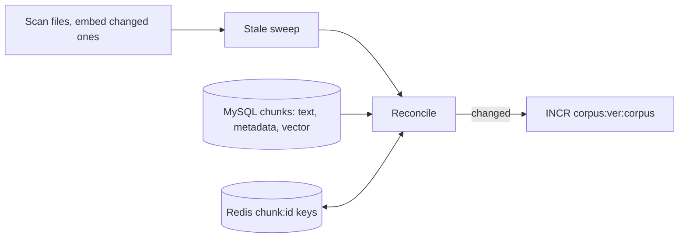

# Redis chunk index rebuilt from MySQL on every ingest run

**Status:** PR open (branch `fix/redis-reconcile-from-mysql`), in review. Not merged, not live.

## TL;DR

A confirmed production bug: if Redis lost its data (the `redis-data` volume lost, a FLUSHALL, an OOM kill before the last save) or MySQL was restored from a dump, the vector index `idx:chunks` stayed empty or partial and every answer said "I don't know". Nothing rebuilt it: ingest skips unchanged files, and the model-tag backfill only touches keys that already exist. `docs/DESIGN.md` claimed "Redis is rebuilt from MySQL on restart"; it wasn't. Every ingest run now ends with a **reconcile** that makes Redis match MySQL again using the vectors MySQL already stores, so it never calls the embedding API. A `--reindex` flag forces a full rewrite.

## What changed for a visitor

Nothing while things are healthy. After Redis data loss, answers come back at the next ingest run (each release) instead of never.

## How it works

For the configured embedding model, `services/glassbox/ingest/reconcile.py`:

1. Loads every MySQL chunk id with its corpus, document, path and `content_sha` (SHA-256 of the chunk text), and every Redis `chunk:*` key (SCAN, pipelined HMGET in batches of 500).
2. **Repair:** a MySQL chunk with no key gets one, written from the row and its stored vector.
3. **Rewrite:** a key whose corpus, model tag, document id, path or `content_sha` disagrees with its row is replaced atomically (DEL plus HSET in one MULTI). Keys written before `content_sha` existed are rewritten once, which back-fills the field.
4. **Remove:** a key tagged with this model whose id has no MySQL row is deleted, along with its `chunktxt:{id}` text cache.
5. Bumps `corpus:ver:{corpus}` only for a corpus where something changed, and logs `repaired / rewritten / removed / skipped` per corpus.

All writers of a chunk key now go through one helper, `chunk_fields()` in `redis_index.py`, which adds `content_sha` next to the existing fields. `python -m services.glassbox.ingest.run --reindex` runs the same step forced (rewrite every key in scope) without scanning files or embedding.

## Key design decisions

- **Run it every time, not only when something looks wrong.** The bug path is exactly the run where no file changed. The check is cheap: id sets and five short fields per key; vectors are read from MySQL only for keys that need writing.
- **Content hash, not text length.** `content_sha` is stored in each key so a mismatch is detected exactly. This is the same field and definition PR #117 (answer cache validated by its sources) uses, so after both merge a key exists only when MySQL row `{id}` exists, and its `content_sha` names that row's current text.
- **Zero-MySQL guard.** If MySQL has zero chunks for a corpus but Redis has keys for it, nothing is deleted and the run logs `REFUSED` with a `!!! REDIS RECONCILE REFUSED ... !!!` banner (same style as the stale sweep's zero-file guard). `--reindex` doesn't lift it.
- **Scoped to the current embedding model.** Keys tagged with another model are left alone, as the sweep and `--clear` do.
- **One ingest at a time is assumed** (the Job). Ingest writes a document's Redis keys just before its MySQL commit, so a concurrent reconcile could briefly see those as orphans.

## Interaction with PR #117

#117 makes the answer cache check a cached answer's source chunks in Redis instead of keying entries by the corpus version. The coordinator agreed the field name and definition (`content_sha` = SHA-256 hex of `chunks.text`). This PR writes it on every key it touches and treats a missing field as "rewrite". Whichever PR merges second resolves a small overlap in `redis_index.py` (both write `content_sha`; keep `chunk_fields()` as the single writer).

## Operational notes and risks

- **At the next release:** the ingest Job runs the reconcile. On a healthy production index, expect `repaired=0 removed=0`. The first run also rewrites every existing key once to add `content_sha` (`rewritten=N`, roughly the whole index, a few hundred to a few thousand keys) and therefore bumps both corpus versions once. Later runs should print all zeros.
- Redis data loss is repaired only when the ingest Job next runs (a release). Until then answers abstain. A faster trigger is in BACKLOG.
- A chunk whose stored vector is not 2048 bytes is skipped and logged at `ERROR` (`skipped=N`).

## How to verify

- `pytest services/tests` (unit tests with fakes: repair, orphan removal, mismatch rewrite including a missing `content_sha`, other-model keys untouched, zero-MySQL guard even when forced, version bump only on change, no embedding call, invalid vector skipped, CLI flags and banner).
- Integration test (CI's MySQL and Redis; it skipped locally because the local Docker stack was unresponsive): ingest a fixture, delete its chunk keys and plant an orphan, re-run ingest with an embedding provider that fails if called; the keys come back, the orphan goes, search finds the chunk again, a further run changes nothing, and `--reindex` twice is idempotent.
- After release: the ingest Job log shows `reconcile about_me: ...` and `reconcile about_system: ...` lines.

## Open items

- Faster repair than "next release" (readiness check or a periodic `--reindex`), in BACKLOG.
