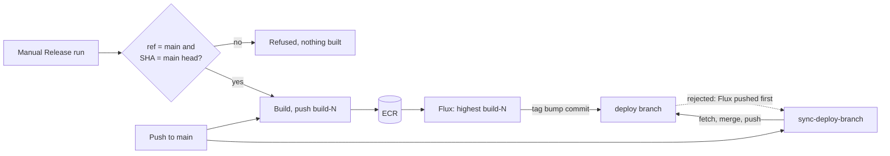

# Release pipeline hardening: manual-run provenance and deploy-branch retry

**PR:** [#91](https://github.com/hacka-tron/basel.engineering/pull/91) · **Branch:** `ci/release-hardening` · **Backlog item:** "Release pipeline hardening"
**Status:** In review (PR opened 2026-10-01; not merged).

## TL;DR

- A manual **Release** run on `main` that no longer builds `main`'s head (for example one that queued while a merge landed) is now refused by a check inside the workflow. Before, it got the highest `build-N` and Flux would have deployed it.
- **That check only protects refs that contain it.** A manual run uses the `release.yml` of the branch or tag it was started on, so the 15 older branches on origin, and any tag, have no check. **Owner action (closes the old-ref hole): GitHub → Settings → Environments → `release` → Deployment branches and tags → Selected branches and tags → `main` only.** Until that is set, a manual run on an old branch can still deploy it.
- The **main → deploy sync** no longer loses a race with Flux. When Flux pushes a tag bump between the sync's fetch and push, the sync re-fetches, re-merges and pushes again (up to 5 attempts). It never force-pushes, so Flux's commit is never dropped.
- Both behaviours live in small scripts with offline tests against local bare git repositories, run in CI.

## What changed for a visitor

Nothing directly. This protects the site from two rare ways a release could go wrong: an old image being deployed as "newest", or a merged change silently not reaching the `deploy` branch Flux reads.

## How it works

1. **Provenance check** (`.github/scripts/release-provenance.sh`, first step of `release.yml`). For `workflow_dispatch` runs only, it requires `github.ref == refs/heads/main` and `github.sha` equal to `git ls-remote origin refs/heads/main`, and fails before AWS credentials are requested. Push runs skip it.
2. **Sync with retry** (`.github/scripts/sync-deploy-branch.sh`, called by `sync-deploy-branch.yml`). Each attempt fetches `main` and `deploy`, resets the local `deploy` to the remote tip, merges `main`, and does a plain push. A rejected push waits 5, 10, 15, 20 s and tries again; after 5 attempts the job fails. A merge conflict fails at once without retrying. If `deploy` already contains `main` it exits without pushing.

## Key design decisions & trade-offs

- **Refuse stale manual runs, rather than tag them differently.** The alternative was tagging manual builds `dispatch-N` so Flux ignores them. That would make the manual button useless for its real purpose (rebuilding `main` after a failed run), and leave two tag schemes to reason about. Refusing is simpler and keeps one rule: every `build-N` is a build of what was `main`'s head.
- **Exact equality, not "ancestor of main".** Every old release is an ancestor of `main`, so an ancestor check would let exactly the stale rebuild through.
- **Checked when the job starts, not when the button is clicked.** A manual run can wait behind another release (`release-main` concurrency group); if a merge lands meanwhile, it is refused instead of building the older commit. The one remaining window is during the build itself (a few minutes): if `main` moves then with an image change, that merge's own push run gets a higher number and supersedes it; if `main` moves with no image change, the image is the same anyway.
- **Push runs are not checked.** They only run on `main`, in order, and each gets a higher number than the last. Re-running an old push run re-pushes its own (lower) number, which Flux ignores.
- **Retry by redoing the merge, never force.** A force push or `--force-with-lease` overwrite would drop Flux's tag-bump commit (and with it the deployed image tag). Rebuilding the merge on the new tip keeps both. The old workflow already merged (not rebased), so history shape is unchanged.
- **Merge conflicts are not retried.** They need a human, and retrying would only hide them.
- **Scripts, not inline YAML.** Both can be shellchecked and tested offline, which inline workflow steps cannot.
- **Flux's own push is unchanged.** It is a cluster controller; a rejected push is retried at its next 1-minute reconcile, from the new tip. Changing that would be a cluster change.

## Validation

- `actionlint` on all workflows: clean.
- `shellcheck` on both scripts and both tests: clean (the CI shellcheck line now also covers `.github/scripts/tests/`).
- `release-provenance-test.sh` (7 cases): head of `main` allowed; older `main` commit refused; other branch refused; tag refused; push run not checked; run overtaken by a newer `main` refused; unreachable remote fails closed.
- `sync-deploy-branch-test.sh` (22 checks, 6 scenarios) against a local bare repo, with a `git` shim that pushes a competing "Flux" commit just before the script's push (a real non-fast-forward rejection, not a simulated error): no race; two races then success (both Flux commits kept, latest tag kept, `main` merged); Flux wins every time (stops after the attempt cap, `deploy` still Flux's last commit); already up to date (no push); merge conflict (exit 2, no push, `deploy` unchanged); no `--force` in the script.
- Mutation check: with `--force` added to the push, 11 checks fail; with retries disabled, 6 fail. So the tests catch both regressions.
- Not exercised live: a real manual Release run, and a real race on GitHub. Neither was triggered (agents may not dispatch workflows).

## Owner action before or after merge

**GitHub → Settings → Environments → `release` → Deployment branches and tags → Selected branches and tags → add `main` only.** This is the item that actually closes the old-ref hole: a manual run on any other branch or tag is then refused by GitHub before the job starts, so it never gets the release role's credentials, whatever that ref's `release.yml` says. Push releases are unaffected (they run on `main`). It can be done before or after merging; the in-workflow check is the second layer for runs on `main`.

## What review caught

| Round | Finding | Resolution |
|---|---|---|
| R1 (Opus) | **Important:** `workflow_dispatch` runs the selected ref's `release.yml`, so branches and tags cut before this PR have no provenance step; the `release` environment has no branch policy and the release role trusts any `environment:release` subject, so an old-ref dispatch still pushes the highest `build-N`. Docs overstated the fix. | Docs corrected (in-workflow check covers refs that contain it; the environment branch policy is the gate). Owner action added above. IAM `ref` condition proposed as a follow-up (see Open items). |
| R1 | Minor: docs said a re-run of an old manual run mints the highest number; a re-run keeps its `run_number`. | Reason corrected in `infra/CI.md` and `release.yml`. |
| R1 | Minor: a re-run of an old push run moves `:latest` to the old commit (mutable ECR tags). | Noted in `infra/CI.md`; production unaffected, Flux uses `build-N` only. |
| R1 | Sync half: sound. | No change. |

## Operational notes & risks

- **What merging changes live.** Merging is a push to `main` that touches `release.yml`, `infra/CI.md` and `docs/`, so it triggers a normal Release run (push run, not checked) and Flux rolls out the new image: the usual few seconds of `api` downtime and an ingest re-run, as with any docs merge. No `k8s/` manifests, RBAC or IAM change. The merge also triggers `sync-deploy-branch` with the new script (its first real run) and the Terraform workflow (because `.github/scripts/**` changed): validate and plan run, and the apply job waits for the usual `terraform-prod` approval with no infrastructure changes to apply.
- **Behaviour change the owner will notice:** Actions → Release → Run workflow now fails on any branch other than `main`, or if `main` moved after the click. Start a new run on `main`.
- **Sync failure is visible, not silent.** If the sync runs out of attempts or hits a conflict, the job is red and `deploy` is unchanged. Nothing re-runs it until the next push to `main`; re-run the job by hand.
- **Unchanged risk:** a failed push run still leaves no image for that commit until the next release or a manual run.

## How to see it / verify it

- After merge: the Release run for the merge commit shows "Check release provenance: push run, no check needed", and `sync-deploy-branch` logs "Attempt 1 of 5" and "Pushed deploy on attempt 1".
- Locally: `bash .github/scripts/tests/release-provenance-test.sh && bash .github/scripts/tests/sync-deploy-branch-test.sh`.
- Optional live check (owner): Actions → Release → Run workflow on `main` passes the check; on any other branch it fails at the first step.

## Open items

- **Owner:** restrict the `release` environment to `main` (above).
- **Follow-up, not in this PR (needs owner go-ahead and the Bootstrap workflow):** bind the release role to `main` in IAM too. Since January 2026 AWS STS accepts GitHub claims as trust-policy condition keys (`token.actions.githubusercontent.com:ref`, `job_workflow_ref`, `environment`, `workflow`, `repository_id` and others; [IAM condition keys, OIDC federation, GitHub tab](https://docs.aws.amazon.com/IAM/latest/UserGuide/reference_policies_iam-condition-keys.html)). Add `StringEquals token.actions.githubusercontent.com:ref = refs/heads/main` (or the stricter `job_workflow_ref = hacka-tron/basel.engineering/.github/workflows/release.yml@refs/heads/main`) to `release_trust` in `infra/bootstrap/main.tf`, applied through the Bootstrap workflow with the owner's go-ahead. No OIDC subject customization is needed. The in-workflow head check stays: it is what catches a stale SHA on `main`.
- Possible later: a scheduled check that `deploy` contains `main`, so an exhausted sync is noticed without watching Actions.
