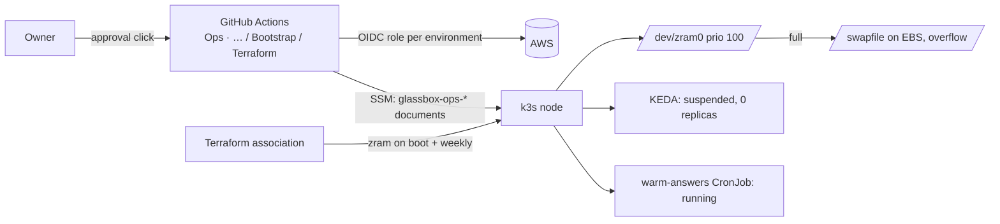

# Session wrap-up: outage, push-button ops, mobile pass

**PR:** this docs PR (`docs/session-wrapup-2026-10-01`) · **Covers:** 2026-09-30 to 2026-10-01, PRs #55, #59, #61–#79
**Status:** In review. Docs only; no code or infrastructure changes.

## TL;DR

- **The site went down and came back.** The 2 GiB node thrashed on memory and disk swap, Traefik went not-ready and visitors got Cloudflare 521. A reboot, compressed RAM swap (zram), suspending KEDA and briefly pausing the answer warm-up fixed it. Memory pressure is now about 3% with about 357 MiB available.
- **Operations are buttons now.** Eight "Ops · …" workflows (diagnose, reboot, restarts, Flux suspend/resume/reconcile, KEDA on/off, warm-up suspend/resume, zram) and a bootstrap pipeline. The owner approves; nobody runs AWS or Terraform by hand.
- **Mobile got a full pass:** diagram in place of the chat, focus mode, a "+" New chat, "Select a component", name shortening, 13px text without iOS focus zoom, a one-row header with topic chips and an envelope Contact (#78).
- **Docs caught up:** the architecture deep dive (which the site answers from), SNAPSHOT, BACKLOG and the owner's standing instructions.

## What changed for a visitor

- Phones: the Chat | Diagram switch shows the full diagram in place of the chat; typing hides the header and footer; the stress-test button always shows the diagram; the header is one row with topic chips in Chat view and an envelope Contact icon.
- The stress test currently plays the simulation: the node has less free memory than the 512 MiB a real burst needs, and KEDA, which would scale the workers, is suspended.
- "About This System" answers now describe zram, the runbooks, the bootstrap pipeline and KEDA's suspended state correctly, once this PR's release re-ingests the deep dive.

## How it works

## Key design decisions & trade-offs

- **zram before disk swap** keeps swap traffic off the disk k3s's SQLite and MySQL share; delivered by an SSM association because changing user data would force a stop/start.
- **KEDA stays off until there is headroom.** It costs about 150 MiB; the stress test simulates meanwhile. Restoring it is a runbook sequence (BACKLOG "RESUME HERE").
- **Fixed SSM documents, not a shell.** Each runbook runs a reviewed, Terraform-managed document with enum inputs; diagnose output is redacted because workflow logs are public.
- **Bootstrap applies only a fingerprint-matched plan**, and its state is in S3 out of CI's reach.

## What review caught

Each PR had its own review (Codex, then Opus subagents once Codex ran out of usage); see the per-feature reports. This docs PR was checked against the code and git history.

## Operational notes & risks

- The KEDA HelmRelease is in a failed state from the outage's install timeout; resuming it may need a reconcile.
- Flux re-applies the `warm-answers` CronJob, so a manual suspend does not last; a lasting one needs a Git change (owner decision pending).
- Not verified: iOS focus zoom on a real iPhone, landscape phones (not built), the first change-type runbook's approval prompt since the per-action split (#68).

## How to see it / verify it

- Run **Ops · Diagnose** (no approval) for memory, PSI, zram, KEDA and Flux state.
- Phone layout: `cd frontend && npm run phone`, then open http://localhost:5230/phone-preview.html.
- Ask About This System "How does the stress test work right now?" after this PR deploys.

## Open items

See `project/BACKLOG.md` "> RESUME HERE": bring KEDA back, answer thinness (the stress-test answer dropped the 512 MiB rule and cooldown), landscape layout, warm-answers decision, unapproved proposals (About This System fallback, chat bubble tightening), Contact clipboard-failure layout, ops `redact()` multiline values, leftover branches, and the earlier roadmap.
